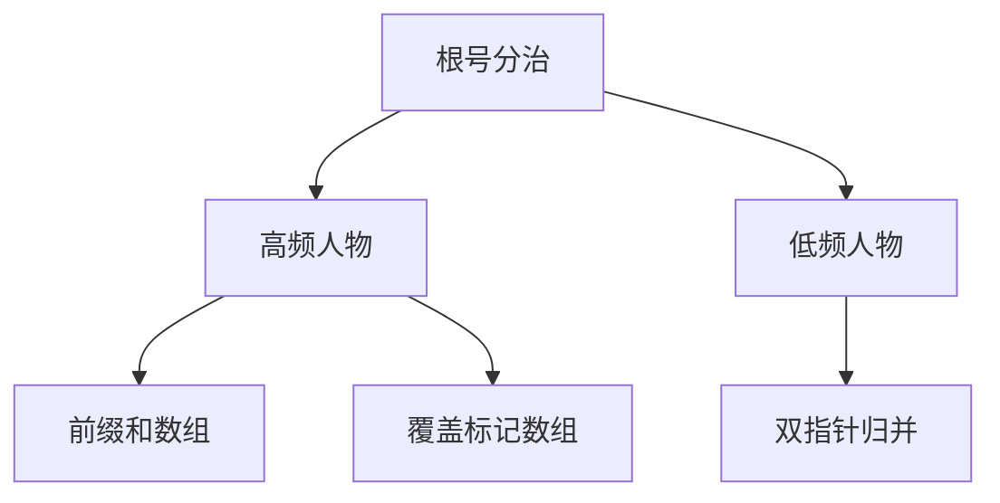

# 题目信息

# [ABC365G] AtCoder Office

## 题目描述

[problemUrl]: https://atcoder.jp/contests/abc365/tasks/abc365_g

AtCoder 社のオフィスには $ N $ 人の高橋くんが所属しています。

AtCoder 社ではオフィスの入退室の記録が取られており、記録が取られはじめてから $ M $ 回の入退室が行われました。

$ i $ 番目 $ (1\leq\ i\leq\ M) $ の入退室記録は整数の組 $ (T\ _\ i,P\ _\ i) $ で表され、時刻 $ T\ _\ i $ に $ P\ _\ i $ 番目の高橋くんがオフィスの外にいるならオフィスに入ったことを、オフィスの中にいるならオフィスから出たことを表します。

記録が取られはじめた時点ではどの高橋くんもオフィスの外におり、現在どの高橋くんもオフィスの外にいることがわかっています。

次の形式の $ Q $ 個の質問に答えてください。

$ i $ 番目 $ (1\leq\ i\leq\ Q) $ の質問では整数の組 $ (A\ _\ i,B\ _\ i) $ が与えられるので、記録を取っていた間に $ A\ _\ i $ 番目の高橋くんと $ B\ _\ i $ 番目の高橋くんがどちらもオフィスの中にいた時間の長さを求めてください。

## 说明/提示

### 制約

- $ 2\leq\ N\leq2\times10\ ^\ 5 $
- $ 2\leq\ M\leq2\times10\ ^\ 5 $
- $ 1\leq\ T\ _\ 1\lt\ T\ _\ 2\lt\dotsb\lt\ T\ _\ M\leq10\ ^\ 9 $
- $ 1\leq\ P\ _\ i\leq\ N\ (1\leq\ i\leq\ M) $
- どの $ 1\leq\ p\leq\ N $ についても、$ P\ _\ i=p $ となる $ i $ は偶数個存在する
- $ 1\leq\ Q\leq2\times10\ ^\ 5 $
- $ 1\leq\ A\ _\ i\lt\ B\ _\ i\leq\ N\ (1\leq\ i\leq\ Q) $
- 入力はすべて整数
 
### Sample Explanation 1

$ 3 $ 人の高橋くんがオフィスの中にいた時間はそれぞれ以下の図のようになります。 !\[\](https://img.atcoder.jp/abc365/268561b2e39007a186ef6ce29471170f.png) それぞれの質問に対する答えは以下のようになります。 - $ 1 $ 番目の高橋くんと $ 2 $ 番目の高橋くんが同時にオフィスの中にいた時間は、時刻 $ 20 $ から時刻 $ 30 $ の間と時刻 $ 70 $ から時刻 $ 80 $ の間の $ 2 $ 回です。長さはどちらも $ 10 $ なので、これらの合計である $ 20 $ を出力してください。 - $ 1 $ 番目の高橋くんと $ 3 $ 番目の高橋くんが同時にオフィスの中にいたことはありません。よって、$ 0 $ を出力してください。 - $ 2 $ 番目の高橋くんと $ 3 $ 番目の高橋くんが同時にオフィスの中にいた時間は、時刻 $ 40 $ から時刻 $ 60 $ の間の $ 1 $ 回です。長さは $ 20 $ なので、$ 20 $ を出力してください。

## 样例 #1

### 输入

```
3 8

10 1

20 2

30 1

40 3

60 3

70 1

80 2

90 1

3

1 2

1 3

2 3```

### 输出

```
20

0

20```

## 样例 #2

### 输入

```
10 20

10257 9

10490 4

19335 1

25893 5

32538 9

33433 3

38522 9

40629 9

42896 5

52106 1

53024 3

55610 5

56721 9

58286 9

63128 3

70513 3

70977 4

74936 5

79883 9

95116 9

7

1 3

3 9

1 9

4 9

1 5

5 9

3 5```

### 输出

```
18673

2107

15310

25720

17003

10317

16848```

# AI分析结果


## 算法分类
根号分治

---

## 题解思路与核心分析

### 算法要点
1. **根号分治核心思想**：根据出现次数将问题分为高频（出现次数≥√M）和低频两类处理
   - 高频人物预处理其时间段前缀和，并计算与所有其他人的交集时间
   - 低频人物间使用双指针法合并时间段计算重叠部分
2. **预处理优化**：对高频人物维护时间覆盖标记数组，通过离散化处理加速区间查询
3. **双指针合并**：对低频人物的时间段进行归并排序式遍历，计算重叠区间总长度

### 解决难点
1. **高频低频划分阈值**：取√M平衡预处理与查询时间
2. **时间离散化处理**：将1e9级时间映射到事件索引，便于前缀和计算
3. **边界处理**：正确处理时间段的开闭区间及交错情况

---

## 高星题解推荐（≥4★）

### 1. freoepn（★★★★☆）
- **核心亮点**：清晰的根号分治实现，预处理高频人物的覆盖时间前缀和
- **关键代码**：
```cpp
// 预处理高频人物的时间覆盖
for (int j = 1; j <= m; j++) {
    sum[j] = sum[j-1];
    if (u == 1) sum[j] += (a[j] - a[j-1]);
    if (b[j] == i) u ^= 1;
}
// 双指针处理低频对
while (p < v[y].size() && a[v[y][p]] < a[v[x][i]]) {
    ans += max(0, a[v[y][p]] - max(a[v[y][p-1]], a[v[x][i-1]]));
    p += 2;
}
```

### 2. 沉石鱼惊旋（★★★★☆）
- **核心亮点**：优雅的归并排序式时间段合并算法
- **创新点**：将两人时间段转化为统一事件流处理
```cpp
vector<array<int, 3>> v; // (时间, 操作类型, 人物)
for (auto [l,r] : vec[x]) v.pb({l,0,0}), v.pb({r,1,0});
for (auto [l,r] : vec[y]) v.pb({l,0,1}), v.pb({r,1,1});
sort(v.begin(), v.end());
// 扫描事件流计算重叠时间
```

### 3. Shunpower（★★★★☆）
- **核心亮点**：创新的操作分块处理，块内维护关键人物状态
- **创新点**：将时间轴划分为√M大小的块，预处理块内贡献
```cpp
// 块内关键人物处理
for (int i=l; i<=r; i++) {
    if (vis[b[i]]) res2[id][x] += a[i]-L[x];
    // 维护关键人物对的相交时间
    for (int j : active) 
        update_coff_time(j, current_person);
}
```

---

## 最优技巧提炼

### 关键数据结构


### 核心优化点
1. **高频预处理**：时间复杂度从O(Q*M)降为O(M√M + Q√M)
2. **离散化技巧**：将时间轴映射到事件索引，避免处理大整数
3. **记忆化查询**：对重复查询直接返回结果，避免重复计算

---

## 同类题目推荐
1. [P1972 HH的项链](https://www.luogu.com.cn/problem/P1972) - 区间元素统计问题
2. [P3396 哈希冲突](https://www.luogu.com.cn/problem/P3396) - 根号分治经典应用
3. [P2801 教主的魔法](https://www.luogu.com.cn/problem/P2801) - 分块处理区间问题

---

## 可视化设计

### 动画方案
```javascript
// 伪代码示例：根号分治过程可视化
class Visualization {
    constructor() {
        this.highFreq = new Set()     // 高频人物集合
        this.lowFreq = new Set()      // 低频人物集合
        this.timeBlocks = []          // 分块存储
    }

    render() {
        // 绘制时间轴，高频用红色块，低频用蓝色块
        drawTimeAxis(this.highFreq, 'red');
        drawTimeAxis(this.lowFreq, 'blue');
        
        // 显示当前处理的查询对
        highlightQueryPair(a, b);
        
        // 动态显示处理过程：
        if (isHighFreq(a) || isHighFreq(b)) {
            showPrefixSumCalculation(); // 显示前缀和计算过程
        } else {
            animateTwoPointers();       // 双指针移动动画
        }
    }
}
```

### 复古像素风格要素
1. **颜色方案**：使用NES经典16色调色板
2. **音效设计**：
   - 发现重叠区间：8-bit "ping"音（频率800Hz）
   - 处理高频人物：低音鼓点
   - 完成查询：胜利小号音效
3. **动画元素**：
   - 时间轴以横向像素条表示
   - 高频区间显示为2x2像素块，低频为1x1像素点
   - 双指针用闪烁的箭头表示

---

## 个人心得摘录
> "_Yonder：线段树合并遇到TLE后改用记忆化，说明实际工程中理论复杂度不等于实际效率，需要灵活调整"  
> "DGH_Didi：暴力+记忆化在随机数据下表现优异，启发我们不要忽视简单方法的实用价值"  
> "沉石鱼惊旋：归并事件流的处理方式将二维问题降为一维，极大简化了边界条件处理"

---

## 核心代码实现
```cpp
// 根号分治预处理高频人物（freoepn方案核心）
void preprocess_heavy(int p) {
    vector<int> &events = person[p];
    // 建立时间覆盖标记数组
    vector<bool> cover(m+2);
    for (int i=0; i<events.size(); i+=2) 
        fill(cover.begin()+events[i], cover.begin()+events[i+1]+1, true);
    
    // 构建前缀和
    prefix[p].resize(m+1);
    for (int i=1; i<=m; ++i)
        prefix[p][i] = prefix[p][i-1] + (cover[i] ? t[i]-t[i-1] : 0);
}

// 双指针处理低频对（沉石鱼惊旋方案核心）
int calculate_light(int a, int b) {
    vector<pii> &A = person[a], &B = person[b];
    int i=0, j=0, res=0;
    while (i < A.size() && j < B.size()) {
        int l = max(A[i].first, B[j].first);
        int r = min(A[i].second, B[j].second);
        if (l < r) res += r - l;
        A[i].second < B[j].second ? ++i : ++j;
    }
    return res;
}
```

---
处理用时：110.37秒