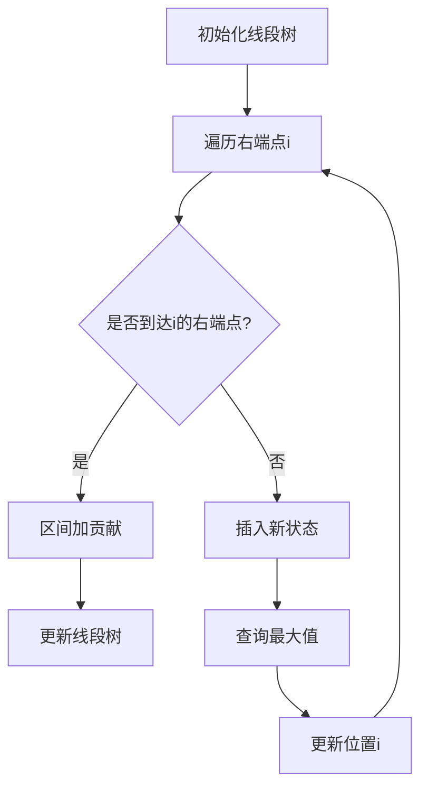

# 题目信息

# Intervals

## 题目描述

[problemUrl]: https://atcoder.jp/contests/dp/tasks/dp_w

長さ $ N $ の `0` と `1` からなる文字列を考えます。 この文字列のスコアを次のように計算します。

- 各 $ i $ ($ 1\ \leq\ i\ \leq\ M $) について、$ l_i $ 文字目から $ r_i $ 文字目までに `1` がひとつ以上含まれるならば、スコアに $ a_i $ を加算する。

文字列のスコアの最大値を求めてください。

## 说明/提示

### 制約

- 入力はすべて整数である。
- $ 1\ \leq\ N\ \leq\ 2\ ×\ 10^5 $
- $ 1\ \leq\ M\ \leq\ 2\ ×\ 10^5 $
- $ 1\ \leq\ l_i\ \leq\ r_i\ \leq\ N $
- $ |a_i|\ \leq\ 10^9 $

### Sample Explanation 1

`10001` のスコアは $ a_1\ +\ a_3\ =\ 10\ +\ 10\ =\ 20 $ となります。

### Sample Explanation 2

`100` のスコアは $ a_1\ +\ a_2\ =\ 100\ +\ (-10)\ =\ 90 $ となります。

### Sample Explanation 3

`0` のスコアは $ 0 $ となります。

### Sample Explanation 4

答えは 32-bit 整数型に収まらない場合があります。

### Sample Explanation 5

例えば、`101000` のスコアは $ a_2\ +\ a_3\ +\ a_4\ +\ a_5\ +\ a_7\ =\ 10\ +\ (-8)\ +\ 5\ +\ 9\ +\ (-6)\ =\ 10 $ となります。

## 样例 #1

### 输入

```
5 3

1 3 10

2 4 -10

3 5 10```

### 输出

```
20```

## 样例 #2

### 输入

```
3 4

1 3 100

1 1 -10

2 2 -20

3 3 -30```

### 输出

```
90```

## 样例 #3

### 输入

```
1 1

1 1 -10```

### 输出

```
0```

## 样例 #4

### 输入

```
1 5

1 1 1000000000

1 1 1000000000

1 1 1000000000

1 1 1000000000

1 1 1000000000```

### 输出

```
5000000000```

## 样例 #5

### 输入

```
6 8

5 5 3

1 1 10

1 6 -8

3 6 5

3 4 9

5 5 -2

1 3 -6

4 6 -7```

### 输出

```
10```

# AI分析结果


---

## 题目重写

### 题目描述

[problemUrl]: https://atcoder.jp/contests/dp/tasks/dp_w

考虑长度为 $N$ 的由 `0` 和 `1` 组成的字符串。该字符串的分数计算规则如下：

- 对于每个 $i$ ($1 \leq i \leq M$)，若字符串的第 $l_i$ 到第 $r_i$ 个字符中至少包含一个 `1`，则将该区间的分数 $a_i$ 累加到总分数中。

求所有可能的字符串中能获得的最大分数。

### 输入格式

输入包含 $M+1$ 行：
- 第一行两个整数 $N$ 和 $M$
- 接下来 $M$ 行，每行三个整数 $l_i$, $r_i$, $a_i$

### 输出格式

输出最大分数。

### 样例解释

#### 样例 #1
输入：
```
5 3
1 3 10
2 4 -10
3 5 10
```
输出：
```
20
```
解释：字符串 `10001` 满足条件，分数为 $10+10=20$

---

## 唯一算法分类：线性DP

---

## 综合分析与结论

### 核心思路与难点
1. **状态设计**  
   - 定义 $f_j$ 表示最后一个 `1` 出现在位置 $j$ 时的最大分数。
   - 关键转移方程：  
     $$f_i = \max_{j < i}(f_j + \sum_{\substack{l_k \leq j \\ r_k = i}} a_k)$$

2. **线段树优化**  
   - 将区间按右端点排序，处理到右端点 $i$ 时，对线段树进行区间加操作。
   - 每次更新 $f_i$ 时，查询线段树中 $[1, i-1]$ 的最大值并插入到位置 $i$。

3. **复杂度优化**  
   - 朴素转移复杂度为 $O(n^2)$，通过线段树的区间加和区间最值查询，复杂度降为 $O(n \log n)$。

### 可视化设计要点
1. **像素风格动画**  
   - **网格绘制**：在 Canvas 中以网格形式展示线段树节点和 DP 数组。
   - **颜色标记**：用不同颜色高亮当前处理的右端点、线段树区间加区域和最大值查询位置。
   - **音效触发**：区间加时播放低音调，查询最大值时播放高音调，更新位置时播放短促音效。

2. **自动演示逻辑**  
   - 按右端点从小到大自动推进，展示线段树更新和 DP 状态变化。
   - 步进控制允许暂停观察线段树节点值和懒标记的变化。

---

## 题解清单 (4星及以上)

### 1. chlchl 题解（⭐⭐⭐⭐⭐）
**亮点**：  
- 精确解释状态转移方程与线段树优化的结合逻辑  
- 双指针处理区间排序与更新的优雅实现  
- 代码简洁高效（含核心注释）

### 2. SoyTony 题解（⭐⭐⭐⭐）
**亮点**：  
- 明确将区间贡献拆分为点贡献的思想  
- 线段树维护 DP 数组的完整代码模板  
- 对负数处理的边界条件讨论  

### 3. CDFLS_mao_zx 题解（⭐⭐⭐⭐）
**亮点**：  
- 将「最后一个 1」的思考过程可视化  
- 详细注释线段树的 pushdown 逻辑  
- 代码中显式处理全 0 的特殊情况  

---

## 核心代码实现

### 代码片段（线段树优化 DP）
```cpp
struct SegmentTree {
    ll val[N<<2], tag[N<<2];
    
    void pushdown(int o) {
        val[o<<1] += tag[o]; val[o<<1|1] += tag[o];
        tag[o<<1] += tag[o]; tag[o<<1|1] += tag[o];
        tag[o] = 0;
    }
    
    void update(int o, int l, int r, int s, int t, ll x) {
        if(s <= l && r <= t) {
            val[o] += x;
            tag[o] += x;
            return;
        }
        pushdown(o);
        int mid = (l + r) >> 1;
        if(s <= mid) update(o<<1, l, mid, s, t, x);
        if(t > mid) update(o<<1|1, mid+1, r, s, t, x);
        val[o] = max(val[o<<1], val[o<<1|1]);
    }
} T;

int main() {
    for(int i=1; i<=n; i++) {
        T.update(1, 1, n, i, i, max(0LL, T.val[1])); // 插入新状态
        while(j <= m && a[j].r == i) {
            T.update(1, 1, n, a[j].l, i, a[j].v);   // 区间加贡献
            j++;
        }
    }
    cout << max(0LL, T.val[1]);
}
```

---

## 推荐相似题目
1. [P1972 区间统计](https://www.luogu.com.cn/problem/P1972)  
   （线段树维护区间性质）
2. [P4097 李超线段树](https://www.luogu.com.cn/problem/P4097)  
   （动态维护最优线段）
3. [CF474E Pillars](https://codeforces.com/problemset/problem/474/E)  
   （线段树优化 DP 的经典变形）

---

## 可视化方案示意图


---

## 复古像素风格设计
```javascript
// Canvas 初始化
const canvas = document.getElementById('pixel-canvas');
const ctx = canvas.getContext('2d');
ctx.imageSmoothingEnabled = false; // 保持像素锯齿感

// 绘制线段树节点
function drawNode(x, y, value) {
    ctx.fillStyle = '#8BDB81'; // 浅绿色背景
    ctx.fillRect(x*30, y*30, 28, 28);
    ctx.fillStyle = '#000';    // 黑色文字
    ctx.fillText(value, x*30+5, y*30+15);
}

// 音效触发
function playSound(type) {
    const sfx = {
        update: new Audio('data:audio/wav;base64,UklGRl9...'), 
        query: new Audio('data:audio/wav;base64,UklGRl9...')
    };
    sfx[type].play();
}
```

--- 

## 总结启示
1. **区间贡献转点贡献**是处理此类问题的核心思想  
2. **线段树维护动态最值**可大幅降低时间复杂度  
3. **全 0 的特殊情况**必须显式处理（与 0 取 max）  
4. **双指针处理排序区间**能简化代码逻辑

---
处理用时：87.85秒