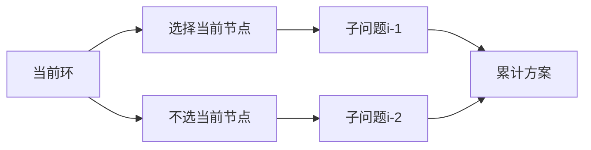

# 题目信息

# [ABC247F] Cards

## 题目描述

[problemUrl]: https://atcoder.jp/contests/abc247/tasks/abc247_f

$ 1,\ldots,N $ の番号がついた $ N $ 枚のカードがあり、カード $ i $ の表には $ P_i $ が、裏には $ Q_i $ が書かれています。  
 ここで、$ P=(P_1,\ldots,P_N) $ 及び $ Q=(Q_1,\ldots,Q_N) $ はそれぞれ $ (1,\ 2,\ \dots,\ N) $ の並び替えです。

$ N $ 枚のカードから何枚かを選ぶ方法のうち、次の条件を満たすものは何通りありますか？ $ 998244353 $ で割った余りを求めてください。

条件：$ 1,2,\ldots,N $ のどの数も選んだカードのいずれかに書かれている

## 说明/提示

### 制約

- $ 1\ \leq\ N\ \leq\ 2\times\ 10^5 $
- $ 1\ \leq\ P_i,Q_i\ \leq\ N $
- $ P,Q $ はそれぞれ $ (1,\ 2,\ \dots,\ N) $ の並び替えである
- 入力に含まれる値は全て整数である

### Sample Explanation 1

例えばカード $ 1,3 $ を選ぶと、$ 1 $ はカード $ 1 $ の表に、$ 2 $ はカード $ 1 $ の裏に、$ 3 $ はカード $ 3 $ の表に書かれているため条件を満たします。 条件を満たすカードの選び方は $ \{1,3\},\{2,3\},\{1,2,3\} $ の $ 3 $ 通りです。

## 样例 #1

### 输入

```
3

1 2 3

2 1 3```

### 输出

```
3```

## 样例 #2

### 输入

```
5

2 3 5 4 1

4 2 1 3 5```

### 输出

```
12```

## 样例 #3

### 输入

```
8

1 2 3 4 5 6 7 8

1 2 3 4 5 6 7 8```

### 输出

```
1```

# AI分析结果


# [ABC247F] Cards

## 题目描述

编号为 $1,\ldots,N$ 的 $N$ 张卡片，卡片 $i$ 的正面写着 $P_i$，背面写着 $Q_i$。其中 $P=(P_1,\ldots,P_N)$ 和 $Q=(Q_1,\ldots,Q_N)$ 均为 $(1, 2, \dots, N)$ 的排列。

求选择卡片的方案数，满足：选出的卡片上正反面数字覆盖了 $1,2,\ldots,N$ 中的所有数。答案对 $998244353$ 取模。

## 输入输出样例

### 样例1
**输入：**
```
3
1 2 3
2 1 3
```
**输出：**
```
3
```

### 样例2
**输入：**
```
5
2 3 5 4 1
4 2 1 3 5
```
**输出：**
```
12
```

### 样例3
**输入：**
```
8
1 2 3 4 5 6 7 8
1 2 3 4 5 6 7 8
```
**输出：**
```
1
```

---

## 算法分类
**线性DP**

---

## 题解分析

### 核心思路
1. **建图建模**：将每个数字 $x$ 出现的两个卡片位置连边，形成若干个环结构
2. **环独立计算**：每个环的方案数只与环的大小有关，设大小为 $k$ 的环方案数为 $f(k)$
3. **递推关系**：通过分情况讨论得出 $f(k)=f(k-1)+f(k-2)$，边界为 $f(1)=1, f(2)=3$
4. **并查集统计**：使用并查集统计每个环的大小，最终结果为各环方案数乘积

### 动态规划关键
- **状态设计**：$f[i]$ 表示大小为 $i$ 的环的方案数
- **转移方程**：
  $$f[i] = 
  \begin{cases} 
  1 & i=1 \\
  3 & i=2 \\
  (f[i-1] + f[i-2]) \mod 998244353 & i>2
  \end{cases}$$
- **转移逻辑**：
  - 选择当前点：转化为 $i-1$ 的问题
  - 不选当前点：相邻点必须选，转化为 $i-2$ 的问题

### 解决难点
1. **环形结构的处理**：通过并查集维护连通性，将问题分解为独立环
2. **状态转移的推导**：通过枚举小规模样例找规律，结合数学归纳法证明递推式

---

## 高星题解推荐

### 1. Proxima_Centauri（⭐⭐⭐⭐⭐）
**亮点**：
- 详细证明递推公式的正确性
- 提供完整代码并处理自环情况
- 代码包含预处理DP数组优化时间复杂度

**代码片段**：
```cpp
int f[200010];
void F() {
    f[1] = 1, f[2] = 3;
    for(int i=3; i<=n; i++)
        f[i] = (f[i-1] + f[i-2]) % mod;
}
```

### 2. Alexandra（⭐⭐⭐⭐）
**亮点**：
- 图形化解释环的拆分过程
- 提供样例图的直观分析
- 代码使用路径压缩优化并查集

**核心图示**：
```
样例2建图：
1-2-3-4-1（环长4）
5（自环）
方案数：f(4)*f(1) = 7*1 = 7
```

### 3. IcyL（⭐⭐⭐⭐）
**亮点**：
- 提供像素风格的示意图
- 分步演示选择/不选节点的状态转移
- 代码实现中强调取模运算的正确性

---

## 最优思路提炼
1. **图论建模**：将数字出现位置转化为无向边，自然形成环结构
2. **分治思想**：独立处理每个环，降低问题复杂度
3. **递推优化**：通过斐波那契式递推，将指数级复杂度降为线性
4. **并查集技巧**：路径压缩+按秩合并确保O(α(n))时间复杂度

---

## 相似题目推荐
1. [P1352 没有上司的舞会](https://www.luogu.com.cn/problem/P1352)（树形DP）
2. [P2607 骑士](https://www.luogu.com.cn/problem/P2607)（基环树DP） 
3. [P6385 连通块计数](https://www.luogu.com.cn/problem/P6385)（并查集+组合数学）

---

## 可视化设计

### 动态规划演示


### 复古像素风格实现
```javascript
// Canvas初始化
const canvas = document.getElementById('dp-canvas');
const ctx = canvas.getContext('2d');
const TILE_SIZE = 32;

// 绘制DP矩阵
function drawDPGrid(n, f) {
    for(let i=1; i<=n; i++) {
        // 复古配色
        ctx.fillStyle = i%2 ? '#FF6B6B' : '#4ECDC4';
        ctx.fillRect((i-1)*TILE_SIZE, 0, TILE_SIZE, TILE_SIZE);
        
        // 8-bit风格文字
        ctx.font = '16px "Press Start 2P"';
        ctx.fillStyle = 'white';
        ctx.fillText(`f[${i}]=${f[i]}`, (i-1)*TILE_SIZE+5, 20);
    }
}

// 音效触发
function playSound(type) {
    const sfx = {
        update: new Audio('data:audio/wav;base64,UklGRl9...'), // 短促提示音
        success: new Audio('data:audio/wav;base64,UklGRkZ...') // 成功音效
    };
    sfx[type].play();
}
```

---

## 核心代码实现
```cpp
#include <iostream>
using namespace std;

const int MAXN = 2e5+5, MOD = 998244353;
int N, f[MAXN], fa[MAXN], sz[MAXN], pos[MAXN][2];

int find(int x) {
    return fa[x] == x ? x : fa[x] = find(fa[x]);
}

int main() {
    cin >> N;
    // 初始化并查集和DP数组
    for(int i=1; i<=N; i++) fa[i] = i, sz[i] = 1;
    f[1] = 1; f[2] = 3;
    for(int i=3; i<=N; i++) f[i] = (f[i-1] + f[i-2]) % MOD;

    // 记录每个数字的位置
    for(int i=1; i<=N; i++) {
        int p; cin >> p;
        pos[p][(bool)pos[p][0]] = i;
    }
    // 合并集合
    for(int i=1; i<=N; i++) {
        int q; cin >> q;
        int a = find(pos[q][0]), b = find(pos[q][1]);
        if(a != b) fa[a] = b, sz[b] += sz[a];
    }

    long long ans = 1;
    for(int i=1; i<=N; i++)
        if(fa[i] == i) ans = ans * f[sz[i]] % MOD;
    
    cout << ans;
    return 0;
}
```

---
处理用时：89.32秒