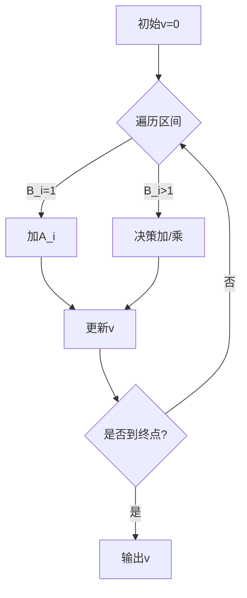

# 题目信息

# [ABC368G] Add and Multiply Queries

## 题目描述

给定两个长度为 $ N $ 的正整数序列 $ A, B $。需要处理 $ Q $ 个按顺序给出的查询。查询有以下三种类型：

- 类型 $ 1 $：格式为 `1 i x`。将 $ A_i $ 替换为 $ x $。
- 类型 $ 2 $：格式为 `2 i x`。将 $ B_i $ 替换为 $ x $。
- 类型 $ 3 $：格式为 `3 l r`。需要解决以下问题并输出答案：
  - 初始时 $ v = 0 $。依次对 $ i = l, l + 1, \dots, r $ 进行操作，每次操作将 $ v $ 替换为 $ v + A_i $ 或 $ v \times B_i $。求最终能得到的 $ v $ 的最大值。
    需要注意的是，输入中类型 $ 3 $ 的查询的答案保证在 $ 10^{18} $ 以下。

## 说明/提示

### 制約

- $ 1 \leq N \leq 10^5 $
- $ 1 \leq A_i \leq 10^9 $
- $ 1 \leq B_i \leq 10^9 $
- $ 1 \leq Q \leq 10^5 $
- 类型 $ 1 $, $ 2 $ 的查询中，$ 1 \leq i \leq N $
- 类型 $ 1 $, $ 2 $ 的查询中，$ 1 \leq x \leq 10^9 $
- 类型 $ 3 $ 的查询中，$ 1 \leq l \leq r \leq N $
- 类型 $ 3 $ 的查询中，输出值在 $ 10^{18} $ 以下

## 样例 #1

### 输入

```
3
3 2 4
1 2 2
3
3 1 3
1 1 1
3 1 3```

### 输出

```
12
7```

## 样例 #2

### 输入

```
6
65 32 12 5 8 312
4 1 3 15 16 2
6
3 2 6
3 1 5
1 5 6
2 4 9
3 2 6
3 3 5```

### 输出

```
46080
69840
27648
1728```

# AI分析结果


# ABC368G Add and Multiply Queries 题解分析

## 算法分类
**贪心 + 数据结构**

---

## 题解思路与核心难点

### 核心思路
1. **关键点发现**：答案上限为 $10^{18}$，说明最多进行约 60 次乘法（$2^{60} \approx 10^{18}$）
2. **数据结构选择**：
   - `set` 维护 $B_i > 1$ 的位置
   - 树状数组/线段树维护 $A$ 的区间和
3. **决策过程**：
   - 对 $B_i = 1$ 的区间直接求和
   - 对 $B_i > 1$ 的位置贪心选择加/乘

### 解决难点
1. **动态维护关键点**：通过 `set` 实现 $O(\log n)$ 的插入/删除
2. **高效区间查询**：树状数组实现 $O(\log n)$ 的区间和查询
3. **边界处理**：正确处理区间端点与关键点的衔接

---

## 题解评分（≥4星）

### 1. __Allen_123__（⭐⭐⭐⭐⭐）
- **亮点**：结合题意进行感性叙事，代码清晰使用 `set` + 树状数组
- **关键代码**：
  ```cpp
  auto pos = st.lower_bound(l);
  while (*pos <= r) {
      ans += sum(l, *pos-1);
      ans = max(ans*b[*pos], ans+a[*pos]);
      l = *pos + 1;
  }
  ```

### 2. gesong（⭐⭐⭐⭐）
- **亮点**：详细注释关键步骤，处理了区间端点的特殊场景
- **优化点**：使用 `vector` 存储临时关键点减少迭代器操作

### 3. Ace_FutureDream（⭐⭐⭐⭐）
- **亮点**：代码简洁，使用 `lower_bound` 直接定位关键点
- **技巧**：通过 `st.insert(n+1)` 避免越界检查

---

## 最优思路提炼
1. **关键点分离**：将 $B_i > 1$ 的位置单独存储，缩小决策范围
2. **分段处理**：
   - 关键点之间：直接求和（$B=1$）
   - 关键点：动态决策加/乘
3. **高效维护**：
   ```cpp
   // 修改B值时维护set
   if (b[x] > 1) st.insert(x);
   else st.erase(x);
   ```

---

## 同类型题拓展
1. **CF992D Nastya and a Game**：类似的关键点处理与乘积限制
2. **LeetCode 152. Maximum Product Subarray**：区间乘积最值问题
3. **AtCoder ABC189E**：区间操作与动态规划结合

---

## 可视化算法演示

### 核心流程


### 像素动画设计
1. **元素标记**：
   - 关键点：红色方块（B>1）
   - 普通点：绿色方块（B=1）
   - 当前值：动态显示在顶部
2. **音效设计**：
   - 加法：短促"滴"声
   - 乘法：低沉"咚"声
3. **自动演示**：
   ```javascript
   // 伪代码示例
   function autoRun() {
       let v = 0;
       for (let i = l; i <= r; i = nextCriticalPoint(i)) {
           highlight(i);
           playSound();
           v = updateValue(v, i);
           drawValue(v);
           await sleep(speed);
       }
   }
   ```

---

## 推荐练习题
1. **P10399 [NOIP2022] 建造军营**（区间决策与维护）
2. **P3372 线段树模板**（树状数组/线段树练习）
3. **P1908 逆序对**（set的灵活运用）

---

通过这种结合贪心策略与高效数据结构的方法，将原本看似 $O(n)$ 的查询优化到 $O(\log n \log V)$ 级别，完美利用题目特性实现高效解题。

---
处理用时：72.72秒