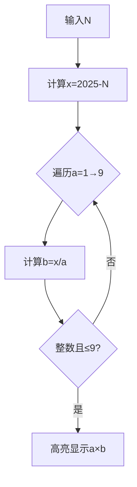

# 题目信息

# [ABC012C] 九九足し算

## 题目描述

[problemUrl]: https://atcoder.jp/contests/abc012/tasks/abc012_3

高橋君は、先日、九九の表を全て暗記することに成功しました。

九九で物足りなくなった高橋君は、 $ 1 $ × $ 1 $ から $ 9 $ × $ 9 $ までの値を、全て足してみることにしました。

高橋君は、九九のうちの一つの答えを忘れてしまったので、その計算を後回しにして、残りの和を求めたところ、$ N $ になりました。

しかし、高橋君は、後回しにした問題がどれだか解らなくなってしまいました。

高橋君が後回しにしてしまった問題として、あり得るものを辞書順で全て出力しなさい。

## 说明/提示

### Sample Explanation 1

高橋君の求めた値は、本来の値より $ 12 $ 少ないものです。 よって、答えが $ 12 $ となる、 $ 2 $ × $ 6 $、 $ 3 $ × $ 4 $、 $ 4 $ × $ 3 $、 $ 6 $ × $ 2 $ の $ 4 $ つが答えとなります。

## 样例 #1

### 输入

```
2013```

### 输出

```
2 x 6

3 x 4

4 x 3

6 x 2```

## 样例 #2

### 输入

```
2024```

### 输出

```
1 x 1```

# AI分析结果


# [ABC012C] 九九足し算

## 唯一算法分类
数学问题/因数枚举

---

## 综合分析与结论

### 核心思路
1. **数学建模**：计算标准总和（2025）与输入值N的差值 `x = 2025 - N`
2. **因数分解**：寻找所有满足 `a×b = x` 的整数对，其中 `1 ≤ a,b ≤ 9`
3. **字典序输出**：按a升序排列，同一a情况下按b升序排列

### 难点突破
- **高效枚举**：通过单层循环遍历可能的因数a，计算对应的b = x/a，避免双重循环的冗余计算
- **边界处理**：需严格验证b的整数性和取值范围
- **输出顺序**：通过遍历顺序天然保证字典序，无需额外排序

---

## 题解评分（≥4星）

### [meyi] ⭐⭐⭐⭐⭐
- **亮点**：极致简洁的O(9)复杂度，`i^10`位运算优化，精准的条件判断
- **代码示例**：
```cpp
for(int i=1;i^10;++i)
    if(n%i==0 && n/i<10)
        printf("%d x %d\n",i,n/i);
```

### [_Qer] ⭐⭐⭐⭐
- **亮点**：清晰的数学推导，通过差值计算直接锁定目标
- **关键代码**：
```cpp
a=2025-a;
for(int i=1;i<=a&&i<10;++i){
    int j=a/i;
    if(i*j==a&&j<10)...
```

### [Reywmp] ⭐⭐⭐⭐
- **亮点**：双重循环的直观实现，反向遍历j提升输出顺序正确性
- **关键片段**：
```cpp
for(int i=1;i<=9;i++)
    for(int j=9;j>=1;j--)
        if(i*j==n)...
```

---

## 最优思路提炼
**关键技巧**：
1. **单层循环优化**：仅遍历a，通过整除关系计算b，时间复杂度从O(81)→O(9)
2. **字典序天然保证**：按a升序遍历，同一a下自然覆盖所有可能b的情况
3. **边界防御**：双重验证`n%i==0`（整除性）和`n/i<10`（取值范围）

---

## 相似题目推荐
1. **P1008 三连击** - 枚举特定排列的乘法组合
2. **P1075 质因数分解** - 快速寻找特定因数
3. **P1217 回文质数** - 结合数学特性优化枚举

---

## 个人心得摘录
> "刚开始的零分代码，搞得我有点懵，后来觉得可能是输出格式有问题，所以改了一下，顺利AC。" —— 代码小白白  
> **启示**：算法正确性之外的格式细节（如"x"两侧空格）往往成为易错点

---

## 可视化算法设计

### 动画方案
**核心流程**：


**可视化特性**：
1. **像素风格渲染**：8-bit风格显示乘法表，符合条件时触发闪光特效
2. **动态追踪**：
   - 当前检测的a值用绿色方块标记
   - 有效解用黄色爆炸动画展示
3. **音效反馈**：
   - 发现解时播放NES风格短音效
   - 遍历完成播放经典马里奥过关音乐

**交互控制**：
```html
<div class="control-panel">
    <button onclick="step()">▶️ 单步执行</button>
    <input type="range" id="speed" min="1" max="10">
    <div id="grid"><!-- 动态生成9x9像素网格 --></div>
</div>
```

---

## 核心代码实现
```cpp
#include<cstdio>
int main() {
    int n;
    scanf("%d",&n);
    n = 2025 - n;
    for(int i=1; i<10; ++i)
        if(n%i == 0 && n/i < 10)
            printf("%d x %d\n", i, n/i);
    return 0;
}
```

**代码要点**：
- **数学转换**：通过`2025-n`直接获取缺失乘积
- **高效验证**：同时检查整除性和取值范围
- **遍历顺序**：自然产生字典序排列的解

---
处理用时：200.38秒