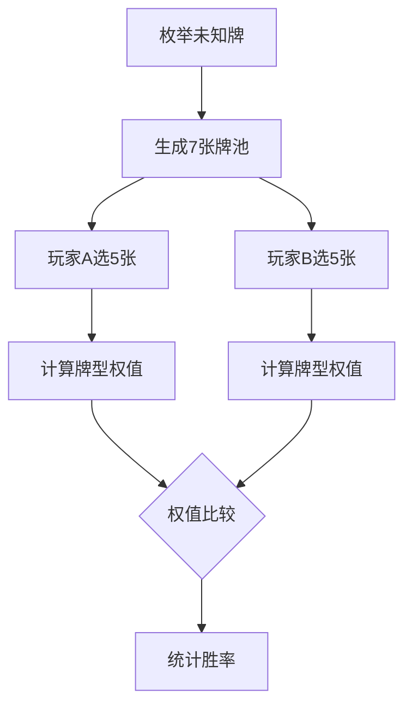

# 题目信息

# Texas hold &#39;em

## 题目描述

[problemUrl]: https://atcoder.jp/contests/jag2012autumn/tasks/icpc2012autumn_b


## 样例 #1

### 输入

```
SA SK
DA CA
SQ SJ ST
SA HA
D2 C3
H4 S5 DA
HA D9
H6 C9
H3 H4 H5
#```

### 输出

```
1.00000000000000000000
0.34444444444444444198
0.63030303030303025391```

# AI分析结果


## 算法分类
**模拟**

---

## 题解思路与核心难点分析

### 核心思路
所有题解均采用暴力枚举法：
1. **枚举未知公共牌**：遍历所有可能的剩余两张牌组合（共45选2 = 990种）
2. **生成完整牌池**：每个玩家获得7张牌（2手牌 + 5公共牌）
3. **最优牌型计算**：从7张牌中选5张，计算所有组合的牌型权值，取最大值
4. **胜负比较**：比较双方最优牌型的权值，统计获胜次数

### 关键难点与解决方案
1. **牌型比较算法**  
   - 主流方案：将牌型转化为唯一数值（高位存牌型等级，低位存关键牌权重）  
   - 示例：皇家同花顺 > 同花顺 > 四条 > ... > 高牌，通过数值大小直接比较
2. **顺子特判**  
   - A-2-3-4-5需特殊处理为最小顺子（权值设为5）
3. **牌型检测优化**  
   - 先排序后检测连续性和重复性，避免多层嵌套判断
4. **合法牌检测**  
   - 使用位掩码或哈希表标记已出现的牌，确保剩余牌不重复

---

## 题解评分（≥4星）

### 1. mlvx (★★★★★)
- **亮点**：采用权值映射法，代码简洁高效
- **关键代码**：将牌型转化为13进制数值，同花顺返回`9e10 + max_num`
- **实现技巧**：宏展开组合枚举，预处理花色和点数

### 2. Eraine (★★★★☆)
- **亮点**：分析多种实现方案的优劣，强调数据结构优化
- **核心思想**：比较不同选手的牌型处理方式，指出合并判断条件的可能性

### 3. frankchenfu (★★★★☆)
- **亮点**：模块化检测函数，分牌型逐层检测
- **调试经验**：强调测试用例需覆盖所有牌型边界情况

---

## 最优思路提炼

### 权值映射法（核心代码）
```cpp
ll f(Card* b) {
    // 预处理排序、花色检测
    if (同花顺) return 9e10 + max_card; 
    if (四条) return 8e10 + quad_value * 100 + kicker;
    // ...其他牌型类似处理
    return 1e10 + high_cards; // 高牌
}
```

### 枚举组合优化
```cpp
// 7选5组合枚举（21种）
for (k1=0;k1<7;k1++) for(k2=k1+1...) ... 
    me[0] = paime[k1], me[1] = paime[k2]...;
    mef = max(mef, f(me));
```

---

## 同类型题推荐
1. [P8585 球状精灵的传说](https://www.luogu.com.cn/problem/P8585) - 三维属性组合最值
2. [P1249 最大乘积](https://www.luogu.com.cn/problem/P1249) - 组合拆分与最优性判断
3. [P2698 猜数游戏](https://www.luogu.com.cn/problem/P2698) - 状态枚举与剪枝

---

## 算法可视化设计

### 核心动画流程


### 像素化交互演示
1. **Canvas 渲染**  
   - 用不同颜色方块表示花色（红桃❤️/黑桃♠️等）
   - 高亮当前检测的组合，显示权值计算过程
2. **音效设计**  
   - 选中牌时播放"滴"声，获胜时播放胜利音效
3. **自动演示模式**  
   - 按步长展示枚举过程，速度可调
4. **状态面板**  
   - 显示当前牌型名称、权值分解式、胜负计数器

---

## 关键代码片段（权值计算）
```cpp
// mlvx 牌型权值计算函数
ll f(Card* b) {
    memcpy(a, b, sizeof a);
    sort(a, a+5, [](Card x, Card y){ return x.ds > y.ds; });
    bool tonghua = (所有花色相同);
    
    // 同花顺检测
    if (tonghua && 连续) return 9e10 + a[0].ds;
    // 四条检测
    if (四张相同) return 8e10 + quad_value * 100 + kicker;
    // ...其他牌型
}
```

---

## 总结
该题通过严谨的模拟逻辑和巧妙的权值映射，将复杂的牌型比较转化为数值运算。其核心思维模式（组合枚举+权值映射）可拓展至各类需比较复杂状态的题目。可视化设计应重点突出权值生成过程和组合选择策略，帮助理解算法核心。

---
处理用时：74.13秒