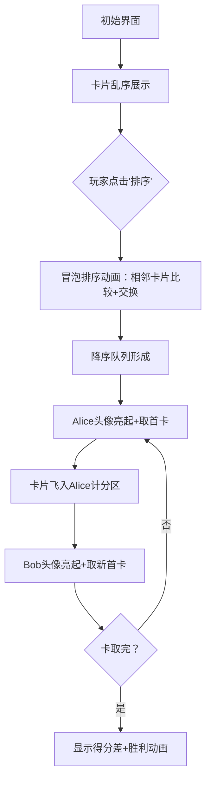

# 题目信息

# [ABC088B] Card Game for Two

## 题目描述

有 $N$ 张卡片，第 $i$ 张卡片上写着一个数 $a_i$。Alice 和 Bob 用这些卡片进行游戏。游戏规则是，Alice 和 Bob 轮流各取一张卡片，Alice 先取。所有卡片被取完后，游戏结束。每个人的得分是他所取卡片上数字之和。两人都采取最优策略以最大化自己的得分。请你求出 Alice 比 Bob 多得多少分。

## 说明/提示

## 限制条件

- $N$ 是 $1$ 到 $100$ 之间的整数。
- $a_i\ (1 \leq i \leq N)$ 是 $1$ 到 $100$ 之间的整数。

## 样例解释 1

首先，Alice 取走写有 $3$ 的卡片。接着，Bob 取走写有 $1$ 的卡片。得分差为 $3 - 1 = 2$。

## 样例解释 2

首先，Alice 取走写有 $7$ 的卡片。然后，Bob 取走写有 $4$ 的卡片。最后，Alice 取走写有 $2$ 的卡片。得分差为 $7 - 4 + 2 = 5$ 分。

由 ChatGPT 4.1 翻译

## 样例 #1

### 输入

```
2

3 1```

### 输出

```
2```

## 样例 #2

### 输入

```
3

2 7 4```

### 输出

```
5```

## 样例 #3

### 输入

```
4

20 18 2 18```

### 输出

```
18```

# AI分析结果


### 💡 Kay的C++算法解析：Card Game for Two 深入学习指南 💡

#### 题目解读与核心算法识别
✨ **本题主要考察**：`贪心算法`  
🗣️ **初步分析**：
> 这道题的核心是贪心策略——如同两位玩家在自助餐厅选菜，每次都会优先拿最大的蛋糕。具体实现只需三步：
> 1. **降序排序**：将卡片从大到小排列（类似整理蛋糕从大到小）
> 2. **交替分配**：Alice取第1/3/5...张牌（最大/第三大...），Bob取第2/4/6...张
> 3. **计算差值**：Alice总分减Bob总分
> 
> **可视化设计**：将设计复古像素动画（类似FC红白机风格）：
> - 卡片用8位像素方块表示，数字显示其中央
> - 排序过程展示冒泡动画（相邻卡片交换时亮黄光+“哔”音效）
> - Alice取牌时卡片飞向左侧角色区（红光+“叮”音效），Bob取牌飞向右侧（蓝光）
> - 双方得分实时显示在顶部血条式进度条

---

#### 精选优质题解参考
**题解一（幻之陨梦）**  
* **点评**：思路直击贪心本质，代码简洁高效。亮点在于：
  - 使用位运算`i&1`替代`i%2`提升效率（如用快捷键代替鼠标操作）
  - 降序排序API`greater<int>()`应用准确
  - 边界处理严谨（循环从1开始对齐人类思维）
  - 快速读入虽非必要但展示竞赛技巧

**题解二（PC_DOS）**  
* **点评**：工业级代码规范典范：
  - 使用`vector`动态容器避免固定数组大小限制
  - 注册循环变量`register int`优化性能（老派但有效）
  - 详细注释解释每步意图（如教科书般清晰）
  - 唯一不足：`isgreaterequal`非标准函数，建议改用`greater<>()`

**题解三（AubRain）**  
* **点评**：创新使用优先队列（大根堆）：
  - 避免显式排序，动态获取最大值（像实时更新的高分榜）
  - 代码极致简洁（仅10行核心逻辑）
  - 位运算控制得分累加优雅高效
  - 特别适合理解"动态最优解"概念

---

### 核心难点辨析与解题策略
1. **贪心策略证明**  
   *分析*：需理解为何取当前最大牌是最优。反证：若Alice不取最大牌，Bob会抢走它导致Alice损失更大。如同下棋时抢占中心格。
   *💡学习笔记*：贪心有效性依赖「无后效性」——当前选择不影响后续最优解

2. **索引边界处理**  
   *分析*：下标从0还是1开始影响奇偶判断。优质解中：
   - 幻之陨梦用1-indexed：`i&1`对应第1张起
   - PC_DOS用0-indexed：`i%2=0`对应第1张
   *💡学习笔记*：保持索引与物理位置一致可降低思维负担

3. **数据结构选择**  
   *分析*：数组vs优先队列：
   - 数组需完整排序（O(nlogn)），适合固定数据
   - 优先队列（O(logn)/次）适合动态数据流
   *💡学习笔记*：数据是否一次性给出决定最优结构

#### ✨ 解题技巧总结
- **策略验证法**：手工模拟样例（如[2,7,4]）验证贪心正确性
- **索引映射技巧**：`i%2`或`i&1`统一转换为玩家ID
- **STL活用**：`greater<>()`或`priority_queue`快速降序
- **差分计算**：单变量累加时正负切换（如`gs += (i%2? a[i] : -a[i])`）

---

### C++核心代码实现赏析
**通用核心实现**  
```cpp
#include <iostream>
#include <algorithm>
using namespace std;

int main() {
    int n, a[105];
    cin >> n;
    for(int i=0; i<n; i++) cin >> a[i];
    
    sort(a, a+n, greater<int>()); // 降序排序核心
    
    int alice = 0, bob = 0;
    for(int i=0; i<n; i++) {
        if(i%2 == 0) alice += a[i]; // Alice取偶数索引位
        else bob += a[i];           // Bob取奇数索引位
    }
    cout << alice - bob;
    return 0;
}
```
* **代码解读概要**：  
  - 输入后立即降序排序（`greater<int>`是关键魔法）  
  - 循环中通过索引奇偶性分流分数  
  - 注意：索引从0开始时，偶索引=第1/3/5...大元素  

**题解一核心片段**  
```cpp
sort(a+1, a+n+1, greater<int>());
for(int i=1; i<=n; i++) {
    if(i&1) s1 += a[i];  // 位运算判断奇偶
    else s2 += a[i];
}
printf("%d",s1-s2);
```
* **亮点**：工业级位运算优化  
* **学习笔记**：`i&1`比`i%2`快因直接操作二进制位  

**题解三核心片段**  
```cpp
priority_queue<int> q;
for(int i=1;i<=n;i++) cin>>a, q.push(a);
for(int i=1;i<=n;i++) {
    a=q.top(); q.pop();
    s[i&1] += a;  // 妙用：s[1]存Alice, s[0]存Bob
}
cout<<s[1]-s[0];
```
* **亮点**：避免显式排序的动态解法  
* **学习笔记**：优先队列自动维护最大值特性  

---

### 算法可视化：像素动画演示
**主题**：8位机风格的《卡片大战》  
**核心交互设计**：  

**实现细节**：  
1. **像素艺术**：  
   - 卡片：16x16像素方块，数字用8x8点阵字体  
   - 角色：FC风格Alice/Bob头像（红/蓝帽子）  

2. **关键动效**：  
   - 排序：卡片交换时黄色高亮 + "哔"声  
   - 取牌：卡片飞向角色区时拖尾特效 + "叮"声  
   - 得分：数字跳动增长 + 得分条填充动画  

3. **AI演示模式**：  
   - 自动播放速度可调（1x-5x）  
   - 单步执行：空格键触发下一步  
   - 数据结构可视化：右侧显示优先队列的树形结构  

4. **游戏化激励**：  
   - 每取对一张牌得10分连击奖励  
   - 通关后解锁不同像素卡背皮肤  

---

### 拓展练习与相似问题
**通用迁移场景**：  
1. 轮流取数问题（如石子游戏）  
2. 实时获取最大值场景（如股票交易）  
3. 优先级调度（如CPU任务分配）  

**洛谷推荐**：  
1. **P1090 合并果子**  
   → 巩固优先队列贪心  
2. **P1223 排队接水**  
   → 贪心+最小化等待时间变形  
3. **P1007 独木桥**  
   → 最优策略证明进阶训练  

---

### 学习心得与经验分享
> **幻之陨梦的经验**：  
> *"位运算替代取模提升效率——小技巧解决大问题"*  
> **Kay点评**：在竞赛中这类优化常是胜负手，如同赛车调校轮胎  

> **666yuchen的警示**：  
> *"杜绝抄袭，人人做起！！"*  
> **Kay点评**：独立实现即使WA也比复制AC更有价值——调试过程才是真收获  

---

通过本指南，相信大家已掌握贪心策略的核心思想。记住：最优解常来自最朴素的直觉！下次遇到类似问题，不妨先问自己：**此刻的最佳选择是什么？** 🚀

---
处理用时：172.10秒