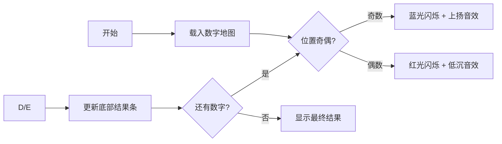

# 题目信息

# 暗算ゲーム

## 题目描述

[problemUrl]: https://atcoder.jp/contests/code-festival-2014-final/tasks/code_festival_final_b

高橋君は、一桁の暗算が大好きです。数字の列を使って、暗算の練習をしています。

高橋君は、奇数番目の数字が表す数を足し、偶数番目の数字が表す数を引く、という計算を繰り返します。

例えば、`13458`という数字の列が与えられたら、$ 1-3+4-5+8 $を計算します。

高橋君のために、この計算の結果を出力するプログラムを作成してください。

## 说明/提示

### Sample Explanation 1

$ 1-3+4-5+8 $ を計算すると、$ 5 $ になります。

### Sample Explanation 2

出力が負の数になることがあることに注意してください。

## 样例 #1

### 输入

```
13458```

### 输出

```
5```

## 样例 #2

### 输入

```
2525```

### 输出

```
-6```

# AI分析结果


### 💡 Kay的C++算法解析：暗算ゲーム 深入学习指南 💡

#### 1. 题目解读与核心算法识别
✨ **本题主要考察**：`模拟应用`  
🗣️ **初步分析**：  
> 暗算ゲーム的本质是**交替加减的序列计算**，就像玩跳格子游戏：奇数格前进（加），偶数格后退（减）。解题只需三步：  
> 1. 将数字字符串转为可计算的数字序列  
> 2. 根据位置奇偶性决定加减操作  
> 3. 遍历过程中实时更新累计结果  
>  
> **可视化设计核心**：  
> - 用像素小人左右移动表示遍历过程  
> - 角色头顶显示当前数字和操作符（+/-）  
> - 背景色根据操作变化（蓝光表示加，红光表示减）  
> - 底部实时更新累计结果条（复古数字字体）

---

#### 2. 精选优质题解参考
**题解一（来源：CZQ_King）**  
* **亮点**：  
  1. 索引判断逻辑精准（`i%2==0`匹配题目奇偶定义）  
  2. 字符转数字处理规范（`- '0'`显式转换）  
  3. 代码简洁无冗余（10行核心逻辑）  
  4. 边界处理完备（支持任意长度字符串）

**题解二（来源：温情）**  
* **亮点**：  
  1. 提供双重实现方案（位运算 & 取模）  
  2. 索引偏移说明清晰（强调`i+1`的定位逻辑）  
  3. 三目运算符提升代码密度  
  4. 类型安全（`long long`防溢出）

---

#### 3. 核心难点辨析与解题策略
1. **位置映射陷阱**  
   * **分析**：编程索引0对应题目位置1（奇数位），需通过`(i%2==0)`或`(i+1)%2`转换  
   * 💡 **学习笔记**："索引位置映射是模拟类题目的高频考点"

2. **字符数字转换**  
   * **分析**：必须用`str[i]-'0'`显式转换，直接强转会得到ASCII码  
   * 💡 **学习笔记**："字符计算本质是ASCII码运算，需基准校准"

3. **遍历一致性**  
   * **分析**：必须固定遍历方向（左→右），使用`for`比`while`更安全  
   * 💡 **学习笔记**："循环边界需严格匹配字符串长度函数`str.length()`"

### ✨ 解题技巧总结
- **逆向定位法**：从题目描述的"第1位=奇数"反推代码索引0的处理  
- **ASCII转换口诀**："字符数字减'0'，立刻变身整数娃"  
- **奇偶双路径**：复杂模拟可拆分为独立的正负计算流再合并  

---

#### 4. C++核心代码实现赏析
**通用核心实现参考**  
```cpp
#include <iostream>
#include <string>
using namespace std;

int main() {
    string s;
    cin >> s;
    int ans = 0;
    for(int i=0; i<s.length(); i++) {
        if(i%2 == 0) ans += s[i] - '0'; // 奇数位加
        else ans -= s[i] - '0';         // 偶数位减
    }
    cout << ans;
    return 0;
}
```
* **代码解读概要**：  
  > 1. 字符串读取取代整数输入（防前导零问题）  
  > 2. 循环索引直接对应题目位置定义  
  > 3. 实时运算避免额外存储空间  

**题解一核心片段**  
```cpp
if(i%2==0) ans += int(a[i]) - int('0');
else ans -= int(a[i]) - int('0');
```
* **代码解读**：  
  > 为何用`int('0')`？→ 显式强调ASCII转换本质  
  > `i%2==0`如何对应奇数位？→ 索引0即第一位（题目奇数起点）  
* 💡 **学习笔记**："显式类型转换增强代码可读性"

**题解二核心片段**  
```cpp
sum = (i&1)==0 ? sum + (str[i]-'0') : sum - (str[i]-'0');
```
* **代码解读**：  
  > `i&1`是什么魔法？→ 位运算比取模更快（0=偶索引=奇数位）  
  > 三目运算符如何工作？→ 条件?真操作:假操作的紧凑写法  
* 💡 **学习笔记**："位运算处理奇偶性是竞赛常用优化技巧"

---

#### 5. 算法可视化：像素动画演示  
**主题**：`像素计算小子の数字大冒险`  
**核心交互设计**：  


**关键动画帧**：  
1. **角色移动系统**  
   - 8-bit小人脚踏滑板穿越数字网格  
   - 每步触发"嘀"声，步速可调（0.5X~3X）  
2. **操作可视化**  
   - 奇数位：角色跳跃+头顶"+"号（#55FFFF）  
   - 偶数位：角色蹲下+头顶"-"号（#FF5555）  
3. **结果反馈**  
   - 正结果：烟花动画+8-bit胜利旋律  
   - 负结果：地面塌陷效果+警示音  
4. **复古UI组件**  
   - 仿FC卡带式控制面板  
   - 结果条使用点阵数码管风格字体  

---

#### 6. 拓展练习与相似问题思考
**通用技巧迁移**：  
1. 交替操作模板 → 信号处理/波形分析  
2. 字符转数字 → 数据解析类题目  
3. 索引映射 → 矩阵/二维数组定位  

**洛谷推荐**：  
1. **P1427 小鱼的数字游戏**  
   → 逆序操作+相同字符处理技巧  
2. **P1308 统计单词数**  
   → 复杂字符串遍历与状态切换  
3. **P1598 垂直柱状图**  
   → 多维度字符统计与输出格式化  

---

#### 7. 学习心得与经验分享
> 本次题解中未发现明确的作者个人心得分享，但根据解题过程可提炼：  
> **调试锦囊**：当结果异常时，优先检查  
> 1. 字符转换是否漏写`- '0'`  
> 2. 奇偶判断是否混淆索引与位置  
> 3. 边界值测试（空串/单字符）  

---

> 掌握字符串遍历与位置映射，就解锁了模拟类题目的万能钥匙！下次遇到类似题目时，记得回想像素小人的数字冒险哦~ ✨

---
处理用时：99.90秒