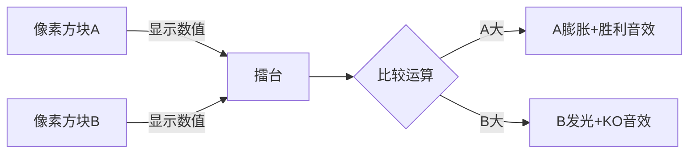

# 题目信息

# [ABC002A] 正直者

## 题目描述

输入两个正整数A,B,比较它们哪个最大,输出最大的那个数。

# AI分析结果


### Kay的C++算法解析：ABC002A 正直者 深入学习指南  

#### 1. 题目解读与核心算法识别  
✨ **本题主要考察**：`编程技巧应用`（基础比较与条件判断）  

🗣️ **初步分析**：  
> 本题核心是**比较两个整数并输出最大值**，如同两位选手比身高，只需找出更高的那位。解题关键在于：  
> - **核心技巧**：直接比较（`if-else`）或调用标准库函数（`max`）  
> - **难点对比**：  
>   - 位运算解法（da32s1da）虽巧妙但晦涩（如用位移和位掩码模拟比较）  
>   - 字符串解法（CZQ_King）过度复杂化（按ASCII逐位比较）  
> - **最优方案**：`max`函数（简洁高效）或`if-else`（直观易理解）  
>  
> **可视化设计思路**：  
> 设计**像素化数字擂台**动画：  
> - 两个像素方块（A/B）显示输入数值  
> - 比较时触发「擂台对决」特效：数值大的方块膨胀发光+胜利音效  
> - 高亮关键操作：比较运算符或`max()`函数调用位置  

---

#### 2. 精选优质题解参考  
**题解一（两年打铁 & _Qer）**  
* **亮点**：  
  - ⭐ 极致简洁：直接调用`std::max`，5行内解决  
  - ⭐ 实践价值高：标准库用法竞赛通用  
  - ⭐ 代码规范：变量名清晰（`a`,`b`），包含最小值提示  

**题解二（Messi李）**  
* **亮点**：  
  - ⭐ 逻辑直白：`if-else`分支覆盖所有情况  
  - ⭐ 防御性编程：`long long`防溢出，边界处理严谨  
  - ⭐ 教学友好：每行注释解释操作意图  

> 🔍 注：位运算解法虽有趣但可读性差（★2）；字符串解法冗余（★3）  

---

#### 3. 核心难点辨析与解题策略  
1. **关键点：选择高效比较方式**  
   - *分析*：`max()`函数编译优化后效率≈手写比较，且代码更健壮  
   - 💡 **学习笔记**：优先使用标准库减少错误  

2. **关键点：数值范围处理**  
   - *分析*：`int`可能溢出（本题范围$10^9$），优质解用`long long`防御  
   - 💡 **学习笔记**：比较前先确认数据类型范围  

3. **关键点：避免过度设计**  
   - *分析*：字符串/位运算解法增加复杂度，违反KISS原则  
   - 💡 **学习笔记**：简单问题首选最直白解法  

✨ **解题技巧总结**：  
- ✅ **标准库优先**：熟记`<algorithm>`中的`max/min`  
- ✅ **防御性类型**：大范围用`long long`代替`int`  
- ✅ **逻辑全覆盖**：`if-else`需处理`>`、`<`和`==`  

---

### 4. C++核心代码实现赏析  
**通用核心实现**  
```cpp
#include <iostream>
#include <algorithm> // 包含max函数
using namespace std;

int main() {
    long long a, b;    // 防御大范围数据
    cin >> a >> b;     // 输入
    cout << max(a, b); // 核心比较
    return 0;
}
```
* **代码解读概要**：  
  > 三阶段清晰：声明防御性变量 → 安全输入 → 调用优化过的库函数比较  

**题解一核心片段（两年打铁）**  
```cpp
cout << max(a,b) << endl;
```
* **亮点**：标准库最佳实践  
* **学习笔记**：`max`可同时比较多种类型（int/double等）  

**题解二核心片段（Messi李）**  
```cpp
if(a>=b) { 
    cout<<a<<endl;   // 分支输出
} else {
    cout<<b<<endl; 
}
```
* **亮点**：显式覆盖相等情况  
* **学习笔记**：`if-else`是条件判断基石，需掌握逻辑链  

---

### 5. 算法可视化：像素动画演示  
**主题**：*8-bit数字擂台争霸赛*  

**核心设计**：  

- **动画细节**：  
  1. **初始化**：FC风格擂台，A/B用不同颜色像素块（16色调色板）  
  2. **比较过程**：  
     - 调用`max()`时：函数名像素化弹出+「叮」音效  
     - `if`判断时：分支路径高亮闪烁  
  3. **胜负特效**：  
     - 胜方像素块膨胀200% + 8-bit胜利音乐  
     - 败方变灰色缩小  
  4. **交互控制**：  
     - 调速滑块控制比较速度  
     - 「对决回放」按钮重播过程  

> 💡 设计意义：将抽象比较具象化为擂台对抗，强化条件判断的直观理解  

---

### 6. 拓展练习与相似问题  
**通用技巧迁移**：  
1. 多元素比较（如三数最大值）  
2. 条件分支扩展（如成绩分级）  
3. 比较器自定义（结构体排序）  

**洛谷推荐**：  
1. **P5713** 比较三个整数的最大值  
   → 巩固多分支条件判断  
2. **P1420** 最长连号  
   → 练习相邻元素比较技巧  
3. **P1106** 删数问题  
   → 结合字符串比较与贪心  

---

### 7. 学习心得与经验分享  
> 本次题解中未发现作者个人调试心得，但优质解共性经验：  
> - ✨ **避免炫技**：简单问题用最可靠解法（两年打铁）  
> - ✨ **防御编程**：数据范围优先考虑（Messi李）  
> - ✨ **代码即文档**：关键注释提升可读性（所有优质解）  

---  
**掌握基础比较，方能迎接更复杂的算法挑战！下次见！** 🚀

---
处理用时：99.03秒