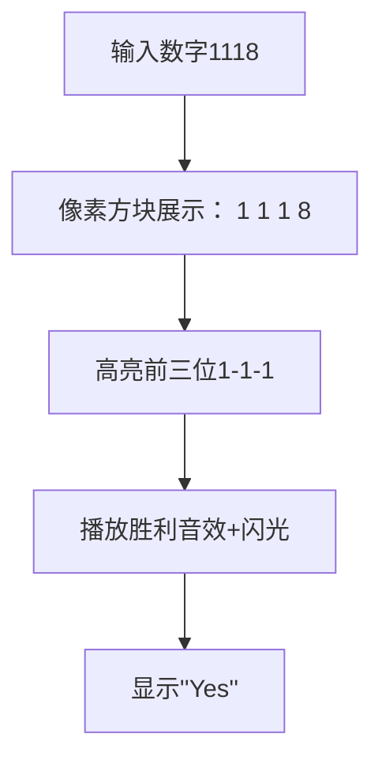

# 题目信息

# [ABC079A] Good Integer

## 题目描述

像 $1118$ 这样，$4$ 位整数中有 $3$ 个或以上相同的数字连续排列的数，被称为**好整数**。

给定一个 $4$ 位整数 $N$，请判断 $N$ 是否为**好整数**。

## 说明/提示

## 限制条件

- $1000 \leq N \leq 9999$
- 输入为整数

## 样例解释 1

因为 $1$ 连续出现了 $3$ 次，所以是**好整数**。

## 样例解释 2

所有数字都相同的情况也属于**好整数**。

由 ChatGPT 4.1 翻译

## 样例 #1

### 输入

```
1118```

### 输出

```
Yes```

## 样例 #2

### 输入

```
7777```

### 输出

```
Yes```

## 样例 #3

### 输入

```
1234```

### 输出

```
No```

# AI分析结果


# 💡 Kay的C++算法解析：Good Integer 深入学习指南 💡

**引言**  
今天我们一起分析「Good Integer」这道C++编程题。题目要求判断一个4位整数中是否存在至少3个连续相同的数字。本指南将帮助你掌握解题思路和核心技巧！

---

## 1. 题目解读与核心算法识别

✨ **本题主要考察**：`编程技巧应用（基础操作）`

🗣️ **初步分析**：  
> 解决这道题就像检查一串珍珠项链是否有连续三颗相同颜色的珍珠。核心技巧是**提取数字的每一位**并**判断连续性**。  
> - 题解主要分两类：整数拆解法（用除法和取余）和字符串遍历法（直接比较相邻字符）  
> - 关键步骤：提取四位数字 → 检查前三位或后三位是否相同  
> - 可视化设计：用像素方块表示数字，高亮连续相同的三个方块，配胜利音效；否则灰色显示并配提示音  

---

## 2. 精选优质题解参考

**题解一（Warriors_Cat）**  
* **点评**：思路清晰直白，完整演示了整数拆解过程。变量命名规范（a/b/c/d对应千/百/十/个位），边界处理严谨。亮点在于用数学运算替代字符串操作，加深对数字处理的理解。代码可直接用于竞赛，是学习基础编程技巧的优秀范例。

**题解二（RioBlu）**  
* **点评**：采用字符串遍历思路，代码简洁高效。亮点在于用`%1d`技巧直接读取数字和智能循环终止（找到即退出）。虽然变量`u`未使用，但核心逻辑突出，展示了字符串处理的实用性，特别适合熟悉字符串操作的学习者。

---

## 3. 核心难点辨析与解题策略

1. **难点：如何正确提取数字位？**  
   * **分析**：整数拆解需掌握除法和取余的配合。例如`n/1000`取千位，`n/100%10`取百位。优质题解通过分步计算避免混淆  
   * 💡 **学习笔记**：除10ⁿ取高位，模10取低位  

2. **难点：如何高效判断连续性？**  
   * **分析**：只需检查两种位置组合——前三位（索引0-2）或后三位（索引1-3）。避免无效比较是关键  
   * 💡 **学习笔记**：连续三位的核心是中间位共享（如b是前三位和后三位的交集）  

3. **难点：选择整数还是字符串处理？**  
   * **分析**：整数拆解适合学习数学运算，字符串处理更简洁。根据输入特性（固定4位数），两种方法时间复杂度均为O(1)  
   * 💡 **学习笔记**：数字计算锻炼底层思维，字符串操作提升代码简洁性  

### ✨ 解题技巧总结
- **技巧1：分步拆解复杂操作** → 先取位再比较，降低思维复杂度  
- **技巧2：逻辑表达式优化** → 用`||`合并同类条件（前三位或后三位）  
- **技巧3：即时终止** → 找到结果立即退出（如字符串解法中的`return 0`）  

---

## 4. C++核心代码实现赏析

**通用核心实现（整数拆解法）**  
```cpp
#include <iostream>
using namespace std;
int main() {
    int n, a, b, c, d;
    cin >> n;
    a = n / 1000;       // 千位
    b = n / 100 % 10;   // 百位
    c = n / 10 % 10;    // 十位
    d = n % 10;         // 个位
    
    if ((a == b && b == c) || (b == c && c == d)) 
        cout << "Yes";
    else 
        cout << "No";
    return 0;
}
```
**代码解读概要**：  
> 通过除法和取余提取四位数字，用逻辑表达式判断前三位或后三位的连续性。是基础数学运算的经典应用  

---

**题解一核心代码（Warriors_Cat）**  
```cpp
a = n / 1000;
b = n / 100 % 10;
c = n / 10 % 10;
d = n % 10;
if((a == b && b == c) || (b == c && c == d)) 
    puts("Yes");
else 
    puts("No");
```
* **亮点**：清晰的变量命名和分步计算  
* **代码解读**：  
  > `n/1000`直接获取千位；`n/100%10`先取前三位再得百位；连续比较使用短路逻辑优化效率  
* 💡 **学习笔记**：除法和取余是数字处理的基石  

---

**题解二核心代码（RioBlu）**  
```cpp
string n;
cin >> n;
for(int s=2; s<n.size(); s++) {
    if(n[s]==n[s-1] && n[s]==n[s-2]) {
        cout<<"Yes"<<endl;
        return 0;
    }
}
cout<<"No"<<endl;
```
* **亮点**：简洁的字符串遍历和即时返回  
* **代码解读**：  
  > 循环从索引2（第三位）开始，检查当前位与前两位是否相同。找到即输出并终止程序  
* 💡 **学习笔记**：字符串遍历时注意索引起始位置  

---

## 5. 算法可视化：像素动画演示

**主题**：像素数字检验员（8-bit风格）  
**核心演示**：动态展示数字拆解与连续性判断过程  

### 动画设计


1. **场景初始化**  
   - 复古绿色终端界面，数字用16x16像素方块显示  
   - 控制面板：步进执行/自动播放/速度滑块（配FC按键音效）  

2. **关键动画帧**  
   - **拆解阶段**：数字从输入框"掉落"成四个独立方块（配下落音效）  
   - **检查阶段**：  
     - 前三位黄色高亮闪烁→相同则变绿，播放"叮！"音效  
     - 否则变灰，播放"噗"提示音  
   - **结果阶段**：显示像素风"Yes/No"弹窗，胜利时放8-bit庆祝音乐  

3. **交互设计**  
   - **AI演示模式**：自动展示不同输入案例（1118/7777/1234）  
   - **音效系统**：数字移动声、成功三连音、失败低沉音  
   - **关卡积分**：连续答对3题解锁"数字大师"像素勋章  

---

## 6. 拓展练习与相似问题思考

**通用技巧迁移**：  
连续数字判断技巧还可用于：  
1. 身份证号校验（连续相同数字检测）  
2. 彩票中奖分析（连续中奖号统计）  
3. 密码强度验证（禁止连续相同字符）  

**洛谷练习推荐**：  
1. **P1424** 连续字符统计 → 训练字符串遍历能力  
2. **P1618** 三连击 → 强化数字拆解与重组技巧  
3. **P1008** 三连击升级版 → 综合应用边界条件处理  

---

## 7. 学习心得与经验分享

> 本次分析的题解中未发现明确的作者个人心得分享部分，但Warriors_Cat的注释提醒我们：  
> **调试技巧**：对于固定位数问题，可打印中间变量（如a/b/c/d）验证拆解正确性  

---

**结语**  
通过本次学习，你掌握了数字处理的核心技巧！记住：整数拆解和字符串操作是基础中的基石。下次遇到类似问题，不妨先思考——"我需要珍珠项链视角还是数字分解视角？" Keep coding! 💻✨

---
处理用时：143.73秒