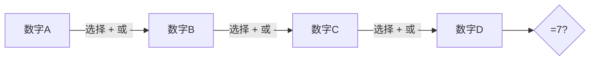

# 题目信息

# [ABC079C] Train Ticket

## 题目描述

坐在车站候车室的 joisino 姐姐正在看着她的车票。

车票上依次写着 $4$ 个 $0$ 到 $9$ 之间的整数 $A$、$B$、$C$、$D$，作为整理编号。

请在 $A$、$B$、$C$、$D$ 之间依次插入 $op1$、$op2$、$op3$，每个 $op$ 可以是 `+` 或 `-`，使得 $A\ op1\ B\ op2\ C\ op3\ D = 7$。

请构造出满足条件的表达式。

另外，输入保证一定存在解。如果有多个答案，输出任意一个即可。

## 说明/提示

## 限制

- $0 \leq A,B,C,D \leq 9$
- 输入均为整数
- 输入保证一定存在解

## 样例解释 1

$1+2+2+2=7$ 满足条件。

## 样例解释 2

除此之外，$0-2+9-0=7$ 也满足条件。

由 ChatGPT 4.1 翻译

## 样例 #1

### 输入

```
1222```

### 输出

```
1+2+2+2=7```

## 样例 #2

### 输入

```
0290```

### 输出

```
0-2+9+0=7```

## 样例 #3

### 输入

```
3242```

### 输出

```
3+2+4-2=7```

# AI分析结果


# 💡 Kay的C++算法解析：Train Ticket 深入学习指南 💡

**引言**  
大家好，我是Kay！今天我们来探索ABC079C Train Ticket这道有趣的问题。题目要求我们在四个数字间插入`+`或`-`运算符，使表达式结果为7。这道题能帮助我们掌握**暴力枚举**的核心思想，培养对问题规模的分析能力。让我们开始吧！

---

## 1. 题目解读与核心算法识别

✨ **本题主要考察**：`枚举`（暴力搜索）与`模拟`  

🗣️ **初步分析**：  
> 解决本题就像玩一个**数字迷宫游戏**：四个数字是固定位置，三个运算符是需要选择的路径（`+`或`-`）。我们需要尝试所有可能的路径组合（共8种），找到通目标7的正确路径。  
> - **核心思路**：通过三重循环枚举所有运算符组合（2³=8种），模拟计算表达式值
> - **可视化设计**：采用像素风迷宫探险主题，数字为站点，运算符为岔路。动画高亮当前选择的运算符路径，实时显示计算过程和结果
> - **游戏化元素**：FC音效（选择路径"滴"声，成功"胜利"音效），每尝试一条路径视为"关卡"，通关时显示表达式路径

---

## 2. 精选优质题解参考

**题解一：TRZ_2007**  
* **点评**：思路清晰直白，直接使用字符循环枚举运算符（`'+'`到`'-'`）。代码规范（变量名`ans`含义明确），边界处理严谨。亮点在于用字符变量直接表示运算符，避免额外转换，逻辑简洁高效。竞赛实用性强，是标准解法典范。

**题解二：Ciyang**  
* **点评**：创新性使用整数0/1映射运算符，通过`i*2+43`转换为ASCII字符（`+`=43, `-`=45）。代码模块化优秀（分步记录中间结果），注释详尽。亮点在于运算符的数学化处理，展示数字与字符的转换技巧，适合学习底层实现。

**题解三：Kiel**  
* **点评**：直接使用ASCII码值（43/45）进行循环和判断。虽然可读性稍弱（需了解ASCII），但性能高效（减少类型转换）。亮点在于用整数运算避免字符比较，体现对数据本质的理解，适合进阶学习者。

---

## 3. 核心难点辨析与解题策略

### 关键难点与解决方案
1. **运算符的枚举与表示**  
   * **分析**：如何简洁表示并遍历三种运算符？优质题解给出三种方案：字符循环（TRZ_2007）、0/1标志转换（Ciyang）、ASCII值运算（Kiel）
   * 💡 **学习笔记**：选择取决于可读性与性能的平衡，字符循环最直观

2. **表达式计算的顺序处理**  
   * **分析**：必须严格从左向右计算（无优先级）。解法都采用累加策略：`ans`初始为首位数字，随后根据运算符增减值
   * 💡 **学习笔记**：表达式计算需保持顺序一致性，初始值设为`a`是关键

3. **结果的即时判断与输出**  
   * **分析**：找到第一个解立即退出（`return 0`），避免无效计算。所有解法都严格遵循"发现即输出"原则
   * 💡 **学习笔记**：在保证正确性的前提下提前退出是优化的重要技巧

### ✨ 解题技巧总结
- **问题规模分析**：先计算可能性数量（8种），确认枚举可行性
- **变量转换技巧**：字符数字减`'0'`转整型是通用技巧
- **模块化计算**：将表达式拆分为多步操作（如Ciyang的分步记录）
- **即时退出机制**：找到解后立即结束程序，提升效率

---

## 4. C++核心代码实现赏析

**通用核心实现参考**  
```cpp
#include <iostream>
using namespace std;

int main() {
    char a1, b1, c1, d1;
    cin >> a1 >> b1 >> c1 >> d1;
    int a = a1 - '0', b = b1 - '0', c = c1 - '0', d = d1 - '0';

    for (char op1 : {'+', '-'}) {
        for (char op2 : {'+', '-'}) {
            for (char op3 : {'+', '-'}) {
                int res = a;
                res += (op1 == '+') ? b : -b;
                res += (op2 == '+') ? c : -c;
                res += (op3 == '+') ? d : -d;

                if (res == 7) {
                    cout << a << op1 << b << op2 << c << op3 << d << "=7\n";
                    return 0;
                }
            }
        }
    }
}
```
* **说明**：综合优质题解优点，使用C++11范围循环提升可读性
* **解读概要**：  
  1. 读入字符并转换为整数  
  2. 三重循环枚举运算符组合  
  3. 条件运算符(`?:`)高效计算表达式  
  4. 发现解立即输出并退出  

---

**题解一：TRZ_2007**  
```cpp
for(char i='+'; i<='-'; i++)
    for(char j='+'; j<='-'; j++)
        for(char k='+'; k<='-'; k++) {
            ans = a;
            if(i == '+') ans += b; else ans -= b;
            // 类似处理j,k...
            if(ans == 7) {
                cout << a << i << b << ... << "=7\n";
                return 0;
            }
        }
```
* **亮点**：直观的字符枚举，易理解
* **解读**：  
  > 循环变量`i`,`j`,`k`直接从`'+'`到`'-'`（ASCII 43到45）。  
  > 为何能这样循环？字符在底层以整数存储，`'+'`(43)和`'-'`(45)是连续的整数。  
  > 像选择路径：每次尝试一条新岔路，计算当前路径结果。
* 💡 **学习笔记**：利用ASCII特性简化代码是实用技巧

**题解二：Ciyang**  
```cpp
for(int i=0; i<2; i++) {
    if(!i) { t[0] = a + b; f[0] = '+'; }
    else   { t[0] = a - b; f[0] = '-'; }
    // 内层循环处理j,k...
}
```
* **亮点**：分步记录结果和运算符
* **解读**：  
  > 用整数`i`(0/1)表示运算符，再转换为字符存储。  
  > `t[]`数组保存中间结果：如`t[0]`存储`a±b`的结果。  
  > 像搭积木：先组合前两个数字，再逐步添加后续部分。
* 💡 **学习笔记**：分阶段计算复杂表达式更不易出错

**题解三：Kiel**  
```cpp
for(int i=43; i<=45; i+=2) {
    if(i == 43) res += b; 
    else        res -= b;
    // 类似处理j,k...
}
```
* **亮点**：直接使用ASCII值运算
* **解读**：  
  > 43(`'+'`)和45(`'-'`)通过`i+=2`遍历。  
  > 省去字符转换，直接整数比较。  
  > 像破译密码：数字43/45对应具体操作指令。
* 💡 **学习笔记**：理解数据底层表示能开拓解题思路

---

## 5. 算法可视化：像素动画演示

**主题**：数字迷宫探险  
**核心演示**：枚举过程可视化，运算符选择作为路径分支  

### 动画设计


**实现细节**：
1. **8位像素风格**：
   - 数字站点：16x16像素方块（FC风格）
   - 运算符路径：绿色(+)和红色(-)箭头
   - 控制面板：复古按钮（开始/单步/重置）

2. **动态演示流程**：
   - 初始化：显示四个数字站点和三条路径
   - 路径选择：高亮当前尝试的运算符组合
   - 实时计算：显示当前表达式和中间结果
   - 结果反馈：成功(金币动画+胜利音效)/失败(灰色路径)

3. **交互与游戏化**：
   - 单步执行：手动控制探索速度
   - 自动演示：AI自动遍历所有路径
   - 音效系统：
     * 路径切换："滴"声（8-bit短音）
     * 计算成功：经典FC胜利旋律
     * 路径错误：低沉警示音

4. **教学提示**：
   - 旁白框显示当前表达式
   - 状态栏提示："正在尝试：A+B-C+D"
   - 结果页显示："找到解：3+2+4-2=7"

**设计价值**：将抽象枚举过程转化为具象路径探索，帮助理解循环和条件判断的执行流程

---

## 6. 拓展练习与相似问题思考

### 通用思路迁移
枚举法适用于：
1. 状态空间小的问题（通常≤1000种可能）
2. 需要穷举所有组合/排列的场景
3. 可分解为独立选择的决策序列

### 洛谷推荐练习
1. **P1036 选数**  
   🗣️ *巩固枚举组合+质数判断，学习剪枝优化*

2. **P1217 回文质数**  
   🗣️ *练习数字处理与枚举策略的结合应用*

3. **P2392 考前复习**  
   🗣️ *提升多维度枚举能力，培养时间估算意识*

---

## 7. 学习心得与经验分享

**经验摘录**（Ciyang题解）：  
> *"使用0/1标记运算符并通过公式转换，可避免字符循环边界问题"*

**Kay点评**：  
> 这个技巧展示了问题转化的思维——将符号选择抽象为数学问题。当遇到复杂操作时，思考"能否用数字表示状态？"往往能简化代码。调试时，可先验证转换公式的正确性（如打印`i*2+43`的值），再逐步构建逻辑。

---

**结语**  
通过本次分析，我们掌握了枚举法的核心思想：**化大为小，化繁为简**。记住，编程就像探险——先看清所有可能的路径（分析问题规模），再选择最高效的探索方式（设计算法）。继续加油，下次见！🚀

---
处理用时：221.57秒