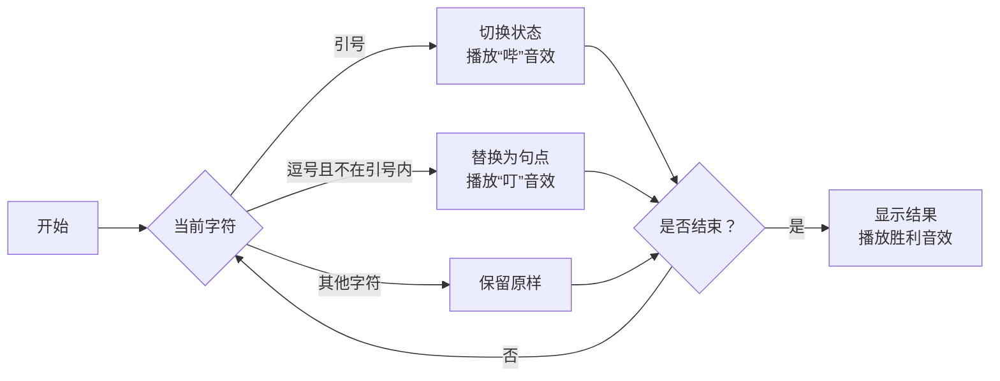

# 题目信息

# [ABC282C] String Delimiter

## 题目描述

给定一个由小写英文字母、`,` 和 `"` 组成的长度为 $N$ 的字符串 $S$。保证 $S$ 中出现的 `"` 的个数为偶数。

如果 $S$ 中的 `"` 出现了 $2K$ 次，则对于每个 $i=1,2,\ldots,K$，从第 $2i-1$ 个 `"` 到第 $2i$ 个 `"` 之间的所有字符，称为**被括起来的字符**。

你的任务是，将 $S$ 中所有**不属于被括起来的字符**的 `,` 替换为 `.`，并输出替换后的字符串。

## 说明/提示

### 限制条件

- $N$ 是 $1$ 到 $2\times 10^5$ 之间的整数。
- $S$ 是一个长度为 $N$ 的字符串，仅包含小写英文字母、`,` 和 `"`。
- $S$ 中出现的 `"` 的个数为偶数。

### 样例解释 1

在 $S$ 中，`"a,b"` 是被括起来的字符，而 `c,d` 不是被括起来的字符。$S$ 中不属于被括起来的字符的 `,` 是从左数第 $7$ 个字符，因此将第 $7$ 个字符替换为 `.` 后的字符串即为答案。

由 ChatGPT 4.1 翻译

## 样例 #1

### 输入

```
8

"a,b"c,d```

### 输出

```
"a,b"c.d```

## 样例 #2

### 输入

```
5

,,,,,```

### 输出

```
.....```

## 样例 #3

### 输入

```
20

a,"t,"c,"o,"d,"e,"r,```

### 输出

```
a."t,"c."o,"d."e,"r.```

# AI分析结果


### 💡 Kay的C++算法解析：String Delimiter 深入学习指南 💡

**引言**  
今天我们来分析 ABC282C "String Delimiter" 这道字符串处理题。本指南将帮助你理解如何通过状态跟踪技巧高效解决引号内字符的识别问题。

---

## 1. 题目解读与核心算法识别
✨ **本题主要考察**：`状态机模拟`（编程技巧应用）  

🗣️ **初步分析**：  
> 解决本题的关键在于设计一个**字符处理流水线**。想象你在工厂流水线上检查包裹（字符），手里有一个开关（状态标志）。每当看到双引号包裹，就按动开关切换状态（引号内/外）。当遇到逗号包裹且开关处于"关闭"状态（非引号内）时，就将其替换成句点包裹。  

- **核心流程**：  
  1. 初始化状态标志 `flag = 0`（表示当前不在引号内）  
  2. 遍历字符串：  
     - 遇 `"` → 翻转状态（`flag ^= 1`）  
     - 遇 `,` 且 `flag=0` → 替换为 `.`  
- **可视化设计**：  
  采用**8位像素流水线**动画：  
  - 字符显示为像素方块（字母：绿色，逗号：黄色，引号：红色）  
  - 状态标志用发光边框表示（蓝色边框=引号内）  
  - 替换操作时：黄色方块闪烁→变为紫色方块，伴随"叮"音效  

---

## 2. 精选优质题解参考
**题解一：InversionShadow（思路清晰性 ★★★★☆）**  
* **点评**：  
  通过计数器 `cnt` 模拟引号状态（0/1），逻辑直白易理解。代码中 `if-else` 分支完整覆盖所有情况，边界处理严谨（如先判断引号再处理逗号）。亮点在于用最简单的计数逻辑实现状态切换，适合初学者掌握基础状态机思想。

**题解二：c20231020（代码简洁性 ★★★★☆）**  
* **点评**：  
  仅用 **10行核心代码** 解决问题！采用位运算 `f ^= 1` 切换状态，效率极高。直接修改原字符串的设计减少了内存占用。尽管变量名 `f` 稍简略，但整体实现简洁高效，体现了"用最少代码解决复杂问题"的编程哲学。

---

## 3. 核心难点辨析与解题策略
1. **难点：正确跟踪引号状态**  
   * **分析**：双引号成对出现时状态才翻转。优质题解用整型变量（0/1）或布尔值精准记录状态，避免复杂匹配逻辑  
   * 💡 **学习笔记**：状态变量是处理分段标记问题的"灵魂开关"  

2. **难点：高效执行字符替换**  
   * **分析**：边遍历边修改比事后批量处理更高效（如NightStriker解法需额外标记数组）。直接修改原字符串节省内存  
   * 💡 **学习笔记**：在允许修改输入数据时，原地操作常是最优解  

3. **难点：处理边界条件**  
   * **分析**：首位引号、连续逗号等特殊情况需测试。题解一通过严格的条件分支（`if(cnt==0 && s[i]==',')`）确保鲁棒性  
   * 💡 **学习笔记**：用极限用例（如全逗号、无引号）验证代码健壮性  

### ✨ 解题技巧总结
- **技巧1：状态机简化流程**  
  用单一变量（如 `flag`）抽象复杂状态，避免多层嵌套判断  
- **技巧2：边读边处理**  
  单次遍历完成所有操作，达到O(n)最优时间复杂度  
- **技巧3：防御性测试**  
  验证空串、全引号、无逗号等边界用例  

---

## 4. C++核心代码实现赏析
**通用核心实现参考**  
```cpp
#include <iostream>
using namespace std;

int main() {
    int n;
    string s;
    cin >> n >> s;
    bool inQuote = false; // 状态标志
    
    for (char &c : s) { // 引用修改原字符
        if (c == '"') inQuote = !inQuote; // 状态翻转
        else if (c == ',' && !inQuote) c = '.'; // 非引号内替换
    }
    cout << s;
    return 0;
}
```
* **代码解读概要**：  
  - `inQuote` 作为状态标志（true=在引号内）  
  - 范围循环 `for(char &c : s)` 直接修改字符  
  - 仅当非引号内逗号时执行替换  

**题解一片段赏析**  
```cpp
if (s[i] == '"') {
    cnt = (cnt == 0) ? 1 : 0; // 三元运算符切换状态
} else if (cnt == 0 && s[i] == ',') {
    s[i] = '.';
}
```
* **亮点**：显式状态切换逻辑更易理解  
* **学习笔记**：三元运算符 `a?b:c` 可简化二选一赋值  

**题解二片段赏析**  
```cpp
if (s[i] == '\"') f ^= 1;  // 位运算切换状态
else if (s[i] == ',' && !f) s[i] = '.';
```
* **亮点**：异或运算 `^=` 实现高效状态翻转  
* **学习笔记**：位运算适合二进制状态切换场景  

---

## 5. 算法可视化：像素动画演示
**主题**：`字符工厂流水线`（复古游戏风）  

**核心演示流程**：  


**交互设计**：  
1. **像素元素**：  
   - 字母：绿色像素块（带字母贴图）  
   - 逗号：黄色闪烁方块  
   - 引号：红色旋转方块  
   - 状态指示器：LED灯（蓝色=引号内）  

2. **动画特效**：  
   - 引号切换：LED灯闪烁，角色头顶显示`!`气泡  
   - 逗号替换：黄色→紫色渐变，掉落星形粒子  

3. **游戏化设计**：  
   - 每正确处理10字符解锁新BGM  
   - 连续无错误触发"COMBO"特效  
   - 通关后显示用时和准确率评级（S/A/B/C）  

---

## 6. 拓展练习与相似问题思考
**技巧迁移场景**：  
1. 解析JSON/XML等带分隔符的结构化数据  
2. 代码语法高亮中的括号匹配检测  
3. 嵌入式系统协议解析（如AT指令）  

**推荐练习**：  
1. **洛谷 P1739** - 表达式括号匹配  
   → 巩固状态跟踪技巧  
2. **洛谷 P1179** - 数字统计  
   → 训练字符条件判断能力  
3. **洛谷 P3740** - [COCI2015] BABA  
   → 进阶版字符串模式匹配  

---

## 7. 学习心得与经验分享
本次题解中未发现作者明确的调试心得，但通过代码可提炼经验：  
> **Kay的调试建议**：  
> 当状态逻辑出错时，在循环内打印状态变量（如`cout<<"pos:"<<i<<" flag:"<<inQuote<<endl;`），可清晰观察状态机运作轨迹。

---

**结语**  
通过本次学习，我们掌握了用状态机高效处理分段字符串的核心技巧。记住：好的算法如同精巧的机械装置——用最简单的零件解决最复杂的问题！下次挑战见！💪

---
处理用时：119.76秒