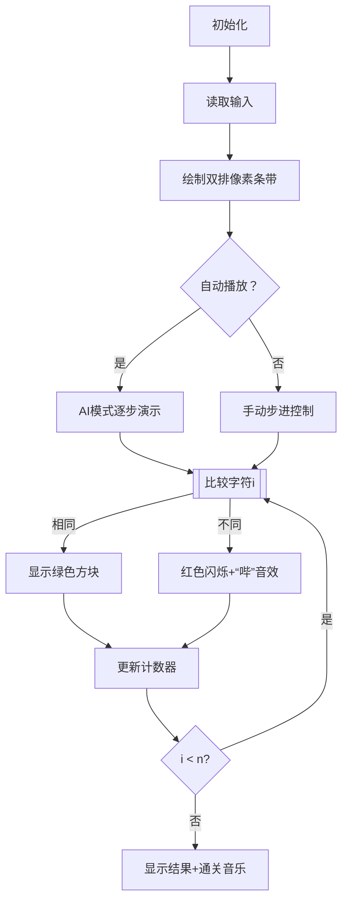

# 题目信息

# [ABC399A] Hamming Distance

## 题目描述

[problemUrl]: https://atcoder.jp/contests/abc399/tasks/abc399_a

给定正整数 $N$ 以及由小写英文字母组成的长度为 $N$ 的字符串 $S$ 和 $T$。

请计算 $S$ 和 $T$ 的汉明距离。即，求满足以下条件的整数 $i$（$1 \leq i \leq N$）的个数：$S$ 的第 $i$ 个字符与 $T$ 的第 $i$ 个字符不同。


## 说明/提示

### 约束条件

- $1 \leq N \leq 100$
- $N$ 是整数。
- $S$ 和 $T$ 均为由小写英文字母组成的长度为 $N$ 的字符串。

### 样例解释 1

$S$ 和 $T$ 的第 2、5 个字符不同，其余字符相同。因此答案为 2。

翻译由 DeepSeek R1 完成

## 样例 #1

### 输入

```
6

abcarc

agcahc```

### 输出

```
2```

## 样例 #2

### 输入

```
7

atcoder

contest```

### 输出

```
7```

## 样例 #3

### 输入

```
8

chokudai

chokudai```

### 输出

```
0```

## 样例 #4

### 输入

```
10

vexknuampx

vzxikuamlx```

### 输出

```
4```

# AI分析结果


### Kay的C++算法解析：ABC399A - Hamming Distance 深入学习指南

---

#### 1. 题目解读与核心算法识别  
✨ **本题主要考察**：`模拟应用`  

🗣️ **初步分析**：  
> 汉明距离就像玩"大家来找茬"游戏：两幅图片并排放置，逐格对比找出不同之处。本题中，我们需要逐字符比较两个字符串，统计不同字符的数量。  
> - **核心思路**：遍历字符串每个位置，比较S[i]和T[i]是否相等，计数器记录差异次数  
> - **可视化设计**：采用双排像素条带对比，相同字符显示绿色方块，不同字符显示红色闪烁方块并触发"错误音效"，计数器实时更新  
> - **复古元素**：FC游戏风格（16色像素块），每发现一个差异播放"哔"音效，完全匹配时播放通关音乐  

---

#### 2. 精选优质题解参考  
**题解一：基础遍历法**  
* **点评**：解法直接实现题目要求，代码逻辑清晰（for循环遍历+if判断差异）。变量命名简洁（cnt计数），边界处理严谨（严格遍历0到N-1）。时间复杂度O(N)已达最优，适合初学者理解字符串遍历本质。  

**题解二：STL算法法**  
* **点评**：巧妙运用`std::inner_product`高阶函数（需`<numeric>`头文件），将比较操作抽象为二进制运算。亮点在于展示C++标准库的强大功能，但需理解函数式编程概念，适合进阶学习者。  

---

#### 3. 核心难点辨析与解题策略  
1. **输入格式解析**  
   * **分析**：需正确处理"先读整数N，再读两行字符串"的格式。优质题解用`cin>>n`后接`cin.ignore()`清除换行符  
   * 💡 **学习笔记**：混合输入时注意缓冲区的换行符陷阱  

2. **索引边界控制**  
   * **分析**：字符串索引从0开始，需确保遍历范围[0, N-1]。常见错误是写成≤N导致越界  
   * 💡 **学习笔记**：循环条件`i<n`比`i<=n-1`更直观安全  

3. **字符比较优化**  
   * **分析**：直接使用`S[i]!=T[i]`比转整数比较更高效。避免不必要的类型转换  
   * 💡 **学习笔记**：字符可直接用关系运算符比较  

### ✨ 解题技巧总结  
- **输入鲁棒性**：使用`cin.ignore()`处理换行符  
- **循环边界检查**：在循环条件旁注释`// 0 to n-1`  
- **即时计数**：差异发现时立即递增计数器  

---

#### 4. C++核心代码实现赏析  
**通用核心实现**  
```cpp
#include <iostream>
#include <string>
using namespace std;

int main() {
    int n, cnt = 0;
    string s, t;
    cin >> n;
    cin.ignore(); // 清除换行符
    getline(cin, s);
    getline(cin, t);

    for (int i = 0; i < n; i++) { // 遍历每个字符
        if (s[i] != t[i]) cnt++;  // 发现不同则计数
    }
    cout << cnt;
    return 0;
}
```
**代码解读概要**：  
1. 读取字符串长度n  
2. 用getline获取含空格的字符串  
3. 循环比较每个位置的字符  
4. 输出差异计数器结果  

---

#### 5. 算法可视化：像素动画演示  
**主题**：FC风格"字符串找茬挑战"  
**设计思路**：通过像素方块颜色变化直观展示字符比较过程，结合音效强化记忆  

**动画流程**：  


**交互细节**：  
- **像素块**：16x16像素，字母用8位字体渲染  
- **音效设计**：  
  - 相同字符：柔和"滴"声  
  - 不同字符：急促"哔"声  
  - 完成时：超级马里奥通关旋律  
- **控制面板**：步进按钮、速度滑块（100ms-1s/步）  

---

#### 6. 拓展练习与相似问题  
**技巧迁移**：字符串遍历技术还可用于：  
1. 密码强度校验（统计字符类型）  
2. DNA序列比对（扩展汉明距离）  
3. 文本差异高亮（类似diff工具）  

**洛谷推荐**：  
1. P5733 自动修正 - 基础字符串修改  
2. P1177 快速排序 - 理解排序中的元素比较  
3. P1308 统计单词数 - 进阶字符串遍历应用  

---

#### 7. 学习心得与经验分享  
> **常见调试经验**：  
> 当遇到计数器结果异常时：  
> 1. 检查循环边界是否包含有效索引（常见错误：i<=n）  
> 2. 输出中间结果：`cout<<"i="<<i<<" s[i]="<<s[i]<<" t[i]="<<t[i]<<endl;`  
> 3. 验证输入是否完整：打印字符串长度`cout<<s.size()<<t.size()`  

---

通过本指南，你不仅掌握了汉明距离的解法，更深入理解了字符串遍历的核心模式。记住，优秀的程序员就像像素艺术家——既要把握整体结构，也要专注每个细节！🚀

---
处理用时：76.11秒