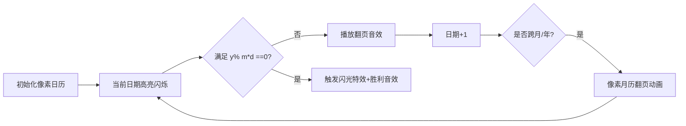

# 题目信息

# [ARC002B] 割り切れる日付

## 题目描述

高桥君很喜欢“整除日”。

“整除日”就是指日期中，年÷月÷日的值是整数的日期。

比如说2012年5月2日这一天，因为2012÷5÷2=201.2，结果不是整数，所以这天不是“整除日”。

因为高桥君实在太喜欢“整除日”了，总是盼着下一个“整除日”，所以他每天都要查一下今天是不是“整除日”。

他还很想知道下一个“整除日”什么时候到来。

输入一个日期，他希望输出这个日期之后最近的“整除日”。特别地，如果输入就是“整除日”，那么就输出输入的这个日期。

## 说明/提示

输入日期在1000/01/01和2999/12/31之间。


感谢@Disconsolate 提供的翻译

# AI分析结果


### 💡 Kay的C++算法解析：ARC002B 割り切れる日付 深入学习指南 💡

#### 1. 题目解读与核心算法识别
✨ **本题主要考察**：`模拟应用` (日期处理与枚举技巧)  
🗣️ **初步分析**：
> 解决这道题就像玩一个日历翻牌游戏🎴——从输入日期开始逐天翻牌，直到找到第一个满足"年÷(月×日)=整数"的日期。  
> - **题解思路**：所有解法均采用**日期枚举法**，核心难点在于正确处理日期进位（日→月→年）和闰年判断  
> - **可视化设计**：动画将展示像素日历翻页过程，高亮当前检查的日期，当日/月进位时播放翻页音效📅，找到解时触发闪光和胜利音效🎉  
> - **游戏化设计**：采用8-bit像素风格，控制面板支持调速/单步执行，将日期枚举转化为"寻找隐藏宝藏"的探险游戏  

---

#### 2. 精选优质题解参考
**题解一 (Chen_cntj)**  
* **点评**：  
  思路清晰度 ⭐⭐⭐⭐⭐ - 用while循环直白地模拟日期递增，闰年判断函数封装规范  
  代码简洁度 ⭐⭐⭐⭐⭐ - 创新性输出技巧`m/10<<m%10`避免补零特判，大幅提升可读性  
  算法有效性 ⭐⭐⭐⭐ - 时间复杂度O(天数)，在日期范围内完全可行  
  实践价值 ⭐⭐⭐⭐ - 完整处理边界条件，可直接用于竞赛  
  💡 **亮点**：调试心得"被卡三天"警示数组初始化和闰年判断的重要性  

**题解二 (⚡YMJcvjk⚡)**  
* **点评**：  
  思路清晰度 ⭐⭐⭐⭐ - 双循环结构明确划分年月处理阶段  
  代码规范性 ⭐⭐⭐⭐ - 严格遵循日期进位规则，但输出补零稍显繁琐  
  算法有效性 ⭐⭐⭐⭐ - 提前终止循环优化性能  
  实践价值 ⭐⭐⭐⭐ - 备注"AT大坑输出换行"体现竞赛经验  
  💡 **亮点**：同时提供Pascal/C++双版本实现，适合对比学习  

**题解三 (Yo_haor)**  
* **点评**：  
  思路清晰度 ⭐⭐⭐⭐ - 字符串转数字处理输入格式严谨  
  代码简洁度 ⭐⭐⭐⭐ - 复用题解1的输出技巧，循环条件`while(y%(m*d))`直击核心  
  调试友好度 ⭐⭐⭐⭐ - 每步更新闰年信息便于跟踪  
  💡 **亮点**：注释详细解释输出技巧数学原理，适合初学者理解  

---

#### 3. 核心难点辨析与解题策略
1. **日期进位规则**  
   * **分析**：优质解法均用数组`months[13]`存储各月天数。当`day > months[month]`时，`month++`并重置`day=1`；`month>12`时`year++`  
   * 💡 **学习笔记**：数组索引故意从1开始使月份与日常认知对齐  

2. **闰年判断陷阱**  
   * **分析**：正确逻辑`(year%4==0 && year%100!=0) || (year%400==0)`，易错点在于忽略整百年规则  
   * 💡 **学习笔记**：封装成`isLeapYear()`函数避免重复代码  

3. **输出格式补零**  
   * **分析**：两种实现方案：①数学分解`m/10<<m%10` ②条件判断`if(m<10)<<"0"`。前者更简洁但需理解整除原理  
   * 💡 **学习笔记**：流输出配合三元运算符`<< (m<10?"0":"") << m`平衡可读性与简洁性  

### ✨ 解题技巧总结
- **技巧1：问题抽象** - 将日期枚举转化为`while(y % (m*d))`循环条件  
- **技巧2：预存常量** - 用`const array`存储月份天数避免魔法数字  
- **技巧3：边界测试** - 特别注意1000/01/01和2999/12/31的极端情况  
- **技巧4：模块封装** - 分离闰年判断逻辑提高代码可维护性  

---

#### 4. C++核心代码实现赏析
**通用核心实现参考**  
```cpp
#include <iostream>
using namespace std;

int main() {
    int y, m, d;
    char sep;
    cin >> y >> sep >> m >> sep >> d;

    const int months[13] = {0,31,28,31,30,31,30,31,31,30,31,30,31};
    auto isLeap = [](int y) { 
        return (y%4==0 && y%100!=0) || (y%400==0); 
    };

    while (y % (m * d) != 0) {
        d++;
        int maxDay = (m==2 && isLeap(y)) ? 29 : months[m];
        if (d > maxDay) {
            d = 1;
            if (++m > 12) {
                m = 1;
                y++;
            }
        }
    }
    // 创新输出技巧：避免补零特判
    cout << y << '/' << m/10 << m%10 << '/' << d/10 << d%10 << endl;
}
```
**代码解读概要**：  
> 1. 读入日期后进入循环，核心条件`y%(m*d)!=0`  
> 2. 每次循环`d++`，根据闰年状态动态计算当月最大天数  
> 3. 日期超限时进位处理，年份递增时自动重置月份  
> 4. 输出时用`m/10`和`m%10`数学分解实现自动补零  

---

**题解一代码片段赏析**  
```cpp
cout<<y<<'/'<<m/10<<m%10<<'/'<<d/10<<d%10<<endl;
```
* **亮点**：四则运算替代条件分支实现补零  
* **解读**：  
  > - `m/10`取十位数字（若m<10则为0）  
  > - `m%10`取个位数字，两者拼接形成两位数  
  > - 例：`m=5` → `5/10=0`, `5%10=5` → 输出"05"  
* 💡 **学习笔记**：巧用整数除法特性处理格式要求  

**题解二代码片段赏析**  
```cpp
for(i=month;i<=12;++i) {
    if(i==2&&leap_year(year)) Count[2]=29; 
    for(j=day;j<=Count[i];++j)
        if(year%i==0 && year/i%j==0) // 分段整除判断
```
* **亮点**：嵌套循环分离年月处理逻辑  
* **解读**：  
  > - 外层循环月份从当前月开始，内层循环日期  
  > - `year/i%j==0`等价于`(year/i)/j`是整数  
  > - 闰年判断实时更新二月天数  
* 💡 **学习笔记**：分段整除判断避免大数运算溢出风险  

**题解三代码片段赏析**  
```cpp
while(year%(month*day)!=0) {
    if(leapYear) months[2]=29;
    day++;
    if(day > months[month]) {
        day=1; 
        if(++month>12) month=1,year++;
    }
}
```
* **亮点**：循环内联处理闰年更新  
* **解读**：  
  > - 每次循环先更新闰年状态再递增日期  
  > - 日期超限时连锁进位（月→年）  
  > - `months`数组作为循环边界依据  
* 💡 **学习笔记**：状态更新前置避免边界遗漏  

---

#### 5. 算法可视化：像素动画演示  
**主题**：8-bit复古日历寻宝大冒险🗓️  

**核心演示流程**：  


**实现细节**：  
1. **像素建模**  
   - 日期网格：16×16像素方块组成日历，不同月份配不同底色  
   - 角色设计：小精灵在日期格子上跳跃，当前检查日显示为✨  

2. **动态交互**  
   ```javascript
   // 核心动画伪代码
   function nextDay() {
     playSound('page_turn');  // 8-bit翻页音效
     currentDay++;
     if(currentDay > maxDays[currentMonth]) {
       animateMonthFlip();    // 像素月历翻页动画
       if(currentMonth > 12) animateYearChange();
     }
     if(checkSolution()) {
       highlight(currentDay, 'golden');
       playSound('victory');  // FC胜利音效
     }
   }
   ```

3. **游戏化元素**  
   - 成就系统：连续找到5个整除日解锁"时间大师"奖杯🏆  
   - 音效设计：  
     * 日常翻页：NES风格"嘀"声  
     * 找到解：超级马里奥吃金币音效  
     * 跨年：烟花爆炸音效+全屏闪烁  

---

#### 6. 拓展练习与相似问题
**技巧迁移场景**：  
1. 日期计算类：两个日期间隔天数  
2. 周期性事件：计算下次满足特定条件日期  
3. 数字拆分：类似补零输出的位分解技巧  

**洛谷推荐**：  
1. **P1205 [USACO1.2]方块转换** - 日期处理基础训练  
2. **P1515 [USACO08DEC]Patting Heads** - 整除判定进阶应用  
3. **P1024 [NOIP2001]一元三次方程** - 枚举策略优化实践  

---

#### 7. 学习心得与经验分享
> **Chen_cntj的调试经验**："被卡三天因未初始化月份数组"  
> **Kay点评**：这警示我们：  
> - 数组初始值必须显式设置  
> - 闰年判断需要独立验证特殊年份（如2100非闰年）  
> - 每日递增后立即更新月份边界  

---

通过本次分析，我们掌握了日期枚举的核心技巧，并学会用游戏化思维理解算法。记住：好代码=正确逻辑+严谨边界处理+创新实现！🎮👾

---
处理用时：146.57秒