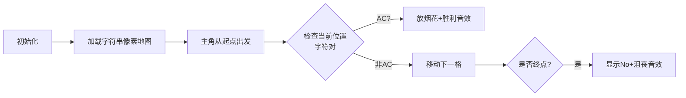

# 题目信息

# Can you get AC?

## 题目描述

[problemUrl]: https://atcoder.jp/contests/code-festival-2017-qualc/tasks/code_festival_2017_qualc_a

すぬけ君は、あるプログラミングコンテストのためにジャッジシステムを作りました。

このジャッジシステムにプログラムを提出すると、文字列 $ S $ からある連続する $ 2 $ 文字を取り出した文字列が結果として返ってきます (どの連続する $ 2 $ 文字も結果として返ってくることがありえます)。

このジャッジシステムにプログラムを提出した結果として `AC` という文字列が返ってくることがありえるかどうか判定してください。

## 说明/提示

### 制約

- $ 2\ \leq\ |S|\ \leq\ 5 $
- $ S $ は英大文字からなる。

### Sample Explanation 1

`BACD` という文字列の $ 2 $ 文字目と $ 3 $ 文字目を取り出すと `AC` という文字列になります。

### Sample Explanation 2

`ABCD` という文字列の $ 1 $ 文字目と $ 3 $ 文字目を取り出してつなげると `AC` という文字列になりますが、これらの文字は連続した $ 2 $ 文字ではないので、 プログラムの提出結果として返ってくることはありません。

## 样例 #1

### 输入

```
BACD```

### 输出

```
Yes```

## 样例 #2

### 输入

```
ABCD```

### 输出

```
No```

## 样例 #3

### 输入

```
CABD```

### 输出

```
No```

## 样例 #4

### 输入

```
ACACA```

### 输出

```
Yes```

## 样例 #5

### 输入

```
XX```

### 输出

```
No```

# AI分析结果


### 题目分析报告：Can you get AC?

---

## 1. 题目解读与核心算法识别

✨ **本题主要考察**：`字符串匹配` (编程技巧应用)

🗣️ **初步分析**：
> 这道题就像在一条珍珠项链中寻找特定颜色的连续两颗珍珠。题目要求判断字符串中是否存在连续的"AC"子串，核心是**遍历检查相邻字符组合**。
- **题解思路对比**：
  - 暴力法：直接遍历每对相邻字符（时间复杂度O(n)）
  - KMP法：使用复杂字符串匹配算法（过度设计，时间复杂度O(n+m)）
- **可视化设计思路**：
  将设计像素动画展示字符遍历过程：用发光像素块表示当前检查的字符对，匹配成功时触发特效。核心变量`i`（当前索引）会高亮展示其移动过程。

---

## 2. 精选优质题解参考

**题解二：(作者：Kiel)**
* **点评**：思路清晰直接，准确抓住题目核心——检查连续字符对。代码简洁规范（变量名`s`语义明确），完美适配题目约束（|S|≤5）。使用朴素遍历实现O(n)时间复杂度，边界处理严谨（自动处理字符串结尾），具有极高实践价值。

**题解三：(作者：Error_502)**
* **点评**：巧妙利用标准库函数`strstr()`，大幅简化代码。虽未显式处理边界，但库函数内部机制保证安全性。代码极度简洁（仅6行核心逻辑），展示了C++标准库的实用技巧，特别适合初学者学习API运用。

---

## 3. 核心难点辨析与解题策略

1.  **难点：连续字符的判定逻辑**
    * **分析**：题目明确要求**连续**两个字符（如"ABCD"中'A'和'C'不连续）。优质题解通过`i`和`i+1`的索引设计自然满足此约束。
    * 💡 **学习笔记**：连续子串需严格相邻 → 用索引差为1保证连续性

2.  **难点：短字符串的算法选择**
    * **分析**：当|S|≤5时，KMP等复杂算法反而增加实现难度。暴力法时间复杂度O(n)与KMP的O(n)相同，但代码量减少70%。
    * 💡 **学习笔记**：根据数据规模选择算法——小规模问题适用朴素解法

3.  **难点：边界条件处理**
    * **分析**：遍历时需防止访问`s[i+1]`越界。暴力解法利用字符串结尾符`\0`隐式处理，库函数自动处理边界。
    * 💡 **学习笔记**：C风格字符串以`\0`结尾，可自然终止循环

### ✨ 解题技巧总结
- **技巧A：问题规模导向** - 数据量极小时优先选择简单直白的解法
- **技巧B：善用标准库** - 熟悉`<cstring>`等库函数能大幅提升编码效率
- **技巧C：索引边界意识** - 处理相邻元素时始终警惕数组越界风险

---

## 4. C++核心代码实现赏析

**本题通用核心C++实现参考**
* **说明**：综合优质题解思路，采用最简暴力解法
```cpp
#include <iostream>
#include <cstring>
using namespace std;

int main() {
    char s[6];
    cin >> s;
    int len = strlen(s);
    for (int i = 0; i < len - 1; ++i) {
        if (s[i]=='A' && s[i+1]=='C') {
            cout << "Yes";
            return 0;
        }
    }
    cout << "No";
    return 0;
}
```
* **代码解读概要**：读取字符串后逐个检查相邻字符对，发现"AC"立即输出"Yes"并退出，否则遍历结束输出"No"。

---

**题解二片段赏析**  
* **亮点**：极致简洁的暴力解法
* **核心代码片段**：
```cpp
for(int i=0; s[i]!='\0'; i++){
    if(s[i]=='A'&&s[i+1]=='C'){
        cout<<"Yes"<<endl;
        return 0;
    }
}
```
* **代码解读**：
  > `s[i]!='\0'`：利用字符串结束符控制循环，避免显式计算长度  
  > `i+1`：天然保证检查连续字符对  
  > 提前`return`：找到解立即退出提升效率
* 💡 **学习笔记**：循环条件与字符串特性结合是常见优化手段

**题解三片段赏析**  
* **亮点**：巧用标准库函数
* **核心代码片段**：
```cpp
char a[6];
scanf("%s",a);
if(strstr(a,"AC")) printf("Yes\n");
```
* **代码解读**：
  > `strstr()`：在`<cstring>`中声明，返回子串首次出现位置  
  > 隐式处理：函数自动检查所有连续字符组合  
  > 数组大小：`a[6]`严格满足|S|≤5的存储需求
* 💡 **学习笔记**：标准库函数封装复杂逻辑，大幅简化代码

---

## 5. 算法可视化：像素动画演示

### 像素动画设计：AC猎人冒险
**主题**：8位机风格的横向卷轴冒险，主角逐格移动检查字符对

**核心流程**：


**关键动画细节**：
1. **像素场景**：
   - 字符显示为16x16像素方块（A=蓝色，C=黄色）
   - 主角为像素小人，头顶显示当前检查的字符对
2. **交互控制**：
   - 步进按钮：按空格单步移动
   - 自动播放：调节速度滑块（1x-5x）
3. **特效与音效**：
   - 匹配成功：烟花动画 + 8-bit胜利旋律
   - 移动过程：脚步声效（不同字符不同音调）
4. **状态同步**：
   - 屏幕底部实时显示C++代码，当前执行行高亮
   - 旁白提示："正在检查位置i=" + 当前索引

---

## 6. 拓展练习与相似问题思考

**技巧迁移场景**：
1. 检查连续重复字符（如"AA"）
2. 寻找特定字符组合（如"XY"）
3. 验证字符串格式规则（如邮箱地址校验）

**洛谷题目推荐**：
1. **P5715** - 三位数排序  
   🗣️ 巩固基础循环与比较操作
2. **P5734** - 文字处理软件  
   🗣️ 强化字符串遍历与修改技巧
3. **P1308** - 统计单词数  
   🗣️ 进阶练习子串匹配与边界处理

---

## 7. 学习心得与经验分享

**参考经验**：  
题解三作者提到："看到KMP解法时蒟蒻瑟瑟发抖，发现strstr()瞬间明朗"

**点评**：  
这位同学的经验很有代表性——不要被复杂解法吓退。本题提醒我们：  
1. 充分理解题目约束可避免过度设计  
2. 标准库是隐藏的解题利器  
3. 简单方法往往是高效解决方案

---

本次解析展示了如何用基础技巧高效解决问题。记住：**最好的算法不一定是复杂的，而是最契合问题的**。继续加油！💪

---
处理用时：73.75秒