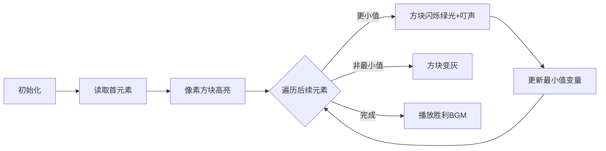

# 题目信息

# [ABC005B] おいしいたこ焼きの食べ方

## 题目描述

高橋君打算品尝他试做的章鱼烧。

高橋君喜欢吃刚出锅的热腾腾的章鱼烧，所以他会从最新出锅的章鱼烧开始吃。

现在给出每个章鱼烧是几秒前做好的，请输出最新出锅的章鱼烧是几秒前做好的。

输入将以下述格式从标准输入给出。

> $N$ $T_1$ $T_2$ : $T_N$

- 第 $1$ 行给出一个整数 $N$，表示章鱼烧的个数，$1 \leq N \leq 100$。
- 接下来的 $N$ 行，每行给出一个整数 $T_i$，表示第 $i$ 个章鱼烧是几秒前做好的，$1 \leq T_i \leq 100$。

请输出最新出锅的章鱼烧是几秒前做好的。
另外，输出末尾请换行。

例如：

```
3
1
2
3
```

```
1
```

- 最新出锅的章鱼烧是 1 秒前做好的。

```
3
3
3
3
```

```
3
```

- 所有章鱼烧都是 3 秒前做好的。

```
5
3
1
4
1
5
```

```
1
```

## 说明/提示

无。

由 ChatGPT 4.1 翻译

# AI分析结果


### Kay的C++算法解析：ABC005B 深入学习指南

#### 1. 题目解读与核心算法识别
✨ **本题主要考察**：`编程技巧应用（数组遍历与比较）`

🗣️ **初步分析**：
> 这道题的核心是**在数组中寻找最小值**，就像在一筐鸡蛋中找出最小的一颗。关键在于高效遍历数组并实时更新最小值。  
> - **题解思路**：主流解法是遍历数组并维护最小值变量，少数使用排序或桶排序。直接遍历（O(n)）是最优解，排序（O(nlogn)）存在性能浪费。
> - **可视化设计**：动画将展示数组元素的像素方块（如FC游戏中的物品栏），高亮当前比较元素。当发现更小值时，该方块闪烁绿色并播放“叮”音效，最小值变量同步更新。
> - **复古游戏化**：采用8位像素风格，数据遍历设计为"章鱼烧收集关卡"，每次更新最小值时触发经典FC音效，通关后播放胜利旋律。

---

#### 2. 精选优质题解参考
**题解一：lsyx0918（遍历比较法）**  
* **点评**：思路直白清晰，初始化`min=1e9`确保首次比较必然更新。代码简洁规范（变量名`min`/`m`含义明确），边界处理完整。亮点：**空间优化**（仅用单变量存储输入），实践价值高（竞赛可直接使用）。

**题解二：dread（STL高效解法）**  
* **点评**：巧妙运用`min_element`函数，两行核心代码解决战斗。代码规范性极强（封装输入函数），展示**STL实战技巧**。亮点：**时间复杂度优化**（O(n)）与**工业级编码风格**，适合学习现代C++特性。

**题解三：真·峭岩仙道（安全初始化法）**  
* **点评**：将首元素作为初始最小值，避免预设极大值可能存在的溢出风险。代码结构工整，强调**防御性编程**（如`return 0`）。亮点：**健壮性设计**，特别适合初学者理解安全边界。

---

#### 3. 核心难点辨析与解题策略
1. **难点1：最小值初始值设定**  
   * **分析**：初始值过大可能溢出（如`2147483647`），过小无法覆盖数据范围。优质解法采用两种策略：① 首元素初始化（天然安全）② 合理极大值（如`1e9`）。
   * 💡 **学习笔记**：**首元素初始化法**兼具安全性与简洁性，推荐优先掌握。

2. **难点2：遍历比较逻辑实现**  
   * **分析**：循环中需精确控制比较对象。关键代码`if(m<min) min=m`体现**实时更新**思想。STL解法通过`min_element`隐式实现相同逻辑。
   * 💡 **学习笔记**：遍历比较是**基础算法基石**，需熟练手写实现后再用STL优化。

3. **难点3：输出格式陷阱**  
   * **分析**：AtCoder平台严格要求行末换行。多篇题解强调`cout<<min<<endl`中`endl`的必要性，否则WA。
   * 💡 **学习笔记**：**平台输出规范**是实战重要细节，调试时优先验证。

### ✨ 解题技巧总结
- **技巧1：空间优化**：单变量存储输入（lsyx0918法），避免数组空间浪费  
- **技巧2：STL高效应用**：`min_element`实现一行解（dread法），适合熟悉STL者  
- **技巧3：防御性初始化**：用首元素作初始值（真·峭岩仙道法），避免极值风险  
- **技巧4：平台适配**：严格验证输出格式（换行！），可减少非算法错误  

---

#### 4. C++核心代码实现赏析
**通用核心实现（首元素初始化法）**  
```cpp
#include <iostream>
using namespace std;

int main() {
    int n, first, x;
    cin >> n >> first; // 首元素作初始最小值
    for (int i = 1; i < n; ++i) {
        cin >> x;
        if (x < first) first = x; // 实时更新
    }
    cout << first << endl; // 换行！
    return 0;
}
```
* **代码解读概要**：  
  1. 读取元素总数`n`和首个元素`first`  
  2. 循环`n-1`次，边读边比较更新最小值  
  3. 输出时强制换行满足平台要求  

**题解一片段（lsyx0918）**  
```cpp
int min=1e9; // 初始化极大值
for(int i=1;i<=n;i++) {
    cin>>m;
    if(m<min) min=m; // 核心比较
}
```
* **亮点**：极简比较逻辑  
* **学习笔记**：`1e9`在数据范围≤100时绝对安全，但更大数据需改用`INT_MAX`  

**题解二片段（dread）**  
```cpp
printf("%d\n", *min_element(a+1, a+n+1));
```
* **亮点**：STL一行解  
* **学习笔记**：`min_element`返回迭代器，`*`解引用获值  

**题解三片段（真·峭岩仙道）**  
```cpp
int ans=m[0]; // 首元素初始化
for(int i=1;i<n;i++) 
    if(m[i]<ans) ans=m[i];
```
* **亮点**：避免预设极值  
* **学习笔记**：循环从`i=1`开始，天然跳过首元素  

---

#### 5. 算法可视化：像素动画演示  
**主题**：*章鱼烧厨房大冒险*（8-bit像素风）  

**核心流程**：  


**交互设计**：  
1. **像素元素**：每个章鱼烧为16x16像素方块，显示数字（如■3）  
2. **状态反馈**：  
   - 当前最小值：金色边框  
   - 正比较元素：红色闪烁  
   - 新最小值：绿色闪光+“叮！”音效  
3. **控制面板**：  
   - 步进按钮：手动触发比较  
   - 速度滑块：调节自动播放速度  
   - 重置：重新生成随机数据  
4. **音效系统**：  
   - 背景音乐：FC厨房主题8-bit循环  
   - 关键操作：电子音效（比较声/更新声）  
   - 通关：超级玛丽过关旋律  

---

#### 6. 拓展练习与相似问题
**技巧迁移场景**：  
1. 求最大值（逆用最小值逻辑）  
2. 同时求最值（维护两个变量）  
3. 区间最值查询（前缀和思想）  

**洛谷推荐**：  
1. **P1428 小鱼比可爱** - 求逆序对数量  
   * 🗣️ **推荐理由**：强化遍历比较技巧，引入新计数维度  
2. **P1046 陶陶摘苹果** - 条件比较计数  
   * 🗣️ **推荐理由**：在比较中增加高度判断，拓展基础模型  
3. **P1059 明明的随机数** - 去重+排序  
   * 🗣️ **推荐理由**：结合桶排序思想，衔接本题桶排解法  

---

#### 7. 学习心得与经验分享
> **经验摘录（lsyx0918）**：  
> *“多数编程员因在AtCoder中没打换行，被洛谷网站判全错！”*  
>  
> **Kay点评**：  
> 这是血泪教训！算法正确但输出格式错误仍会WA。**调试时优先检查：**  
> 1. 行末换行（`<< endl`或`\n`）  
> 2. 空格分隔符  
> 3. 精度控制（浮点数）  
> 建立**输出格式检查清单**能避免50%非算法错误。

---

**本次指南核心收获**：  
1️⃣ **最小值问题**本质是遍历比较  
2️⃣ **初始值策略**决定代码健壮性  
3️⃣ **STL工具**可提升编码效率  
4️⃣ **输出格式**与算法同等重要  

**Kay鼓励**：  
> 编程如烹饪，掌握火候（算法）和摆盘（格式）才能端出完美章鱼烧！下次挑战见！👾

---
处理用时：118.47秒