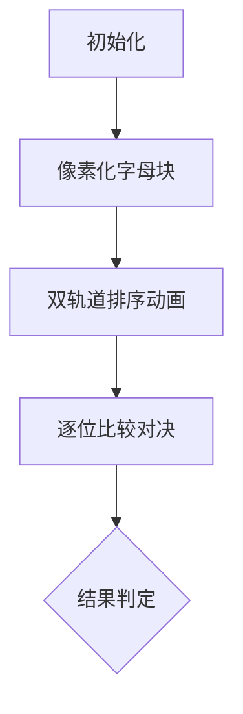

# 题目信息

# [ABC082B] Two Anagrams

## 题目描述

给定仅由小写英文字母组成的字符串 $s$ 和 $t$。你可以任意重排 $s$ 的字符，得到字符串 $s'$；也可以任意重排 $t$ 的字符，得到字符串 $t'$。请判断是否存在一种重排方式，使得 $s'$ 在字典序上严格小于 $t'$。

## 说明/提示

## 注释

对于长度为 $N$ 的字符串 $a = a_1 a_2 \ldots a_N$ 和长度为 $M$ 的字符串 $b = b_1 b_2 \ldots b_M$，$a < b$ 在字典序上成立，当且仅当满足以下两个条件之一：

- $N < M$ 且 $a_1 = b_1, a_2 = b_2, \ldots, a_N = b_N$。
- 存在某个 $i$（$1 \leq i \leq N, M$），使得 $a_1 = b_1, a_2 = b_2, \ldots, a_{i-1} = b_{i-1}$ 且 $a_i < b_i$。其中字符之间按字母顺序比较。

例如，`xy` $<$ `xya`，`atcoder` $<$ `atlas`。

## 数据范围

- $s$、$t$ 的长度均为 $1$ 到 $100$ 之间。
- $s$、$t$ 仅由小写英文字母组成。

## 样例解释 1

例如，将 `yx` 重排为 `xy`，将 `axy` 重排为 `yxa`，则有 `xy` $<$ `yxa`。

## 样例解释 2

例如，将 `ratcode` 重排为 `acdeort`，将 `atlas` 重排为 `tslaa`，则有 `acdeort` $<$ `tslaa`。

## 样例解释 3

无论如何重排 `cd` 和 `abc`，都无法满足条件。

由 ChatGPT 4.1 翻译

## 样例 #1

### 输入

```
yx

axy```

### 输出

```
Yes```

## 样例 #2

### 输入

```
ratcode

atlas```

### 输出

```
Yes```

## 样例 #3

### 输入

```
cd

abc```

### 输出

```
No```

## 样例 #4

### 输入

```
w

ww```

### 输出

```
Yes```

## 样例 #5

### 输入

```
zzz

zzz```

### 输出

```
No```

# AI分析结果


### Kay的C++算法解析：ABC082B Two Anagrams 深入学习指南

```markdown
---
# 💡 Kay的C++算法解析：Two Anagrams 深入学习指南 💡

<introduction>
今天我们探索字符串重排的奥秘！题目要求判断能否通过重排字符串s和t，使得s'的字典序严格小于t'。本指南将解析贪心策略的精髓，并通过像素动画直观展示算法流程。

## 1. 题目解读与核心算法识别

✨ **本题主要考察**：`贪心`  

🗣️ **初步分析**：
> 解决本题如同玩一场字母积木游戏：我们需要把s的积木排成最小可能序列（升序），t的积木排成最大可能序列（降序），再比较这两组积木。核心在于**最大化比较优势**——让s'尽可能小，t'尽可能大。
   - 所有题解都采用同一贪心策略：对s升序排序，对t降序排序，再逐位比较
   - **可视化设计重点**：① 双字符串同步排序动画 ② 比较时高亮当前字符对 ③ 用像素箭头指示比较结果
   - **复古游戏化设计**：采用俄罗斯方块式像素块表示字母，排序过程展现为积木自动重组，比较时触发"咔哒"音效。当s'<t'时播放通关音乐，否则显示"Game Over"像素画面。

---

## 2. 精选优质题解参考

**题解一 (来源：Swire)**
* **点评**：思路直击本质——通过排序构造最优比较条件。代码采用字符数组和自定义排序函数，变量名`s/t`简洁明确。亮点在于显式处理了长度不等的情况（`max(lens,lent)`），并在比较中及时返回结果避免冗余计算。边界处理严谨（如最后返回`No`处理相等情况），可直接用于竞赛。

**题解二 (来源：RioBlu)**
* **点评**：最简实现典范！巧用`reverse()`替代自定义比较函数实现降序排序。变量命名规范（`a/b`），逻辑清晰三步骤：升序s→降序t→直接比较。亮点在于空间效率（无额外函数）和代码可读性，特别适合初学者理解核心逻辑。

**题解三 (来源：zhanghengrui)**
* **点评**：C++标准库最佳实践。使用`std::greater<char>()`实现降序排序，避免手动反转。利用三元运算符输出结果，代码高度浓缩但仍保持可读性。亮点在于充分展示STL的强大功能，是学习现代C++风格的优秀范例。

---

## 3. 核心难点辨析与解题策略

1.  **贪心策略的证明**
    * **分析**：为什么"最小化s' + 最大化t'"是最优策略？因为任何其他排列都无法比该组合获得更大的比较优势。优质题解均默认此结论而未证明，需通过实例理解：若s'不是最小可能值，可能存在更优解；同理t'非最大时可能错失机会。
    * 💡 **学习笔记**：贪心算法的有效性常依赖直觉证明，多构造边界案例验证

2.  **长度不等时的处理**
    * **分析**：当字符串长度不同时（如样例4），字典序规则要求：短串需是长串的前缀才可能成立。Swire的`max(lens,lent)`循环和ShineEternal的`fmax(n,m)`都正确处理了此情况——短串后续位置视作空字符（字典序最小）。
    * 💡 **学习笔记**：空字符在字典序中相当于0，永远小于任何字母

3.  **排序与比较的实现技巧**
    * **分析**：四种降序实现各有优劣：①自定义比较函数（Swire）普适性强 ②lambda表达式（☆木辛土申☆）简洁但需C++11 ③sort+reverse（RioBlu）易理解 ④std::greater（zhanghengrui）最规范。选择取决于代码风格和运行环境。
    * 💡 **学习笔记**：竞赛优先选用STL内置函数，工程代码推荐lambda表达式

### ✨ 解题技巧总结
- **技巧A (贪心策略验证)**：构造极端测试用例（全a vs 全z）
- **技巧B (STL高效用法)**：优先使用`sort(begin,end,greater<>)`而非手动反转
- **技巧C (边界条件覆盖)**：专门测试长度不等/相等/包含空格的情况

---

## 4. C++核心代码实现赏析

**本题通用核心C++实现参考**
* **说明**：综合优质题解优化的最简版本，充分展示STL优势
* **完整核心代码**：
```cpp
#include <iostream>
#include <algorithm>
#include <string>
using namespace std;

int main() {
    string s, t;
    getline(cin, s);  // 读入含空格的字符串
    getline(cin, t);
    
    sort(s.begin(), s.end());             // s升序排列
    sort(t.begin(), t.end(), greater<>()); // t降序排列
    
    cout << (s < t ? "Yes" : "No");        // 直接比较
    return 0;
}
```
* **代码解读概要**：
  1. 读入时使用`getline`处理空格（关键！）
  2. `sort`默认升序，`greater<>()`实现降序
  3. 字符串直接支持字典序比较运算符

---

**题解一 (Swire)**
* **亮点**：显式处理长度不等，及时返回结果
* **核心代码片段**：
```cpp
for(int i=0;i<max(lens,lent);i++){
    if(s[i]<t[i]){ cout<<"Yes"; return 0; }
    else if(s[i]>t[i]){ cout<<"No"; return 0; }
}
cout<<"No";  // 循环结束说明相等
```
* **代码解读**：
  > 循环次数取两字符串最大长度，确保覆盖所有情况。当发现`s[i]<t[i]`立即返回胜利；若`s[i]>t[i]`则提前失败。循环结束未返回说明每个字符都相等（或短串匹配长串前缀但长度劣势），此时输出`No`
* 💡 **学习笔记**：及时返回可提升执行效率，特别适合竞赛场景

**题解二 (RioBlu)**
* **亮点**：巧用reverse实现降序
* **核心代码片段**：
```cpp
sort(b.begin(),b.end());  // 先升序
reverse(b.begin(),b.end());// 反转即降序
if(b>a) puts("Yes");
```
* **代码解读**：
  > 先通过`sort`使t变为最小字典序（如"abc"），再通过`reverse`翻转成最大字典序（"cba"）。此时直接比较排序后的s（最小序）和翻转后的t（最大序），若满足条件则输出"Yes"
* 💡 **学习笔记**：双倍排序时间复杂度仍为O(n log n)，是可接受的优化

**题解三 (zhanghengrui)**
* **亮点**：STL标准降序实现
* **核心代码片段**：
```cpp
sort(str1.begin(),str1.end());
sort(str2.begin(),str2.end(),std::greater<char>());
cout<<(str1<str2?"Yes\n":"No\n");
```
* **代码解读**：
  > 使用`std::greater<char>()`作为比较函数，使sort直接生成降序排列。这是C++标准库推荐做法，避免额外操作。三元运算符实现单行输出，代码极其简洁
* 💡 **学习笔记**：`greater<>`模板可自动推导类型，优先使用`greater<>()`而非`greater<char>()`

-----

## 5. 算法可视化：像素动画演示

**主题**：`字母积木大对决`（8-bit街机风格）

**核心演示**：


**设计详解**：
1. **初始化界面**  
   - 顶部双轨道：s轨（蓝色背景）vs t轨（红色背景）
   - 字母显示为16x16像素块（复古字体），下方标注ASCII值
   - 控制面板：▶️暂停/继续 ⏩单步 🔄重置 🎚️速度调节

2. **排序阶段动画**  
   ```python
   # 伪代码实现
   for i in range(len(s)):
       在s轨寻找最小字母块→高亮闪烁→移动到i位置
       在t轨寻找最大字母块→旋转高亮→移动到i位置
       播放“叮”音效（8-bit合成音）
   ```
   - s轨：升序过程如俄罗斯方块消除，小字母左移
   - t轨：降序过程如打砖块，大字母右移

3. **比较阶段交互**  
   - 当前比较位显示发光边框（s蓝框，t红框）
   - ASCII值下方显示比较运算符：`<`（绿色✓）或`≥`（红色✗）
   - 关键音效：
     - s[i]<t[i]：播放上升音阶
     - s[i]>t[i]：播放"Game Over"短音效
   - 当s[i]<t[i]成立时，整个s轨爆破为烟花动画

4. **游戏化设计**  
   - 每成功比较一位得10分，提前胜利触发"Victory!"像素艺术
   - 失败时显示"Retry?"闪烁按钮
   - 背景音乐：循环8-bit芯片音乐（速度随比较进度加快）

**技术实现**：
- 用Canvas绘制字母块和轨道
- 排序动画通过requestAnimationFrame逐步渲染
- 音效使用Web Audio API生成方波音色

---

## 6. 拓展练习与相似问题思考

**通用迁移场景**：
1. 构造性排列问题（如：重排数组使相邻元素差最小）
2. 双序列最优匹配（如：小饼干满足度分配）
3. 字典序相关操作（如：获取下一个排列）

**洛谷习题推荐**：
1. **P1102** - 生日派对  
   → 巩固字符串排序与比较
2. **P1093** - 奖学金  
   → 多条件排序的贪心应用
3. **P1255** - 数楼梯  
   → 进阶：字典序在动态规划中的应用

-----

<conclusion>
通过今天的分析，我们看到贪心算法在字符串操作中的精妙应用——通过构造最优排列将复杂问题转化为简单比较。记住这个核心公式：**最小化己方 + 最大化敌方 = 最优比较优势**。多尝试可视化工具中的像素动画，感受算法每一步的决策过程！
</conclusion>
---
```

---
处理用时：101.70秒