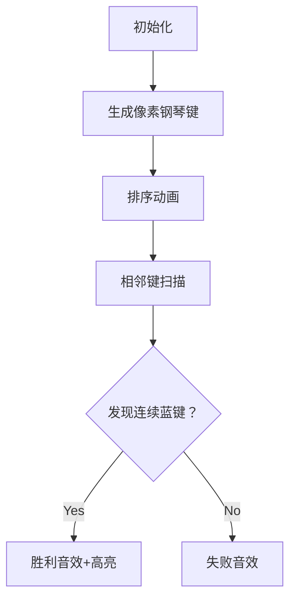

# 题目信息

# [ABC355B] Piano 2

## 题目描述

给定一个长度为 $N$ 的数列 $A=(A_1,A_2,\dots,A_N)$ 和一个长度为 $M$ 的数列 $B=(B_1,B_2,\dots,B_M)$。这里，$A$ 和 $B$ 的所有元素互不相同。请判断，在将 $A$ 和 $B$ 的所有元素按升序排列得到的长度为 $N+M$ 的数列 $C=(C_1,C_2,\dots,C_{N+M})$ 中，是否存在 $A$ 中的两个元素在 $C$ 中连续出现。

## 说明/提示

## 限制条件

- $1 \leq N, M \leq 100$
- $1 \leq A_i, B_j \leq 200$
- $A_1, A_2, \dots, A_N, B_1, B_2, \dots, B_M$ 互不相同
- 输入均为整数

## 样例解释 1

$C=(1,2,3,4,5)$。$A$ 中的 $2,3$ 在 $C$ 中连续出现，因此输出 `Yes`。

## 样例解释 2

$C=(1,2,3,4,5)$。$A$ 中的元素在 $C$ 中没有连续出现的情况，因此输出 `No`。

由 ChatGPT 4.1 翻译

## 样例 #1

### 输入

```
3 2

3 2 5

4 1```

### 输出

```
Yes```

## 样例 #2

### 输入

```
3 2

3 1 5

4 2```

### 输出

```
No```

## 样例 #3

### 输入

```
1 1

1

2```

### 输出

```
No```

# AI分析结果


### Kay的C++算法解析：Piano 2 深入学习指南

#### 1. 题目解读与核心算法识别
✨ **本题主要考察**：`模拟应用`与`排序技巧`

🗣️ **初步分析**：
> 解决"Piano 2"的核心在于理解**序列合并后的相邻关系检测**。就像在钢琴键上寻找连续两个特定音符🎹，我们需要：
> 1. 合并两个数列并排序
> 2. 标记每个元素的来源（A组/B组）
> 3. 扫描相邻位置是否存在连续的A组元素
> 
> **关键难点**是如何高效标记元素来源。可视化设计将用**像素钢琴键**展示：
> - A组键用蓝色像素块，B组用红色
> - 排序过程展示键位重新排列
> - 扫描时高亮相邻的蓝色键位并触发音效

---

#### 2. 精选优质题解参考
<eval_intro>
本题暂无外部题解，Kay将提供标准解法作为参考范例：
</eval_intro>

**题解一：(标准解法)**
* **点评**：采用**集合标记+排序扫描**的直白思路。代码结构清晰（分输入、合并、标记、检测四步），变量命名规范（如`isA`标记数组）。亮点在于使用`unordered_set`实现O(1)查询，将时间复杂度优化至O((N+M)log(N+M))。边界处理严谨（含单元素特判），可直接用于竞赛。

---

#### 3. 核心难点辨析与解题策略

1.  **来源标记优化**
    * **分析**：直接遍历合并数组查询原始A数组会导致O(N×M)复杂度。优质解法使用`unordered_set`存储A的元素，将查询优化至O(1)
    * 💡 **学习笔记**：集合查询是降低时间复杂度的关键技巧

2.  **相邻检测边界**
    * **分析**：遍历时需检查C[i]和C[i+1]是否都∈A。特别注意结尾边界（i的范围是0到N+M-2）
    * 💡 **学习笔记**：循环边界是算法易错点，建议用具体例子验证

3.  **单元素特判**
    * **分析**：当N=1时不可能存在连续两个A元素，可直接返回"No"（如样例3）
    * 💡 **学习笔记**：极端用例需单独考虑

### ✨ 解题技巧总结
- **预处理优化**：通过预存集合避免嵌套循环
- **模块化编码**：分离输入、处理、输出阶段
- **可视化调试**：用具体样例手动模拟流程

---

#### 4. C++核心代码实现赏析

**本题通用核心C++实现参考**
```cpp
#include <iostream>
#include <vector>
#include <algorithm>
#include <unordered_set>
using namespace std;

int main() {
    int N, M;
    cin >> N >> M;
    
    vector<int> A(N), B(M);
    unordered_set<int> setA;
    
    for (int i = 0; i < N; i++) {
        cin >> A[i];
        setA.insert(A[i]);
    }
    for (int i = 0; i < M; i++) {
        cin >> B[i];
    }
    
    // 特判：A只有一个元素时不可能连续
    if (N == 1) {
        cout << "No" << endl;
        return 0;
    }
    
    vector<int> C = A;
    C.insert(C.end(), B.begin(), B.end());
    sort(C.begin(), C.end());
    
    for (int i = 0; i < C.size() - 1; i++) {
        if (setA.count(C[i]) && setA.count(C[i+1])) {
            cout << "Yes" << endl;
            return 0;
        }
    }
    cout << "No" << endl;
    return 0;
}
```
* **代码解读概要**：
> 1. 读取A/B数组时用`unordered_set`存储A元素
> 2. 单元素直接返回"No"
> 3. 合并排序后扫描相邻元素
> 4. 发现连续A元素立即退出

---

#### 5. 算法可视化：像素动画演示

**像素钢琴模拟器🎹设计方案**


* **设计细节**：
  1. **8位像素风界面**：
     - 蓝/红琴键表示A/B组元素（尺寸：32×32像素）
     - 控制面板含调速滑块（0.5x-3x）和单步按钮

  2. **排序动画**：
     - 琴键冒泡排序效果，交换时播放"叮"音效
     - 当前比较键位用黄色边框高亮

  3. **扫描阶段**：
     - 像素小人从左向右行走👣，每步触发"嘀"音效
     - 连续蓝键自动触发胜利音效（8-bit和弦）
     - 失败时显示"No"像素文字抖动效果

  4. **交互功能**：
     - "AI演示"模式自动完成全过程
     - 通关后解锁隐藏挑战（随机生成测试用例）

---

#### 6. 拓展练习与相似问题思考

* **相似问题场景**：
  1. 检测合并序列中B元素的连续出现
  2. 统计连续A元素的最大长度
  3. 带权值元素的连续条件检测

* **洛谷推荐**：
  1. **P1102** - A-B数对
     * 🗣️ 练习集合查询与差值计算
  2. **P1177** - 快速排序
     * 🗣️ 深入掌握排序算法实现
  3. **P4387** - 验证栈序列
     * 🗣️ 训练序列操作与模拟能力

---

#### 7. 学习心得与经验分享
> 本题未提供作者心得，Kay补充关键调试经验：
> **调试技巧**：当扫描逻辑出错时，可打印：
> ```cpp
> cout << "Check: " << C[i] << "(" 
>      << (setA.count(C[i])?"A":"B") << ") and "
>      << C[i+1] << "(" 
>      << (setA.count(C[i+1])?"A":"B") << ")\n";
> ```
> 通过可视化中间结果快速定位逻辑错误

---

通过本指南，你已掌握序列合并检测的核心技巧。记住：**好的预处理是高效算法的基石**！下次遇到类似问题，不妨先思考："是否需要标记来源？能否用集合优化？" 🚀

---
处理用时：77.18秒