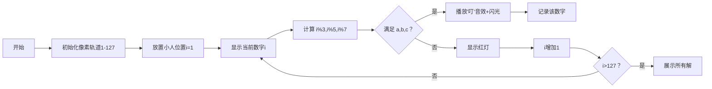

# 题目信息

# 孫子算経

## 题目描述

[problemUrl]: https://atcoder.jp/contests/tenka1-2012-qualB/tasks/tenka1_2012_5

 いま、物が有る。  
 その数は $ 1 $ 以上 $ 127 $ 以下である。   
 $ 3 $ で割ると、 $ a $ 余る。 $ 5 $ で割ると、 $ b $ 余る。 $ 7 $ で割ると、 $ c $ 余る。  
 いくつ物があるとそうなるか小さい順に答えよ。

 入力は以下の形式で標準入力から与えられる。 > $ a $ $ b $ $ c $

- 入力として $ 3 $ つの整数 $ a $ ( $ 0\ \leq\ a\ \leq\ 2 $ ), $ b $ ( $ 0\ \leq\ b\ \leq\ 4 $ ), $ c $ ( $ 0\ \leq\ c\ \leq\ 6 $ ) が空白で区切られて $ 1 $ 行で与えられる。
 
 条件を満たす物の数を小さい順に改行区切りで出力せよ。  
 なお、行の終端には改行が必要である。 ```

2 3 2
```

 ```

23
```

 ```

1 1 1
```

 ```

1
106
```

 ```

2 4 6
```

 ```

104
```

# AI分析结果


# 💡 Kay的C++算法解析：孫子算経 深入学习指南 💡

## 1. 题目解读与核心算法识别

✨ **本题主要考察**：`枚举` (编程技巧应用)

🗣️ **初步分析**：
> 这道题像在玩"数字侦探"游戏——已知一个数字除以3、5、7的余数（a,b,c），要在1-127范围内找出所有符合条件的数字。枚举法就像拿着放大镜逐个检查数字，验证每个数是否满足三个余数条件。  
> - 题解主要有两种思路：直接枚举（遍历1-127）和优化枚举（跳过不可能的值）。前者简单直观，后者尝试减少循环次数但效果有限  
> - 核心流程：循环变量i从1到127 → 检查i%3==a, i%5==b, i%7==c → 满足则输出  
> - 可视化设计：像素小人沿数字轨道移动，每步检查时三个余数条件会亮起红绿灯，满足条件时触发音效和收集动画

---

## 2. 精选优质题解参考

**题解一 (来源：loi_hjh)**
* **点评**：思路简洁高效，直接遍历1-127判断余数条件。代码规范（变量名a,b,c含义明确），边界处理完整（i从1开始）。亮点在于完全避免复杂逻辑，用最直白方式解决问题，实践价值高（可直接用于竞赛）。注释幽默但未影响代码清晰度。

**题解二 (来源：PC_DOS)**
* **点评**：采用标准枚举框架，加入输入输出加速优化（ios::sync_with_stdio）。代码结构工整，使用register关键字优化循环变量（虽对小数据效果有限），体现了性能优化意识。亮点在于完整的工程化思维（加速+严谨边界处理），适合学习规范编码。

---

## 3. 核心难点辨析与解题策略

1.  **关键点1：枚举范围与边界确定**
    * **分析**：题目明确要求1≤数字≤127，优质题解均设置循环`for(int i=1; i<=127; i++)`。难点在于注意起始值（从1而非0开始）和终止值（包含127）
    * 💡 **学习笔记**：仔细审题确定数值范围是枚举基础

2.  **关键点2：多条件复合判断**
    * **分析**：需同时满足三个余数条件，优质题解使用`&&`逻辑连接：`i%3==a && i%5==b && i%7==c`。注意余数取值范围（a∈[0,2], b∈[0,4], c∈[0,6]）天然匹配取模结果
    * 💡 **学习笔记**：复合条件要用逻辑运算符完整覆盖

3.  **关键点3：避免无效枚举的尝试**
    * **分析**：有题解尝试跳过某些数字（如从a开始每次+3），但实际未显著优化。因127范围小，简单枚举已足够高效
    * 💡 **学习笔记**：优化前需评估实际收益，避免过度设计

### ✨ 解题技巧总结
- **技巧1：暴力枚举优先**：数据范围小时（n≤10^3），直接枚举往往是最简单有效方案
- **技巧2：条件表达式化简**：将复杂条件拆解为`A&&B&&C`的链式判断
- **技巧3：输入输出优化**：竞赛中可用`ios::sync_with_stdio(false)`加速cin/cout

---

## 4. C++核心代码实现赏析

**本题通用核心C++实现参考**
* **说明**：综合优质题解思路，标准枚举方案
* **完整核心代码**：
```cpp
#include <iostream>
using namespace std;

int main() {
    int a, b, c;
    cin >> a >> b >> c;
    for (int i = 1; i <= 127; i++) {
        if (i % 3 == a && i % 5 == b && i % 7 == c) {
            cout << i << endl;
        }
    }
    return 0;
}
```
* **代码解读概要**：读取三个余数 → 遍历1-127 → 检查当前数是否同时满足三个余数条件 → 满足则输出

**题解一 (来源：loi_hjh)**
* **亮点**：极简实现，核心逻辑仅2行
* **核心代码片段**：
```cpp
for(int i=1;i<=127;i++)
    if((i%3==a)&&(i%5==b)&&(i%7==c)) 
        printf("%d\n",i);
```
* **代码解读**：
  > `i`从1循环到127，每次检查：  
  > ① `i%3==a`：除以3余数匹配  
  > ② `i%5==b`：除以5余数匹配  
  > ③ `i%7==c`：除以7余数匹配  
  > 三者同时成立时输出`i`
* 💡 **学习笔记**：用逻辑与`&&`连接多个条件实现复合判断

**题解二 (来源：PC_DOS)**
* **亮点**：工程化优化实践
* **核心代码片段**：
```cpp
ios::sync_with_stdio(false);
for (i = 1; i <= 127; ++i) {
    if (i%3 == iMod1 && i%5 == iMod2 && i%7 == iMod3) {
        cout << i << endl;
    }
}
```
* **代码解读**：
  > `ios::sync_with_stdio(false)`解除cin/cout与stdio的同步提升速度  
  > 循环内条件判断逻辑相同，但使用`++i`略微优化迭代效率  
  > 输出使用`endl`自动刷新缓冲区并换行
* 💡 **学习笔记**：大数据量时输入输出优化可显著提升性能

---

## 5. 算法可视化：像素动画演示

* **主题**："余数侦探"像素闯关
* **核心演示**：数字轨道上像素小人逐格移动检测余数条件



**动画设计细节**：
1. **像素场景**：FC风格横向卷轴，数字轨道由127个砖块组成，顶部显示当前检测数
2. **条件指示灯**：三个像素灯显示余数检查结果（绿灯满足/红灯不满足）
3. **交互控制**：
   - 单步执行：按空格键逐格移动
   - 自动播放：调速滑块控制检测速度
   - 重置：回到起点重新检测
4. **音效设计**：
   - 移动：8-bit脚步声
   - 满足条件：NES风格"叮"声
   - 收集解：超级马里奥金币音
5. **动态效果**：满足条件时砖块变为金色，弹出+1分数提示

---

## 6. 拓展练习与相似问题思考

* **通用技巧迁移**：枚举法适用于：
  1. 小数据范围的问题（如n≤1000）
  2. 需要验证所有可能解的场景
  3. 作为更优算法的对拍验证

* **洛谷练习推荐**：
  1. **P1008 三连击**：枚举三位数组合
  2. **P1036 选数**：枚举子集求和问题
  3. **P1217 回文质数**：结合数学特性的枚举

---

## 7. 学习心得与经验分享

> **经验教训**：  
> 有题解尝试用中国剩余定理但忽略解的范围限制（需1-127），导致输出错误解。  
> **Kay点评**：使用数学定理时务必注意题目约束条件，小范围问题先用枚举验证更稳妥

---

通过本次分析，我们掌握了枚举法的核心应用场景：当问题规模有限时，直接遍历验证往往是最简单可靠的解法。记住：编程世界需要"暴力美学"与"精密思维"的结合！💪

---
处理用时：136.21秒