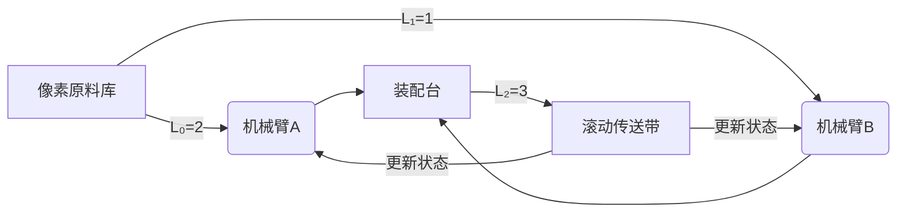

# 题目信息

# [ABC079B] Lucas Number

## 题目描述

给你一个数列 $L$，规定：

$L_0=2$

$L_1=1$

而第 $i$ 个数是：$L_i=L_{i-1}+L_{i-2}$。

现在给出一个正整数 $n$，求这个数组的第 $n$ 项。

## 说明/提示

$1 \leq n \leq 86$，$L_n$ 保证小于 $10^{18}$。

**【样例解释】**

$L_0=2$

$L_1=1$

$L_2=L_0+L_1=3$

$L_3=L_1+L_2=4$

$L_4=L_2+L_3=7$

$L_5=L_3+L_4=11$

## 样例 #1

### 输入

```
5```

### 输出

```
11```

## 样例 #2

### 输入

```
86```

### 输出

```
939587134549734843```

# AI分析结果


### 💡 Kay的C++算法解析：Lucas Number 深入学习指南 💡

**引言**  
今天我们一起分析ABC079B题"Lucas Number"。这道题要求计算卢卡斯数列的第n项，是理解递推算法的经典案例。本指南将带你掌握核心解法，并通过趣味可视化加深理解。

---

## 1. 题目解读与核心算法识别
✨ **本题主要考察**：`递推算法`  

🗣️ **初步分析**：
> 卢卡斯数列就像多米诺骨牌——确定前两张牌的位置后，后续每张牌的倒下方向完全由前两张决定。递推算法正是利用这种"前后依赖"特性，从已知的`L₀=2`和`L₁=1`出发，通过循环逐步推导后续项。  
> - **核心难点**：变量更新顺序（防止覆盖关键值）和边界处理（n=0/n=1的特判）  
> - **可视化设计**：将用像素方块表示三个滚动变量（a/b/c），高亮展示"计算新值→滚动更新"的循环过程，配合8-bit音效强化记忆  

---

## 2. 精选优质题解参考
**题解一（作者：ShineEternal）**  
* **点评**：思路清晰展现递推本质，通过a/b/c三变量滚动实现O(1)空间复杂度。代码规范：  
  - 特判边界（n=0/n=1）严谨  
  - 变量更新顺序`c=a+b; a=b; b=c;`精准避免值覆盖  
  - 作者心得"赋值顺序要注意"点出核心陷阱，实践价值极高  

**题解二（作者：yuzhechuan）**  
* **点评**：数组存储法直观体现数列生成过程，适合初学者理解：  
  - 明确定义`f[0]=2, f[1]=1`初始状态  
  - 循环关系`f[i]=f[i-1]+f[i-2]`直白表达递推本质  
  - 数组大小精确控制为87（n≤86）展现空间规划意识  

---

## 3. 核心难点辨析与解题策略
1. **难点：变量更新顺序陷阱**  
   * **分析**：滚动变量法中，若错误写成`a=c; b=c;`会导致前序值丢失。正确顺序应如：  
     ```c
     c = a + b;  // 先计算新值
     a = b;      // 将L_{i-1}存入L_{i-2}位置
     b = c;      // 新值成为下一个L_{i-1}
     ```
   * 💡 **学习笔记**：递推更新像接力赛——必须稳稳交棒再前进

2. **难点：边界条件处理**  
   * **分析**：n=0/n=1时直接返回初始值，避免无效循环。优质题解均采用：  
     ```c
     if(n==0) return 2;
     if(n==1) return 1;
     ```
   * 💡 **学习笔记**：特殊输入是代码健壮性的试金石

3. **难点：数据范围意识**  
   * **分析**：n=86时结果达18位数，必须用`long long`（范围±9e18）而非`int`（仅±2e9）  
   * 💡 **学习笔记**：看见10^18立即反应"需要long long！"

### ✨ 解题技巧总结
- **滚动变量法**：用O(1)空间替代数组，适合仅需末项的递推问题  
- **防御性特判**：优先处理边界输入（n=0/1）再进入主逻辑  
- **更新顺序验证**：通过n=2手工模拟（L₂=3）检验代码正确性  

---

## 4. C++核心代码实现赏析
**通用核心实现（综合优化版）**  
```cpp
#include <iostream>
using namespace std;

int main() {
    int n;
    cin >> n;
    
    // 特判边界
    if (n == 0) { cout << 2; return 0; }
    if (n == 1) { cout << 1; return 0; }

    long long a = 2, b = 1, c; // 三变量滚动
    for (int i = 2; i <= n; ++i) {
        c = a + b;  // 核心计算
        a = b;      // 滚动更新
        b = c;
    }
    cout << c;
    return 0;
}
```
* **代码解读概要**：  
  1. 优先处理边界值（n=0/1）  
  2. 三变量循环：a(Lₙ₋₂)、b(Lₙ₋₁)、c(Lₙ)  
  3. 精确的更新顺序保障状态传递  

---

**题解一核心片段赏析**  
```cpp
for(int i=2; i<=n; i++) {
    c = a + b;  // 亮点：先计算新值
    a = b;      // 再安全更新前序状态
    b = c;      // 避免值覆盖
}
```
* **代码解读**：  
  > 注意`a=b`和`b=c`的顺序！若颠倒为`b=c; a=b;`，会导致a获得新值而非原b值。这就像做菜时"先切菜再开火"——步骤顺序决定成败。

* 💡 **学习笔记**：递推更新=计算新值→传递旧值→锁定新值

**题解二核心片段赏析**  
```cpp
long long f[87]; // 精确预留空间
f[0] = 2; 
f[1] = 1;
for(int i=2; i<=n; i++)
    f[i] = f[i-1] + f[i-2]; // 显式状态依赖
```
* **代码解读**：  
  > 数组法直观体现数列定义`Lᵢ = Lᵢ₋₁ + Lᵢ₋₂`。定义`f[87]`因为n∈[0,86]，共87项。这就像给数列准备精确大小的抽屉——既节省空间又避免溢出。

* 💡 **学习笔记**：数组递推是理解状态依赖关系的可视化教材

---

## 5. 算法可视化：像素动画演示  
**主题**：`8-bit卢卡斯工厂`  
**设计思路**：用像素流水线比喻递推过程，配合FC音效强化关键操作记忆  



**动画流程**：  
1. **初始化**：  
   - 左侧两个像素槽亮起（🔵=2，🟡=1）  
   - 播放FC开机音效"叮咚~"

2. **生产循环**：  
   ```python
   while i <= n:
       显示公式"c = a + b" // 像素文字闪烁
       新像素块🔴从上方掉落（带+号动画） 
       播放合成音效"嘀！"
       🔵🟡→🟡🔴 // 像素块向左滚动
       计数器i+1（8-bit数字跳动）
   ```

3. **交互控制**：  
   - 单步执行：按A键逐步观察  
   - 自动模式：摇杆控制速度（慢/中/快三档）  
   - 完成时：目标像素块爆炸为金币，播放胜利音效  

**音效设计**：  
- 赋值操作：电子音"嘀"  
- 状态更新：传送带"咔嚓"声  
- 错误操作：短促警报声  

---

## 6. 拓展练习与相似问题思考
**通用技巧迁移**：  
递推算法还适用于：  
1. 斐波那契数列（P1962）  
2. 爬楼梯问题（每次走1/2阶）  
3. 网格路径计数（每次向右/下移动）  

**洛谷推荐**：  
1. **P1962 斐波那契数列**  
   > 🗣️ 直接应用递推，注意n=0的特殊性  
2. **P1255 数楼梯**  
   > 🗣️ 递推+高精度加法，训练大数处理能力  
3. **P3991 路径计数**  
   > 🗣️ 二维递推，理解状态转移方程的扩展应用  

---

## 7. 学习心得与经验分享
> **作者ShineEternal的经验**：  
> *"赋值顺序要注意，否则会出现值覆盖错误。我通过打印中间变量debug才发现这个问题。"*  
>   
> **Kay点评**：  
> 这是极其典型的递推陷阱！建议：  
> 1. 对n=2手工演算验证更新顺序  
> 2. 在循环内插入临时输出（如`printf("i=%d a=%lld b=%lld\n",i,a,b);`）  
> 3. 记住口诀：新值计算→旧值传递→新值锁定  

---

**结语**  
通过递推算法计算卢卡斯数列，我们不仅掌握了状态传递的核心思想，更体会到变量更新顺序的重要性。记住：好算法=正确思路+严谨实现+边界守护。下次遇到斐波那契变种时，不妨用滚动变量法一试！🚀

---
处理用时：124.71秒