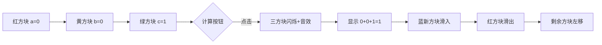

# 题目信息

# [ABC006B] トリボナッチ数列

## 题目描述

有一种数列叫做“Tribonacci 数列”。这个数列的每一项等于它前三项的和。  
具体地，定义如下：  
1. $a_1 = 0$，$a_2 = 0$，$a_3 = 1$  
2. $a_n = a_{n-1} + a_{n-2} + a_{n-3}$

作为参考，下面给出 Tribonacci 数列的部分项：

| 项数 | $a_1$ | $a_2$ | $a_3$ | $a_4$ | $a_5$ | $a_6$ | $a_7$ | $a_8$ | …… | $a_n$                               |
| :--- | :----- | :----- | :----- | :----- | :----- | :----- | :----- | :----- | :----- | :--------------------------------------- |
| 值   | 0      | 0      | 1      | 1      | 2      | 4      | 7      | 13     | …… | $a_{n-1} + a_{n-2} + a_{n-3}$ |

请你求出该数列的第 $n$ 项 $a_n$，并输出 $a_n$ 除以 $10007$ 的余数。

输入通过标准输入给出，格式如下：  
> $n$

其中，整数 $n$ 满足 $1 \leq n \leq 10^6$。请输出 Tribonacci 数列的第 $n$ 项 $a_n$ 除以 $10007$ 的余数，输出占一行。

另外，输出末尾需要换行。

例如：

```
7
```

```
7
```

- 第 7 项的 Tribonacci 数是 7。

```
1
```

```
0
```

- 第 1 项的 Tribonacci 数是 0。

```
100000
```

```
7927
```

- 注意输出 $a_n$ 除以 $10007$ 的余数。

## 说明/提示

无。

由 ChatGPT 4.1 翻译

# AI分析结果


### 💡 Kay的C++算法解析：Tribonacci数列 深入学习指南 💡

#### 1. 题目解读与核心算法识别
✨ **本题主要考察**：`递推算法`（模拟应用）  
🗣️ **初步分析**：
> Tribonacci数列就像一场数字接力赛，每个新选手的成绩由前三棒选手成绩相加决定（$a_n = a_{n-1} + a_{n-2} + a_{n-3}$）。核心难点在于：  
> - **空间优化**：n最大达$10^6$，不能存储整个数列  
> - **数值控制**：直接计算会导致数值溢出  
> 解决方案：采用**滚动变量法**，只需保存最近三项的值。在可视化设计中，我们将用三个像素方块表示前三项，新项产生时最左侧方块滑出，新方块滑入，配合"叮"的音效强化递推关系。

---

#### 2. 精选优质题解参考
**题解一（作者：_Qer）**  
* **点评**：使用长度为4的数组实现滚动存储，思路清晰（初始化→边界处理→递推更新→结果输出）。代码规范（`num[]`命名合理），空间复杂度优化至O(1)，循环内及时取模避免溢出。特别亮点：伪代码辅助说明，实践价值高（可直接用于竞赛）。

**题解二（作者：失之_连心）**  
* **点评**：用三个变量`a, b, c`实现滚动，逻辑简洁直接。边界处理完整（单独处理n=1,2,3），循环内取模防止溢出。代码精简但可读性稍弱（变量名可更语义化），核心亮点：直观展示滚动变量思想。

---

#### 3. 核心难点辨析与解题策略
1. **空间优化（滚动技巧）**  
   * **分析**：优质解用3个变量代替数组，通过`a=b; b=c; c=t`实现值传递，类似传送带运送数字  
   * 💡 **学习笔记**：当状态仅依赖固定前驱时，优先考虑滚动变量法

2. **边界条件处理**  
   * **分析**：n≤3时直接返回初始值（0,0,1），避免无效循环  
   * 💡 **学习笔记**：递推问题需特殊处理初始状态

3. **数值溢出控制**  
   * **分析**：每次计算后立即`%10007`，将数值控制在[0,10006]范围内  
   * 💡 **学习笔记**：模运算应在每一步递推中进行

✨ **解题技巧总结**：
- **空间压缩**：用O(1)空间代替O(n)数组
- **即时取模**：在加法后立即取模
- **边界优先**：先处理最小规模输入

---

#### 4. C++核心代码实现赏析
**通用核心实现（综合优化版）**：
```cpp
#include <iostream>
using namespace std;
int main() {
    int n; cin >> n;
    if(n <= 2) cout << 0;
    else if(n == 3) cout << 1;
    else {
        int a=0, b=0, c=1; // 前三项
        for(int i=4; i<=n; i++) {
            int t = (a+b+c) % 10007;
            a = b; // 滚动更新
            b = c;
            c = t;
        }
        cout << c;
    }
    return 0;
}
```
* **代码解读概要**：初始化前三项→处理边界→循环递推（取模+滚动更新）→输出结果

**题解一核心片段**：
```cpp
num[3] = (num[0]+num[1]+num[2]) % 10007;
num[0]=num[1]; num[1]=num[2]; num[2]=num[3];
```
* **解读**：通过索引实现数组滚动，`num[3]`作为临时存储位，计算后前移覆盖旧值  
* 💡 **学习笔记**：数组滚动需注意赋值顺序（先计算后覆盖）

**题解二核心片段**：
```cpp
int t=(a+b+c)%10007;
a=b; b=c; c=t;  // 变量轮换
```
* **解读**：三变量轮换如同旋转门，`t`暂存新值后更新变量链  
* 💡 **学习笔记**：变量更新顺序不可颠倒（先移旧值再存新值）

---

### 5. 算法可视化：像素动画演示
**主题**："像素方块接力赛"（8-bit风格）  
**核心交互设计**：

**关键实现**：
1. **视觉编码**：
   - 方块颜色：红(a)/黄(b)/绿(c)/蓝(新项)
   - 数值显示：方块上方显示数字
2. **音效设计**：
   - 计算时："叮！"（8-bit合成音）
   - 方块移动："嗖"（滑动音效）
   - 完成时：胜利旋律
3. **控制面板**：
   - 速度滑块：调速递推动画
   - 单步/自动模式：空格键控制步进

---

#### 6. 拓展练习与相似问题
**通用技巧迁移**：
1. 斐波那契数列变种（如$F_n = F_{n-1} + F_{n-3}$）
2. 线性递推优化问题
3. 模运算防止溢出场景

**洛谷推荐**：
1. **P1962 斐波那契数列**  
   → 巩固滚动变量技巧
2. **P1755 斐波那契数列（升级版）**  
   → 练习大范围递推+取模
3. **P4994 终于结束的起点**  
   → 递推结合模运算循环节

---

#### 7. 学习心得与经验分享
> **经验摘录**（作者_Qer）：
> "数据范围不清易导致RE，滚动数组是解决利器"  
> **Kay总结**：两位作者均强调**空间优化意识**和**及时取模**的重要性，这是处理大范围递推问题的核心心法！

> 通过本次分析，我们看到：  
> 1. 简单问题隐藏空间优化技巧  
> 2. 边界处理体现代码严谨性  
> 3. 模运算位置影响程序正确性  
> 继续加油，少年们！下次挑战更复杂的递推问题吧！🚀

---
处理用时：171.56秒