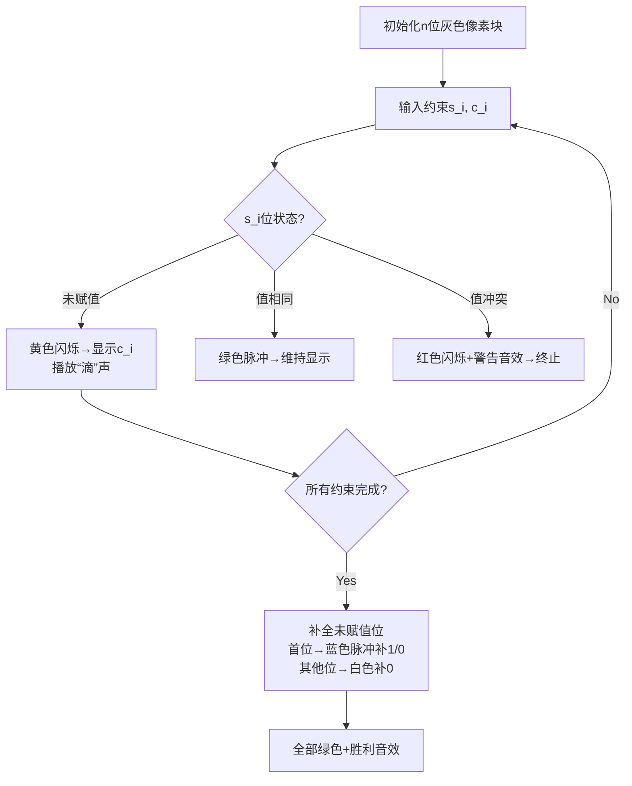

# 题目信息

# [ABC157C] Guess The Number

## 题目描述

如果存在满足以下条件的非负整数，请输出其中最小的一个。如果不存在这样的整数，请输出 $-1$。

- 该整数的十进制表示恰好为 $N$ 位数。（$0$ 被视为 $1$ 位数。对于其他整数，不允许在首位添加 $0$。）
- 从左起第 $s_i$ 位上的数字为 $c_i$，其中 $i = 1, 2, \cdots, M$。

## 说明/提示

### 限制条件

- 所有输入均为整数。
- $1 \leq N \leq 3$
- $0 \leq M \leq 5$
- $1 \leq s_i \leq N$
- $0 \leq c_i \leq 9$

### 样例解释 1

$702$ 的从左起第 $1$ 位是 $7$，第 $3$ 位是 $2$，因此 $702$ 满足题目条件。此外，$701$ 及以下的非负整数都不满足题目条件。

由 ChatGPT 4.1 翻译

## 样例 #1

### 输入

```
3 3

1 7

3 2

1 7```

### 输出

```
702```

## 样例 #2

### 输入

```
3 2

2 1

2 3```

### 输出

```
-1```

## 样例 #3

### 输入

```
3 1

1 0```

### 输出

```
-1```

# AI分析结果


### 💡 Kay的C++算法解析：Guess The Number 深入学习指南 💡

<introduction>
今天我们来分析"Guess The Number"这道构造类模拟题。本指南将帮助你掌握数字构造的核心逻辑、边界条件处理技巧，并通过像素动画直观理解算法流程。
</introduction>

---

## 1. 题目解读与核心算法识别

✨ **本题主要考察**：`模拟应用` (编程技巧应用)

🗣️ **初步分析**：
> 解决本题就像按照蓝图组装乐高数字：给定数字位数(n)和位置约束(s_i, c_i)，需构造满足约束的最小数字。核心挑战在于处理边界条件：
> - 当n>1时首位不能为0（蓝图不允许在"地基"放0）
> - 同一位置被赋予不同值时蓝图冲突
> - n=1时0是有效数字（特殊小房子）
>
> **可视化设计思路**：
> - 用像素网格表示数字位：灰色(未赋值)→黄色(赋值中)→红色(冲突)/绿色(完成)
> - 关键动画：① 约束输入时对应位置闪烁+像素音效 ② 冲突位置红色脉冲+错误音效 ③ 补全时首位变蓝(补1)/白色(补0)
> - 复古元素：FC风格控制面板(步进/调速/重置)，过关时播放《超级玛丽》通关音效

---

## 2. 精选优质题解参考

**题解一 (来源：zhou_ziyi)**
* **点评**：思路清晰直击核心——初始化数组为-1表示未赋值，顺序处理约束时即时检测冲突。代码规范：`ans[]`数组命名明确，边界处理完整（特判n=1且无约束时输出0）。亮点在于将复杂边界条件转化为简洁逻辑判断，实践价值高可直接用于竞赛。

**题解二 (来源：LucasXu80)**
* **点评**：解题推导细致完整，注释详尽教学性强。代码亮点：用`a[4]`精确处理位数(n≤3)，通过`a[s]==-1`巧妙区分已/未赋值状态。实践价值体现在鲁棒性：独立处理"首位赋值0"和"同位置冲突"两类异常，调试技巧值得学习（作者强调边界测试重要性）。

**题解三 (来源：迟暮天复明)**
* **点评**：创新使用`s[]`数组标记赋值状态，避免初始值歧义。核心亮点：输出时动态决策补位逻辑（`if(i!=1||n==1)`），解决"未赋值位补0但首位特殊"的难点。代码简洁高效，变量命名(`s`状态,`c`值)增强可读性。

---

## 3. 核心难点辨析与解题策略

1.  **首位0陷阱**  
    * **分析**：当n>1时首位为0违反数学规则（除非n=1）。优质题解通过`if(s==1 && c==0 && n>1)`提前拦截，避免无效构造。
    * 💡 **学习笔记**：数字构造先验知识——n位数首位范围[1,9]（n=1时为[0,9]）

2.  **约束冲突检测**  
    * **分析**：同一位置多次赋值需完全一致。题解用两种方案：① 数组记录值并对比历史值（zhou_ziyi）② 独立状态标记数组（迟暮天复明）。关键变量`ans[s]`或`s[s]`承载位置约束状态。
    * 💡 **学习笔记**：约束冲突检查必须即时处理，否则后续补全无意义

3.  **未赋值位补全策略**  
    * **分析**：补全需满足"最小数字"原则。通用策略：首位补1（n>1时）或0（n=1时），其余位补0。关键在区分"未赋值"(初始-1)与"赋值为0"，避免混淆。
    * 💡 **学习笔记**：补全本质是贪心策略——高位尽可能小（首位最小为1，其他为0）

### ✨ 解题技巧总结
- **边界驱动设计**：优先处理n=1, 首位赋值0等边界，再实现主逻辑
- **状态-值分离**：用独立数组标记赋值状态（如迟暮天复明的`s[]`），避免初始值歧义
- **即时终止策略**：检测冲突立即返回-1，减少无效计算
- **测试用例构造**：重点覆盖(n=1, m=0), (n=3, s1=1,c1=0)等边界组合

---

## 4. C++核心代码实现赏析

**本题通用核心C++实现参考**
* **说明**：综合优质题解边界处理方案的精炼实现
* **完整核心代码**：
```cpp
#include <iostream>
using namespace std;

int main() {
    int n, m, s, c;
    cin >> n >> m;
    int digit[4] = {-1, -1, -1, -1}; // 1-indexed, -1=未赋值
    
    // 处理约束
    while (m--) {
        cin >> s >> c;
        // 首位为0且非1位数 → 无效
        if (s == 1 && c == 0 && n > 1) {
            cout << -1; 
            return 0;
        }
        // 位置冲突 → 无效
        if (digit[s] != -1 && digit[s] != c) {
            cout << -1;
            return 0;
        }
        digit[s] = c; // 记录约束
    }
    
    // 补全未赋值位
    for (int i = 1; i <= n; i++) {
        if (digit[i] == -1) {
            if (i == 1) digit[i] = (n == 1) ? 0 : 1; // 首位特殊处理
            else digit[i] = 0; // 非首位补0
        }
    }
    
    // 输出结果
    for (int i = 1; i <= n; i++) cout << digit[i];
    return 0;
}
```
* **代码解读概要**：
> 1. 初始化`digit[]`为-1（未赋值）
> 2. 循环处理约束：检测首位0冲突和同位置赋值冲突
> 3. 补全策略：首位按n值补0/1，其他位补0
> 4. 顺序输出数字位

---

**题解一 (zhou_ziyi)**
* **亮点**：边界处理前置化，逻辑简洁
* **核心代码片段**：
```cpp
if (n == 1 && !m) {
    printf("%d", 0);
    return 0;
}
if (s == 1 && c == 0 && n != 1) {
    printf("%d", -1);
    return 0;
}
```
* **代码解读**：
> - 第1段：**特判无约束的1位数** → 直接输出0。为何优先处理？因此时无需后续赋值
> - 第2段：**拦截非法首位0** → 当s=1且c=0时，除非n=1否则立即终止。避免无效状态传递

**题解二 (LucasXu80)**
* **亮点**：状态初始化明确，注释导向
* **核心代码片段**：
```cpp
int a[4] = {0, -1, -1, -1}; // [0]未用，[1]-[3]初始-1
if (n == 1 && m == 0) {
    cout << 0;
    return 0;
}
```
* **代码解读**：
> - 数组初始化：`a[1]-a[3]`显式设为-1，**避免默认0导致状态混淆**
> - 特判位置：在输入循环前处理n=1且m=0，体现**分层处理思想**——先解决无需输入的场景

**题解三 (迟暮天复明)**
* **亮点**：输出时动态决策补位
* **核心代码片段**：
```cpp
for (int i = 1; i <= n; ++i) {
    if (s[i]) printf("%d", c[i]);       // 已赋值
    else if (i != 1 || n == 1) printf("0"); // 非首位或n=1
    else printf("1");                   // 首位补1
}
```
* **代码解读**：
> - **三元补全策略**：① 已赋值直接输出 ② 未赋值时：非首位→0；首位且n>1→1；首位且n=1→0
> - 优势：避免单独补全循环，**输出阶段一次性解决**

---

## 5. 算法可视化：像素动画演示

**主题**：8位数字装配工（复古工厂风格）  
**核心演示**：按约束装配数字位，实时检测冲突  
**设计思路**：像素风格降低认知负担，游戏化元素强化状态记忆  

### 动画流程


**关键交互**：
1. **像素网格**：每个数字位用32×32像素块，初始灰色(未赋值)
2. **约束处理动画**：
   - 输入(s,c)时：s位置黄色闪烁3次→显示c值（8位数字字体）
   - 冲突时：红色脉冲+爆炸动画，播放FC游戏"Game Over"音效片段
3. **补全动画**：
   - 首位：蓝色水流填充效果→显示1(或0)
   - 其他位：白色渐显→显示0
4. **控制面板**：
   - 步进控制：← →键单步执行
   - 速度滑块：0.5x~2.0x动画速度
   - AI演示：自动按最优顺序处理约束

**技术实现**：
- 状态记录数组同步显示在屏幕下方
- 当前操作位用闪烁边框高亮
- 过关时播放《魂斗罗》通关BGM 8-bit改编版

---

## 6. 拓展练习与相似问题思考

**通用技巧迁移**：
1. **约束满足构造**：如[LeetCode 1056. 易混淆数]——旋转后有效的数字
2. **边界敏感模拟**：如[洛谷 P1003 铺地毯]——覆盖边界的毯子选择
3. **位操作约束**：如[CodeForces 1527A]——按位与归零的最小步数

**洛谷练习推荐**：
1. **P1003 [铺地毯]**  
   🗣️ 推荐理由：同为边界敏感模拟题，练习坐标系与覆盖判断
2. **P1059 [明明的随机数]**  
   🗣️ 推荐理由：强化数组操作与去重技巧，数据处理基础
3. **P1781 [宇宙总统]**  
   🗣️ 推荐理由：大数比较+位数处理，自然延伸本题

---

## 7. 学习心得与经验分享

**参考经验 (来自 LucasXu80)**：  
> "我在n=1且首位赋值为0的情况卡了很久，直到用`if(n==1){a[1]=0;}`明确区分处理才通过"  

**点评**：  
> 这个调试经历揭示重要原则：边界条件需独立处理而非依赖主逻辑。建议学习者：
> 1. 列出所有边界组合(n=1/m=0, n>1/首位0等)
> 2. 编写针对性测试用例验证
> 3. 采用状态变量显式标记（如`isSingleDigit`）

---

<conclusion>
通过本次分析，我们掌握了约束数字构造的核心技巧——边界处理驱动逻辑设计。记住：好代码像精密的钟表，每个齿轮（边界）都必须精准咬合。下次遇到构造题时，不妨先画出状态转换图哦！🚀
</conclusion>
```

---
处理用时：187.82秒