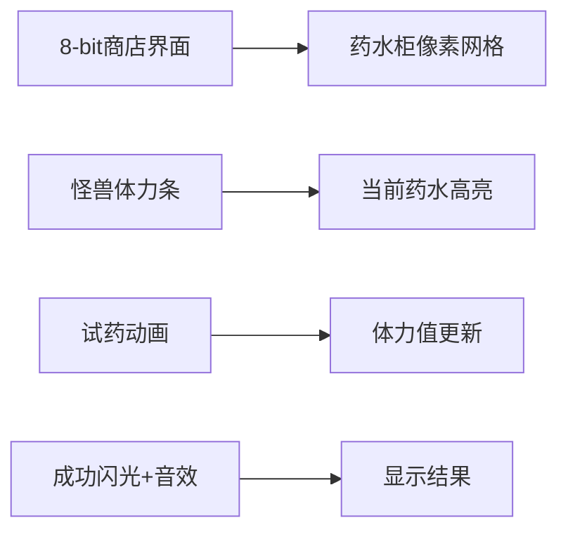

# 题目信息

# [ABC317A] Potions

## 题目描述

ナオヒロ君养了一只怪兽。怪兽当前的体力为 $H$。  
此外，ナオヒロ君拥有 $N$ 种不同的伤药。伤药按照效果从弱到强编号为 $1$ 到 $N$。  
给怪兽服用第 $n$ 号伤药后，怪兽的体力会增加 $P_n$。这里满足 $P_1 < P_2 < \dots < P_N$。

ナオヒロ君希望通过给怪兽服用一瓶伤药，使怪兽的体力达到至少 $X$。  
请输出所有能实现目标的伤药中，效果最弱的那一瓶的编号。（在题目的限制下，保证一定存在这样的伤药。）

## 说明/提示

## 限制条件

- $2 \leq N \leq 100$
- $1 \leq H < X \leq 999$
- $1 \leq P_1 < P_2 < \dots < P_N = 999$
- 所有输入的值均为整数。

## 样例解释 1

分别给怪兽服用每种伤药后，怪兽的体力变化如下：  
- 给怪兽服用第 $1$ 号伤药后，体力变为 $100 + 50 = 150$。  
- 给怪兽服用第 $2$ 号伤药后，体力变为 $100 + 200 = 300$。  
- 给怪兽服用第 $3$ 号伤药后，体力变为 $100 + 999 = 1099$。  
服用后体力达到 $X = 200$ 及以上的伤药为第 $2$ 号和第 $3$ 号伤药。其中效果最弱的是第 $2$ 号伤药，所以答案为 $2$。

由 ChatGPT 4.1 翻译

## 样例 #1

### 输入

```
3 100 200
50 200 999```

### 输出

```
2```

## 样例 #2

### 输入

```
2 10 21
10 999```

### 输出

```
2```

## 样例 #3

### 输入

```
10 500 999
38 420 490 585 613 614 760 926 945 999```

### 输出

```
4```

# AI分析结果


### Kay的C++算法解析：ABC317A Potions 深入学习指南

---

### 1. 题目解读与核心算法识别  
✨ **本题主要考察**：**有序数组的线性查找**（编程技巧应用）  

🗣️ **初步分析**：  
> 本题如同在**药水商店选购商品**：药水效果按编号严格递增排列（`P₁ < P₂ < ... < Pₙ`），我们需要找到**第一瓶**能让怪兽体力达到目标值`X`的药水（效果最弱的合格药水）。核心思路是遍历有序药水列表，找到首个满足 `H + Pₙ ≥ X` 的药水编号。  

**关键流程可视化设计**：  
- 用**像素格子**表示药水（编号1~N）和怪兽体力条  
- 遍历时高亮当前药水，实时计算 `H + Pₙ` 并更新体力条  
- 当体力条突破`X`阈值时触发**胜利音效**与闪光特效  
- 复古元素：药水商店背景+8-bit音效（选择/成功音）  

---

### 2. 精选优质题解参考  
**题解一：线性遍历法**  
* **点评**：  
  直接遍历有序数组找到首个解，思路清晰直白（符合暴力逻辑）。代码简洁规范：  
  - 变量名`H, X, P`直接对应题目参数  
  - 边界处理严谨（题目保证解必存在）  
  - 时间复杂度`O(N)`完全可接受（`N≤100`）  
  **亮点**：用最基础循环实现，适合初学者理解遍历本质  

**题解二：二分查找法**  
* **点评**：  
  巧妙利用有序性，用`lower_bound`二分搜索优化：  
  - 将问题转化为寻找首个 `Pₙ ≥ (X - H)` 的元素  
  - 时间复杂度优化至`O(log N)`，展示算法思维  
  **注意**：虽非必要优化，但演示了有序数组的进阶技巧  

---

### 3. 核心难点辨析与解题策略  
1. **关键点：理解"效果最弱"的本质**  
   * **分析**：药水效果严格递增 → 首个满足条件的药水即是最弱解。需抓住"有序性"核心特征  
   * 💡 **学习笔记**：有序数组问题优先考虑遍历/二分  

2. **关键点：边界条件处理**  
   * **分析**：题目保证解存在，但实际编码需确保循环能正确终止（如用`break`及时退出）  
   * 💡 **学习笔记**：即使题目保证有解，仍需写健壮代码  

3. **关键点：选择遍历还是二分**  
   * **分析**：`N≤100`时线性遍历更简单；`N`较大时二分显著更优  
   * 💡 **学习笔记**：根据数据规模选择实现方式  

#### ✨ 解题技巧总结  
- **技巧1：利用有序性加速** - 有序数组的搜索永远先考虑二分可能  
- **技巧2：问题转化** - 将`H+Pₙ≥X`转化为`Pₙ≥(X-H)`更易处理  
- **技巧3：及时终止** - 找到解后立即退出循环提升效率  

---

### 4. C++核心代码实现赏析  
**通用核心实现（线性遍历）**  
```cpp
#include <iostream>
#include <vector>
using namespace std;

int main() {
    int N, H, X;
    cin >> N >> H >> X;
    vector<int> P(N);
    for (int i = 0; i < N; i++) cin >> P[i];
    
    for (int i = 0; i < N; i++) {
        if (H + P[i] >= X) { // 检查体力是否达标
            cout << i + 1 << endl; // 输出药水编号
            return 0; // 立即终止
        }
    }
}
```
**代码解读概要**：  
1. 读入药水数量`N`、当前体力`H`、目标`X`  
2. 遍历药水列表，首个满足`H+P[i]≥X`时输出编号（`i+1`）  
3. `return 0`确保找到解后立即退出，避免无效循环  

---

### 5. 算法可视化：像素动画演示  
**主题**：`像素药水商店 - 怪兽试药大冒险`  

**动画设计**：  


**关键交互**：  
1. **初始化**：  
   - 16色像素画风：药水柜（编号1~N）、怪兽体力条（红色/绿色区间）  
   - 控制面板：单步执行/自动播放/速度滑块  

2. **核心流程**：  
   - 高亮当前药水→播放"选择音效"（8-bit叮声）  
   - 药水注入怪兽→体力条增长（实时数值显示）  
   - 若`体力≥X`：触发胜利闪光+上升音效，药瓶变为金色  

3. **游戏化元素**：  
   - 每瓶药水是独立"关卡"，成功获得1星  
   - 自动演示模式：AI怪兽自动试药（速度可调）  
   - 背景音乐：FC风格循环BGM  

---

### 6. 拓展练习与相似问题  
**通用技巧迁移**：  
> **有序数组查找**模型适用于：  
> 1. 首个满足条件的元素  
> 2. 最接近目标值的元素  
> 3. 元素的存在性检查  

**洛谷推荐**：  
1. **P1102 A-B数对**  
   🗣️ 练习有序数组的差值查找  
2. **P2249 查找**  
   🗣️ 二分查找标准模板题  
3. **P1024 一元三次方程求解**  
   🗣️ 有序区间上的精度查找  

---

> 本次题解无作者心得分享，但记住：**有序性是最易被忽视的优化突破口**！下次遇到排序数组时，先问问自己能否用二分加速~ 💪

---
处理用时：75.34秒