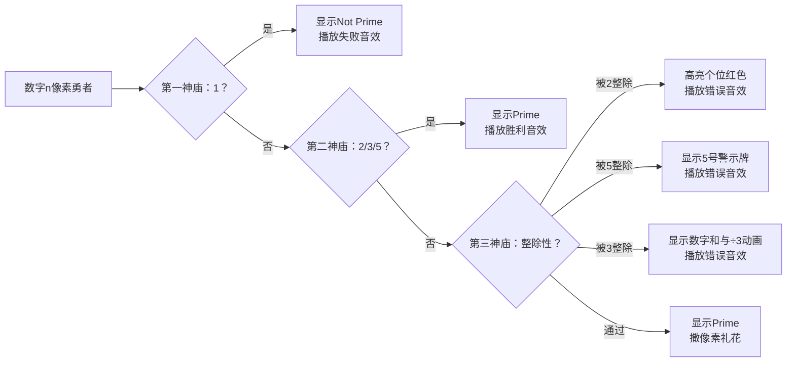

# 题目信息

# [ARC044A] 素数判定

## 题目描述

[problemUrl]: https://atcoder.jp/contests/arc044/tasks/arc044_a

高橋君は素数判定アルゴリズムが大好きです。毎日さまざまな素数判定アルゴリズムを実装して遊んでいます。 しかし、高橋君は素数判定をしすぎてしまったので、素数判定に飽きてしまいました。 そこで高橋君は、「素数っぽく見える数」判定をすることにしました。

$ 1 $以上の整数$ N $は、以下のように「素数っぽい」かどうかが判定されます。

- $ N $が素数であるなら、$ N $は「素数っぽい」
- $ N $が合成数であるなら、$ N $を$ 10 $進表記した時の$ 1 $の位が偶数でも$ 5 $でもなく、各桁の和が$ 3 $で割り切れないならば、$ N $は「素数っぽい」
- それ以外の場合、$ N $は「素数っぽくない」

整数$ N $が与えられるので、$ N $が「素数っぽい」場合は"Prime"、そうでない場合は"Not Prime"と出力してください。

## 说明/提示

### Sample Explanation 1

$ 42 $は合成数かつ$ 1 $の位が偶数なので、「素数っぽくない」と判定されます。

### Sample Explanation 2

$ 49 $は素数ではありませんが、「素数っぽい」と判定されます。

### Sample Explanation 3

$ 3 $は素数なので、「素数っぽい」と判定されます。

### Sample Explanation 4

$ 1 $は素数でも合成数でもないので、「素数っぽくない」と判定されます。

## 样例 #1

### 输入

```
42```

### 输出

```
Not Prime```

## 样例 #2

### 输入

```
49```

### 输出

```
Prime```

## 样例 #3

### 输入

```
3```

### 输出

```
Prime```

## 样例 #4

### 输入

```
1```

### 输出

```
Not Prime```

# AI分析结果


### 💡 Kay的C++算法解析：ARC044A 素数判定 深入学习指南 💡

#### 1. 题目解读与核心算法识别
✨ **本题主要考察**：`数学性质应用与编程技巧`

🗣️ **初步分析**：
> 这道题看似需要素数判定，实则考察数学性质的灵活应用。就像玩扫雷游戏时通过数字提示直接推断地雷位置一样，我们通过数字的整除特性（2、3、5）直接判断"素数っぽい"属性，避免传统素数判断的高开销。
> - 核心思路：特判1和素数2/3/5后，只需检查数字能否被2/3/5整除
> - 难点在于理解规则转化：满足"不被2/3/5整除"的数要么是素数，要么是符合规则2的合数
> - 可视化设计：用像素方块表示数字，分步检查时高亮当前判断条件（个位/数字和），用颜色变化和音效反馈结果

---

#### 2. 精选优质题解参考
**题解一：C20210404杜铖昊 (16赞)**
* **点评**：思路直击本质，将题目规则转化为简洁的整除判断。代码采用分层条件结构（特判1→特判2/3/5→主判断），逻辑清晰如闯关游戏的三道门。变量名直接使用n增强可读性，边界处理完整。亮点在于O(1)时间复杂度的数学优化，竞赛实战价值极高。

**题解二：Cinderella (7赞)**
* **点评**：提供双视角解法对比，教学价值突出。简化版解法与题解一思路一致，但额外用详细注释解释"各位和≡0(mod3)⇔被3整除"的数学原理。代码采用iostream/stdio混合输入输出，展示C++灵活性。特别提醒换行符，体现竞赛细节意识。

**题解三：____OccDreamer (4赞)**
* **点评**：最简实现典范，仅用单层条件链完成判断。巧妙利用逻辑运算符组合条件（n%2==0||n%5==0||n%3==0），代码如数学公式般精炼。强调AT题库必须换行(endl)的细节，展现实战经验。

---

#### 3. 核心难点辨析与解题策略
1. **特判1的陷阱**  
   *分析*：1既非素数也非合数，必须单独处理。优质解法均在首层条件判断排除，避免后续逻辑污染  
   💡 **学习笔记**：边界值是算法设计的"暗雷"，优先排除可简化主逻辑

2. **规则转化的数学本质**  
   *分析*：理解"不被2/3/5整除的数自动满足规则2"是关键。数学上，此类数若为合数，其质因子必≥7，保证个位非偶非5且各位和不被3整除  
   💡 **学习笔记**：将文字规则转化为数学表达式是优化算法的钥匙

3. **条件判断的顺序艺术**  
   *分析*：优质解法均采用"1→2/3/5→主判断"顺序。若先检查整除性，需额外处理2/3/5的特殊性，增加复杂度  
   💡 **学习笔记**：特例前置处理是保持主逻辑简洁的黄金法则

### ✨ 解题技巧总结
- **数学转化法**：将文字规则抽象为数学表达式（如n%2!=0）
- **分层过滤**：像安检流程般由简到繁处理条件（特例→简单判断→复杂计算）
- **边界预判**：优先处理0/1等特殊值，避免主逻辑分支污染

---

#### 4. C++核心代码实现赏析
**通用核心实现参考**
* **说明**：综合优质解法精华，采用分层条件判断
* **完整核心代码**：
```cpp
#include <iostream>
using namespace std;

int main() {
    int n;
    cin >> n;
    
    // 分层条件判断
    if (n == 1) 
        cout << "Not Prime" << endl;
    else if (n == 2 || n == 3 || n == 5) 
        cout << "Prime" << endl;
    else if (n % 2 != 0 && n % 3 != 0 && n % 5 != 0) 
        cout << "Prime" << endl;
    else 
        cout << "Not Prime" << endl;
    
    return 0;
}
```
* **代码解读概要**：
  > 代码呈现清晰的三层过滤结构：① 排除1 ② 特判最小素数 ③ 用整除性覆盖剩余情况。通过取模运算避免循环，时间复杂度O(1)

---

**题解片段赏析**  
**题解一：C20210404杜铖昊**
```cpp
if(n==1){ printf("Not Prime\n"); return 0; }  // 第一层：排除1
if(n==2||n==3||n==5){ printf("Prime\n"); return 0; } // 第二层：特判
if(n%2!=0&&n%3!=0&&n%5!=0) printf("Prime\n"); // 第三层：主判断
else printf("Not Prime\n");
```
* **亮点**：return提前终止避免嵌套，竞赛风格
* **代码解读**：> 通过return实现"短路逻辑"，符合条件立即退出。scanf/printf提升IO效率，适合大数据量场景  
💡 **学习笔记**：流程控制中提前返回可降低圈复杂度

**题解二：Cinderella简化版**
```cpp
if(n==1){ cout<<"Not Prime"<<endl; return 0; }
if(n==2||n==3||n==5){ cout<<"Prime"<<endl; return 0; }
if(n%2!=0&&n%3!=0&&n%5!=0) cout<<"Prime"<<endl;
else cout<<"Not Prime"<<endl;
```
* **亮点**：混合使用iostream/stdio，展示语法包容性
* **代码解读**：> 条件表达式保持统一风格(n%2!=0)，增强可读性。注意AT题库必须换行  
💡 **学习笔记**：竞赛中注意平台输出格式要求

**题解三：____OccDreamer**
```cpp
if (n==2||n==3||n==5) {cout<<"Prime"<<endl;return 0;}
if (n<=1) {cout<<"Not Prime"<<endl;return 0;}
if (n%2==0||n%5==0||n%3==0) {cout<<"Not Prime"<<endl;return 0;}
else cout<<"Prime"<<endl;
```
* **亮点**：逻辑运算符复用最大化
* **代码解读**：> 将"被2/3/5整除"合并为单条件，用否定形式简化表达式  
💡 **学习笔记**：德·摩根定律可优化条件表达式

---

#### 5. 算法可视化：像素动画演示
* **主题**："数字判定大冒险"（8-bit RPG风格）
* **核心演示**：数字n化身像素勇者，闯过三座判定神庙



**实现细节**：
1. **像素艺术**：用16色NES调色板，数字用8×8像素块表示
2. **交互控制**：
   - 单步执行：空格键逐步触发判定
   - 速度滑块：调节动画速度（0.5x~3x）
   - AI演示：自动播放完整流程（类似贪吃蛇AI）
3. **音效设计**：
   - 通过判定：FC游戏金币声（400Hz方波）
   - 失败：短促警报（100ms 200Hz三角波）
   - 胜利：《超级玛丽》过关音效
4. **教学提示**：
   - 执行第三神庙时，分解数字如：49 → 4+9=13
   - 显示数学关系：13÷3=4...1 ≡ 不被3整除

---

#### 6. 拓展练习与相似问题
* **技巧迁移**：
  1. 回文数判断（数字分解）
  2. 质因数分解（整除性应用）
  3. 数字谜题（各位数操作）

* **洛谷推荐**：
  1. **P1217 [USACO1.5]回文质数**  
     🗣️ 练习数字分解与素数判断的结合
  2. **P1304 哥德巴赫猜想**  
     🗣️ 强化质数特性与数学转化思维
  3. **P1061 判断数字性质**  
     🗣️ 数字各位操作的综合应用

---

#### 7. 学习心得与经验分享
> **参考经验 (来自 LW_h_FP)**："我在1这个数据上卡了很久，后来发现1既不是素数也不是合数，必须单独处理"
> 
> **点评**：这个调试经历揭示算法设计的核心原则——边界条件决定鲁棒性。建议学习时制作"特殊值检查表"（0/1/极值）

---

通过本次分析，我们领悟到：算法的优雅在于对问题本质的洞察。记住，好的代码如同数学证明，简洁即是美！下次挑战见！💪

---
处理用时：217.40秒