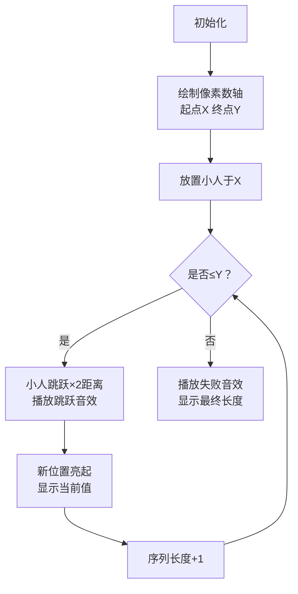

# 题目信息

# [ABC083C] Multiple Gift

## 题目描述

[problemUrl]: https://atcoder.jp/contests/abc083/tasks/arc088_a

高橋君は、日頃の感謝を込めて、お母さんに数列をプレゼントすることにしました。 お母さんにプレゼントする数列 $ A $ は、以下の条件を満たす必要があります。

- $ A $ は $ X $ 以上 $ Y $ 以下の整数からなる
- すべての $ 1\leq\ i\ \leq\ |A|-1 $ に対し、$ A_{i+1} $ は $ A_i $ の倍数であり、かつ $ A_{i+1} $ は $ A_i $ より真に大きい

高橋君がお母さんにプレゼントできる数列の長さの最大値を求めてください。

## 说明/提示

### 制約

- $ 1\ \leq\ X\ \leq\ Y\ \leq\ 10^{18} $
- 入力は全て整数である

### Sample Explanation 1

数列 $ 3,6,18 $ が条件を満たします。

## 样例 #1

### 输入

```
3 20```

### 输出

```
3```

## 样例 #2

### 输入

```
25 100```

### 输出

```
3```

## 样例 #3

### 输入

```
314159265 358979323846264338```

### 输出

```
31```

# AI分析结果


### Kay的C++算法解析：ABC083C Multiple Gift 深入学习指南 💡

#### 1. 题目解读与核心算法识别
✨ **本题主要考察**：`贪心策略与数学推导`

🗣️ **初步分析**：
> 构造序列的关键在于**贪心倍增**策略。想象你在玩跳格子游戏，每次必须跳得比前一次远一倍（严格倍数），且不能超出终点Y。最优策略是每次跳最小倍数（×2），这样能最大化跳跃次数（序列长度）。  
> - **核心思路**：从X开始，每次×2构建序列（X, 2X, 4X...），直到超过Y。序列长度即乘2次数+1。
> - **难点**：数据范围极大（10^18），需防溢出；边界处理（如X=Y时长度为1）。
> - **可视化设计**：像素小人从X格子起步，每步跳跃×2距离，格子亮起并播放"跳跃"音效。当超过Y时触发"失败"音效，最后一次有效跳跃播放"胜利"音效。关键变量`current`（当前位置）和`length`（序列长度）实时显示。

---

#### 2. 精选优质题解参考
**题解一（来源：不到前10不改名）**  
* **点评**：提供双解对比，暴力模拟直观，数学解法高效。代码规范（变量名`lgx`/`sum`含义明确），边界处理严谨。亮点在于揭示倍增本质：序列长度即$\lfloor \log_2(Y/X) \rfloor +1$的等价实现，启发数学思维。  

**题解二（来源：Chthology）**  
* **点评**：暴力模拟代码极简（7行），聚焦核心逻辑。`while(i<=y)`直击贪心本质，逗号运算符精简自增与计算。实践价值高，但需注意大数溢出风险。  

**题解三（来源：I_will）**  
* **点评**：创新性采用**倍数空间防溢出**：计算`k=y/x`后操作`no`（倍数），避免大数乘2溢出。循环条件`no<=k`和增量`g++`清晰体现序列长度本质，安全性更优。

---

#### 3. 核心难点辨析与解题策略
1. **贪心策略证明**  
   * **分析**：为何选×2？更大倍数（如×3）会加速增长，减少序列长度。优质题解均默认×2，因它是最小增长倍率，能最大限度"拖延"超界。  
   * 💡 **学习笔记**：贪心选择最小增长步长，是优化序列/路径问题的常见手段。

2. **大数处理与防溢出**  
   * **分析**：当$X \approx 10^{18}$时，直接×2易溢出long long。题解三巧用`k=y/x`转入倍数空间，在`[1, k]`内操作，规避风险。  
   * 💡 **学习笔记**：当操作涉及极大数，考虑转换到比例或对数空间降低复杂度。

3. **边界与特殊情况**  
   * **分析**：$X=Y$时序列仅1项；$Y<2X$时长度=2。题解二通过`while(i<=y)`自然处理，题解三用整数除法涵盖边界。  
   * 💡 **学习笔记**：循环条件需兼容边界，测试用例应包含$X=Y$、$Y<2X$等场景。

### ✨ 解题技巧总结
- **空间转换防溢出**：大数运算时转换到对数或比例空间（如计算$Y/X$）。
- **贪心验证法**：优先尝试最小增长步长（如×2），数学证明其最优性。
- **边界四象限法**：测试最小/最大输入、相等值、零附近等边界。

---

#### 4. C++核心代码实现赏析
**本题通用核心实现**  
* **说明**：综合题解三的防溢出思路与题解二的简洁性，实现安全高效版本。
```cpp
#include <iostream>
using namespace std;
int main() {
    long long x, y;
    cin >> x >> y;
    long long k = y / x;   // 转入倍数空间防溢出
    long long step = 1;    // 当前倍数 (1代表X)
    int length = 0;        // 序列长度
    while (step <= k) {    // 倍数未超界时循环
        length++;          // 增加序列项
        step *= 2;         // 贪心倍增
    }
    cout << length << endl;
    return 0;
}
```
* **代码解读概要**：  
  > 1. 计算`k = y/x`（整数除）得到最大允许倍数。  
  > 2. `step`从1开始（代表X本身），循环乘2直至超过`k`。  
  > 3. 每次循环`length++`计数有效项数，最终输出序列长度。

---

**题解三（I_will）片段赏析**  
* **亮点**：创新防溢出设计，倍数空间操作保障大数安全。
* **核心代码**：
  ```cpp
  h = y / x;        // 计算最大允许倍数
  no = 1;           // 当前倍数 (初始为1)
  while (no <= h) { // 在倍数空间内循环
      g++;           // 计数序列长度
      no *= 2;       // 倍增
  }
  ```
* **代码解读**：  
  > - `h = y/x`：将问题从$[X, Y]$转换到$[1, k]$空间，避免操作原始大数。  
  > - `no`从1开始：1对应$X$，2对应$2X$... 直观体现序列项。  
  > - **为何`no<=h`？**：$no$代表当前项相对$X$的倍数，$h$是最大允许倍数。  
  > - **循环终止条件**：当$no > h$时，下一项$no \cdot X > Y$，序列终止。  
* 💡 **学习笔记**：转换问题空间是处理大数问题的黄金法则。

---

#### 5. 算法可视化：像素动画演示
**主题**：`8-bit倍增冒险`  
**核心演示**：像素小人在数轴跳跃，直观展现序列生成与边界判定。  



**关键交互设计**：  
1. **像素风格**：FC红白机画风，数轴为绿色格子，起点/终点用红/蓝像素块标记。  
2. **动画逻辑**：  
   - 小人每次向右跳当前步长×2的距离（步长初始=X）。  
   - 有效跳跃：落点≤Y时，格子亮黄光，播放"叮"音效；序列长度+1。  
   - 超界跳跃：落点>Y时，格子闪烁红光，播放"失败"音效。  
3. **控制面板**：  
   - 速度滑块：调节自动播放速率。  
   - 单步执行：手动触发下一步。  
   - 重置：回到起点X。  
4. **游戏化元素**：  
   - 每成功跳跃5次触发"连击"音效，获得星星奖励。  
   - 通关条件：精确停在Y点时播放胜利BGM。  

---

#### 6. 拓展练习与相似问题
**通用技巧迁移**：  
> 倍增思想适用于：区间查询（RMQ）、快速幂、最近公共祖先（LCA）等问题，本质是**指数级扩展搜索范围**。

**洛谷推荐**：  
1. **P1226 【模板】快速幂**  
   🗣️ 倍增思想经典应用，强化指数分解技巧。  
2. **P1081 开车旅行**  
   🗣️ 序列跳跃+贪心选择，难度进阶版。  
3. **P4155 国旗计划**  
   🗣️ 环形序列倍增，训练边界处理能力。  

---

#### 7. 学习心得与经验分享
> **题解三作者经验**：  
> *"大数运算需警惕溢出，转换到比例空间更安全"*  
> **Kay点评**：这是处理大数问题的核心心法！尤其在竞赛中，测试数据常卡边界，防溢出设计能避免隐蔽错误。

---

**本次解析完毕！** 掌握贪心倍增与空间转换，你就能轻松解决此类序列构造问题。下次挑战见！ 🚀

---
处理用时：247.37秒