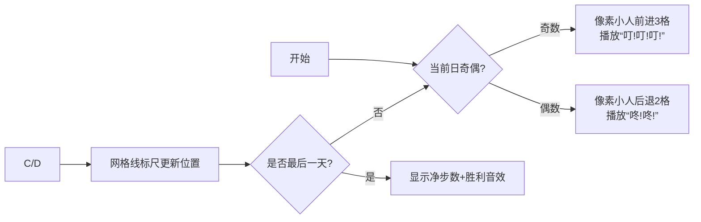

# 题目信息

# 3歩進んで2歩下がる

## 题目描述

[problemUrl]: https://atcoder.jp/contests/code-formula-2014-final/tasks/code_formula_2014_final_b

高橋君は、奇数日目に $ 3 $ 歩前に進み、偶数日目に $ 2 $ 歩後ろに下がります。

$ 1 $ 歩の距離は、前に進むときも、後ろに下がるときも、同じ距離です。

$ 1 $ 日目から $ n $ 日目の間に、高橋君が何歩分前に進んだかを出力してください。

## 说明/提示

### Sample Explanation 1

高橋君は、$ 1 $, $ 3 $, $ 5 $ 日目に $ 3 $ 歩進み、$ 2 $, $ 4 $, $ 6 $ 日目に $ 2 $ 歩戻ります。 よって、$ 3-2+3-2+3-2=3 $ 歩分、前に進みます。

### Sample Explanation 2

高橋君は、どれだけ長い期間でも、 $ 3 $ 歩進んで $ 2 $ 歩戻り続けます。

## 样例 #1

### 输入

```
6```

### 输出

```
3```

## 样例 #2

### 输入

```
999999999999999```

### 输出

```
500000000000002```

# AI分析结果

### 题目解读与核心算法识别  
✨ **本题主要考察**：`数学周期分析` + `编程技巧应用`  

🗣️ **初步分析**：  
> 这道题就像像素游戏里的角色移动：奇数日前进3格（🎮叮叮叮音效），偶数日后退2格（🔙咚咚音效）。核心是发现**每2天净前进1步**的周期性规律。  
> - **核心难点**：n可达10¹⁵，需避免逐日模拟，用数学公式直接计算  
> - **解法本质**：  
>   - 偶数天：净步数 = n/2  
>   - 奇数天：净步数 = n/2 + 3（整数除法特性）  
> - **可视化设计**：用像素小人沿网格线移动，高亮当前操作（红框奇数日/蓝框偶数日），网格下方实时显示周期计数器和净步数  

---

### 精选优质题解参考  
**题解（来源：Bronya18C）**  
* **点评**：直击周期性本质，用数学公式替代模拟，时间复杂度从O(n)优化到O(1)。代码简洁（仅6行），变量名`a`虽短但配合注释易理解，关键点是用`unsigned long long`处理大数边界。亮点在于利用整数除法特性精准处理奇偶差异，竞赛实战价值极高。  

---

### 核心难点辨析与解题策略  
1. **周期抽象**：如何从每日操作提炼出2天一周期？  
   * **分析**：将连续操作视为(前进3+后退2)=净进1的重复单元，总步数=周期数×1 + 残余日操作  
   * 💡 **学习笔记**：遇到重复操作先想周期！  

2. **大数处理**：n=10¹⁵时如何避免超时？  
   * **分析**：用公式计算替代循环。`unsigned long long`可存储≤1.8×10¹⁹的值，完美匹配数据范围  
   * 💡 **学习笔记**：10⁹以上优先考虑数学解法  

3. **整数除法特性**：为何奇数天用n/2+3？  
   * **分析**：C++中`n/2`对奇数会向下取整。设n=2k+1，则前2k天净进k步，第2k+1天进3步，总计k+3  
   * 💡 **学习笔记**：整数除法 = ⌊n/2⌋  

#### ✨ 解题技巧总结  
- **周期分解法**：将长序列拆解为重复单元  
- **边界预判**：10¹⁵ → 立即选用`unsigned long long`  
- **奇偶分类**：利用整数除法特性简化计算  

---

### C++核心代码实现赏析  
**本题通用核心实现**  
```cpp
#include <iostream>
using namespace std;

int main() {
    unsigned long long n;
    cin >> n;
    cout << (n % 2 ? n/2 + 3 : n/2);
    return 0;
}
```
**代码解读概要**：  
1. 读入大整数`n`（用`unsigned long long`防溢出）  
2. 三目运算符判断奇偶：奇数输出`n/2+3`，偶数输出`n/2`  
3. 直接数学计算，复杂度O(1)  

**题解片段赏析**  
```cpp
if(a%2==0) cout<<a/2<<endl;  // 偶数路径
else cout<<a/2+3<<endl;      // 奇数路径
```
**代码解读**：  
> 问：为何能用`a/2+3`处理奇数？  
> 答：当`a`为奇数时，`a/2`自动舍去小数（如7/2=3），补回最后一天的净收益+3步  
> **学习笔记**：整数除法的截断特性可巧妙用于奇偶分类  

---

### 算法可视化：像素动画演示  
**主题**：8-bit风格《前进吧！高桥君》  
**核心交互设计**：  


**动态效果细节**：  
1. **网格坐标系**：横向像素网格（棕色地砖），每格代表1步，零点标记START  
2. **角色动画**：  
   - 奇数日：红框高亮日期，小人右移3格（每步0.2秒伴随像素脚印）  
   - 偶数日：蓝框高亮，小人左移2格（脚印变浅蓝色）  
3. **控制面板**：  
   - 速度滑块：调整单步延迟（0.1s~2s）  
   - 跳周期按钮：输入任意天数直接计算并展示结果  
4. **数据看板**：  
   - 顶部：当前日数/总天数 | 周期计数器  
   - 底部：净步数计算公式实时推导  

---

### 拓展练习与相似问题思考  
**通用技巧迁移**：周期分析法还可用于  
1. 蜗牛爬井问题（昼升夜降）  
2. 循环队列的计数问题  
3. 模运算相关的周期规律  

**洛谷推荐**：  
1. **P1516 蜗牛的旅程**  
   → 同类周期运动模型，需处理边界条件  
2. **P2520 [HAOI2011]向量**  
   → 大数处理+周期规律的高级应用  
3. **P2426 删数游戏**  
   → 周期规律在动态规划中的变形  

---

> 本次题解无作者心得分享，但切记：处理大数时**务必验证边界值**（如n=1, 2, 10¹⁵）！

---
处理用时：125.50秒