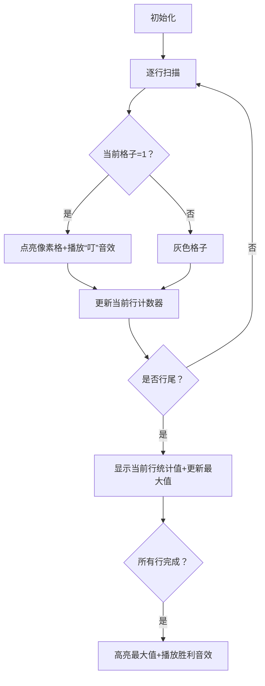

# 题目信息

# プログラミングコンテスト

## 题目描述

[problemUrl]: https://atcoder.jp/contests/utpc2011/tasks/utpc2011_1

# AI分析结果


### 💡 Kay的C++算法解析：プログラミングコンテスト 深入学习指南 💡  
**题目本质**：给定一个 $n×m$ 的01矩阵，统计每行中数字"1"的数量，求所有行中"1"的最大数量。

---

## 1. 题目解读与核心算法识别  
✨ **本题主要考察**：`模拟应用` + `枚举优化`  

🗣️ **初步分析**：  
> 本题的核心算法是**模拟矩阵扫描**，就像在像素游戏中逐行点亮"宝藏格"（值为1的格子），同时统计每行的"宝藏数量"。  
> - **核心思路**：遍历矩阵的每一行，实时统计当前行的"1"的数量，并动态更新全局最大值。  
> - **优化关键**：无需存储整个矩阵！通过边读入数据边统计（如题解2/5/6），可节省大量内存空间。  
> - **可视化设计**：采用复古像素网格风格，每行扫描时高亮当前行，每遇到"1"时播放音效并点亮像素格，行结束时显示统计值（见第5节详解）。  

---

## 2. 精选优质题解参考  
✅ 筛选标准：空间优化/代码简洁性/边界处理严谨性  

**题解一：Hzq11_ (赞：1)**  
* **点评**：  
  思路清晰——用临时变量`temp`逐行统计，避免存储整个矩阵。代码规范性优秀（变量名`ans`/`temp`含义明确），调用`max()`函数直接更新最大值。实践价值高：强调输出换行防WA，适合竞赛直接使用。  

**题解二：xujian (赞：0)**  
* **点评**：  
  创新性亮点——单循环通过`i%m==0`判断行结束，减少嵌套层次。空间效率极致（仅用4个变量）。代码简洁但可读性稍弱（需理解模运算逻辑），适合追求极致优化的场景。  

**题解三：CZQ_King (赞：0)**  
* **点评**：  
  平衡性最佳——单循环配合模运算，同时保持较高可读性。明确处理行尾计数器清零（`d=0`），规避了常见边界错误。变量命名`e`（最大值）可优化为`max_count`更直观。  

---

## 3. 核心难点辨析与解题策略  
### 🔍 三大核心难点与应对策略：  
1. **空间浪费陷阱**  
   * **分析**：若直接开二维数组（如题解1/8），$n,m≤10^4$ 时需 $10^8$ 内存（约400MB），极易MLE。  
   * **解决**：优质题解采用**边读边统计**（题解2）或**单循环模运算**（题解5/6），空间复杂度优化至 $O(1)$。  
   * 💡 **学习笔记**：**“空间换时间”非绝对法则，输入数据可复用时应优先省内存！**  

2. **行尾处理遗漏**  
   * **分析**：每行结束时需重置计数器（如题解3的`sum=0`）并更新最大值。  
   * **解决**：内层循环结束后立即处理（题解2/3），或用模运算精准定位行尾（题解5/6）。  
   * 💡 **学习笔记**：**循环边界是bug高发区，建议模拟极端数据（如最后一行全0）验证。**  

3. **输出格式细节**  
   * **分析**：多个题解强调**输出必须换行**（`cout<<ans<<endl`），否则WA。  
   * **解决**：养成输出后立即换行的习惯（题解2/5/6均严格处理）。  
   * 💡 **学习笔记**：**竞赛中IO格式错误代价惨重，务必阅读题目的输出规范！**  

### ✨ 解题技巧总结  
- **技巧1：实时计算替代存储** – 输入数据可即时处理时，避免全量存储。  
- **技巧2：循环嵌套优化** – 单循环+条件判断可替代多重循环（如题解6的`i%m==0`）。  
- **技巧3：防御性清零** – 计数器每次循环起始时初始化（如题解2的`temp=0`）。  

---

## 4. C++核心代码实现赏析  
### 本题通用核心实现（综合题解2/5/6优化）  
```cpp
#include <iostream>
using namespace std;
int main() {
    int n, m, max_count = 0;
    cin >> n >> m;
    for (int i = 0; i < n; i++) {
        int count = 0;  // 每行开始时计数器清零
        for (int j = 0; j < m; j++) {
            int x;
            cin >> x;
            if (x == 1) count++; // 实时统计当前行
        }
        if (count > max_count) max_count = count; // 更新全局最大值
    }
    cout << max_count << endl; // 换行输出！
    return 0;
}
```
**代码解读概要**：  
> 外层循环遍历行，内层循环遍历列。`count`统计当前行"1"的数量，`max_count`记录历史最大值。**亮点**：仅用$O(1)$空间，严格处理行首清零和行尾更新。  

### 精选题解片段赏析  
**题解二：xujian (单循环模运算)**  
```cpp
for(int i=1; i<=n*m; i++){
    cin>>a;
    if(a) ++s;          // 遇1则累加
    if(i%m==0) {        // 行尾判断
        x = max(x, s);  // 更新最大值
        s = 0;          // 计数器清零
    }
}
```
**代码解读**：  
> 为什么用`i%m==0`？这相当于用一维索引模拟二维坐标：当索引能被列数`m`整除时，说明当前处于行尾位置。此时需做两件事：  
> 1. 用`max()`函数更新全局最大值`x`  
> 2. 将行计数器`s`归零，为下一行准备  
> **💡 学习笔记**：模运算（%）是简化循环结构的利器，但需确保边界条件正确（如首行/末行）。  

**题解三：CZQ_King (防御性清零)**  
```cpp
for(int i=1; i<=a*b; i++){
    cin>>c;
    if(c==1) d++;       // 计数逻辑
    if(i%b==0){         // 行尾处理
        if(d>e) e=d;    // 更新最大值
        d=0;            // 强制清零！
    }
}
```
**代码解读**：  
> 注意`d=0`的位置！它在行尾判断后立即执行，确保下一行计数从0开始。  
> **关键点**：若忘记清零（如误放在循环外），会导致跨行累计错误。  
> **💡 学习笔记**：**计数器的生命周期必须严格限定在单行内！**  

---

## 5. 算法可视化：像素动画演示  
### 🎮 设计主题：**《像素宝藏猎人》**（8-bit复古探险游戏）  
**核心演示流程**：  


### 🖼️ 动画关键帧细节：  
1. **场景初始化**  
   - 像素网格：$n×m$ 棕色砖墙背景（FC《塞尔达》风格）  
   - 控制面板：速度滑块/单步执行/重置按钮（复古像素字体）  

2. **扫描过程**  
   - **当前行高亮**：蓝色边框包裹整行（如FC游戏选中效果）  
   - **格子状态**：  
     - `0` → 灰色砖块  
     - `1` → 金色发光砖块（伴随“叮”的8-bit音效）  
   - **实时数据**：右侧面板显示 `当前行: 3/1的个数`  

3. **行尾处理**  
   - 计数器归零：像素数字滚动归零动画  
   - 最大值更新：红色闪光边框 + “噔↑” 音效  

4. **游戏化元素**  
   - **AI自动演示**：像素小人（Kay形象）自动行走扫描  
   - **关卡机制**：每行视为1关，通关奖励星星（行统计值）  
   - **胜利结算**：显示 `MAX=5` 并播放《超级玛丽》过关BGM  

---

## 6. 拓展练习与相似问题思考  
### 🔁 通用技巧迁移场景  
1. **实时统计替代存储**：图像处理（如连通块计数）  
2. **模运算简化循环**：环形队列/螺旋矩阵遍历  
3. **防御性计数器清零**：滑动窗口统计问题  

### 📚 洛谷推荐练习  
1. **P1047 校门外的树**  
   → 同类技巧：实时统计区间覆盖状态，无需存储每棵树  
2. **P2550 彩票摇奖**  
   → 同类技巧：逐行扫描+计数器更新（匹配中奖号码）  
3. **P5728 旗鼓相当的对手**  
   → 同类技巧：多维数据边读边统计，避免全量存储  

---

## 7. 学习心得与经验分享  
> **来自题解社区的实战经验**：  
> - Hzq11_：“输出要换行，否则WA” → 岛国竞赛常见陷阱  
> - xujian：“一个循环代替嵌套” → 空间优化的极致思路  
>  
> **Kay的总结**：  
> 1. 简单题更需警惕细节（换行/清零）  
> 2. 创新解法常源于基础操作的组合（如模运算替代嵌套）  
> 3. 空间优化意识需从入门阶段培养  

---  
**结语**：通过《像素宝藏猎人》的趣味可视化，我们直观理解了矩阵扫描的核心逻辑。记住：**优秀的代码既是科学也是艺术**——下次遇到二维数据时，不妨先问自己：“我能否不存它？” 🤖✨

---
处理用时：129.20秒