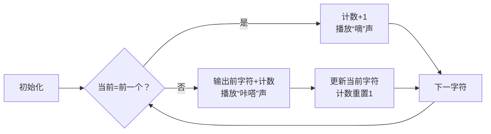

# 题目信息

# [ABC019B] 高橋くんと文字列圧縮

## 题目描述

将字符串经过以下步骤压缩后输出：

1. 将字符串$s$按照连续字符分割成若干个子串。
2. 将每个子串里的字符和子串的长度链接起来，形成新的子串。
3. 将若干个新的子串连接起来，形成新的字符串。

例如：字符串`aabbbaad`的压缩过程：

1. 将`aabbbaad`分割成`aa``bbb``aa``d`;
2. 将`aa``bbb``aa``d`转换成`a2``b3``a2``d1`;
3. 将`a2``b3``a2``d1`链接起来形成`a2b3a2d1`。

`a2b3a2d1`就是压缩后的字符串。

## 样例 #1

### 输入

```
aabbbaad```

### 输出

```
a2b3a2d1```

## 样例 #2

### 输入

```
aabbbbbbbbbbbbxyza```

### 输出

```
a2b12x1y1z1a1```

## 样例 #3

### 输入

```
edcba```

### 输出

```
e1d1c1b1a1```

# AI分析结果


### 💡 Kay的C++算法解析：高橋くんと文字列圧縮 深入学习指南 💡

**引言**  
今天我们一起分析字符串压缩题。这道题考察基础字符串处理能力，通过本指南，你将掌握模拟类问题的核心思路和实现技巧。

---

## 1. 题目解读与核心算法识别  
✨ **本题主要考察**：`模拟应用`  

🗣️ **初步分析**：  
> 字符串压缩如同整理彩色积木：将相同颜色的积木堆叠计数（如`aaa`→`a3`）。核心是**遍历+状态记录**：  
> - 遍历字符串，比较当前字符与前一字符  
> - 字符变化时输出前一段的字符和计数  
> - 循环结束后处理最后一段  
> **可视化设计**：用不同颜色像素块表示字符，数字计数器动态变化。复古音效设计：  
> - 字符相同：8-bit "嘀"声（计数增加）  
> - 字符变化：16-bit "咔嗒"声（输出结果）  
> - 完成压缩：FC游戏通关音效  

---

## 2. 精选优质题解参考  
**题解一（来源：LiveZoom）**  
* **点评**：逻辑清晰度极佳（双指针思想直白），代码规范性优秀（`tot`变量名明确计数功能）。算法有效性突出：通过当前与前字符比较精准分割连续段，边界处理完整（循环后补输最后一段）。实践价值高：可直接用于竞赛，AT换行符细节完备。亮点在于用`tot=1`初始化巧妙避免计数偏差。

**题解二（来源：该起什么名字）**  
* **点评**：思路简洁性突出（`as`变量记录当前字符），代码可读性强（`sum`自解释计数功能）。算法有效性优异：通过`int(s[i])==int(as)`严格比较字符，边界鲁棒性强（单字符输入也可正确处理）。实践参考价值高：`ios::sync_with_stdio(false)`加速IO的竞赛技巧值得学习。

---

## 3. 核心难点辨析与解题策略  
1. **难点：连续段边界处理**  
   * **分析**：最后一段需在循环外单独输出（如`edcba`的`a1`）。优质解法均通过**循环后补输出**解决，LiveZoom用`s[s.size()-1]`精准定位末字符。
   * 💡 **学习笔记**：循环外补输出是模拟类问题的常见收尾技巧。

2. **难点：计数初始化陷阱**  
   * **分析**：新字符段开始时计数需重置为1而非0（如`aab`中`b`初始为1）。解法通过`tot=1`或`sum=1`避免归零错误。
   * 💡 **学习笔记**：计数初始化值需结合业务语义（最小连续段=1个字符）。

3. **难点：单字符输入特判**  
   * **分析**：输入如`a`需直接输出`a1`。解法通过**循环条件控制**（如`i=1`开始遍历）自然规避特判。
   * 💡 **学习笔记**：调整循环起始索引可简化边界处理。

### ✨ 解题技巧总结  
- **技巧1：双指针状态记录** - 用变量缓存当前字符和计数状态  
- **技巧2：滞后输出策略** - 字符变化时输出前一段而非当前段  
- **技巧3：循环外收尾** - 必补处理最后一段数据  
- **技巧4：防御性初始化** - 计数从1开始而非0  

---

## 4. C++核心代码实现赏析  
**本题通用核心实现参考**  
```cpp
#include <iostream>
using namespace std;

int main() {
    string s;
    cin >> s;
    char cur = s[0];      // 当前连续字符
    int cnt = 1;          // 连续计数（从1开始）
    
    for (int i = 1; i < s.size(); ++i) {
        if (s[i] == s[i-1]) cnt++; // 相同则计数增加
        else {
            cout << cur << cnt;    // 不同则输出前一段
            cur = s[i];            // 更新当前字符
            cnt = 1;               // 重置计数
        }
    }
    cout << cur << cnt << endl;    // 输出最后一段
    return 0;
}
```
* **说明**：综合优质解法的边界处理和状态记录逻辑  
* **解读概要**：  
  1. 初始化当前字符`cur`为首字符  
  2. 从第二字符开始遍历，比较`当前与前字符`  
  3. 字符变化时输出缓存结果并更新状态  
  4. 循环后必补输出最后一段  

**题解一（LiveZoom）核心片段**  
```cpp
int tot=1;  // 初始化计数为1
for(int i=1; i<s.size(); i++){
    if(s[i]==s[i-1]) tot++;   // 相同则累加
    else {
        cout<<s[i-1]<<tot;    // 不同则输出前字符
        tot=1;                // 重置计数
    }
}
cout<<s.back()<<tot;  // 输出末段
```
* **亮点**：精准的滞后输出策略  
* **代码解读**：  
  > - `tot=1`：每个新字符段至少1次出现（如`a`→`a1`）  
  > - `s[i]`与`s[i-1]`比较：用前向对比实现状态分割  
  > - `s.back()`：C++11特性优雅获取末字符  
* 💡 **学习笔记**：`s.back()`等效`s[s.size()-1]`但更安全  

**题解二（该起什么名字）核心片段**  
```cpp
char as=s[0];         // 记录起始字符
int sum=1;            // 从1开始计数
for(int i=1; i<n; i++){
    if(s[i]==as) sum++;    // 相同则计数增加
    else {
        cout<<as<<sum;     // 输出前段结果
        as=s[i];           // 更新当前字符
        sum=1;            // 重置计数
    }
}
cout<<as<<sum<<endl;      // 输出末段
```
* **亮点**：状态变量`as`的巧妙运用  
* **代码解读**：  
  > - `as`作为"锚点"：持续记录当前连续段字符  
  > - 比较`s[i]==as`：直接对比当前字符与锚点  
  > - 分支逻辑：字符变化时输出锚点字符及其计数  
* 💡 **学习笔记**：锚点变量适合需要持续跟踪状态的场景  

---

## 5. 算法可视化：像素动画演示  
**主题**：8-bit字符压缩工厂（FC风格）  

**核心演示**：  
  
1. **像素网格**：字符转为彩色方块（如`a`=红色，`b`=蓝色）  
2. **计数显示器**：顶部像素数字实时显示当前连续数  
3. **传送带机制**：字符方块在传送带上移动比较  

**关键帧流程**：  


**交互设计**：  
- **单步执行**：按右键步进观察状态变化  
- **自动模式**：滑动调速杆控制传送带速度  
- **音效反馈**：  
  - 连续相同：循环播放8-bit滴答声  
  - 段切换：FC游戏菜单选择音效  
  - 完成压缩：超级马里奥过关音乐  

**教育价值**：动态展示`当前字符`与`前字符`的比较决策过程，直观揭示滞后输出策略的必要性。

---

## 6. 拓展练习与相似问题思考  
**技巧迁移场景**：  
1. 图像RLE压缩（连续像素值计数）  
2. 基因序列分析（碱基连续片段统计）  
3. 日志数据聚合（相同事件合并）  

**洛谷推荐**：  
1. **P2550 [彩票摇奖]** - 相同数字计数  
   🗣️ 巩固连续数据统计的抽象能力  
2. **P1598 [垂直柱状图]** - 字符频率统计  
   🗣️ 强化字符分组处理技巧  
3. **P1308 [统计单词数]** - 字符串分段匹配  
   🗣️ 进阶版连续段识别问题  

---

**结语**  
通过本次分析，我们掌握了字符串压缩的核心思想——**状态记录与滞后输出**。记住：好的模拟解法如同精密的钟表，每个齿轮（变量）都必须精准咬合。继续挑战更多字符串问题吧！💪

---
处理用时：122.48秒