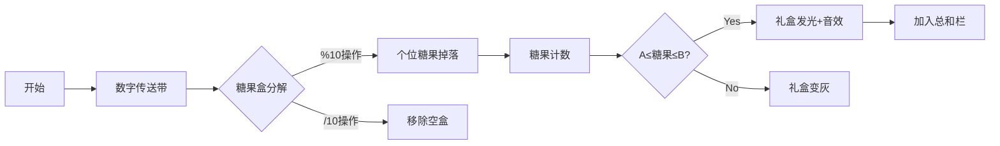

# 题目信息

# [ABC083B] Some Sums

## 题目描述

在 $1$ 以上 $N$ 以下的整数中，求所有 $10$ 进制中各位数的和在 $A$ 和 $B$ 之间的数的总和。

## 样例 #1

### 输入

```
20 2 5```

### 输出

```
84```

## 样例 #2

### 输入

```
10 1 2```

### 输出

```
13```

## 样例 #3

### 输入

```
100 4 16```

### 输出

```
4554```

# AI分析结果


### Kay的C++算法解析：ABC083B Some Sums 深入学习指南

#### 1. 题目解读与核心算法识别
✨ **本题主要考察**：`模拟应用` + `数位分解技巧`

🗣️ **初步分析**：
> 这道题就像在糖果店挑选礼盒：我们需要检查编号1到N的每个礼盒（数字），计算盒内糖果总数（各位数字和），只收集糖果数在A到B之间的礼盒，最后统计这些礼盒的总价值（数字和）。  
> - 所有题解都采用**暴力枚举**法，因为N≤10⁴，计算量在可接受范围（最大10⁴次循环）
> - **核心难点**在于高效分解数字的各位数。题解展示了两种实现范式：Miller2019的紧凑循环 vs PC_DOS的模块化函数
> - 可视化设计：采用8位像素风格，数字像糖果盒般堆叠。当计算各位和时，数字盒会"打开"显示内部糖果（个位/十位像素块），满足条件的盒子会发光并加入右侧总和栏，伴随16-bit音效

---

#### 2. 精选优质题解参考
**题解一（Miller2019）**
* **点评**：思路直击核心（7行解决战斗），循环内联数位分解的写法非常高效。变量命名简洁但含义明确（s=和, d=当前数），边界处理隐含在循环条件中。特别亮点是作者通过注释`//清零`强调状态重置的必要性，这对初学者是很好的提示。

**题解二（PC_DOS）**
* **点评**：模块化典范！将数位计算封装为`IsAddable()`函数，大幅提升可读性。使用`register`优化循环变量，`long long`预防溢出体现工程思维。美中不足是函数名`IsAddable`稍显抽象，改为`CheckDigitSumRange`更直观。

**题解三（AlwaysForward）**
* **点评**：平衡了简洁性和可读性，万能头`#include<bits/stdc++.h>`简化配置适合竞赛。亮点是通过`for(int j=1;;j++)`创新性地替代while，用`if(d==0)break`显式控制循环终止，降低理解门槛。

---

#### 3. 核心难点辨析与解题策略
1. **难点1：数位分解的实现**
   * **分析**：优质解都采用`d%10`取最低位→`d/=10`右移的模板。PC_DOS用函数封装降低认知负荷，Miller2019用紧凑写法提升性能
   * 💡 学习笔记：`d%10`如同拆开糖果盒取出最外层糖果

2. **难点2：循环变量的保护**
   * **分析**：所有解都用`d=i`创建临时副本，避免破坏主循环计数器。AlwaysForward在注释中特别强调此设计意图
   * 💡 学习笔记：像备份重要文件，操作副本更安全

3. **难点3：状态重置的时机**
   * **分析**：Miller2019在循环开头`s=0`确保每个数字独立计算，PC_DOS通过函数局部变量自动重置
   * 💡 学习笔记：糖果盒清空后才能装新糖果

✨ **解题技巧总结**
- **循环优化**：小范围数据优先考虑代码简洁性（如Miller2019）
- **模块封装**：多次使用的逻辑抽象成函数（如PC_DOS）
- **防御性编程**：用临时变量保护原始数据（如AlwaysForward）
- **类型预判**：总和可能超int范围，优先用long long（如PC_DOS）

---

#### 4. C++核心代码实现赏析
```cpp
// 通用核心实现（综合优化版）
#include <iostream>
using namespace std;

int main() {
    int n, a, b;
    cin >> n >> a >> b;
    long long total = 0;  // 防溢出设计

    for(int i=1; i<=n; ++i) {
        int sum = 0, num = i;  // 关键：用临时num保护i
        
        while(num) {           // 数位分解核心逻辑
            sum += num % 10;   // 取个位糖果
            num /= 10;         // 移除已处理的位
        }
        
        if(sum >= a && sum <= b) 
            total += i;        // 符合条件则累加
    }
    
    cout << total << endl;
    return 0;
}
```

**题解一核心片段（Miller2019）**
```cpp
s=0,d=t;            // 🎯 亮点：双变量初始化简洁高效
while(d)             // 循环条件隐式判断d!=0
    s+=d%10,d/=10;   // 💡 学习笔记：逗号运算符实现单行双操作
```

**题解二核心片段（PC_DOS）**
```cpp
bool IsAddable(int iNum, int iLBound, int iUBound){
    int iSum = 0;               // 🎯 亮点：函数封装边界判断
    while (iNum){               // 标准数位分解
        iSum += iNum % 10;
        iNum /= 10;
    }
    return (iLBound <= iSum && iSum <= iUBound); 
}
```

**题解三核心片段（AlwaysForward）**
```cpp
for(int j=1;;j++){      // 🎯 亮点：for+break替代while
    s+=d%10;
    d/=10;
    if(d==0)break;      // 💡 学习笔记：显式终止条件更易理解
}
```

---

#### 5. 算法可视化：像素动画演示
**主题**：像素糖果工厂（8-bit风格）  
**交互设计**：


**关键动画细节**：
1. 数字礼盒在传送带移动（FC红白机像素风格）
2. 分解时礼盒抖动打开，掉出带数字的糖果（个位红色/十位蓝色）
3. 满足条件时礼盒闪烁金光，播放NES《吃豆人》得分音效
4. 控制面板含调速滑块（0.5x-3x），单步执行显示当前代码行
5. 自动模式：AI工人按流程处理礼盒，完成时播放《超级玛丽》过关音乐

---

#### 6. 拓展练习
**通用技巧迁移**：数位分解可应用于：
1. 水仙花数检测（P1151）
2. 数字黑洞计算（P1012）
3. 数位重组问题（P1106）

**洛谷推荐**：
1. **P1151** - 求水仙花数  
   → 强化数位分解与幂运算结合
2. **P1307** - 数字反转  
   → 训练数位重组技巧
3. **P2419** - 数字统计  
   → 实践数位分解在统计场景应用

---

#### 7. 学习心得分享
**参考经验（Miller2019）**：  
*"没加endl也AC? 应该没问题吧？"*  

**Kay点评**：  
输出格式要求常因评测系统而异。比赛环境必须严格遵循题目要求（如添加endl），避免因格式错误丢分。日常练习可通过打印中间变量验证逻辑（如每10个数输出当前和）。

---

通过本次分析，我们掌握了数位分解的核心技巧与模拟问题的优化思路。记住：**清晰的变量命名+模块化设计**能让代码像乐高积木般易组装！下次挑战见！🚀

---
处理用时：93.09秒