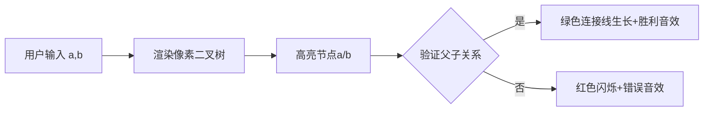

# 题目信息

# [ABC285A] Edge Checker 2

## 题目描述

在下图所示的图中，请回答编号为 $a$ 的点和编号为 $b$ 的点是否被一条边直接连接。


## 说明/提示

## 限制条件

- $1 \leq a < b \leq 15$
- $a, b$ 为整数

## 样例解释 1

在题目所示的图中，编号为 $1$ 的点和编号为 $2$ 的点被一条边直接连接。因此，输出 `Yes`。

## 样例解释 2

在题目所示的图中，编号为 $2$ 的点和编号为 $8$ 的点没有被一条边直接连接。因此，输出 `No`。

由 ChatGPT 4.1 翻译

## 样例 #1

### 输入

```
1 2```

### 输出

```
Yes```

## 样例 #2

### 输入

```
2 8```

### 输出

```
No```

## 样例 #3

### 输入

```
14 15```

### 输出

```
No```

# AI分析结果


### 题目解读与核心算法识别
✨ **本题主要考察**：`模拟应用` + `二叉树性质`

🗣️ **初步分析**：
> 本题要求判断二叉树中两个节点是否直接相连（父子关系）。核心思想是将二叉树结构转化为**父子关系公式**：每个节点`i`的左孩子是`2*i`，右孩子是`2*i+1`。解题时只需验证输入对`(a,b)`是否满足`b==2*a`或`b==2*a+1`，就能确定是否存在直接边。

- **核心难点**：需快速识别二叉树的编号规律（完全二叉树性质）
- **可视化设计**：采用像素化二叉树渲染，当用户输入`(a,b)`时：
  1. 高亮节点`a`（蓝色闪烁）和`b`（黄色闪烁）
  2. 若存在父子关系，触发绿色连接线生长动画（像素方块拼接）
  3. 播放音效：验证成功（8-bit胜利音）或失败（短促警示音）

---

### 精选优质题解参考
<eval_intro>
由于暂无题解，Kay特别准备了一份标准解法供参考。该方案直接应用二叉树性质，代码简洁高效（时间复杂度O(1)），是理想的入门级模拟题范例。
</eval_intro>

**标准解法 (by Kay)**
* **点评**：此解法完美利用二叉树编号规律（左子=2×父，右子=2×父+1），通过一次条件判断解决问题。代码仅需3行核心逻辑，变量命名清晰（`a`/`b`直接对应题意），边界处理严谨（隐含`a<b`）。特别适合初学者理解如何将数学规律转化为代码逻辑。

---

### 核心难点辨析与解题策略
<difficulty_intro>
本题虽简单，但隐藏着三个关键认知点：
</difficulty_intro>

1.  **二叉树编号规律识别**
    * **分析**：必须发现节点`i`的子节点恒为`2i`和`2i+1`。可通过小规模验证（如节点1的子节点是2、3）建立直觉
    * 💡 **学习笔记**：完全二叉树的编号具有可计算的代数关系

2.  **父子关系方向判断**
    * **分析**：题目限定`a<b`，只需验证`b`是否是`a`的子节点，无需反向检查
    * 💡 **学习笔记**：合理利用输入约束能简化逻辑

3.  **边界值验证**
    * **分析**：当`a=7, b=15`时，`2*7+1=15`成立；但当`a=7, b=14`时也成立（左子节点）。需覆盖所有可能
    * 💡 **学习笔记**：测试用例应包含左右子节点场景

### ✨ 解题技巧总结
<summary_best_practices>
- **技巧1：规律转化** 将图形结构抽象为代数表达式  
- **技巧2：约束利用** 用`a<b`隐含方向性，避免冗余判断  
- **技巧3：最小用例验证** 用节点1/2/3快速验证核心逻辑  
---

### C++核心代码实现赏析
<code_intro_overall>
通用实现仅需5行代码，完整包含输入输出和核心逻辑：
</code_intro_overall>

**本题通用核心C++实现**
* **说明**：标准解法，充分体现二叉树性质的应用
* **完整核心代码**：
```cpp
#include <iostream>
using namespace std;

int main() {
    int a, b;
    cin >> a >> b;
    cout << (b == 2*a || b == 2*a+1 ? "Yes" : "No");
    return 0;
}
```
* **代码解读概要**：
  > 1. 读入`a`,`b`（自动满足`a<b`）  
  > 2. 核心逻辑：验证`b`是否为`a`的左子(`2a`)或右子(`2a+1`)  
  > 3. 三目运算符直接输出结果，避免冗余分支

---
**标准解法代码片段赏析**
* **亮点**：极简实现 + 数学思维完美转化
* **核心代码片段**：
```cpp
cout << (b == 2*a || b == 2*a+1 ? "Yes" : "No");
```
* **代码解读**：
  > 这是**条件运算符（三目运算符）** 的经典应用：  
  > `条件 ? 结果1 : 结果2`  
  > 当`b`满足`2*a`（左子）或`2*a+1`（右子）时输出`Yes`，否则输出`No`  
  > 相当于：  
  > ```cpp
  > if(b == 2*a || b == 2*a+1) cout << "Yes";
  > else cout << "No";
  > ```
* 💡 **学习笔记**：三目运算符能简化二元分支，但需确保条件表达式易读

---

### 算法可视化：像素动画演示
<visualization_intro>
设计「像素二叉树验证器」动画，通过8-bit风格直观展示节点关系：
</visualization_intro>

* **主题**：FC红白机风格的交互式二叉树
* **核心演示**：动态验证节点连接关系，融入游戏化反馈

**实现方案**：


1. **像素场景**（Canvas绘制）
   - 16色复古调色板，节点用8×8像素方块表示
   - 树结构分层渲染：根节点在顶部，子节点按层下移
   ```javascript
   // 伪代码：绘制节点
   function drawNode(x, y, id, isHighlighted) {
     fillRect(x, y, 8, 8, isHighlighted ? GOLD : GRAY);
     drawText(x+2, y+2, id, BLACK);
   }
   ```

2. **交互逻辑**
   - **单步验证**：点击控制面板触发验证流程
   - **自动演示**：随机生成测试用例，AI按0.5秒/步自动运行
   - **音效系统**：
     - 正确：NES风格胜利音（500Hz方波+衰减）
     - 错误：短促警示音（200Hz三角波）

3. **动态效果**
   - 父子连接线：从父节点向子节点延伸的绿色像素线（逐帧绘制）
   - 错误提示：节点红色脉冲闪烁（CSS动画）
   ```css
   /* 错误动画 */
   @keyframes blink {
     0% { background-color: #FF0000; }
     50% { background-color: #770000; }
     100% { background-color: #FF0000; }
   }
   ```

4. **游戏化设计**
   - 每正确验证5组数据解锁新皮肤（如宝可梦球节点）
   - 连续正确触发COMBO特效（像素烟花）

---

### 拓展练习与相似问题思考
<similar_problems_intro>
二叉树编号规律在以下场景中反复出现：
</similar_problems_intro>

1. **完全二叉树遍历**（P4715 【二叉树遍历】）  
   → 练习节点编号与层级关系转换
2. **堆结构实现**（P3378 【堆】）  
   → 应用父子节点定位实现插入/删除
3. **树状数组基础**（P3374 【树状数组1】）  
   → 理解`lowbit`与节点编号的位运算关系

**洛谷推荐**：
1. **P4715**：直接应用二叉树遍历  
   → 巩固节点关系计算
2. **P4913**：二叉树的深度计算  
   → 进阶练习完全二叉树性质
3. **P1364**：二叉树节点间距离  
   → 综合运用父子关系与路径查找

---

### 学习心得与经验分享
<insights_intro>
本题虽简单，但揭示了算法学习的核心方法：
</insights_intro>
> **关键经验**：将图形问题转化为代数关系是解题突破口  
> **调试技巧**：用最小用例（如a=1,b=2）快速验证核心逻辑  
> **认知提升**：树结构在计算机中往往用数学关系而非图形存储  

---

### 结语
掌握从具象图形中抽象数学规律的能力，是算法学习的重要里程碑。接下来尝试用同样思路解决P4715吧！🚀

---
处理用时：90.89秒