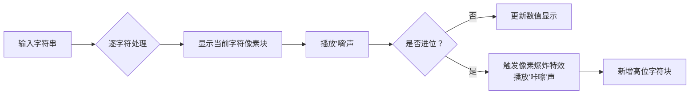

# 题目信息

# [ABC285C] abc285_brutmhyhiizp

## 题目描述

在另一个世界的 AtCoder 举办的 AtCoder Big Contest 中，一次性会出 $10^{16}$ 道题目。  
题目的 ID 从第 $1$ 题开始依次为 `A`、`B`、...、`Z`、`AA`、`AB`、...、`ZZ`、`AAA`、... 这样排列。

也就是说，ID 的分配顺序如下：

- 按照字典序排列的所有长度为 $1$ 的大写英文字母字符串
- 按照字典序排列的所有长度为 $2$ 的大写英文字母字符串
- 按照字典序排列的所有长度为 $3$ 的大写英文字母字符串
- $...$

现在给定一个属于本次比赛的题目 ID 字符串 $S$，请你回答它是第几道题。

## 说明/提示

## 限制

- $S$ 是 AtCoder Big Contest 中合法的题目 ID

## 样例解释 1

ID 为 `AB` 的题目是 AtCoder Big Contest 的第 $28$ 题。

## 样例解释 2

ID 为 `C` 的题目是 AtCoder Big Contest 的第 $3$ 题。

## 样例解释 3

ID 为 `BRUTMHYHIIZP` 的题目是 AtCoder Big Contest 的第 $10^{16}$ 题，也就是最后一题。

由 ChatGPT 4.1 翻译

## 样例 #1

### 输入

```
AB```

### 输出

```
28```

## 样例 #2

### 输入

```
C```

### 输出

```
3```

## 样例 #3

### 输入

```
BRUTMHYHIIZP```

### 输出

```
10000000000000000```

# AI分析结果


### Kay的C++算法解析：ABC285C abc285_brutmhyhiizp 深入学习指南

---

#### 💡 **1. 题目解读与核心算法识别**  
✨ **本题主要考察**：`进制转换应用`  

🗣️ **初步分析**：  
> 这道题的本质是**26进制转10进制**，但有个特殊设定：没有"0"！想象成26个字母组成的密码锁——`A=1`，`B=2`...`Z=26`，当`Z`转完时不是归零而是进位成`AA`。  
> - **核心难点**：处理非标准进制（无0值），需将字母映射为1-26而非0-25  
> - **解题钥匙**：`x = x * 26 + (c - 'A' + 1)`的魔法公式  
> - **可视化设计**：  
>   - 用像素方块表示字母（A=🔵, B=🟢...Z=🟡）  
>   - 进位时触发"像素爆炸"特效（如Z→AA时🟡炸成🔵+🔵）  
>   - 音效：普通字母+1（"嘀"声），进位（"咔嚓"声），完成（8bit胜利旋律）

---

#### 🏆 **2. 精选优质题解参考**  
**题解一（lwx20211103）**  
* **亮点**：  
  ▶️ 双解法对比——从后往前幂次计算 vs 从前往后累进转换  
  ▶️ 发现更优解：类比快读的`x=x*26+(c-'A'+1)`  
  ▶️ 代码规范：变量名直白（`nums[]`），边界处理严谨（`1e16`检测）  
  **学习价值**：展示算法优化路径，教会我们提炼共性规律  

**题解二（Lyu_echo）**  
* **亮点**：  
  ▶️ 最简实现——仅5行核心逻辑  
  ▶️ 清晰注释说明26进制本质  
  ▶️ 直接使用`ans=ans*26+t[i]`避免额外乘方运算  
  **学习价值**：演示如何用最少代码表达核心思想  

**题解三（Kingna）**  
* **亮点**：  
  ▶️ 完整展示反向计算（从末位字符开始）  
  ▶️ 显式处理大数（`#define int long long`）  
  ▶️ 手写幂次计算演示底层原理  
  **学习价值**：帮助理解进制转换的数学本质  

---

#### ⚠️ **3. 核心难点辨析与解题策略**  
1. **难点：非标准进制映射**  
   * **分析**：普通26进制用0-25，但本题字母对应1-26。若按常规转换会漏算（如`A`本应=1，错算成0）  
   * **解法**：字母转换时`+1`：`c - 'A' + 1`  
   * 💡 **学习笔记**：进制问题先确认数字映射规则！  

2. **难点：计算方向选择**  
   * **分析**：两种等效方案——  
     - ➡️ **从前往后**：`ans = ans*26 + 新位值`（如快读）  
     - ⬅️ **从后往前**：`ans += 位值 * 26ᵏ`（需计算幂次）  
   * **解法**：优先选择**从前往后**，避免幂次运算  
   * 💡 **学习笔记**：顺序处理更符合思维惯性且高效  

3. **难点：大数溢出风险**  
   * **分析**：`BRUTMHYHIIZP=10¹⁶`，普通`int`会溢出  
   * **解法**：全程使用`long long`类型  
   * 💡 **学习笔记**：见"10⁶"就开`long long`！  

**✨ 解题技巧总结**  
- **技巧A：问题类比法**  
  > 将字符串看作26进制数，类比Excel列号（A→1, AA→27）  
- **技巧B：核心公式封装**  
  > 记住`ans = ans*base + digit`的进制转换框架  
- **技巧C：极端值测试**  
  > 必测用例：`A`(1), `Z`(26), `AA`(27), `ZZ`(702)  

---

#### 💻 **4. C++核心代码实现赏析**  
**通用核心实现**  
```cpp
#include <iostream>
using namespace std;

int main() {
    string s;
    cin >> s;
    long long ans = 0;              // 必须long long防溢出
    for (char c : s) {              // 魔法公式开始
        ans = ans * 26 + (c - 'A' + 1); 
    }                               // 相当于26进制快读
    cout << ans;
}
```
**代码解读概要**：  
> 遍历每个字符时，将已有结果`×26`（相当于左移一位），再加上新字符的数值（1-26）。如同滚雪球般累积出最终值。  

---  
**题解一（lwx20211103）片段**  
```cpp
ans = ans * 26 + (i - 'A' + 1);  // 核心12字真言
```
* **亮点**：化繁为简，类比快读逻辑  
* **学习笔记**：`*26`实现进位，(c-'A'+1)实现字母→数字映射  

**题解二（Lyu_echo）片段**  
```cpp
for(int i=0; i<len; i++){
    t[i] = s[i] - 'A' + 1;     // 先转换再计算
    ans = ans * 26 + t[i];      // 统一处理
}
```
* **亮点**：分步明确，适合初学者理解  
* **学习笔记**：转换与计算分离，增强可读性  

**题解三（Kingna）片段**  
```cpp
for(int i=lens; i; i--){        // 从末位开始
    res += t * (s[i]-'A'+1);   // 加权累加
    t *= 26;                   // 更新位权
}
```
* **亮点**：直观展示进制权重（26⁰,26¹,26²...）  
* **学习笔记**：反向计算时需同步更新位权变量  

---

#### 🎮 **5. 算法可视化：像素动画演示**  
**主题**：8-bit进制转换模拟器（复古红白机风格）  

**关键交互设计**：  


**动态演示流程**：  
1. **初始化**：  
   - 屏幕顶部显示输入字符串（如`AB`）  
   - 底部显示当前数值（初始0）  
   - 控制面板：▶️（开始） ⏸️（暂停） 🔢（调速）  

2. **处理`A`**：  
   - 🔵方块从顶部落下  
   - 数值显示区：0 → 1  
   - 音效：短促"嘀"  

3. **处理`B`**：  
   - 🟢方块替换🔵  
   - 数值计算：1×26 + 2 = 28  
   - 特效：底部显示`1×26 + 2`的浮动像素公式  

4. **进位演示（如`Z→AA`）**：  
   - 🟡方块爆炸成金色粒子  
   - 左侧新增🔵方块（代表进位）  
   - 音效：爆炸声 + 8-bit胜利旋律  

5. **AI演示模式**：  
   - 自动从`A`开始快速累加  
   - 目标字符串高亮闪烁  
   - 完成时播放《超级玛丽》过关音乐  

---

#### 📚 **6. 拓展练习与相似问题**  
**通用技巧迁移**：  
> 非标准进制转换还可用于：  
> 1. Excel列号转数字（本题原型）  
> 2. 时间转换（60进制分钟→10进制）  
> 3. 罗马数字解析（特殊符号映射）  

**洛谷推荐**：  
1. **P1014 [NOIP1999] Cantor表**  
   → 练习坐标与序号的双向转换  
2. **P1064 金明的预算方案**  
   → 进阶：带约束条件的多进制状态处理  
3. **P1017 进制转换（负进制）**  
   → 魔改：负进制转换训练  

---

#### 💬 **7. 学习心得分享**  
> 本次题解未包含作者调试心得，但Kay建议：  
> **关键调试技巧**：  
> - 在循环内打印`当前字符→数值`和`更新后ans`  
> - 测试`Z`(26)和`AA`(27)的边界值  
> - 使用`assert()`验证小规模用例（如`B=2`）  

---
**最终结语**：  
> 通过这道题，我们解锁了进制转换的"无0特攻版"！记住`ans=ans*base+digit`的黄金公式，就像玩俄罗斯方块——不断堆积、适时消除。下次遇到`ZZZ`时，你一定能笑着算出它是26³+26²+26！🚀

---
处理用时：130.35秒