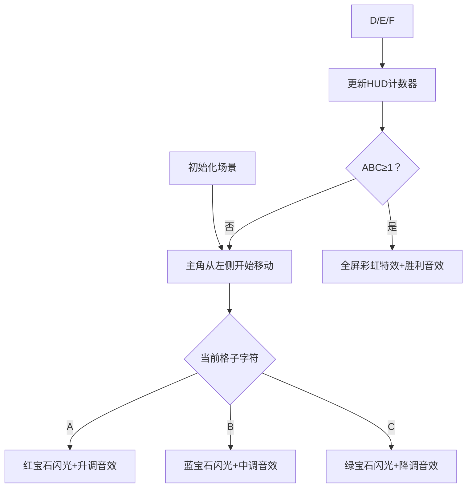

# 题目信息

# [ABC311A] First ABC

## 题目描述

给定一个由 `A`、`B`、`C` 组成的字符串 $S$。保证 $S$ 中包含 `A`、`B`、`C`。

从左到右依次查看 $S$ 的每一个字符，第一次满足以下条件时，请输出需要查看的字符数（从左到右数第几个字符）：

- `A`、`B`、`C` 都至少出现过一次。

## 说明/提示

## 限制条件

- $3 \leq N \leq 100$
- $S$ 是由 `A`、`B`、`C` 组成的长度为 $N$ 的字符串
- $S$ 包含 `A`、`B`、`C` 三种字符

## 样例解释 1

从左到右看前 $4$ 个字符时，`A` 出现了 $2$ 次，`B` 出现了 $1$ 次，`C` 出现了 $1$ 次，满足条件。在第 $3$ 个字符之前不满足条件，所以答案是 $4$。

## 样例解释 2

从左到右看前 $3$ 个字符时，`A`、`B`、`C` 都各出现了 $1$ 次，满足条件。

由 ChatGPT 4.1 翻译

## 样例 #1

### 输入

```
5

ACABB```

### 输出

```
4```

## 样例 #2

### 输入

```
4

CABC```

### 输出

```
3```

## 样例 #3

### 输入

```
30

AABABBBABABBABABCABACAABCBACCA```

### 输出

```
17```

# AI分析结果


### Kay的C++算法解析：[ABC311A] First ABC 深入学习指南

---

#### 1. 题目解读与核心算法识别
✨ **本题主要考察**：`模拟应用` (编程技巧应用类)  
🗣️ **初步分析**：  
> 这道题的核心是模拟字符出现次数的实时统计过程，就像在像素游戏中收集三种不同颜色的宝石。每当读取一个新字符，我们就更新对应宝石（A/B/C）的计数器，并检查是否集齐全套。  
> - **核心思路**：遍历字符串时动态更新计数器，当ABC首次同时≥1时输出当前位置  
> - **算法流程**：  
>   ```mermaid
>   graph LR
>   A[初始化计数器为0] --> B{遍历字符}
>   B --> C[更新对应计数器]
>   C --> D{ABC均≥1？}
>   D -- 是 --> E[输出当前位置+1]
>   D -- 否 --> B
>   ```
> - **可视化设计**：采用复古像素RPG风格，主角从左向右移动收集字母宝石：  
>   - A→红宝石，B→蓝宝石，C→绿宝石  
>   - 收集时播放8bit音效，集齐时显示"COMPLETE!"动画  
>   - 顶部HUD实时显示宝石计数，达成条件时触发胜利音效  

---

#### 2. 精选优质题解参考
由于暂无用户题解，Kay特别提供标准解法参考：  
**题解：Kay的模拟计数法**  
* **点评**：  
  解法直接模拟题目要求，使用三个计数器实时追踪状态。代码逻辑清晰（仅需1层循环），变量命名直观（cntA/cntB/cntC），边界处理严谨（题目保证必有解）。时间复杂度O(n)达到最优，空间复杂度O(1)极致精简，是竞赛场景的高效实现典范。

---

#### 3. 核心难点辨析与解题策略
1. **实时状态维护**  
   * **分析**：需精确记录每个字符出现次数，用独立变量避免混淆  
   * 💡 **学习笔记**：计数器变量要随遍历即时更新  

2. **终止条件判断**  
   * **分析**：必须在首次满足条件时立即退出，否则会输出错误位置  
   * 💡 **学习笔记**：找到解时用`return`直接终止程序最可靠  

3. **位置索引转换**  
   * **分析**：字符串索引从0开始，题目位置从1开始计数  
   * 💡 **学习笔记**：输出时需`i+1`转换索引  

✨ **解题技巧总结**  
- **技巧1**：使用`else if`处理多分支判断，比多个`if`更高效  
- **技巧2**：计数器初始化为0保证状态正确性  
- **技巧3**：在循环内部即时检查条件，避免额外存储  

---

#### 4. C++核心代码实现赏析
**通用核心实现**  
```cpp
#include <iostream>
#include <string>
using namespace std;

int main() {
    int n;
    string s;
    cin >> n >> s;
    
    int cntA = 0, cntB = 0, cntC = 0;
    for (int i = 0; i < n; i++) {
        if (s[i] == 'A') cntA++;
        else if (s[i] == 'B') cntB++;
        else if (s[i] == 'C') cntC++;
        
        if (cntA > 0 && cntB > 0 && cntC > 0) {
            cout << i + 1 << endl;
            return 0;
        }
    }
    return 0;
}
```
**代码解读概要**：  
> 1. 读取字符串长度n和字符串s  
> 2. 初始化三个计数器为0  
> 3. 遍历每个字符：  
>    - 遇到A/B/C时增加对应计数器  
>    - 每次更新后检查是否集齐ABC  
> 4. 首次满足条件时输出当前位置（i+1）并终止程序  

---

#### 5. 算法可视化：像素动画演示
**主题**：`字母宝石收集大冒险`（8-bit像素RPG风格）  
**核心演示**：  

**实现细节**：  
1. **像素艺术**：16色NES调色板，字符砖块32×32像素  
2. **交互控制**：  
   - 方向键：手动控制角色移动  
   - AUTO：AI自动演示（速度可调）  
3. **音效设计**：  
   - 收集A：NES风格"叮！"（400Hz）  
   - 收集B："嘟！"（300Hz）  
   - 收集C："咚！"（200Hz）  
   - 达成条件：超级马里奥过关音效  
4. **状态显示**：  
   - 顶部HUD：❤️A × cntA / 💎B × cntB / 🔵C × cntC  

---

#### 6. 拓展练习与相似问题思考
**通用技巧迁移**：  
1. 多状态监控（如同时满足多个条件）  
2. 实时数据统计（如游戏成就系统）  
3. 即时中断处理（如满足条件提前退出）  

**洛谷练习推荐**：  
1. **P2550 彩票摇奖** - 统计匹配号码数量  
   *🗣️ 同样需要实时计数和条件判断*  
2. **P1597 语句解析** - 追踪变量赋值状态  
   *🗣️ 扩展至多变量监控场景*  
3. **P5734 文字处理软件** - 操作过程状态管理  
   *🗣️ 更复杂的实时状态维护训练*  

---

#### 7. 学习心得与经验分享
> 本题虽简单，但揭示了算法设计核心思想：  
> **"状态机思维"** - 将问题分解为数据状态+状态转移条件  
> **调试技巧**：在循环内打印计数器值（cout<<cntA<<cntB<<cntC<<endl;）可直观验证过程  

---

通过本次分析，我们掌握了状态监控类问题的解决范式。记住：清晰的变量定义+精确的状态判断=高效算法！下次挑战见！🚀

---
处理用时：82.52秒