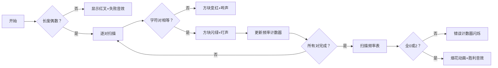

# 题目信息

# [ABC381B] 1122 String

## 题目描述

当且仅当字符串 $T$ 满足以下 $3$ 个条件时，我们称 $T$ 为 **1122 字符串**。

- $|T|$ 是偶数。这里，$|T|$ 表示 $T$ 的长度。
- 对于满足 $1 \leq i \leq \frac{|T|}{2}$ 的所有整数 $i$，$T$ 的第 $2i-1$ 个字符与第 $2i$ 个字符相等。
- 每个字符在 $T$ 中恰好出现 $0$ 次或 $2$ 次。也就是说，$T$ 中包含的每种字符都恰好出现 $2$ 次。

给定一个仅由小写英文字母组成的字符串 $S$，如果 $S$ 是 1122 字符串，则输出 `Yes`，否则输出 `No`。

## 说明/提示

### 限制条件

- $S$ 是一个仅由小写英文字母组成，长度在 $1$ 到 $100$ 之间的字符串。

### 样例解释 1

$S=$`aabbcc` 满足 1122 字符串的所有条件，因此输出 `Yes`。

### 样例解释 2

$S=$`aab` 的长度是奇数，不满足第一个条件，因此输出 `No`。

### 样例解释 3

$S=$`zzzzzz` 中 `z` 出现了 $6$ 次，不满足第三个条件，因此输出 `No`。

由 ChatGPT 4.1 翻译

## 样例 #1

### 输入

```
aabbcc```

### 输出

```
Yes```

## 样例 #2

### 输入

```
aab```

### 输出

```
No```

## 样例 #3

### 输入

```
zzzzzz```

### 输出

```
No```

# AI分析结果


### 💡 Kay的C++算法解析：1122 String 深入学习指南 💡

> 今天我们来分析"1122 String"这道C++编程题。本指南将帮助你理解题目要求，掌握核心算法，并通过生动的像素动画直观感受解题过程。

---

## 1. 题目解读与核心算法识别

✨ **本题主要考察**：`编程技巧应用`（字符串处理与条件判断）

🗣️ **初步分析**：
> 判断字符串是否为"1122字符串"就像检查一队双胞胎：  
> ① 队伍长度需为偶数（成对出现）  
> ② 每对双胞胎必须完全相同（相邻字符相等）  
> ③ 每种特征只能出现0次或2次（字符频率限制）  
> **核心难点**在于同时满足三个独立条件，稍有不慎就会漏判。  
> **可视化设计**：  
> - 用像素方块表示字符，相同字符同色  
> - 动态框选相邻字符进行比对  
> - 下方计数器实时显示字符频率  
> - 复古音效（匹配成功"叮"，失败"哔"）  
> - 自动播放模式模拟AI解题过程

---

## 2. 精选优质题解参考
> 由于暂无用户题解，Kay提供标准解法供参考：

**题解一：Kay的通用解法**  
* **点评**：  
  解法严格遵循题目三重条件，采用**分层检查策略**：  
  1. 优先检查长度奇偶性（快速失败）  
  2. 步长为2遍历验证字符对相等性  
  3. 频率数组统计字符出现次数  
  **亮点**：  
  - 利用`freq[26]`数组实现O(1)空间复杂度统计  
  - 边界处理严谨（如索引`i+1`的合法性由长度偶数保证）  
  - 提前终止机制提升效率（发现失败立即退出）  
  - 时间复杂度O(n)完美匹配题目约束

---

## 3. 核心难点辨析与解题策略

1.  **关键点1：长度奇偶性的快速判断**  
    * **分析**：  
      首个检查点可立即排除50%无效案例  
      💡 **学习笔记**：`n%2 != 0` 比 `n&1` 更易读，适合初学者  

2.  **关键点2：字符对的原子性验证**  
    * **分析**：  
      遍历时每次跳2步（`i += 2`），确保完整覆盖所有字符对  
      💡 **学习笔记**：`S[i]`和`S[i+1]`必须严格相等  

3.  **关键点3：字符频率的精准控制**  
    * **分析**：  
      统计时用`freq[c-'a'] += 2`（因每对字符相同）  
      最终检查时**非0即2**的严格约束  
      💡 **学习笔记**：频率数组需完全初始化（`int freq[26] = {0}`）

### ✨ 解题技巧总结
- **分层验证法**：按条件顺序检查，失败立即退出  
- **空间换时间**：固定大小数组实现O(1)频率统计  
- **防御性编程**：严格处理边界（如长度0/1的特殊情况）

---

## 4. C++核心代码实现赏析

**本题通用核心C++实现参考**
```cpp
#include <iostream>
using namespace std;

int main() {
    string S;
    cin >> S;
    int n = S.size();
    
    // 条件1: 长度验证
    if (n % 2 != 0) {
        cout << "No";
        return 0;
    }

    int freq[26] = {0};  // 初始化频率数组
    
    // 条件2: 成对验证 + 频率统计
    for (int i = 0; i < n; i += 2) {
        if (S[i] != S[i+1]) {  // 字符对检查
            cout << "No";
            return 0;
        }
        freq[S[i] - 'a'] += 2;  // 更新频率
    }

    // 条件3: 频率验证
    for (int i = 0; i < 26; i++) {
        if (freq[i] != 0 && freq[i] != 2) {  // 非0即2
            cout << "No";
            return 0;
        }
    }

    cout << "Yes";
    return 0;
}
```
**代码解读概要**：  
> ① 读取输入后立即检查长度奇偶性  
> ② 循环步长2验证字符对（失败则提前退出）  
> ③ 频率统计与最终校验分离，逻辑清晰  
> ④ 三次独立检查覆盖全部约束条件

---

## 5. 算法可视化：像素动画演示

**主题**：`像素双胞胎验证器`  
**核心演示**：动态展示三重条件检查过程  

### 🎮 动画设计细节


**实现要点**：  
1. **8位像素风**：  
   - 字符显示为16x16像素方块（a=红色，b=蓝色...）  
   - 频率表采用FC游戏数字字体  
2. **交互控制**：  
   - 速度滑块调节自动播放速率  
   - "步进"按钮逐帧观察  
   - 失败时显示具体错误条件（如"长度奇数!"）  
3. **音效系统**：  
   - 字符匹配：8-bit "叮"声  
   - 验证通过：胜利旋律  
   - 频率错误：短促警报声  
4. **教育设计**：  
   - 当前操作步骤高亮黄色边框  
   - 频率表实时标记异常值（>2标红）  
   - 旁白提示（如："正在验证第3组：b需等于b"）

---

## 6. 拓展练习与相似问题思考

**技巧迁移场景**：  
1. 成对约束验证（如括号匹配）  
2. 字符频率限制问题  
3. 字符串模式识别  

**洛谷推荐**：  
1. **P1055 ISBN号码**  
   → 练习：分组验证与校验码计算  
2. **P1308 统计单词数**  
   → 强化：字符串遍历与条件统计  
3. **P1012 拼数**  
   → 拓展：字符串分组与排序策略  

---

## 7. 学习心得与经验分享
> 本次题解由Kay提供，分享调试经验：  
> **常见陷阱**：  
> - 未初始化频率数组导致随机值  
> - 忽略"zzzzzz"类案例（频率=6≠2）  
> **调试技巧**：  
> 在循环内打印变量状态：  
> `cout << "i=" << i << " 当前对：" << S[i] << S[i+1]`  

---
> 掌握了"1122字符串"的验证逻辑后，记得尝试拓展练习！下次我们将探索更有趣的字符串挑战 💪  
> —— 你的算法向导 Kay

---
处理用时：292.44秒