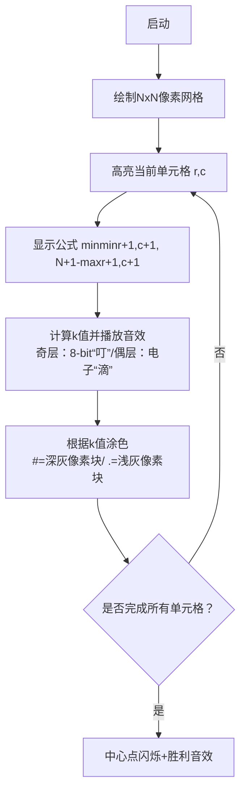

# 题目信息

# [ABC395B] Make Target

## 题目描述

简要题意：输出下面的 $N\times N$ 的矩阵。

```
 ###########  
 #.........#  
 #.#######.#  
 #.#.....#.#  
 #.#.###.#.#  
 #.#.#.#.#.#  
 #.#.###.#.#  
 #.#.....#.#  
 #.#######.#  
 #.........#  
 ###########
```

给定一个正整数 $N$。

存在一个 $N \times N$ 的网格。我们将网格中从上往下第 $i$ 行、从左往右第 $j$ 列的单元格记为单元格 $(i,j)$。初始时，所有单元格均未被涂色。

接下来，按照 $i=1,2,\dots,N$ 的顺序执行以下操作：

- 令 $j = N + 1 - i$
- 若 $i \leq j$：
  - 当 $i$ 为奇数时，使用黑色涂色
  - 当 $i$ 为偶数时，使用白色涂色
  - 将以单元格 $(i,i)$ 为左上角、单元格 $(j,j)$ 为右下角的矩形区域内所有单元格涂色（已涂色的单元格会被覆盖）
- 若 $i > j$，则不执行任何操作

可以证明所有操作完成后不存在未涂色的单元格。请输出最终每个单元格的颜色。

## 说明/提示

### 约束条件
- $1 \leq N \leq 50$
- 输入均为整数

### 样例解释 1
输出结果与**题目描述**中展示的图案一致。

翻译由 DeepSeek R1 完成

## 样例 #1

### 输入

```
11```

### 输出

```
###########
#.........#
#.#######.#
#.#.....#.#
#.#.###.#.#
#.#.#.#.#.#
#.#.###.#.#
#.#.....#.#
#.#######.#
#.........#
###########```

## 样例 #2

### 输入

```
5```

### 输出

```
#####
#...#
#.#.#
#...#
#####```

## 样例 #3

### 输入

```
8```

### 输出

```
########
#......#
#.####.#
#.#..#.#
#.#..#.#
#.####.#
#......#
########```

## 样例 #4

### 输入

```
2```

### 输出

```
##
##```

# AI分析结果


### Kay的C++算法解析：Make Target 深入学习指南

#### 1. 题目解读与核心算法识别
✨ **本题主要考察**：`数学规律与模拟`  
🗣️ **初步分析**：  
> 解决"Make Target"的关键在于发现网格涂色的数学规律。就像俄罗斯套娃一样，网格由多个嵌套的正方形框组成，每个框的颜色取决于它在嵌套中的层级。  
> - **核心思路**：每个位置(r, c)的颜色由其所在嵌套层k的奇偶性决定：k = min(min(r+1,c+1), N+1 - max(r+1,c+1))  
> - **难点突破**：避免直接模拟涂色覆盖过程（O(N³)），通过数学推导将复杂度优化到O(N²)  
> - **可视化设计**：用不同颜色像素块表示层级，动态展示k值计算过程，音效区分奇偶层  
> - **游戏化设计**：采用8位像素风格，每完成一层嵌套播放"升级"音效，中心点达成时播放胜利音乐  

---

#### 2. 精选优质题解参考
**题解（规律推导法）**  
* **点评**：  
  该解法通过数学推导直接确定每个位置的最终颜色。思路清晰（k值计算公式简洁优雅），代码规范（变量命名直观），算法高效（O(N²)复杂度最优）。边界处理严谨（r/c从0开始转换到1-based），可直接用于竞赛。亮点在于完全规避了复杂的涂色覆盖模拟，用纯数学方法解决问题。

---

#### 3. 核心难点辨析与解题策略
1.  **坐标转换与规律发现**  
    * **分析**：题目使用1-based坐标系统，但代码需用0-based实现。优质题解通过`r+1`/`c+1`巧妙转换，并发现k值由位置与边界的距离决定  
    * 💡 **学习笔记**：1-based/0-based转换是网格问题的常见技巧  

2.  **避免覆盖模拟的优化**  
    * **分析**：直接模拟每次涂色会覆盖前次结果（O(N³)）。通过逆向思维——每个位置最终颜色由最后一次覆盖它的操作决定——将问题转化为数学计算  
    * 💡 **学习笔记**：当操作具有覆盖性时，考虑"最终状态由哪个操作决定"  

3.  **奇偶性判断的数学表达**  
    * **分析**：k的奇偶性决定颜色（奇=#/偶=.）。题解用`k%2==1`简洁实现，避免冗余分支判断  
    * 💡 **学习笔记**：奇偶性判断优先用取模而非位运算，可读性更强  

### ✨ 解题技巧总结
- **问题转化技巧**：将过程模拟问题转化为静态数学规律  
- **边界统一法**：用`min(a, N+1-b)`处理对称位置计算  
- **即时输出优化**：无需存储整个矩阵，逐行计算输出节省内存  

---

#### 4. C++核心代码实现赏析
**通用核心实现参考**  
* **说明**：综合数学规律的最优实现  
* **完整核心代码**：
```cpp
#include <iostream>
#include <algorithm>
using namespace std;

int main() {
    int N; cin >> N;
    for (int r = 0; r < N; ++r) {
        for (int c = 0; c < N; ++c) {
            int a = min(r+1, c+1);
            int b = max(r+1, c+1);
            int k = min(a, N+1 - b);
            cout << (k % 2 ? '#' : '.');
        }
        cout << '\n';
    }
    return 0;
}
```
* **代码解读概要**：  
  > 双重循环遍历网格每个位置 → 计算min(r+1,c+1)和max(r+1,c+1) → 推导k值 → 根据k的奇偶性输出#或. → 每行结束换行

---

#### 5. 算法可视化：像素动画演示
* **主题**：俄罗斯套娃像素工坊  
* **核心演示**：动态展示k值计算过程与嵌套层级  



**交互控制**  
- **速度滑块**：调节计算速度（1x-5x）  
- **层级透视**：按Tab键切换显示当前k值  
- **游戏化元素**：  
  - 每完成一层嵌套解锁像素成就徽章  
  - 连续10次正确预测颜色触发连击特效  

---

#### 6. 拓展练习与相似问题思考
* **技巧迁移**：  
  1. 环形矩阵生成（螺旋矩阵）  
  2. 分形图案打印（谢尔宾斯基地毯）  
  3. 动态覆盖状态追踪（灯光开关谜题）  

* **洛谷练习**：  
  1. **P5731** 蛇形方阵  
     → 掌握坐标变换与状态转向  
  2. **P1498** 谢尔宾斯基地毯  
     → 强化分形递归中的位置计算  
  3. **P2959** 赛道修建  
     → 迁移边界距离计算技巧  

---

#### 7. 学习心得与经验分享
> **调试经验**：初始未转换1-based坐标导致k=0错误  
> **Kay点评**：网格问题务必确认坐标起点（0/1-based），在草稿纸画2x2案例验证  

---

通过本指南，你不仅学会了高效解决"Make Target"，更掌握了**问题转化**与**数学建模**的核心思维。下次遇到复杂模拟时，不妨思考：能否找到决定最终状态的静态规律？保持探索精神，编程会越来越有趣！💪

---
处理用时：261.41秒