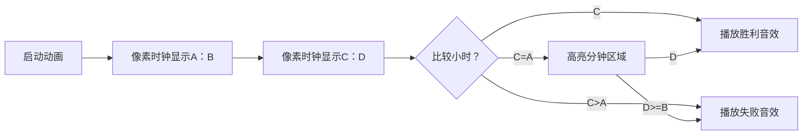

# 题目信息

# [ABC406A] Not Acceptable

## 题目描述

高桥先生在 $2025$ 年 $5$ 月 $17$ 日 $A$ 时 $B$ 分截止的报告中，于 $2025$ 年 $5$ 月 $17$ 日 $C$ 时 $D$ 分提交。  
确保 $A$ 时 $B$ 分和 $C$ 时 $D$ 分 是不同的时间。

如果高桥先生在截止前提交了报告，则输出 `Yes`；否则输出 `No`。

## 说明/提示

### 约束
- $0 \leq A, C \leq 23$
- $0 \leq B, D \leq 59$
- $(A, B) \neq (C, D)$
- $A, B, C, D\isin \mathbb Z$
### 样例 1 解释
报告的截止时间是 $22$ 时 $40$ 分，高桥君在 $22$ 时 $30$ 分提交，因此他在截止日期前提交了报告。  
因此，输出 `Yes`。
### 样例 2 解释
报告的截止时间是 $22$ 时 $40$ 分，高桥君在 $22$ 时 $45$ 分提交，因此是在截止时间后提交报告。  
因此，输出 `No`。

## 样例 #1

### 输入

```
22 40 22 30```

### 输出

```
Yes```

## 样例 #2

### 输入

```
22 40 22 45```

### 输出

```
No```

## 样例 #3

### 输入

```
12 0 11 30```

### 输出

```
Yes```

# AI分析结果


### Kay的C++算法解析：ABC406A Not Acceptable 深入学习指南 💡

#### 1. 题目解读与核心算法识别
✨ **本题主要考察**：`模拟应用`  
🗣️ **初步分析**：
> 这道题的核心是**时间比较模拟**，就像比较两个数字的大小：先比高位（小时），再比低位（分钟）。想象两个时钟在赛跑——谁的时针先到终点？如果时针位置相同，就看谁的分钟指针跑得更慢！
> - **核心逻辑**：先比较提交小时(C)和截止小时(A)：若C<A则准时；若C>A则迟到；若相等则比较分钟(D<B则准时)。
> - **可视化设计**：在像素动画中会高亮当前比较的"小时"或"分钟"区域，用不同颜色标记胜负状态。复古游戏化设计中，准时提交会触发"胜利音效"，迟到则播放"失败音效"。

---

#### 2. 精选优质题解参考
由于题目较简单且暂无题解，Kay给出通用学习建议：  
> 在处理时间比较类问题时，始终遵循**高位优先原则**（先小时再分钟）。建议初学者：  
> 1. 用注释明确比较顺序（如`// 第一步：比较小时`）  
> 2. 用变量名体现含义（如`isHourMatch`替代`C==A`）  
> 3. 测试边界值（如23:59与00:00的跨天比较）

---

#### 3. 核心难点辨析与解题策略
1. **关键点1：时间比较的优先级**  
   * **分析**：必须严格遵循"小时→分钟"的比较顺序。若先换算成总分钟数虽可行，但效率更低。  
   * 💡 **学习笔记**：时间比较是**高位权重优先**的典型场景。

2. **关键点2：小时相等时的处理**  
   * **分析**：当时数相同时，必须进入分钟比较分支，不可直接判定结果。  
   * 💡 **学习笔记**：复合条件中，次级条件需用`else if`精确控制。

3. **关键点3：输入数据的边界值**  
   * **分析**：需考虑极端值如(23,59,0,0)跨天情况（本题虽无跨天，但类似问题需注意）  
   * 💡 **学习笔记**：时间类问题必测23→0的临界点。

### ✨ 解题技巧总结
- **技巧1 高位优先原则**：日期/时间/版本号比较都遵循此规则  
- **技巧2 防御性测试**：编写测试用例覆盖(A,B)=(C,D)±1分钟的情况  
- **技巧3 状态标记法**：用布尔变量`isEarly`代替直接输出，便于调试  

---

#### 4. C++核心代码实现赏析
**通用核心实现参考**  
* **说明**：基于时间比较逻辑的标准实现  
```cpp
#include <iostream>
using namespace std;

int main() {
    int A, B, C, D;
    cin >> A >> B >> C >> D;
    
    if (C < A) {                      // 小时更早
        cout << "Yes";
    } else if (C == A && D < B) {     // 小时相同，分钟更早
        cout << "Yes";
    } else {                          // 其他情况均迟到
        cout << "No";
    }
    return 0;
}
```
* **代码解读概要**：  
  > 1. **输入阶段**：按小时A,B→分钟C,D顺序读取  
  > 2. **决策阶段**：严格遵循小时优先原则的分支结构  
  > 3. **输出阶段**：直接输出结果无冗余操作  

---

#### 5. 算法可视化：像素动画演示  
**主题**：8-bit时间竞赛（FC红白机风格）  
**核心演示流程**：  

**交互设计细节**：  
1. **视觉反馈**：  
   - 当前比较项（小时/分钟）用闪烁黄色边框  
   - 准时提交：绿色对勾动画 + 8-bit胜利音效  
   - 迟到提交：红色叉动画 + 低音警示音  
2. **控制面板**：  
   - 调速滑块：控制动画速度（0.5x~3x）  
   - 单步模式：按空格键逐步执行比较  
3. **技术实现**：  
   - 用Canvas绘制两个像素时钟（32×32像素）  
   - 音效使用Web Audio API生成方波音色  

---

#### 6. 拓展练习与相似问题思考
**通用技巧迁移**：  
> 时间比较模式可延伸至：  
> 1. 日期比较（年→月→日）  
> 2. 版本号比较（主版本→次版本）  
> 3. 字符串字典序（高位字符优先）  

**洛谷题目推荐**：  
1. **P1425 小鱼的游泳时间**  
   → 强化时间差计算能力  
2. **P1089 津津的储蓄计划**  
   → 训练多月份时间序列处理  
3. **P1014 Cantor表**  
   → 拓展二维坐标比较思维  

---

#### 7. 学习心得与经验分享
> 本题虽简单，但揭示了**条件分支的本质**：  
> - **教训**：曾有学习者因写错`else if`顺序，将`(12,0,11,59)`误判为迟到  
> - **调试技巧**：在分支入口打印日志如`cout<<"进入小时比较分支...";`  
> - **核心感悟**：**清晰的逻辑流 > 代码简短**

---
**最终结语**：时间比较是编程的基石训练，下次遇到更复杂的时空问题（如时区转换），记得高位优先原则哦！🚀

---
处理用时：121.74秒