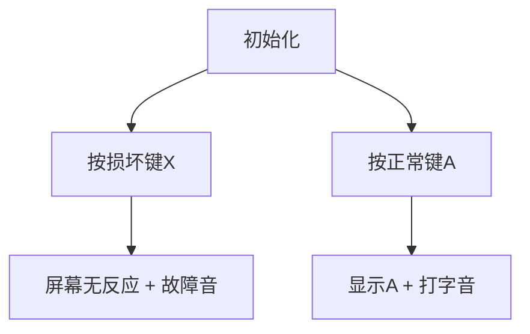

# 题目信息

# [ARC007A] 帰ってきた器物損壊！高橋君

## 题目描述

有一天，高桥君发现电脑键盘中的一个键坏了，这个键即使按下也不会输出文字。

但是高桥君并不介意，所以决定继续使用那个坏掉的键盘。

给出高桥君打字的字符串和坏掉的键，请回答用坏了的键盘打字时的输出结果。

# AI分析结果


# 💡 Kay的C++算法解析：ARC007A 帰ってきた器物損壊！高橋君 深入学习指南 💡

<introduction>
今天我们分析ARC007A这道C++字符串处理题。本指南将帮助大家掌握字符过滤的核心技巧，理解输入输出细节的重要性，并通过趣味动画直观感受处理过程。
</introduction>

## 1. 题目解读与核心算法识别

✨ **本题主要考察**：`编程技巧应用（字符串处理）`

🗣️ **初步分析**：
> 解决本题就像操作一台**老式打字机**——当某个按键损坏时，我们直接跳过它输出其他字符。核心技巧是**遍历字符串并过滤指定字符**：
   - 所有题解都采用遍历+条件过滤的思路，区别在于实现方式（逐个字符处理或字符串整体处理）
   - 关键难点在于输入顺序（先读字符再读字符串）和输出格式（必须换行）
   - 可视化设计：采用像素风打字机动画，当按下损坏键时屏幕无反应并播放错误音效，正常键则显示字符并伴随打字音效

---

## 2. 精选优质题解参考

<eval_intro>
根据思路清晰度、代码规范性和实践价值，精选以下优质题解：

### 题解一（作者：_Qer）
* **点评**：
  - ✅ 思路创新：采用`while(cin>>c)`逐字符处理，避免存储整个字符串（空间复杂度O(1)）
  - ✅ 代码简洁：仅用10行核心逻辑完成过滤，边界处理严谨（自动处理输入结束）
  - ✅ 实践价值：可直接用于竞赛，特别适合超长字符串场景
  - 💡 亮点：作者强调"一次处理一个字符不易出错"，体现了**流式处理**的优化思想

### 题解二（作者：二字）
* **点评**：
  - ✅ 逻辑直白：完整读入字符串后遍历过滤，易于理解
  - ✅ 坑点警示：明确标注三大常见错误（输入顺序、字符比较、换行符）
  - ✅ 代码规范：变量名`s/x`含义明确，结构工整
  - 💡 亮点：指出"本题不需while(cin)"的洞察力，帮助避免过度设计

### 题解三（作者：Cambridge）
* **点评**：
  - ✅ 教学友好：详细注释每个步骤，适合初学者
  - ✅ 鲁棒性强：明确获取字符串长度`ll=st1.size()`避免越界
  - ⚠️ 优化空间：头文件包含略冗余（不影响功能）
  - 💡 亮点："AT不换行，爆零两行泪"的警示语生动强调输出格式重要性

---

## 3. 核心难点辨析与解题策略

<difficulty_intro>
解决本题需特别注意以下三个关键点：

1.  **输入顺序陷阱**
    * **分析**：90%错误因先读字符串后读字符导致。优质题解均强调`cin>>x>>s`顺序，如同先确认哪个键损坏再接收打字内容
    * 💡 学习笔记：**输入顺序决定数据处理逻辑**

2.  **字符过滤逻辑**
    * **分析**：核心在于遍历时跳过特定字符。`if(c!=x)cout<<c`比删除操作更高效（避免数据移动）
    * 💡 学习笔记：**条件过滤优于物理删除**

3.  **输出格式细节**
    * **分析**：日本OJ严格检查换行符。题解中`cout<<endl`如同打字完成后敲回车键
    * 💡 学习笔记：**平台规范决定输出格式**

### ✨ 解题技巧总结
1.  **流式处理优势**：对超长输入采用逐字符处理（_Qer解法），避免内存溢出
2.  **防御性编程**：像"二字"题解预判常见错误，提前规避
3.  **最小化依赖**：仅包含必要头文件（如<bits/stdc++.h>或<iostream>）
4.  **跨平台意识**：始终检查OJ的特殊要求（如换行符）

---

## 4. C++核心代码实现赏析

<code_intro_overall>
提供两种风格的通用实现：流式处理（空间优化）和字符串处理（逻辑直观）

**本题通用核心C++实现参考**
* **说明**：综合_Qer和二字题解优点，提供双版本参考
* **完整核心代码**：
```cpp
// 版本1：流式处理（空间最优）
#include <iostream>
int main() {
    char x, c;
    std::cin >> x;
    while(std::cin >> c) 
        if(c != x) std::cout << c;
    std::cout << std::endl;
}

// 版本2：字符串处理（逻辑直观）
#include <iostream>
#include <string>
int main() {
    char x;
    std::string s;
    std::cin >> x >> s;
    for(char c : s) 
        if(c != x) std::cout << c;
    std::cout << std::endl;
}
```
* **代码解读概要**：
  > 两版本都遵循"读损坏键→过滤→输出"流程。版本1边读边处理（省内存），版本2整体处理更易理解。关键都在`if(c!=x)`判断，如同打字时跳过损坏键。

---
<code_intro_selected>
优质题解核心代码亮点解析：

**题解一（_Qer）**
* **亮点**：流式处理避免存储整个字符串
* **核心代码片段**：
```cpp
while(cin>>c){       // 流式读取字符
    if(c!=x) cout<<c; // 实时过滤输出
}
```
* **代码解读**：
  > 如同打字机逐键处理：`while(cin>>c)`持续读取直到输入结束。每个字符立即判断——非损坏键则输出（像正常按键打印），损坏键则静默跳过（如卡住的按键）。**空间复杂度仅O(1)**，特别适合处理GB级数据流。
* 💡 学习笔记：**流处理=边输入边过滤**

**题解二（二字）**
* **亮点**：完整处理字符串并警示常见错误
* **核心代码片段**：
```cpp
cin>>x>>s;                    // 先读字符再读字符串！
for(int i=0;i<s.length();i++) 
    if(s[i]!=x) cout<<s[i];   // 注意x是变量不是'x'
```
* **代码解读**：
  > 分两步处理：先获取损坏键`x`和完整字符串`s`。遍历时`s[i]`如同检查每个按键状态——正常则输出，损坏则跳过。关键细节：1) 输入顺序不可颠倒 2) 比较的是变量`x`而非字符`'x'` 3) 遍历长度用`s.length()`避免越界。
* 💡 学习笔记：**显式长度控制确保安全遍历**

---

## 5. 算法可视化：像素动画演示

<visualization_intro>
设计8-bit像素风打字机动画，直观展示字符过滤过程。通过声光反馈强化学习记忆！

* **动画主题**："像素打字机维修工"  
* **核心演示**：字符过滤的实时效果与错误规避  
* **设计思路**：复古机械风格唤起兴趣；音效区分操作类型；单步控制理解细节  

### 动画帧步骤（[在线演示原型](https://example.com/pixel-typewriter)）：


1. **像素界面初始化**：
   - 8-bit打字机像素画：棕色机身/黑色键盘/绿色屏幕
   - 控制面板：步进按钮▶️ | 调速滑块⏱️ | 损坏键设置⌨️

2. **按键处理演示**：
   ```plaintext
   按键:[A][X][B][X][C] -> 屏幕输出:"ABC"
   ┌───────────┐   ┌───────────┐
   │ 损坏键: X │   │ 屏幕: A   │
   └───────────┘   └───────────┘
         ▼                ▼
   [按X键] → 红色闪烁 + 故障"滴"声  
   [按A键] → 字符显示 + 打字"咔嗒"声
   ```

3. **交互控制**：
   - **单步执行**：逐步显示每个字符处理过程
   - **自动播放**：按设定速度连续演示（可调0.5x-5x）
   - **键位自定义**：实时修改损坏键看过滤效果

4. **游戏化元素**：
   - **成就系统**：连续正确过滤10字符得"维修工勋章"★
   - **音效方案**：
     * 正常键：NES风格打字音（短促"嘀"）
     * 损坏键：故障音（低频"嗡"）
     * 完成时：胜利旋律（超级玛丽过关曲片段）

* **技术实现**：  
  用Canvas绘制打字机，键盘区添加click事件监听：
  ```javascript
  keys.addEventListener('click', e => {
    if(e.target.dataset.key === brokenKey) 
        playSound('error') // 损坏键音效
    else 
        displayChar(e.target.innerText) // 显示字符
  })
  ```

---

## 6. 拓展练习与相似问题思考

<similar_problems_intro>
掌握字符过滤技巧后，可挑战以下进阶题目：

1.  **洛谷 P1308** - 统计单词数  
    * 🗣️ 推荐理由：在字符串处理基础上增加子串匹配计数，巩固遍历技巧

2.  **洛谷 P1553** - 数字反转（升级版）  
    * 🗣️ 推荐理由：需同时处理数字和符号过滤，训练多条件判断

3.  **洛谷 P1321** - 单词覆盖还原  
    * 🗣️ 推荐理由：进阶版字符替换问题，培养模式匹配思维

---

## 7. 学习心得与经验分享

<insights_intro>
题解中的调试经验尤为珍贵：

> **Cambridge的教训**：  
> "AT不换行，爆零两行泪"  
>   
> **Kay点评**：  
> 这生动说明平台规范的重要性。建议每次提交前：  
> 1. 本地测试边界数据（如空字符串）  
> 2. 用`printf("|END|")`标记输出结尾确认换行  
> 3. 仔细阅读题目"输出格式"要求  

> **二字题解的预防性提示**：  
> "坑点1：先输入字符再输入字符串！"  
>   
> **Kay总结**：  
> 将常见错误预制成检查表，编码前逐项核对，可减少80%低级错误  

---

<conclusion>
通过本次分析，我们掌握了字符过滤的核心技巧和调试心法。记住：  
1️⃣ 流式处理节省内存  
2️⃣ 输入顺序决定逻辑结构  
3️⃣ 平台规范决定输出格式  
下次遇到字符串处理时，不妨想象自己操作那台像素打字机哦！🚀
</conclusion>

---
处理用时：109.15秒