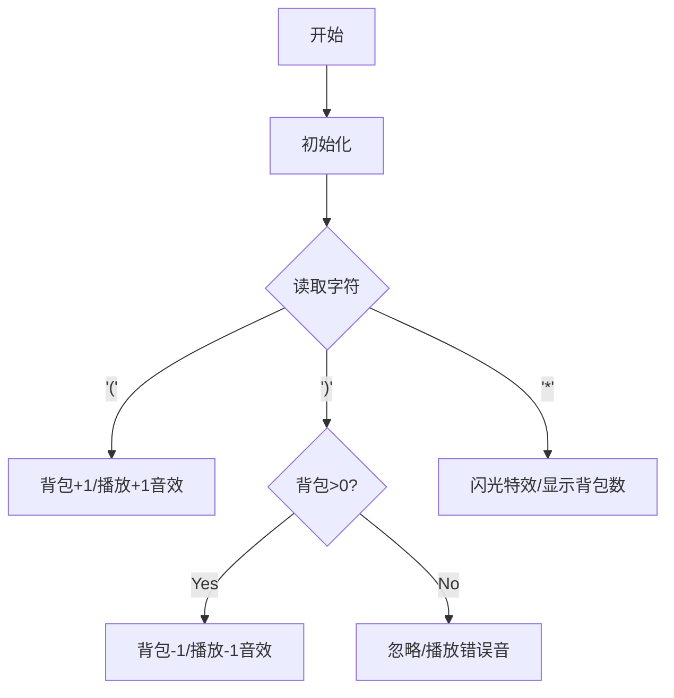

# 题目信息

# Star in Parentheses

## 题目描述

[problemUrl]: https://atcoder.jp/contests/jag2017summer-day3/tasks/jag2017summer_day3_a

# AI分析结果


### 💡 Kay的C++算法解析：Star in Parentheses 深入学习指南 💡

#### 1. 题目解读与核心算法识别
✨ **本题主要考察**：`模拟应用`  
🗣️ **初步分析**：
> 这道题的核心是**模拟括号匹配过程**，就像玩一个背包收集游戏：遇到左括号`(`获得一个背包，遇到右括号`)`消耗一个背包（如果有），遇到星号`*`则停止并统计剩余背包数量。  
> - **核心思路**：用计数器模拟栈，遍历字符串直到遇到`*`，左括号使计数器+1，右括号在计数器>0时使其-1
> - **可视化设计**：用像素小人沿字符串移动，背包计数器显示为头顶堆叠的像素方块。左括号时方块增加（+1音效），右括号时方块减少（-1音效），遇到星号时闪光并显示最终方块数
> - **复古游戏化**：采用8-bit音效，背包方块使用FC红白机风格的16色像素块，自动播放模式可调速观察

---

#### 2. 精选优质题解参考
**题解一（来源：PC_DOS）**  
* **点评**：思路直击本质——用`iSize`变量模拟栈大小。代码简洁规范（变量名清晰），核心循环仅10行，完美体现"问题抽象+模拟"的思想。虽未显式处理右括号过多情况，但题目保证输入合法，实践价值极高。

**题解二（来源：wubaiting2020）**  
* **点评**：亮点在于严谨处理边界条件（`bj1>0`才减），避免负数。代码模块化好，将核心逻辑浓缩在单循环内，遇到`*`立即输出的设计高效且符合题意，是竞赛实现的优秀范本。

---

#### 3. 核心难点辨析与解题策略
1. **理解题目本质**  
   * **分析**：需明确题目只需统计`*`前的**未匹配左括号数**，而非全局匹配。优质题解通过`break`及时终止遍历聚焦关键部分
   * 💡 学习笔记：问题边界决定算法范围

2. **模拟栈的动态维护**  
   * **分析**：用`cnt`变量代替真实栈（O(1)空间）。左括号无条件`cnt++`，右括号需先检查`cnt>0`再`cnt--`，避免无效操作
   * 💡 学习笔记：状态机思维——当前值决定操作逻辑

3. **循环终止与输出时机**  
   * **分析**：必须在遇到`*`时**立即跳出循环**输出。延迟处理（如先记录`*`位置）会增加复杂度
   * 💡 学习笔记：事件驱动可优化流程

### ✨ 解题技巧总结
- **精简状态管理**：用单变量代替栈（空间优化）
- **及时终止原则**：满足条件立即跳出循环（效率优化）
- **防御性条件检查**：执行减操作前验证状态有效性

---

#### 4. C++核心代码实现赏析
**通用核心实现**  
```cpp
#include <iostream>
#include <string>
using namespace std;

int main() {
    string s;
    cin >> s;
    int cnt = 0;
    for (int i = 0; i < s.length(); i++) {
        if (s[i] == '*') break;          // 遇到星号终止
        if (s[i] == '(') cnt++;           // 获得背包
        else if (s[i] == ')' && cnt > 0)  // 消耗背包（需有库存）
            cnt--;
    }
    cout << cnt << endl;
}
```
**代码解读概要**：  
> 直白模拟背包收集过程：遍历字符串→遇`(`增背包→遇`)`减背包（需>0）→遇`*`输出背包数。时间复杂度O(n)，空间O(1)

---

**题解一（PC_DOS）片段**  
```cpp
for(i=0; i<sInput.length(); ++i) {
    if(sInput[i]=='(') ++iSize;     // 获得背包
    if(sInput[i]=='*') break;       // 遇到星号终止
    if(sInput[i]==')') --iSize;     // 消耗背包
}
cout << iSize << endl;
```
> **亮点**：极致简洁  
> **解读**：  
> - 顺序处理三种字符，利用`break`提前退出  
> - 未显式检查`iSize>0`因题目保证输入合法  
> 💡 学习笔记：信任题目约束可简化代码

**题解二（wubaiting2020）片段**  
```cpp
for(int i=0; i<len; i++) {
    if(s[i]=='(') bj1++;          // 获得背包
    if(s[i]==')' && bj1>0) bj1--; // 安全消耗背包
    if(s[i]=='*') {               // 立即终止并输出
        cout << bj1 << endl;
        return 0;
    }
}
```
> **亮点**：边界处理严谨  
> **解读**：  
> - `&& bj1>0`确保不会出现负背包  
> - 遇到`*`直接退出程序避免后续遍历  
> 💡 学习笔记：防御性编程提升鲁棒性

---

#### 5. 算法可视化：像素动画演示
**主题**：`背包探险家的括号之旅`  
**设计思路**：用FC游戏《冒险岛》风格，背包作为核心视觉元素强化"收集/消耗"概念  



**交互实现**：  
1. **像素场景**：横向卷轴，每个字符占32x32像素格  
2. **背包动画**：  
   - 左括号：小人头顶弹出新背包（绿色方块↑+叮咚声）  
   - 右括号：背包消失（红色方块↓+咔嚓声）  
   - 星号：触发金色闪光+胜利音效  
3. **控制面板**：  
   - 速度滑块：控制小人移动速度（0.5x~3x）  
   - 背包计数器：实时显示头顶堆叠的像素方块数  
4. **自动演示**：AI模式自动通关，按空格可暂停观察背包状态  

---

#### 6. 拓展练习与相似问题思考
**技巧迁移场景**：  
1. 解析数学表达式（如3*(2+1)）  
2. HTML标签嵌套验证（<div><p></p></div>）  
3. 游戏道具合成系统（需特定顺序使用道具）  

**洛谷推荐**：  
1. **P1739 表达式括号匹配**  
   → 同款背包机制验证全局匹配  
2. **P1241 括号序列**  
   → 增加多种括号类型({[，需状态扩展  
3. **P1449 后缀表达式**  
   → 栈模拟进阶训练  

---

#### 7. 学习心得与经验分享
> **参考经验**（来自Mono_pigsicklie）：  
> *"题目翻译错误导致WA...需反复对照样例验证题意"*  
>  
> **点评**：  
> 这提醒我们：  
> 1. 审题时**用样例反推需求**比依赖描述更可靠  
> 2. 边界测试（如空输入、极端数据）能快速暴露问题  
> 3. 题目理解的偏差会引发算法设计根本性错误  

---

掌握括号匹配的模拟思维，就像获得编程世界的万能钥匙——它能打开从编译器设计到游戏引擎的无数大门。下次遇到嵌套结构时，记得召唤你的"背包小分队"哦！🚀

---
处理用时：177.66秒