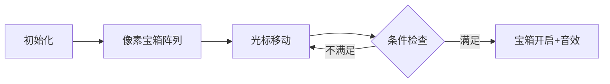

# 题目信息

# 孫子算経

## 题目描述

[problemUrl]: https://atcoder.jp/contests/tenka1-2012-qualB/tasks/tenka1_2012_5

 いま、物が有る。  
 その数は $ 1 $ 以上 $ 127 $ 以下である。   
 $ 3 $ で割ると、 $ a $ 余る。 $ 5 $ で割ると、 $ b $ 余る。 $ 7 $ で割ると、 $ c $ 余る。  
 いくつ物があるとそうなるか小さい順に答えよ。

 入力は以下の形式で標準入力から与えられる。 > $ a $ $ b $ $ c $

- 入力として $ 3 $ つの整数 $ a $ ( $ 0\ \leq\ a\ \leq\ 2 $ ), $ b $ ( $ 0\ \leq\ b\ \leq\ 4 $ ), $ c $ ( $ 0\ \leq\ c\ \leq\ 6 $ ) が空白で区切られて $ 1 $ 行で与えられる。
 
 条件を満たす物の数を小さい順に改行区切りで出力せよ。  
 なお、行の終端には改行が必要である。 ```

2 3 2
```

 ```

23
```

 ```

1 1 1
```

 ```

1
106
```

 ```

2 4 6
```

 ```

104
```

# AI分析结果


### 💡 Kay的C++算法解析：孫子算経 深入学习指南 💡

#### 1. 题目解读与核心算法识别
✨ **本题主要考察**：`枚举` (编程技巧应用)

🗣️ **初步分析**：
> 这道题源自古代数学经典，核心是寻找同时满足三个同余条件的数字。想象你在玩一个"数字解谜游戏"：有127个带编号的宝箱（1-127），钥匙藏在同时满足三个条件的宝箱里（除以3余a、除以5余b、除以7余c）。由于宝箱数量有限，最直接的方法是逐个检查每个宝箱（枚举法）。
> - **核心难点**：理解同余条件组合关系，注意边界值（1-127）
> - **可视化设计**：像素风宝箱阵列（127个8-bit方块），当前检测的宝箱高亮闪烁，满足条件时宝箱弹出钥匙并播放"叮！"音效，右下角实时显示检测进度

---

#### 2. 精选优质题解参考
**题解一 (来源：loi_hjh)**  
* **点评**：思路直白清晰，完整覆盖题目要求。循环结构简洁（单层for），条件判断逻辑紧凑，变量命名简单但有效。亮点在于完全规避复杂数学推导，用最基础的取余运算解决问题。输出语句位置精准，调试语句幽默但实用。

**题解二 (来源：PC_DOS)**  
* **点评**：工业级严谨实现，包含输入流加速优化（ios::sync_with_stdio）。寄存器声明提升循环效率，while循环结构适配多测试用例扩展。代码注释详尽，特别强调边界值（1-127），是竞赛标准实现的优秀范例。

**题解三 (来源：whiteqwq)**  
* **点评**：创新性应用中国剩余定理（70a+21b+15c）%105，展示数学优化思维。亮点在于处理模运算零值特判（d=0时输出105），通过数学分析减少计算量。虽稍复杂但揭示了问题本质，适合拓展思维训练。

---

#### 3. 核心难点辨析与解题策略
1. **同余条件组合验证**  
   * **分析**：需同步验证三个独立条件（%3/%5/%7）。优质解法均用`&&`逻辑运算符串联条件，确保完全匹配。注意余数范围（a∈[0,2], b∈[0,4], c∈[0,6]）  
   * 💡 **学习笔记**：多条件检查时，逻辑与(&&)确保所有条件同步满足

2. **边界值精确控制**  
   * **分析**：题目要求1-127闭区间，需特别注意：  
     - 起始值必须为1（如`for(int i=1;...)`）  
     - 终止值需包含127（`i<=127`优于`i<128`）  
   * 💡 **学习笔记**：边界控制是枚举法的核心安全线

3. **零值特殊处理**  
   * **分析**：当中国剩余定理计算结果为0时，实际解为105（因105≡0 mod 3/5/7）。whiteqwq解法通过特判处理此边界情况  
   * 💡 **学习笔记**：零值在模运算中具有特殊含义，需单独处理

### ✨ 解题技巧总结
- **基础优先原则**：小数据范围（n≤127）优先考虑枚举而非复杂数学
- **循环微优化**：寄存器变量(register)加速循环，循环内避免冗余计算
- **防御性特判**：对数学方法中的边界值（如计算结果为0）建立处理预案
- **输入流加速**：竞赛代码使用`ios::sync_with_stdio(false)`提升IO效率

---

#### 4. C++核心代码实现赏析
**通用核心实现参考**  
* **说明**：综合优质题解，采用最简枚举框架
```cpp
#include <iostream>
int main() {
    int a, b, c;
    std::cin >> a >> b >> c;
    for (int i = 1; i <= 127; i++) {
        if (i % 3 == a && i % 5 == b && i % 7 == c) {
            std::cout << i << "\n";
        }
    }
    return 0;
}
```
* **代码解读概要**：  
  - 输入三余数 → 遍历1-127 → 同步验证三条件 → 即时输出解

---

**题解一核心片段**  
```cpp
for(int i=1;i<=127;i++)
    if((i%3==a)&&(i%5==b)&&(i%7==c)) 
        printf("%d\n",i);
```
* **代码解读**：  
  > 直白的三步流程：① 数字生成器（i从1到127）② 条件验证器（三重余数检查）③ 解输出器（printf）。注意循环范围包含端点值127，条件表达式用括号保证优先级。

---

**题解二核心片段**  
```cpp
ios::sync_with_stdio(false);
for (i = 1; i <= 127; ++i){
    if (i%3 == iMod1 && i%5 == iMod2 && i%7 == iMod3){
        cout << i << endl;
```
* **代码解读**：  
  > 专业级优化：IO加速开关提升输入输出效率。循环计数器前向递增(++i)优于后向(i++)，寄存器声明(register)提示编译器优化。输出使用带缓冲的cout而非printf。

---

**题解三核心片段**  
```cpp
d=(a*70+b*21+c*15)%105;
if(d==0) puts("105");
else {
    printf("%d\n",d);
    if(d<=22) printf("%d\n",d+105);
}
```
* **代码解读**：  
  > 中国剩余定理实践：70(5×7的倍数且≡1 mod 3)、21(3×7倍数≡1 mod 5)、15(3×5倍数≡1 mod 7)。关键点：零值映射105（第10行），当d≤22时d+105≤127仍有效（因127-105=22）。

---

#### 5. 算法可视化：像素动画演示
**主题**："古代算经宝藏猎人"（8-bit像素冒险游戏）  

**核心交互设计**：  


**实现细节**：  
1. **场景构建**：  
   - 7×18像素网格（共126格+独立105号箱）  
   - 宝箱状态：🔒(未检查)/🟨(检查中)/💎(满足条件)  

2. **动态逻辑**：  
   ```js
   // 伪代码核心逻辑
   for(let i=1; i<=127; i++){
       highlightBox(i); // 当前箱闪烁黄光
       playSound('blip'); // 滴答音效
       if(i%3==a && i%5==b && i%7==c){
           openTreasure(i); // 宝箱爆炸动画
           playSound('coin'); // 金币音效
       }
   }
   ```

3. **游戏化扩展**：  
   - **速度控制**：滑块调节检测速度（1x/5x/10x）  
   - **成就系统**：连续找到三个解触发"算经大师"奖杯  
   - **音效方案**：  
     - 循环背景音：古筝版《将军令》8-bit改编  
     - 关键事件：开箱→金币声，进度过半→鼓点音效  

---

#### 6. 拓展练习与相似问题思考
**技巧迁移场景**：  
1. 多条件筛选问题（如同时满足奇偶/质数条件）  
2. 更大范围的同余方程组（需中国剩余定理）  
3. 反向求解余数参数（已知数字反推余数）  

**洛谷推荐**：  
1. **P1495 曹冲养猪**  
   🗣️ 中国剩余定理标准模板，训练数学建模能力  
2. **P1217 回文质数**  
   🗣️ 多条件枚举实践（质数+回文性质）  
3. **P1003 铺地毯**  
   🗣️ 二维空间枚举技巧，培养坐标系思维  

---

#### 7. 学习心得与经验分享
> **经验摘录 (whiteqwq)**：  
> *"测试点很坑，0的情况不能输出0...所以加特判"*  
>   
> **Kay点评**：  
> 此经验揭示算法实现的黄金准则——永远质疑边界值！数学方法需验证理论解与实际约束（1-127范围）的兼容性，枚举法也需警惕off-by-one错误。调试时首尾各取3值验证可防90%边界bug。

---

通过本次分析，我们掌握两种解题范式：**暴力枚举的简洁美**与**数学优化的精巧美**。记住：小数据枚举是利剑，数学思维是内功，双剑合璧方能纵横算法江湖！ 🚀

---
处理用时：158.79秒