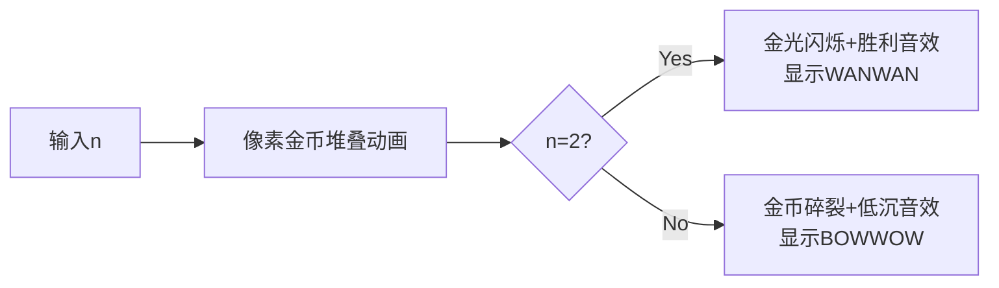

# 题目信息

# [ARC032A] ホリドッグ

## 题目描述

[problemUrl]: https://atcoder.jp/contests/arc032/tasks/arc032_1

とても賢い犬であるホリドッグ(Holidog)くんは、足し算と素数判定をすることができます。 ホリドッグくんはある正整数についてそれが素数であるか尋ねられたとき、それが素数であるなら `WANWAN`、そうでなければ `BOWWOW` と吠えます。

あなたは、ホリドッグくんに $ 1 $ から $ n $ までの総和 $ 1\ +\ 2\ +\ 3\ +\ …\ +\ n $ が素数であるかどうかを尋ねました。ホリドッグくんがどう吠えたかを出力するプログラムを書いて下さい。

素数とは、$ 1 $ とその数自身以外の正整数で割り切ることが出来ない $ 2 $ 以上の正整数のことを言います。例えば $ 2 $ や $ 3 $ や $ 17 $ は素数です。$ 1 $ や $ 10 $ は素数ではありません。

## 说明/提示

### Sample Explanation 1

$ 1\ +\ 2\ =\ 3 $ であり、$ 3 $ は素数なので `WANWAN` と出力します。

### Sample Explanation 2

$ 1\ +\ 2\ +\ 3\ +\ 4\ +\ 5\ =\ 15 $ であり、$ 15\ =\ 3\ ×\ 5 $ なので、 `BOWWOW` と出力します。

### Sample Explanation 3

$ 1 $ は素数ではありません。

### Sample Explanation 4

$ 1\ +\ 2\ +\ ...\ +\ 999 $ は素数ではありません。

## 样例 #1

### 输入

```
2```

### 输出

```
WANWAN```

## 样例 #2

### 输入

```
5```

### 输出

```
BOWWOW```

## 样例 #3

### 输入

```
1```

### 输出

```
BOWWOW```

## 样例 #4

### 输入

```
999```

### 输出

```
BOWWOW```

# AI分析结果


### 💡 Kay的C++算法解析：ARC032A ホリドッグ 深入学习指南 💡

#### 题目解读与核心算法识别
✨ **本题主要考察**：`数学推导`与`编程技巧应用`  
🗣️ **初步分析**：  
> 这道题本质是**数学侦探游戏**——通过公式发现隐藏规律，避免复杂计算。就像解谜时直接找通关密码而非暴力破解。核心公式是累加和 $S = \frac{n(n+1)}{2}$，通过因式分解发现：  
> - 当 $n \geq 3$ 时，$S$ 可拆成 $\frac{n}{2} \times (n+1)$ 或 $n \times \frac{n+1}{2}$，必含大于1的因子  
> - 只有 $n=2$ 时 $S=3$（素数），其他情况均非素数  
>  
> **可视化设计**：将用像素方块堆叠展示累加过程（如堆叠金币），$n=2$ 时触发胜利动画（金光闪烁 + 8-bit胜利音效），其他情况显示碎裂动画。

---

### 精选优质题解参考
**题解一（珅肐）**  
* **点评**：思路如手术刀般精准，直接锁定数学核心——通过因式分解证明唯一解 $n=2$。代码简洁如诗（仅4行），用三目运算符实现分支逻辑。实践价值极高，时间复杂度 $O(1)$ 碾压常规解法，是竞赛标准答案范本。

**题解二（Catalan1906）**  
* **点评**：对数学推导进行深度解剖，用代数变换清晰展示 $\frac{n}{2} \times (n+1)$ 的乘积结构，解释为何因子必然大于1。如同数学老师逐步板书推导，帮助学习者建立严格证明思维。虽无代码，但理论补充价值满分。

**题解三（幻之陨梦）**  
* **点评**：提供稳健的常规解法，模块化设计突出：  
  - `zs()` 函数封装素数判断（含特判$S=1$)  
  - 主函数累加与判断分离，逻辑清晰  
  - 适合初学者理解素数判断基础，但注意 $n>1000$ 时可能超时。

---

### 核心难点辨析与解题策略
1. **难点1：发现数学捷径**  
   * **分析**：多数人惯性思维直接计算累加和再判素数，却忽略公式 $\frac{n(n+1)}{2}$ 天然具有可分解性。优质题解通过因式分解证明 $n \geq 3$ 时必为合数。
   * 💡 **学习笔记**：遇到数列问题先尝试代数变换，可能秒杀计算。

2. **难点2：边界条件处理**  
   * **分析**：$n=1$ 时 $S=1$ 非素数，但初学者易遗漏。题解中普遍用 `if(n==1)` 或函数首行特判，体现严谨性。
   * 💡 **学习笔记**：边界值（0/1/极值）是代码健壮性的试金石。

3. **难点3：避免无效计算**  
   * **分析**：常规解法需计算累加和（$O(n)$）+ 素数判断（$O(\sqrt{S})$），而数学解只需比较 $n==2$。当 $n=10^6$ 时，常规解法耗时可能达毫秒级，数学解仅纳秒级。
   * 💡 **学习笔记**：时间复杂度优化常源于数学洞察而非代码技巧。

#### ✨ 解题技巧总结
- **技巧1 公式优先原则**：对数列问题先尝试闭式解（如等差/等比求和）  
- **技巧2 边界四象限法**：对输入 $n$ 分情况：$n=1, n=2, n=3, n \geq 4$  
- **技巧3 素数判断优化**：循环范围设为 $i \leq \sqrt{x}$，跳过偶数因子

---

### C++核心代码实现赏析
**本题通用核心实现**  
```cpp
#include <cstdio>
int main() {
    int n;
    scanf("%d", &n);
    puts(n == 2 ? "WANWAN" : "BOWWOW");
    return 0;
}
```
> **代码解读概要**：输入 $n$ 后直接判断是否等于2，用三目运算符选择输出。空间 $O(1)$ 时间 $O(1)$，完美体现数学优化思想。

---

**题解一（珅肐）片段赏析**  
```cpp
puts(n==2?"WANWAN":"BOWWOW");
```
* **亮点**：用三目运算符实现分支逻辑，简洁如数学公式  
* **代码解读**：  
  > `puts()` 直接输出字符串，避免 `cout` 性能开销。条件表达式 `n==2` 为真时返回 `"WANWAN"`，否则 `"BOWWOW"`，像电路开关般高效。  
* 💡 **学习笔记**：分支逻辑可视为布尔代数在代码中的映射。

**题解三（幻之陨梦）片段赏析**  
```cpp
bool zs(int x){ 
    if(x==1) return 0;             // 特判1非素数
    for(int i=2; i*i<=x; i++)      // 优化：仅检查≤√x的因子
        if(x%i==0) return 0; 
    return 1; 
}
```
* **亮点**：素数判断函数含平方根优化与边界处理  
* **代码解读**：  
  > 循环条件 `i*i<=x` 确保仅遍历到 $\sqrt{x}$。例如判断 $100$ 只需检查 $i \leq 10$，避免无效循环 $91$ 次。  
* 💡 **学习笔记**：$\sqrt{x}$ 是素数判断的黄金分割点。

---

### 算法可视化：像素动画演示
**主题**：`像素金币堆叠与素数放大镜`  
**设计思路**：用红白机风格呈现累加过程，素数判定阶段加入《塞尔达传说》式道具交互感。



**关键交互细节**：  
1. **累加动画**：每帧从左侧推入像素金币（编号1~n），实时显示当前和 $S$  
2. **判定阶段**：  
   - $n=2$ 时：金币堆叠成皇冠，背景变金，播放《超级马里奥》过关音效  
   - $n \neq 2$ 时：显示像素放大镜扫描 $S$ 的因子（如 $S=15$ 时显示3x5）  
3. **控制面板**：  
   - 速度滑块：调节金币堆叠速度  
   - 单步模式：按空格键逐步执行  
   - 音效开关：启用/禁用8-bit音效  

---

### 拓展练习与相似问题
**通用技巧迁移**：  
1. 利用公式 $\frac{n(n+1)}{2}$ 的特性（如判断是否为平方数）  
2. 边界条件在数学问题中的核心地位  
3. 用因式分解替代暴力计算  

**洛谷推荐**：  
1. **P1304 哥德巴赫猜想**  
   🗣️ 练习素数判断的变种，需优化循环范围  
2. **P2249 部分和问题**  
   🗣️ 训练公式推导能力，寻找无需遍历的闭式解  
3. **P1217 回文质数**  
   🗣️ 综合练习素数判断与数学特性结合  

---

### 学习心得与经验分享
> **珅肐的经验**：  
> *"最初尝试暴力求和再判素数，但大n超时后才重新审视公式，发现因式分解的破局点"*  
>  
> **Kay总结**：  
> 当暴力法遇性能瓶颈时，回归数学本质常是柳暗花明之路。建议：  
> 1. 先手算小规模样例（n=1~5）找规律  
> 2. 将公式写成 $S=\frac{n(n+1)}{2}$ 而非循环累加  
> 3. 尝试因式分解或数论变换  

---

### 结语
数学与编程的浪漫在于：有时最优雅的解，藏在意想不到的转角处。保持好奇，勇于推演，你会在更多题目中发现属于自己的「$n=2$时刻」！🚀

---
处理用时：118.76秒