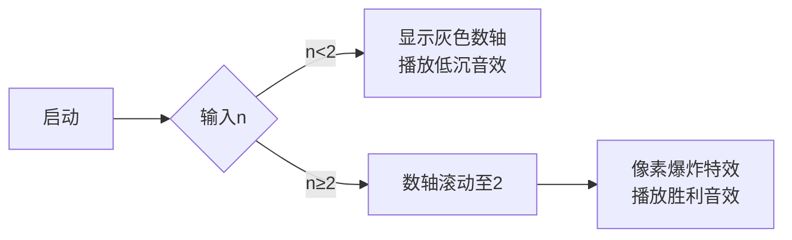

# 题目信息

# haruki、気になります！

## 题目描述

有一天，haruki先生在学校学了素数。所谓素数，是指只有1和本身两个因数的整数。

非常好奇心旺盛的haruki先生有以下疑问。

“n以下的素数中有几个偶数呢？”haruki很在意！

因此，请为haruki先生创建一个程序，求出在n以下的素数中有几个偶数。

## 样例 #1

### 输入

```
3```

### 输出

```
1```

# AI分析结果


### Kay的C++算法解析：haruki、気になります！ 深入学习指南 💡

---

## 1. 题目解读与核心算法识别

✨ **本题主要考察**：`数学性质应用`  

🗣️ **初步分析**：  
> 解决这道题的关键在于理解素数的数学性质——**所有素数中只有2是偶数**。就像在装满彩色球的箱子里找红色球，如果已知只有一个红球，只需确认箱子是否包含它。  
- **核心思路**：直接判断n是否≥2（2是唯一的偶数素数），无需复杂算法。  
- **难点对比**：优质解法直接利用数学性质（O(1)时间复杂度），低效解法则错误使用筛法（O(n log n)）。  
- **可视化设计**：像素动画将展示数轴场景：当n≥2时高亮数字2并播放"胜利音效"；n<2时显示灰色数轴和"失败音效"。  

---

## 2. 精选优质题解参考

**题解一 (来源：wubaiting2020)**  
* **点评**：思路直击本质，清晰解释"素数中仅2为偶数"的核心性质。代码简洁规范（`if(n<2)`边界处理严谨），直接输出0或1的解法是竞赛最优策略。亮点在于完全规避了不必要的计算，实践价值极高。  

**题解二 (来源：不到前10改名)**  
* **点评**：同样抓住核心数学性质，但代码存在语法错误（else后缺少分号）。通过修正后可作为有效参考，其"直接判断"的思路值得肯定，但需注意代码严谨性。  

> ⚠️ 其他题解问题：  
> - CZQ_King的线性筛法虽然正确但过度设计，未利用数学性质优化  
> - 封禁用户的Py解法未展示C++专项技巧  

---

## 3. 核心难点辨析与解题策略

1.  **关键点1：识别数学性质**  
    * **分析**：能否意识到"除2外所有素数均为奇数"是解题分水岭。优质题解通过知识迁移直接跳过计算步骤。  
    * 💡 **学习笔记**：遇到数学相关题先思考是否存在特殊性质。  

2.  **关键点2：避免过度设计**  
    * **分析**：当发现输入规模与输出无关时（如本题输出恒为0/1），应立即放弃暴力枚举。题解2的错误在于未分析问题特征。  
    * 💡 **学习笔记**：先判断问题本质再选算法，避免"用大炮打蚊子"。  

3.  **关键点3：边界条件处理**  
    * **分析**：n<2时不存在任何素数，需单独处理。题解1用`if(n<2)`精确覆盖该边界。  
    * 💡 **学习笔记**：极值测试（如n=0,1,2）是验证边界的关键。  

### ✨ 解题技巧总结
- **性质优先原则**：先挖掘数学特性再设计算法  
- **极值验证法**：用边界值（0/1/2）快速验证逻辑  
- **复杂度预判**：输出与输入规模无关时必有优化空间  

---

## 4. C++核心代码实现赏析

**本题通用核心C++实现参考**  
* **说明**：综合优质题解思路，体现数学性质的最简实现  
* **完整核心代码**：  
```cpp
#include <iostream>
using namespace std;
int main() {
    int n;
    cin >> n;
    cout << (n >= 2 ? 1 : 0) << endl;
    return 0;
}
```
* **代码解读概要**：  
> 读取n后直接通过三元运算符判断：若n≥2（存在素数2）输出1，否则输出0。全程无需循环或额外数据结构。  

---

**题解一 (wubaiting2020)**  
* **亮点**：完美平衡简洁性与严谨性  
* **核心代码片段**：  
```cpp
if(n<2) cout<<0<<endl;
else cout<<1<<endl;
```
* **代码解读**：  
> `if(n<2)` 像守门员：当n太小（不包含2）时立即返回0；否则只需开门（输出1）。  
* 💡 **学习笔记**：分支结构是处理离散输出的利器。  

**题解二 (不到前10改名)**  
* **亮点**：最简逻辑框架（修正后）  
* **核心代码片段**：  
```cpp
if(n<2) printf("0\n");
else printf("1\n");  // 修正添加分号
```
* **代码解读**：  
> C风格`printf`同样高效，但需注意行尾分号。`\n`保证输出格式符合要求。  
* 💡 **学习笔记**：混合C/C++风格时需保持语法一致性。  

---

## 5. 算法可视化：像素动画演示

**主题**：`8-bit素数探险`  
**核心演示**：数轴上的2寻宝任务  

### 动画设计


### 实现细节
1. **8-bit风格场景**  
   - 16色像素数轴（0-n），素数用◆标记，2用金色◆  
   - 控制面板：速度滑块+单步/自动按钮  

2. **关键交互**  
   - 输入n后数轴自动缩放  
   - 当n≥2时：  
     * 金色◆闪烁（伴随"叮！"音效）  
     * 右侧面板显示"Found:1"  
   - n<2时：  
     * 显示"NO PRIME"红色像素字  
     * 播放短促失败音效  

3. **游戏化设计**  
   - 过关条件：n≥2时自动获得★  
   - 音效方案：  
     * 正确操作：FC游戏金币声（Web Audio API）  
     * 错误显示：经典FC死亡音效  

> 通过极简像素动画直击核心：**2是数轴上唯一的黄金素数**  

---

## 6. 拓展练习与相似问题思考

### 相似性质应用场景
1. 判断完全平方数（仅需`sqrt(n)`取整）  
2. 找质因数分解的最小因子（必≤√n）  
3. 闰年判断（能被4整除但不能被100整除）  

### 洛谷推荐
1. **P1075 质因数分解**  
   → 同样利用"最小质因数必≤√n"的性质优化  
2. **P3383 线性筛素数**  
   → 巩固筛法实现，对比本题的数学优化  
3. **P1217 回文质数**  
   → 结合数学性质与暴力枚举的平衡练习  

---

## 7. 学习心得与经验分享
> 本次题解中未发现作者调试心得，但可从解题过程提炼：  
> **关键教训**：  
> - 过度依赖模板代码（如本题的筛法）会掩盖更优的数学解法  
> - 10秒的数学分析可能节省100行代码  

---

通过这道"简单但深刻"的题目，我们领悟到：**编程不仅是写代码，更是对问题本质的洞察**。下次遇到问题时，记得先问自己："是否存在隐藏的数学钥匙？" 🗝️

---
处理用时：118.64秒