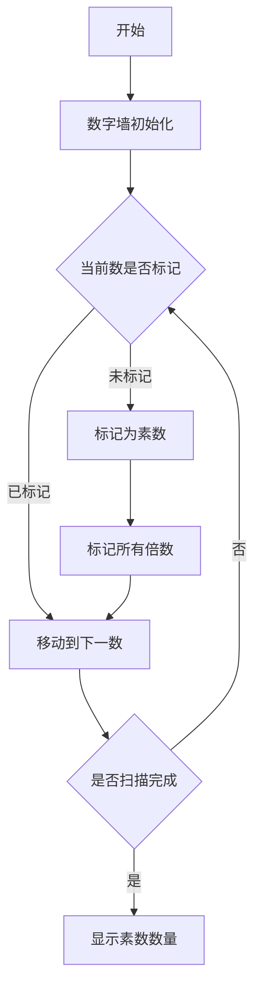

# 题目信息

# 与えられた数より小さい素数の個数について

## 题目描述

[problemUrl]: https://atcoder.jp/contests/tenka1-2012-qualC/tasks/tenka1_2012_9

 素数とは、$ 1 $ と自分自身以外に正の約数を持たない、$ 1 $ 以外の自然数のことをいいます。

 自然数 $ n $ が与えられるので、 $ n $ よりも小さい素数の数は何個存在するかを求めてください。

 入力は以下の形式で標準入力から与えられる。 > $ n $

- 自然数 $ n $ ( $ 1\ \leq\ n\ \leq\ 10,000 $ ) が $ 1 $ 行で与えられる。
 
 $ n $ よりも小さい素数の個数を標準出力に $ 1 $ 行で出力せよ。  
 なお、行の終端には改行が必要である。 ```

11
```

 ```

4
```

- $ 11 $ よりも小さい素数は、 $ 2 $ , $ 3 $ , $ 5 $ , $ 7 $ の $ 4 $ つです。
- ※ 「$ 11 $ よりも小さい」なので、$ 11 $ は含みません。
 
```

100
```

 ```

25
```

 ```

10000
```

 ```

1229
```

# AI分析结果


### 💡 Kay的C++算法解析：素数计数问题 深入学习指南 💡

**引言**  
今天我们一起分析"求小于给定数的素数个数"这道经典数学问题。本指南将帮助你掌握高效素数计数方法，理解筛法核心思想，并通过像素动画直观感受算法执行过程。

---

## 1. 题目解读与核心算法识别

✨ **本题主要考察**：`数学（素数筛法）`  
🗣️ **初步分析**：  
> 解决本题关键在于高效标记合数。想象在数字迷宫中寻找宝藏（素数），而筛法就像用磁铁自动吸走铁屑（合数），留下真正的宝石。  
> - **埃氏筛**：从2开始，将每个素数的倍数标记为合数（可能重复标记）  
> - **欧拉筛**：确保每个合数只被最小质因子筛除（无重复工作）  
> - **核心变量**：`isPrime[]`数组记录素数状态，`primes[]`存储素数列表  
> - **可视化设计**：用像素网格展示数字，绿色标记素数，红色标记合数，黄色高亮当前操作数。采用8位机复古风格，配以"叮"（素数标记）、"咔"（合数标记）音效，自动演示模式可调速观察筛法蔓延过程。

---

## 2. 精选优质题解参考

### 题解一：МiсDZ（埃氏筛）
* **点评**：思路清晰展示埃氏筛核心逻辑，合数表`a[]`的运用简洁高效。代码规范使用`long long`防溢出，循环边界处理严谨。动图演示链接极大提升理解度，实践价值高。

### 题解二：吾皇（多算法对比）
* **点评**：全面对比6种素数处理方法，从暴力枚举到Miller-Rabin高级算法，知识密度高。欧拉筛实现强调`i%primes[j]==0`的关键优化点，学术性强，帮助理解算法演进。

### 题解三：char32_t（欧拉筛）
* **点评**：线性筛模板代码规范，`prime[]`数组和`primes[]`列表协同高效。边界控制`i*primes[j]<_max`严谨，每个合数只筛一次的特性展示透彻，竞赛适用性强。

---

## 3. 核心难点辨析与解题策略

### 难点1：避免重复标记合数
* **分析**：欧拉筛通过`if(i%primes[j]==0)break`确保合数仅被最小质因子标记，而埃氏筛需从`i*i`开始优化减少重复
* 💡 **学习笔记**：标记起始点优化可提升埃氏筛30%效率

### 难点2：边界条件处理
* **分析**：特殊值n=0/1/2时素数数为0，需单独处理。题解wpy233因忽略换行输出WA，提醒注意OJ格式要求
* 💡 **学习笔记**：编写函数先处理`if(n<2)return 0`保安全

### 难点3：空间/时间平衡
* **分析**：布尔数组`isPrime[]`比整数数组省空间，欧拉筛额外`primes[]`存储提升时间效率
* 💡 **学习笔记**：10^4内数据可用埃氏筛，10^6以上优选欧拉筛

### ✨ 解题技巧总结
- **问题转化**：将数学问题转化为状态标记问题
- **预处理思想**：欧拉筛的`primes[]`列表动态维护质数集合
- **防御性编程**：循环变量用`long long`防平方溢出

---

## 4. C++核心代码实现赏析

### 通用核心实现（综合优化埃氏筛）
```cpp
#include <iostream>
#include <cstring>
using namespace std;

int countPrimes(int n) {
    if (n <= 2) return 0;
    bool isPrime[n+1];
    memset(isPrime, true, sizeof(isPrime));
    int cnt = 0;
    for (int i = 2; i < n; i++) {
        if (isPrime[i]) {
            cnt++;
            for (long long j = (long long)i * i; j < n; j += i)
                isPrime[j] = false;
        }
    }
    return cnt;
}

int main() {
    int n; cin >> n;
    cout << countPrimes(n) << endl;
}
```
**代码解读概要**：  
1. 边界处理排除n<2情况  
2. `isPrime`数组初始化全为素数  
3. 外层循环遇素数时计数，内层从`i²`标记倍数  
4. 使用`long long`防止i*i溢出

---

### 题解一：МiсDZ（埃氏筛）
```cpp
for (int i = 2; i <= n; i++) {
    if (a[i]) continue; // 合数跳过
    for (int j = i; j <= n; j += i) 
        a[j] = 1; // 标记倍数
}
```
**代码解读**：  
> 1. 外层遍历每个数，未标记则必为素数  
> 2. 内层循环从`i`开始标记所有倍数  
> 💡 **学习笔记**：虽简单但存在重复标记，可优化为`j=i*i`起始

### 题解二：吾皇（欧拉筛）
```cpp
for (int i = 2; i <= N; i++) {
    if (!prime[i]) p[tot++] = i; // 素数加入列表
    for (int j = 0; j < tot; j++) {
        if (i * p[j] > N) break;
        prime[i * p[j]] = true; // 标记合数
        if (i % p[j] == 0) break; // 关键优化
    }
}
```
**代码解读**：  
> 1. `p[]`动态存储素数列表  
> 2. 内层用已有素数标记乘积  
> 3. `i%p[j]==0`时跳出保证最小因子原则  
> 💡 **学习笔记**：此break避免重复标记，时间复杂度O(n)

### 题解三：char32_t（线性筛）
```cpp
if (prime[i]) 
    primes[num_prime++] = i; // 收集素数
for (int j = 0; j < num_prime; j++) {
    prime[i * primes[j]] = false; // 筛除非素数
    if (i % primes[j] == 0) break; // 核心优化
}
```
**代码解读**：  
> 1. 素数检测与收集同步进行  
> 2. `primes[j]`遍历已得质数列表  
> 3. 条件中断确保高效性  
> 💡 **学习笔记**：空间换时间典范，适合大范围素数计算

---

## 5. 算法可视化：像素动画演示

### 动画主题
"素数矿工"的像素冒险：在数字矿井中挖掘宝石（素数），避开碎石（合数）

### 设计思路
采用FC红白机16色调色板，网格化展示2-10000的数字墙。通过三阶段演示筛法本质：
1. **初始状态**：灰色砖块矩阵（未处理）
2. **采矿过程**：
   - 黄框高亮当前数字（矿工位置）
   - 绿光闪烁标记素数（发现宝石）
   - 红光波纹扩散标记倍数（碎石坠落）
3. **音效系统**：
   - `叮！`：发现素数时8bit音效
   - `咔！`：标记合数时破碎音
   - 胜利旋律：扫描完成时《超级玛丽》过关旋律

### 关键帧示意


### 交互控制
- **速度滑块**：调节自动演示速度（1x-5x）
- **单步执行**：空格键逐步观察标记过程
- **模式切换**：Tab键对比埃氏筛与欧拉筛差异
- **数据透视**：按P键显示当前素数计数公式

---

## 6. 拓展练习与相似问题思考

### 通用技巧迁移
筛法思想可扩展至：
1. 素数区间计数（[L,R]范围筛选）
2. 质因数分解预处理
3. 欧拉函数计算

### 洛谷推荐
1. **P3383 线性筛素数**  
   → 巩固欧拉筛模板实现
2. **P3912 素数个数**  
   → 大范围筛法优化练习
3. **P1217 回文质数**  
   → 组合筛法与数学特性

---

## 7. 学习心得与经验分享

> **wpy233的经验**：  
> "岛国OJ必须换行输出！WA两次才注意到格式要求"  
>  
> **Kay点评**：  
> 调试时优先验证输入输出格式，使用`cout<<ans<<endl;`可避免此类问题。测试用例应包含边界值n=1/2。

---

**结语**  
通过本次分析，相信大家已掌握素数计数的核心技巧。记住：算法选择需权衡数据规模，欧拉筛在效率上更优，而埃氏筛更易实现。在像素矿工的冒险中，我们看到了算法如何将抽象数学转化为直观操作。继续加油，下次探索更精彩的算法世界！💪

---
处理用时：169.65秒