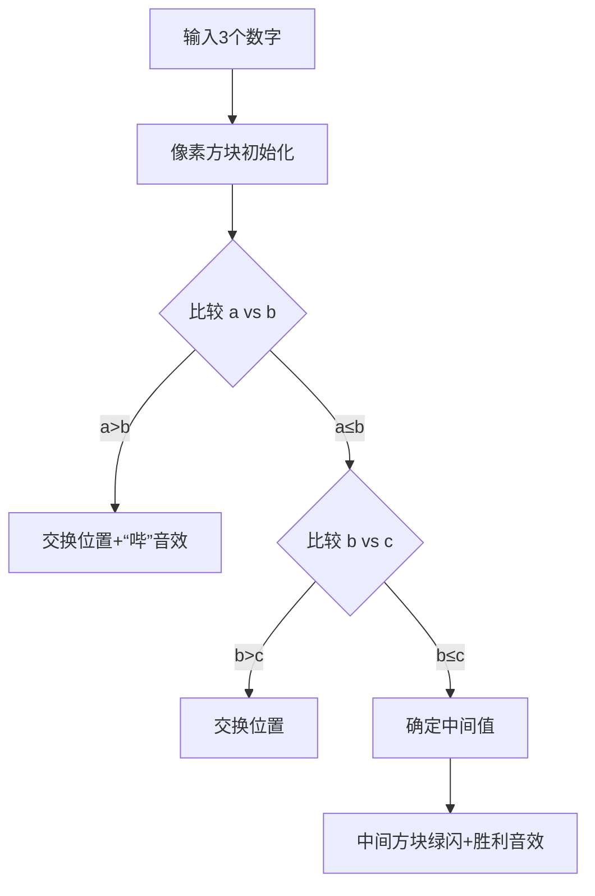

# 题目信息

# [ABC019A] 高橋くんと年齢

## 题目描述

高桥君忘记了自己的年龄。

他成功地找来了 3 个朋友，于是决定用这 3 个人预测的高桥君年龄的中位数，来代替高桥君的年龄。

请你代替高桥君，编写一个程序，从 3 个整数 $a,\ b,\ c$ 中求出中位数。

3 个整数的中位数是指将它们按从小到大排序后，处于中间位置的那个整数。

## 说明/提示

### 样例解释 1

$2,\ 3,\ 4$ 的中位数是 $3$。

### 样例解释 2

$5,\ 100,\ 5$ 的中位数是 $5$。

由 ChatGPT 4.1 翻译

## 样例 #1

### 输入

```
2 3 4```

### 输出

```
3```

## 样例 #2

### 输入

```
5 100 5```

### 输出

```
5```

## 样例 #3

### 输入

```
3 3 3```

### 输出

```
3```

## 样例 #4

### 输入

```
3 3 4```

### 输出

```
3```

# AI分析结果


### 💡 Kay的C++算法解析：ABC019A 高橋くんと年齢 深入学习指南 💡

**<introduction>**  
今天我们分析一道基础但重要的题目：如何从三个数字中快速找到中位数。这道题能帮助我们理解排序算法的核心思想及其灵活应用。

---

## 1. 题目解读与核心算法识别

✨ **本题主要考察**：`排序应用` + `编程技巧`  

🗣️ **初步分析**：  
> 寻找三个数的中位数就像让三个身高不同的同学排队——只需让他们按身高站好，中间那位就是我们要找的人。核心技巧是**局部排序**：不需要完整排序所有元素，只需确保中间位置是正确的值。  
> - **题解思路对比**：  
>   - 直接排序（`std::sort`）最直观  
>   - 部分排序（`std::partial_sort`）更高效  
>   - 优先队列适合动态数据流  
> - **可视化设计**：  
>   用像素方块表示数字，展示比较/交换过程。高亮关键操作：  
>   - 比较时方块闪烁黄色  
>   - 交换时方块移动并播放"哔"音效  
>   - 最终结果方块绿色闪烁+胜利音效  

---

## 2. 精选优质题解参考

**题解一（作者：Elairin176）**  
* **点评**：  
  最简洁直接的解法！用`std::sort`全排序后取`a[1]`，逻辑清晰如"排队取中间"。代码规范（数组命名合理），适合初学者理解排序的本质。竞赛中首选方案。  

**题解二（作者：「已注销」）**  
* **点评**：  
  亮点在**算法优化**！用`std::partial_sort`仅排序前两个元素（时间复杂度O(3log2)），比全排序更高效。代码中`a+2`精准定位需排序的边界，展示STL的高级用法。  

**题解三（作者：LJC00111）**  
* **点评**：  
  实用性强但需注意细节。用`sort(a+1,a+4)`从下标1开始排序，输出`a[2]`。提醒我们**数组下标一致性**的重要性——若从1开始存储，必须同步调整逻辑。  

---

## 3. 核心难点辨析与解题策略

1. **关键点：理解中位数本质**  
   * **分析**：中位数=有序序列中间值。优质解都先排序再取中间索引，避免复杂判断。  
   * 💡 **学习笔记**：排序是简化问题的钥匙！  

2. **关键点：选择排序策略**  
   * **分析**：  
     - 少量元素：`sort`或冒泡即可（如_newbie_解法）  
     - 需优化：`partial_sort`减少操作次数  
     - 动态数据：优先队列（Tomone解法）  
   * 💡 **学习笔记**：根据数据特性选择工具！  

3. **关键点：边界处理**  
   * **分析**：数组下标从0或1开始会改变索引计算（对比Elairin176和LJC00111）。必须保持输入/排序/输出下标一致。  
   * 💡 **学习笔记**：编程时明确索引基准！  

### ✨ 解题技巧总结  
- **技巧1：STL优先法则** → 优先用`std::sort`/`std::partial_sort`  
- **技巧2：防御性编程** → 验证边界值（如全相同数字）  
- **技巧3：空间换直观** → 用数组而非分散变量  

---

## 4. C++核心代码实现赏析

**通用核心实现**  
```cpp
#include <iostream>
#include <algorithm>
using namespace std;

int main() {
    int a[3];
    cin >> a[0] >> a[1] >> a[2];  // 输入
    sort(a, a + 3);               // 全排序
    cout << a[1];                 // 输出中位数
    return 0;
}
```
* **说明**：最简明的基准解法，完整覆盖题目需求  

---

**题解一：std::sort（Elairin176）**  
* **亮点**：极致简洁，5行核心逻辑  
* **核心代码**：  
  ```cpp
  sort(a, a + 3);
  cout << a[1];
  ```
* **代码解读**：  
  > `sort(a, a+3)`将数组升序排列→此时`a[1]`必为中间值。**为何不用判断？** 因为排序后位置已确定！  

---

**题解二：std::partial_sort（「已注销」）**  
* **亮点**：精准定位局部排序  
* **核心代码**：  
  ```cpp
  std::partial_sort(a, a + 2, a + 3);
  std::cout << a[1];
  ```
* **代码解读**：  
  > `partial_sort(a, a+2, a+3)`意为：**仅排序前2小的数**（确保a[0]和a[1]有序）。此时a[1]已是全局第二小→即中位数！  

---

**题解三：下标偏移（LJC00111）**  
* **亮点**：展示不同存储方式  
* **核心代码**：  
  ```cpp
  sort(a + 1, a + 4);
  cout << a[2];
  ```
* **代码解读**：  
  > 数组从`a[1]`开始存储，因此：  
  > - 排序范围：`a+1`到`a+4`（3个元素）  
  > - 中位数索引：`a[2]`（中间位置）  
  > **警惕**：若输入用`a[0]`将导致错误！  

---

## 5. 算法可视化：像素动画演示  

**主题**：`像素数字擂台赛`（复古拳击风格）  
**核心流程**：  


**动画关键帧**：  
1. **初始化**：三个像素方块（红/蓝/黄）显示数字，下方标注下标  
2. **比较阶段**：  
   - 比较两个方块时，它们边框闪烁黄光 + "滴"声  
   - 若需交换：方块沿抛物线轨迹交换位置 + "哔"声  
3. **结果阶段**：  
   - 中间方块放大震动 + 绿色高亮  
   - 播放8-bit胜利音乐（如《超级玛丽》过关）  

**交互设计**：  
- 控制面板：单步执行/自动播放（速度滑块）  
- 教学模式：点击方块显示当前值（如"a[0]=5"）  
- 错误演示：故意乱序时播放失败音效  

---

## 6. 拓展练习与相似问题思考  

**技巧迁移场景**：  
1. 求Top K问题（如10个数中找第3大的数）  
2. 滑动窗口中位数（LeetCode Hard变种）  
3. 数据流实时中位数（优先队列应用）  

**洛谷推荐**：  
1. **P1177 【模板】快速排序**  
   → 巩固`sort`底层原理  
2. **P1923 【深基9.例4】求第 k 小的数**  
   → 进阶版局部排序应用  
3. **P1059 明明的随机数**  
   → 排序+去重综合训练  

---

## 7. 学习心得与经验分享  
> 本次题解中未发现明确的作者个人心得分享部分，但通过代码可总结：  
> **调试经验**：测试全等值（如3,3,3）能快速验证边界逻辑！  

**<conclusion>**  
通过这道题，我们掌握了排序的核心思想——将问题转化为有序序列。记住：**"排好队，取中间"** 是解决中位数问题的黄金法则！下次见！💪

---
处理用时：134.12秒