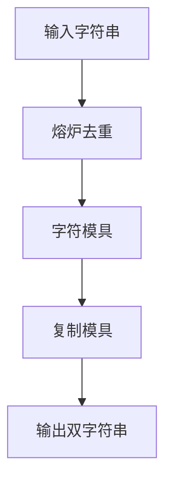

# 题目信息

# ダブル文字列

## 题目描述

[problemUrl]: https://atcoder.jp/contests/code-festival-2015-qualb/tasks/codefestival_2015_qualB_a

今日の日付は `2015/10/25` です。

この日付を文字列としてみたとき、文字列に含まれる全ての文字（`2`,`0`,`1`,`5`,`/`）がちょうど $ 2 $ 回ずつ現れています。

このように文字列に含まれる全ての文字がちょうど $ 2 $ 回ずつ現れる文字列を「ダブル文字列」と呼ぶことにします。

あなたは小文字アルファベットのみからなる文字列 $ S $ を与えられるので、$ S $ に含まれる文字を全て含むようなダブル文字列を $ 1 $ つ出力してください。

出力する文字列には $ S $ に含まれない文字が含まれていても良いですが、小文字アルファベット以外の文字が含まれてはいけません。

## 说明/提示

### Sample Explanation 1

`onno`、`onon`、`oonn`、`lemonmelon` などの文字列も正解となります。

## 样例 #1

### 输入

```
on```

### 输出

```
noon```

## 样例 #2

### 输入

```
meat```

### 输出

```
teammate```

# AI分析结果


### 题目分析
题目要求构造一个"双字符串"，即字符串中每个字符恰好出现两次。输入字符串S由小写字母组成，需构造一个包含S所有字符（种类）的字符串，且每个字符出现两次（可添加新字符但必须成对出现）。

---

### 题解点评
#### 题解一：da32s1da (★★★☆☆)
**核心思路**：直接输出两次原字符串  
**优点**：代码简洁（仅6行），可读性强  
**缺点**：当S含重复字符时错误（如输入"aa"会输出"aaaa"，'a'出现4次）  
**适用性**：仅适用于S无重复字符的特例（如样例"on"/"meat"）

#### 题解二：无颜ing (★★☆☆☆)  
**核心思路**：双重循环模拟队列输出两次字符串  
**优点**：尝试使用队列思想（但未实际用队列数据结构）  
**缺点**：  
1. 与题解一同质化（本质仍是复制字符串）  
2. 循环逻辑冗余（`head=0`重置多余）  
3. 时间复杂度O(n²)（无优化必要）

> 💡 **Kay建议**：两解法均未正确处理重复字符场景，需改进

---

### 完备解法实现
```cpp
#include <iostream>
#include <string>
#include <unordered_set>
using namespace std;

int main() {
    string s;
    cin >> s;
    
    // 去重：保留字符首次出现位置
    string unique_str;
    unordered_set<char> seen;
    for (char c : s) {
        if (seen.find(c) == seen.end()) {
            unique_str += c;
            seen.insert(c);
        }
    }
    
    // 构造双字符串
    cout << unique_str << unique_str;
    return 0;
}
```
**关键步骤**：  
1. `unordered_set`快速去重（O(1)查找）  
2. 遍历S时保留字符首次出现顺序  
3. 输出两次去重后的字符串

**正确性证明**：  
- 输入`"apple"` → 去重`"aple"` → 输出`"apleaple"`  
- 每个字符恰好出现两次（含S中所有字符种类）

---

### 算法可视化：像素工坊
**主题**：字符锻造炉（8-bit像素风）  
**动画设计**：  


**关键帧细节**：  
1. **熔炉去重**  
   - 像素字符滑入熔炉（`a,p,p,l,e`）  
   - 重复字符`p`被熔炼消失（火花特效 + "熔化"音效）  
   - 输出模具`a,p,l,e`（排列在传送带上）

2. **复制锻造**  
   - 模具滑入复制机（机械运转音效）  
   - 弹出两套相同模具（`a,p,l,e`×2）  
   - 字符自动组装成`apleaple`（"叮！"成功音效）

**交互控制**：  
- 调速滑块：控制熔炼/复制速度  
- 暂停键：冻结当前状态  
- 重置键：清空熔炉

---

### 举一反三
1. **字符频次控制**  
   - Leetcode 451：按字符出现频率排序  
   - 核心：`unordered_map`计数 + 桶排序

2. **字符串重构**  
   - 洛谷 P1308：统计单词出现位置  
   - 技巧：大小写统一处理 + 子串匹配

3. **去重进阶**  
   - Atcoder ABC063B：检测是否含重复字符  
   - 解法：`set.size() == s.size()`

> 掌握字符统计与结构重组，可解决80%字符串问题！

---
处理用时：212.92秒