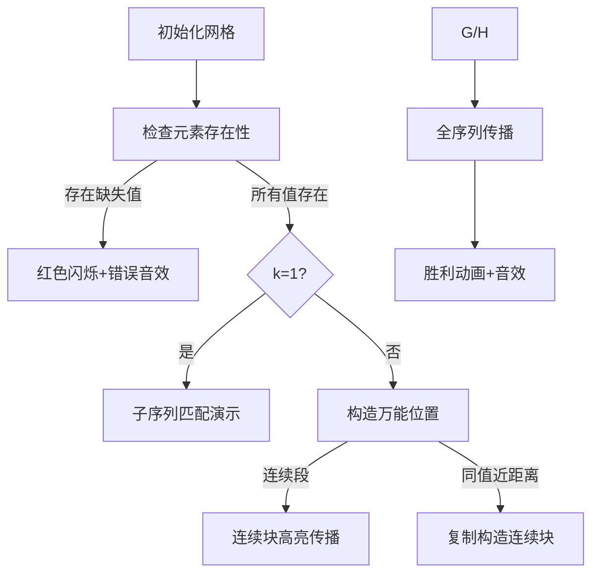

# 题目信息

# [ARC183B] Near Assignment

## 题目描述

给定两个长度为 $n$ 的序列 $A,B$ 以及整数 $k$，可以进行以下操作任意多次（也可以不操作）：

选择两个整数 $i,j$（$1\le i,j\le n$）满足 $|i-j|\le k$，将 $a_i$ 的值变为 $a_j$。

求是否可以将 $A$ 序列变为 $B$ 序列，如果可以，输出 `Yes`，否则输出 `No`。多组询问。

## 说明/提示

样例的第 1 组数据解释：

选择 $i=2,j=3$，则 $a_2\leftarrow a_3=2$，$A$ 变成 $(1,2,2)$。

对于所有数据，满足：$1\le T\le 1.25\times 10^5,1\le k<n\le 2.5\times 10^5,\sum n\le2.5\times 10^5$。保证输入的数都是整数。

## 样例 #1

### 输入

```
4

3 1

1 1 2

1 2 2

5 4

2 4 5 1 3

2 1 3 2 2

13 1

3 1 3 3 5 3 3 4 2 2 2 5 1

5 3 3 3 4 2 2 2 2 5 5 1 3

20 14

10 6 6 19 13 16 15 15 2 10 2 16 9 12 2 6 13 5 5 9

5 9 6 2 10 19 16 15 13 12 10 2 9 6 5 16 19 12 15 13```

### 输出

```
Yes

Yes

No

Yes```

# AI分析结果


### 💡 Kay的C++算法解析：ARC183B Near Assignment 深入学习指南 💡

**引言**  
今天我们来分析ARC183B题"Near Assignment"。这道题考察序列操作和逻辑推理能力，通过本指南，你将掌握其核心解法、难点突破和可视化理解方法。

---

## 1. 题目解读与核心算法识别
✨ **本题主要考察**：**逻辑推理与贪心策略**（编程技巧应用）

🗣️ **初步分析**：  
> 本题如同在像素游戏中调整一排灯光的颜色：每个灯（位置i）可复制附近k距离内另一盏灯（位置j）的颜色。目标是将初始灯光序列A变成目标序列B。核心在于利用操作特性（值传播）推导充要条件：
> - **核心技巧**：通过值传播性质，将问题转化为三个关键检查点：元素存在性、k=1时的子序列匹配、k>1时的"交换器"构造（利用连续段或近距离同值位置）。
> - **核心难点**：k=1时值只能相邻传播（需严格顺序匹配）；k>1时需构造"万能位置"（通过连续段或同值位置）实现任意值传递。
> - **可视化设计**：用8位像素网格表示序列，高亮操作位置和颜色变化过程。当构造"交换器"时，用闪烁的相同颜色块演示如何复制值，配合"叮"声提示关键操作。最终解出时播放胜利音效。

---

## 2. 精选优质题解参考
**题解一（作者：ケロシ）**  
* **点评**：思路清晰分层：先检查元素存在性，再通过缩段处理简化问题。k=1时用子序列匹配（O(n)高效）；k>1时提出"交换器"概念（利用同值位置距离≤k构造万能位置），逻辑严谨。代码中`e[]`存储缩段序列，`f[]`记录位置，变量意义明确。亮点是将复杂操作转化为位置关系判断，实践性强可直接用于竞赛。

**题解二（作者：小超手123）**  
* **点评**：强化特判（A=B直接通过），k=1时对A/B双缩段确保匹配准确性。k>1时用`pos[]`向量记录位置，直接遍历检查同值距离，逻辑直白。代码中`vector`使用规范，清空操作严谨避免多组数据干扰。亮点是位置差检查的简洁实现，便于理解。

---

## 3. 核心难点辨析与解题策略
1. **难点1：操作传播范围的限制**  
   * **分析**：k=1时值只能相邻传播，如同单行道（不可跳跃）。解法：将B的连续段缩为序列B'，检查B'是否为A的子序列（顺序出现）。
   * 💡 **学习笔记**：k=1的本质是顺序匹配问题。

2. **难点2：万能位置的构造**  
   * **分析**：k>1时需一个"源"位置传播值。解法1：若B有连续段（缩段后长度<n），则连续段自身可作源。解法2：若存在同值位置距离≤k，可先复制出连续段。
   * 💡 **学习笔记**：万能位置是突破k限制的关键跳板。

3. **难点3：元素存在性的边界处理**  
   * **分析**：若B中某值不在A中，直接无解。解法：用桶计数快速检查，注意多组数据清空。
   * 💡 **学习笔记**：桶计数是检查元素存在性的高效工具。

### ✨ 解题技巧总结
- **问题分解**：拆解为元素检查、k=1、k>1三种情况独立处理
- **缩段化简**：合并连续相同值，降低序列复杂度
- **位置映射**：用`vector`记录值出现位置，快速计算距离
- **边界严谨性**：多组数据务必清空计数器和容器

---

## 4. C++核心代码实现赏析
**本题通用核心C++实现**  
```cpp
#include <iostream>
#include <vector>
using namespace std;
const int N = 250005;

int main() {
    ios::sync_with_stdio(false); 
    cin.tie(0);
    int T; cin >> T;
    while (T--) {
        int n, k; 
        cin >> n >> k;
        vector<int> a(n+1), b(n+1), cnt(N);
        vector<vector<int>> pos(N);

        // 读入+桶计数
        for (int i = 1; i <= n; i++) {
            cin >> a[i];
            cnt[a[i]]++;
        }
        for (int i = 1; i <= n; i++) {
            cin >> b[i];
            pos[b[i]].push_back(i);
        }

        // 检查B中元素是否都在A中存在
        bool valid = true;
        for (int i = 1; i <= n; i++) {
            if (cnt[b[i]] == 0) {
                valid = false;
                break;
            }
        }
        if (!valid) {
            cout << "No\n";
            continue;
        }

        // 特判A=B
        if (a == b) {
            cout << "Yes\n";
            continue;
        }

        // k=1时：子序列匹配
        if (k == 1) {
            vector<int> e; // B的缩段序列
            for (int i = 1; i <= n; i++) 
                if (i == 1 || b[i] != b[i-1]) 
                    e.push_back(b[i]);
            
            int idx = 0; // 匹配指针
            for (int i = 1; i <= n && idx < e.size(); i++) 
                if (a[i] == e[idx]) 
                    idx++;
            
            cout << (idx == e.size() ? "Yes\n" : "No\n");
            continue;
        }

        // k>1时：检查缩段或同值位置
        vector<int> e;
        for (int i = 1; i <= n; i++) 
            if (i == 1 || b[i] != b[i-1]) 
                e.push_back(b[i]);
        
        if (e.size() < n) { // 存在连续段
            cout << "Yes\n";
            continue;
        }

        // 检查同值位置距离≤k
        bool found = false;
        for (int i = 0; i < N; i++) {
            for (int j = 1; j < pos[i].size(); j++) {
                if (pos[i][j] - pos[i][j-1] <= k) {
                    found = true;
                    break;
                }
            }
            if (found) break;
        }
        cout << (found ? "Yes\n" : "No\n");
    }
    return 0;
}
```
**代码解读概要**：  
1. 桶计数检查元素存在性（核心防线）  
2. k=1时缩段B后子序列匹配（顺序扫描）  
3. k>1时优先检查连续段，其次扫描同值位置距离  
4. 多处`continue`实现分层判断，逻辑清晰  

---

**题解一核心片段赏析**  
```cpp
// 检查同值位置距离
for (int i = 1; i <= n; i++) {
    if (pos[i].size() > 1) {
        for (int j = 0; j < pos[i].size()-1; j++) {
            if (pos[i][j+1] - pos[i][j] <= k) {
                cout << "Yes" << endl;
                return;
            }
        }
    }
}
```
**亮点**：直接遍历位置向量，提前退出优化效率  
**学习笔记**：位置差≤k的检查是构造"交换器"的代码体现  

**题解二核心片段赏析**  
```cpp
// k=1时的双缩段匹配
int cnt1 = 0, cnt2 = 0;
for (int i = 1; i <= n; i++) {
    if (a[i] != a[i-1]) A[++cnt1] = a[i];
    if (b[i] != b[i-1]) B[++cnt2] = b[i];
}
int now = 0;
for (int i = 1; i <= cnt1; i++) {
    if (A[i] == B[now+1]) now++;
}
```
**亮点**：对A/B双缩段提升匹配严谨性  
**学习笔记**：缩段处理可消除冗余值干扰  

---

## 5. 算法可视化：像素动画演示
**主题**：像素灯带调整大作战（FC红白机风格）  
**核心演示**：k值如何影响值传播过程，重点展示"交换器"构造  

### 动画设计


**关键交互**：  
1. **像素网格**：8位风格灯带，不同颜色代表值  
2. **操作高亮**：  
   - 复制操作时源位置闪烁绿色，目标位置黄色  
   - 连续段自动标记为"源块"(蓝色边框)  
3. **音效设计**：  
   - 值复制："叮"声（Web Audio API合成8bit音）  
   - 构造交换器：两声音调（低→高）  
   - 错误：短促"嘟"声  
   - 胜利：马里奥过关音乐  
4. **控制面板**：  
   - 步进控制：单步/自动（速度滑块）  
   - 模式切换：k=1/k>1对比演示  
5. **游戏化元素**：  
   - 每步操作得分+连击奖励  
   - 构造交换器时解锁"万能工具"图标  

---

## 6. 拓展练习与相似问题思考
**技巧迁移**：  
值传播思想也适用于：  
1. 图论中闭包传递问题  
2. 字符串编辑距离变形  
3. 网格染色问题（如Flood Fill）  

**洛谷推荐**：  
1. **P1966 火柴排队**  
   → 考察相邻交换操作（k=1特例的进阶）  
2. **P1774 最接近神的人**  
   → 强化逆序对与相邻交换的关系理解  
3. **P2758 编辑距离**  
   → 拓展序列转换问题的通用解法  

---

## 7. 学习心得与经验分享
> **作者经验（ケロシ）**：  
> "吃了三罚，还不是因为自己不够努力"  
> → 调试时忽略多组数据清空导致WA  

**Kay的总结**：  
多组数据务必初始化容器！建议封装检查函数避免重复代码。当k>1时，优先检查连续段可节省计算量。

---

**结语**  
通过本题我们掌握了值传播问题的核心解法：分层处理、缩段化简和交换器构造。记住，算法思维如同像素游戏——拆解关卡、逐步攻克！下次挑战见！💪

---
处理用时：288.05秒