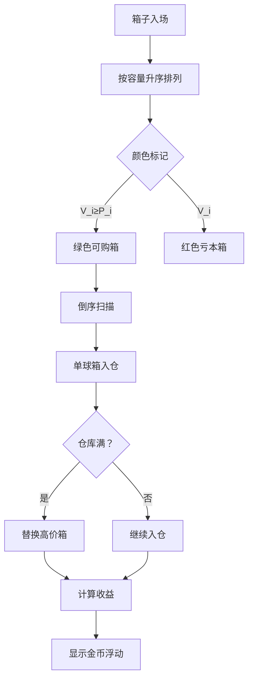

# 题目信息

# [ARC186C] Ball and Box

## 题目描述

球橋和箱木进行一个用球和箱子的游戏。

一开始，球橋有 $M$ 种不同的球，每种球各有 $10^{100}$ 个，箱木有 $10^{100}$ 日元。同时有 $N$ 个箱子，第 $i$ 个箱子的容量为 $V_i$，价格为 $P_i$ 日元。在游戏过程中，箱木可以随时购买任意箱子。

游戏过程中，以下操作会不断重复，直到游戏结束：

1. 球橋选择一种球，递给箱木。
2. 箱木可以选择接收这个球，或者拒绝接收并结束游戏。
3. 如果箱木接收了球，他需要从已购买的箱子中选择一个，将球放入该箱子。
4. 若放入球后的箱子满足以下条件，箱木获得 $1$ 日元，否则游戏结束：
   - 箱子中的球的数量不超过该箱子的容量。
   - 箱子中的所有球都是同一种类型。

球橋会采取使箱木最终所持金钱尽可能少的最优策略，反之，箱木会采取使自己最终所持金钱尽可能多的最优策略。请问，整个游戏过程中，箱木的所持金钱最多能增加多少？

注意，双方都能看到所有信息。特别地，球橋可以看到每个箱子的容量和价格，以及每个箱子里装了多少、哪种球。并且，箱木的初始资金足够多，不会因为钱不够而无法购买箱子。

对于每个输入文件，需要解答 $T$ 个测试用例。

## 说明/提示

### 数据范围

- $1 \leq T, N, M \leq 3 \times 10^5$
- $1 \leq V_i, P_i \leq 10^9$
- 所有测试用例的 $N$ 之和不超过 $3 \times 10^5$
- 所有输入均为整数

### 样例解释 1

第一个测试用例有 $2$ 种球和 $3$ 个箱子。我们把两种球分别叫做白球和黑球，把第 $i$ 个箱子叫做箱 $i$。以下是箱木最终所持金钱增加 $2$ 日元的一个游戏过程示例：

1. 球橋选择白球递给箱木。
2. 箱木接收球，并以 $1$ 日元购买箱 $2$，将白球放入。
   - 箱 $2$ 里有 $1$ 个白球，满足条件，箱木获得 $1$ 日元。
3. 球橋选择白球递给箱木。
4. 箱木接收球，将白球放入箱 $2$。
   - 箱 $2$ 里有 $2$ 个白球，满足条件，箱木获得 $1$ 日元。
5. 球橋选择黑球递给箱木。
6. 箱木接收球，并以 $1$ 日元购买箱 $3$，将黑球放入。
   - 箱 $3$ 里有 $1$ 个黑球，满足条件，箱木获得 $1$ 日元。
7. 球橋选择白球递给箱木。
8. 箱木接收球，将白球放入箱 $2$。
   - 箱 $2$ 里有 $3$ 个白球，满足条件，箱木获得 $1$ 日元。
9. 球橋选择白球递给箱木。
10. 箱木选择不接收，游戏结束。

最终，箱 $2$ 里有 $3$ 个白球，箱 $3$ 里有 $1$ 个黑球。箱木总共花了 $2$ 日元，获得了 $4$ 日元，因此所持金钱增加了 $2$ 日元。

第二个测试用例中，球橋可以采取让箱木无法赚钱的策略。

由 ChatGPT 4.1 翻译

## 样例 #1

### 输入

```
3
3 2
1 1000000000
3 1
3 1
1 300000
1000000000 1
10 4
22 5
26 45
72 21
47 39
97 2
75 35
82 24
17 46
32 22
28 67```

### 输出

```
2
0
28```

# AI分析结果


### 💡 Kay的C++算法解析：[ARC186C] Ball and Box 深入学习指南 💡

#### 1. 题目解读与核心算法识别
✨ **本题主要考察**：`贪心策略 + 排序优化`  
🗣️ **初步分析**：  
> 这道题是经典的**零和博弈问题**，就像两个玩家在下棋：球橋（Mr.Ball）希望最小化箱木（Mr.Box）的收益，而箱木则要最大化收益。核心思路是将箱子分为两类：  
> - **装满箱**：被同种球填满的箱子（收益 = 容量 - 价格）  
> - **单球箱**：只放一个球的箱子（收益 = 1 - 价格）  
>  
> **关键策略**：  
> 1. 箱子按容量升序排序，确保装满箱容量 ≤ 单球箱  
> 2. 枚举分界点，用堆维护最小价格和  
> 3. 通过后缀和快速计算收益  
>  
> **可视化设计**：  
> 采用像素风仓库管理游戏：箱子显示为像素方块（绿色=可购买，红色=亏本），堆用像素仓库动画展示。单步执行时高亮当前分界点，堆更新时播放"叮"音效，收益更新时显示金币浮动动画。

---

#### 2. 精选优质题解参考
**题解一：Claire0918 (赞2)**  
* **点评**：思路清晰直击要害，升序排序+前缀和的设计巧妙规避了复杂讨论。代码中`priority_queue`维护最小价格和堪称亮点，边界处理严谨（特别是m=1的特判）。变量名`pre/sum`含义明确，整体实现简洁高效，可直接用于竞赛。

**题解二：冷却心 (赞2)**  
* **点评**：采用降序排序+后缀和的对称思路，同样用堆维护价格。代码中`res = max(res, pre[i-1] - sum)`的收益计算式浓缩了核心逻辑，后缀和计算与堆操作分离提升可读性，实践参考价值高。

**题解三：chaeminter2467 (赞1)**  
* **点评**：创新使用动态开点线段树维护价格，虽然代码较长但展示了更通用的值域处理方法。亮点在于严格处理n<m边界情况，`qry()`函数设计体现模块化思维，适合学习者拓展数据结构知识。

---

### 3. 核心难点辨析与解题策略
1. **难点1：博弈策略转化**  
   * **分析**：需理解"装满箱必须在前，单球箱必须在后"的容量约束。优质题解通过排序将策略转化为可计算的数学模型。
   * 💡 **学习笔记**：博弈问题常转化为数学优化问题

2. **难点2：收益计算优化**  
   * **分析**：收益 = 前缀装满收益 + 单球箱收益 + 后缀额外收益。Claire0918用`pre[]`数组+堆实现O(n log n)优化。
   * 💡 **学习笔记**：分离计算关注点是优化关键

3. **难点3：边界条件处理**  
   * **分析**：m=1时无单球箱，需完全不同的计算逻辑。冷却心的`if(m==1) res=max(res,pre[n])`展示典型处理方式。
   * 💡 **学习笔记**：特判是竞赛编程的必备技能

### ✨ 解题技巧总结
- **双指针+堆**：枚举分界点时用堆维护极值
- **预处理加速**：前缀/后缀和避免重复计算
- **早判负收益**：先过滤V_i<P_i的箱子
- **模块化测试**：单独验证m=1等边界情况

---

### 4. C++核心代码实现赏析
**本题通用核心实现**  
```cpp
#include <bits/stdc++.h>
using namespace std;
typedef long long ll;
const int N=3e5+5;

struct Box { int v, p; };
ll pre[N]; // 前缀收益

int main() {
    int T; cin >> T;
    while(T--) {
        int n, m; cin >> n >> m;
        vector<Box> a(n+1);
        for(int i=1; i<=n; i++) 
            cin >> a[i].v >> a[i].p;

        sort(a.begin()+1, a.end(), [](Box x, Box y){
            return x.v < y.v; // 按容量升序
        });

        // 计算前缀收益（装满箱）
        for(int i=1; i<=n; i++)
            pre[i] = pre[i-1] + max(0, a[i].v - a[i].p);

        priority_queue<int> q; // 大根堆维护最小价格
        ll sum = 0, res = 0;
        for(int i=n; i>=1; i--) { // 倒序枚举分界点
            if(q.size() < m-1) { // 维护m-1个单球箱
                q.push(a[i].p);
                sum += a[i].p - 1;
            }
            else if(q.size() && q.top() > a[i].p) {
                sum -= q.top() - 1; // 替换高价箱
                q.pop();
                q.push(a[i].p);
                sum += a[i].p - 1;
            }
            if(q.size() == m-1) // 关键：收益=前缀收益-单球箱成本
                res = max(res, pre[i-1] - sum);
        }
        if(m == 1) res = max(res, pre[n]); // 特判
        cout << max(0LL, res) << endl;
    }
    return 0;
}
```

**题解一：Claire0918片段**  
```cpp
for(int i=n; i; i--) {
    if(q.size() < m-1) { 
        q.push(a[i].second); 
        sum += a[i].second - 1;
    }
    else if(!q.empty() && q.top() > a[i].second) {
        sum -= q.top() - 1; 
        q.pop();
        q.push(a[i].second);
        sum += a[i].second - 1;
    }
    if(q.size() == m-1) {
        res = max(res, pre[i-1] - sum);
    }
}
```
> **亮点**：倒序枚举分界点+大根堆巧维护  
> **解读**：  
> - 从最大容量箱开始扫描（第3行）
> - 堆中始终保持最小的m-1个价格（第4-14行）
> - `pre[i-1] - sum` 浓缩收益计算精髓：  
>   `前缀装满收益 - (Σ单球箱价格 - (m-1))`
> 💡 **学习笔记**：大根堆维护小值技巧

---

### 5. 算法可视化：像素动画演示
**主题**：像素仓库大作战（8-bit风格）  
**核心演示**：箱子分类与收益计算过程  



**动画设计**：  
1. **像素元素**：  
   - 箱子：绿色(可购)/红色(亏本)像素方块，显示V/P值  
   - 仓库：8-bit风格货架存放单球箱  
   - 金币：收益更新时浮动显示+金币音效  

2. **关键交互**：  
   - 步进控制：空格键单步执行分界点移动  
   - 堆操作：箱子入仓时播放"叮"，替换时播放"咔"  
   - 收益提示：当前计算式显示在像素仪表盘  

3. **游戏化设计**：  
   - 每完成一个分界点计算解锁新关卡  
   - 最终收益≥0时仓库放烟花  
   - 背景音乐：FC风格循环BGM  

---

### 6. 拓展练习
1. **洛谷 P1880 [NOI1995]石子合并**  
   → 同属最优策略问题，练习区间DP  
2. **洛谷 P1048 采药**  
   → 背包问题中的价值最大化  
3. **洛谷 P1219 八皇后**  
   → 回溯算法中的状态优化  

---

### 7. 学习心得
> **Claire0918经验**：  
> *"倒序枚举才能自然满足容量约束，正序需要额外判断"*  
> **Kay总结**：排序方向的选择直接影响算法实现难度，本题倒序扫描可自动保证装满箱容量≤单球箱，减少边界判断。

通过本次分析，我们深入掌握了博弈问题的转化技巧和堆的灵活应用。记住：将策略转化为数学模型是解题的关键突破口！

---
处理用时：158.83秒