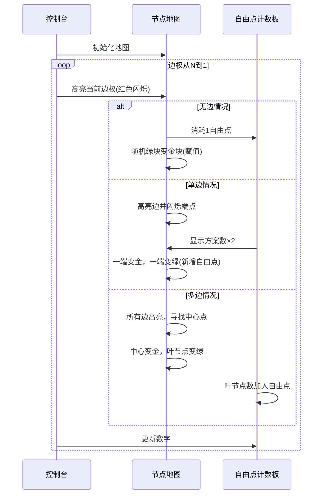

# 题目信息

# [ARC176C] Max Permutation

## 题目描述

在 $ (1,2,\dots,N) $ 的所有排列 $ P=(P_1,P_2,\dots,P_N) $ 中，满足以下所有条件的排列个数，输出其对 $ 998244353 $ 取模的结果。

- 对于每个 $ 1\le i\le M $，都有 $ \max(P_{A_i},P_{B_i})=C_i $。

## 说明/提示

## 限制条件

- $ 2\le N\le 2\times 10^5 $
- $ 1\le M\le 2\times 10^5 $
- $ 1\le A_i < B_i \le N $
- $ 1\le C_i \le N $
- 若 $ i\neq j $，则 $ (A_i,B_i)\neq (A_j,B_j) $

## 样例解释 1

满足条件的 $ P $ 有 $ (4,1,2,3) $ 和 $ (4,2,1,3) $，共 $ 2 $ 个。

由 ChatGPT 4.1 翻译

## 样例 #1

### 输入

```
4 2

1 2 4

2 3 2```

### 输出

```
2```

## 样例 #2

### 输入

```
6 3

1 4 3

2 5 6

3 4 2```

### 输出

```
8```

## 样例 #3

### 输入

```
20 17

9 16 13

5 14 20

15 20 14

5 13 17

18 20 14

14 20 20

6 13 11

12 16 19

2 15 10

6 17 11

7 18 7

8 18 12

8 16 13

6 16 13

2 18 10

9 10 15

7 14 20```

### 输出

```
1209600```

# AI分析结果


### 💡 Kay的C++算法解析：ARC176C Max Permutation 深入学习指南 💡

#### 1. 题目解读与核心算法识别
✨ **本题主要考察**：图论建模与约束处理 + 贪心计数策略

🗣️ **初步分析**：
> 解决本题的核心在于将排列约束转化为图论问题——每个约束条件 $\max(P_{A_i}, P_{B_i}) = C_i$ 可视为连接节点 $A_i$ 和 $B_i$ 的边，边权为 $C_i$。解题策略如同建造一座"约束之城"：我们需要给每个节点（城市）分配唯一的海拔值（排列数值），使得每条道路（边）的海拔要求（边权）被严格满足。  
> - **核心思路**：按边权**从大到小**处理约束，动态维护"自由点"（未赋值且无限制的节点），分三种情况：
>   1. **无边**：消耗自由点填充当前权值
>   2. **单边**：两端点需满足"至少一个等于当前权值"
>   3. **多边**：必须形成"菊花图"（所有边共享中心节点）
> - **可视化设计**：采用8位像素风格，节点显示为彩色方块（金色=已赋值，绿色=自由点，灰色=待处理）。处理边权时高亮对应边（红色闪烁），自由点数量动态显示在顶部。菊花图形成时中心点闪烁金光，播放"叮"音效。

---

#### 2. 精选优质题解参考
**题解一：vegetable_king (赞13)**  
* **点评**：思路清晰直击要害，从大到小处理边权的贪心策略极具启发性。代码简洁高效（$O(n+m)$），变量名`ans`、`cnt`含义明确，边界处理严谨（如菊花图中心验证）。亮点在于用"自由点"动态维护未处理节点，模拟过程直观易懂，可直接用于竞赛。

**题解二：Register_int (赞12)**  
* **点评**：创新性提出"节点上界预处理+链式计数"的双阶段解法。代码结构规范（结构体存边），通过度数分析提前确定部分节点值，显著缩小问题规模。亮点在于将复杂图简化为孤立点/两点链，计数部分用排序维护可用位置，虽复杂度稍高（$O(m \log m)$），但鲁棒性强。

**题解三：sunqihuan (赞4)**  
* **点评**：教学价值突出，用"自由点即生命值"的比喻降低理解门槛。代码实现简洁，关键步骤注释详细，特别适合初学者。亮点在于强调hack数据测试（菊花图中心的小边权冲突），体现实践调试的重要性。

---

#### 3. 核心难点辨析与解题策略
1. **难点一：动态维护约束状态**  
   * **分析**：当处理边权 $x$ 时，需同时考虑：1) 已确定的节点值 2) 未确定节点的上界 3) 自由点数量。优质题解通过"边权降序处理"（避免后续约束干扰）和"实时更新度数"解决。
   * 💡 **学习笔记**：贪心顺序决定了解题效率——大边权优先处理可固定关键节点。

2. **难点二：多条边共存时的合法性判断**  
   * **分析**：当同一权值的边 $≥2$ 条时，必须存在公共中心节点形成菊花图（如右图）。非菊花结构（如环状）必然矛盾。
   ```mermaid
   graph TD
     A[中心节点] --> B(节点1)
     A --> C(节点2)
     A --> D(节点3)
   ```
   * 💡 **学习笔记**：菊花图本质是树形特例——中心节点承担当前权值，叶节点获得上界约束。

3. **难点三：自由点的时空传递**  
   * **分析**：自由点在不同边权处理阶段会相互转化：
     - 单边两端自由 → 方案数$×2$，自由点$+1$（新增未赋值点）
     - 菊花图处理 → 中心固定，叶节点可能转为自由点
   * 💡 **学习笔记**：自由点如同"解题货币"，消耗/获取需精确记账。

### ✨ 解题技巧总结
- **降维拆解**：将排列约束转化为图论模型，边权排序实现维度压缩
- **状态标记法**：用`d[]`数组实时记录节点度数，`vis[]`标记已赋值节点
- **边界防御**：特判边权=1无解；菊花图中心的小边权冲突检测
- **动态维护**：自由点`cnt`和方案数`ans`同步更新，乘法原理贯穿始终

---

#### 4. C++核心代码实现赏析
**本题通用核心实现（综合优质题解）**  
```cpp
#include <bits/stdc++.h>
using namespace std;
const int mod = 998244353;
const int N = 2e5 + 5;

int n, m, deg[N], ans = 1, freeNodes;
vector<pair<int, int>> edgesByWeight[N]; // edgesByWeight[w]: edges with weight w

int main() {
    cin >> n >> m;
    for (int i = 1; i <= m; i++) {
        int u, v, w;
        cin >> u >> v >> w;
        edgesByWeight[w].push_back({u, v});
        deg[u]++; deg[v]++; // 初始化节点度数
    }
    freeNodes = count(deg + 1, deg + n + 1, 0); // 初始自由点统计

    // 从大到小枚举边权
    for (int w = N - 1; w >= 1; w--) {
        auto& edges = edgesByWeight[w];
        if (edges.empty()) { // 情况1：无边
            if (!freeNodes) return cout << 0, 0;
            ans = 1LL * ans * freeNodes-- % mod;
        } 
        else if (edges.size() == 1) { // 情况2：单边
            auto [u, v] = edges[0];
            if (--deg[u] > 0 && --deg[v] > 0) // 两端仍有其他约束
                return cout << 0, 0;
            if (!deg[u] && !deg[v]) { // 两端均自由
                ans = 2LL * ans % mod;
                freeNodes++; // 未赋值点转为自由点
            }
        } 
        else { // 情况3：多边（需菊花图）
            int center = -1;
            for (int i = 0; i < min(2, (int)edges.size()); i++) // 前两条边找公共点
                for (int node : {edges[i].first, edges[i].second})
                    if (center == -1 || node == center) 
                        center = node;
            for (auto [u, v] : edges) // 验证菊花图
                if (u != center && v != center) 
                    return cout << 0, 0;
            for (auto [u, v] : edges) {
                if (u == center) swap(u, v); // u设为非中心点
                if (--deg[u] == 0) freeNodes++; // 叶节点转自由点
            }
            deg[center] = 0; // 中心已赋值
        }
    }
    cout << ans;
}
```
**代码解读概要**：  
> 1. **图存储**：`edgesByWeight[w]`按权值归档边，避免排序  
> 2. **自由度管理**：`freeNodes`动态计数未处理节点  
> 3. **菊花图验证**：通过前两条边快速定位中心，全图验证确保合法性  
> 4. **无解处理**：度数异常或中心验证失败时立即返回0  

**分题解亮点解析**：  
1. **vegetable_king**：菊花图中心检测  
   ```cpp
   // 前两条边交叉比对找公共点
   int u1 = edges[0].first, v1 = edges[0].second;
   int u2 = edges[1].first, v2 = edges[1].second;
   if (u1 == u2 || u1 == v2) center = u1;
   else if (v1 == u2 || v1 == v2) center = v1;
   ```
   > **学习笔记**：利用边的局部特性快速定位中心，避免全图扫描

2. **Register_int**：节点上界预处理  
   ```cpp
   for (auto &neighbors : graph) {
       sort(neighbors.begin(), neighbors.end()); // 邻接边排序
       if (neighbors[0].w == neighbors[1].w) 
           fixedValue[node] = neighbors[0].w; // 重复边权直接确定节点值
   }
   ```
   > **学习笔记**：重复边权是确定节点值的"黄金信号"

3. **sunqihuan**：自由点转化  
   ```cpp
   if (!deg[u] && !deg[v]) { // 单边两端自由时
       ans = (ans * 2) % mod; // 两种选择方案
       freeNodes++; // 未选中的点转为新自由点
   }
   ```
   > **学习笔记**：自由点具有"分裂繁殖"特性，单边处理可能增加库存

---

#### 5. 算法可视化：像素动画演示
**主题**：8位像素风《约束之城建造者》  
**核心演示**：边权从大到小处理时的动态约束传播  

**动画设计**：  


**交互控制**：  
- **核心面板**：开始/暂停、单步执行、速度滑块  
- **音效方案**：  
  - 关键操作：像素"滴"声（比较/赋值）  
  - 自由点变化：金币掉落声  
  - 菊花图形成：胜利号角声  
- **游戏化设计**：  
  - 每成功处理一个边权+100分  
  - 自由点>10时触发"资源过剩"特效  
  - 无解时屏幕抖动+警报音  

---

#### 6. 拓展练习与相似问题思考
**技巧迁移场景**：  
1. 带约束的排列计数（如某些位置必须大于邻位）  
2. 图论约束下的最值分配问题  
3. 菊花图结构在中心化网络中的应用  

**洛谷推荐题目**：  
1. **P2894 [USACO08FEB] Hotel G**  
   🗣️ 练习区间约束处理，强化自由点维护技巧  
2. **P5021 [NOIP2018 提高组] 赛道修建**  
   🗣️ 深入理解菊花图在树形结构中的应用  
3. **P3975 [TJOI2015] 弦论**  
   🗣️ 拓展排列计数思维，结合字典序约束  

---

#### 7. 学习心得与经验分享
> **vegetable_king 的调试经验**：  
> *"菊花图中心的小边权冲突是隐藏陷阱，必须显式检查 center 节点的其他边权"*  
>   
> **Kay点评**：  
> 调试时应重点关注**多重约束节点**——如同交通枢纽，需检验所有进出"道路"的海拔要求是否兼容。建议用邻接表存储时额外记录`minEdgeWeight`，提前排除冲突。

通过本次分析，我们深入理解了约束满足问题的图论转化和贪心计数技巧。记住：**大边权是灯塔，自由点是船帆，菊花图是港湾**——掌握这三要素，你就能在算法的海洋中稳健航行！🚢💨

---
处理用时：229.66秒