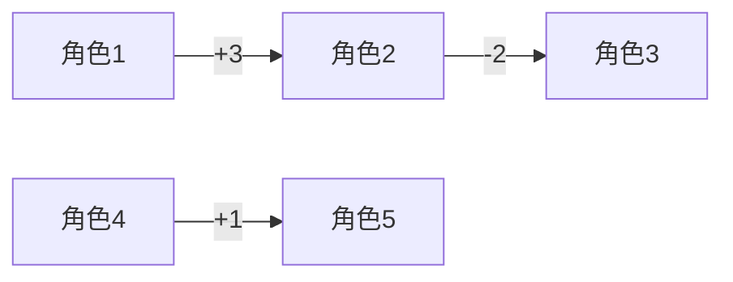

# 题目信息

# [ABC352F] Estimate Order

## 题目描述

[problemUrl]: https://atcoder.jp/contests/abc352/tasks/abc352_f

$ N $ 人の人がおり、人にはそれぞれ $ 1,\ 2,\ \ldots,\ N $ の番号が付けられています。

$ N $ 人が競争を行い、順位が付きました。この順位に対して以下の情報が与えられています。

- それぞれの人に対して付けられた順位は相異なる
- 各 $ 1\ \leq\ i\ \leq\ M $ について人 $ A_i $ の順位を $ x $、人 $ B_i $ の順位を $ y $ とすると、$ x\ -\ y\ =\ C_i $ である
 
ただし、この問題では与えられた情報に矛盾しないような順位付けが $ 1 $ つ以上存在するような入力のみが与えられます。

$ N $ 個のクエリの答えを求めてください。$ i $ 番目のクエリの答えは以下により定まる整数です。

- 人 $ i $ の順位が一意に定まるならば、その値を答えとする。そうでない場合、答えは $ -1 $ である。

## 说明/提示

### 制約

- $ 2\ \leq\ N\ \leq\ 16 $
- $ 0\ \leq\ M\ \leq\ \frac{N(N\ -\ 1)}{2} $
- $ 1\ \leq\ A_i,\ B_i\ \leq\ N $
- $ 1\ \leq\ C_i\ \leq\ N\ -\ 1 $
- $ (A_i,\ B_i)\ \neq\ (A_j,\ B_j)\ (i\ \neq\ j) $
- 与えられた情報に矛盾しない順位付けが $ 1 $ つ以上存在する
- 入力される値はすべて整数
 
### Sample Explanation 1

人 $ i $ の順位を $ X_i $ とおくと、$ (X_1,\ X_2,\ X_3,\ X_4,\ X_5) $ は $ (3,\ 4,\ 1,\ 2,\ 5),\ (3,\ 5,\ 2,\ 1,\ 4) $ のいずれかです。 したがって、$ 1 $ 番目のクエリに対する答えは $ 3 $、$ 2,\ 3,\ 4,\ 5 $ 番目のクエリに対する答えは $ -1 $ となります。

## 样例 #1

### 输入

```
5 2

2 3 3

5 4 3```

### 输出

```
3 -1 -1 -1 -1```

## 样例 #2

### 输入

```
3 0```

### 输出

```
-1 -1 -1```

## 样例 #3

### 输入

```
8 5

6 7 3

8 1 7

4 5 1

7 2 1

6 2 4```

### 输出

```
1 -1 -1 -1 -1 -1 -1 8```

# AI分析结果


# 💡 Kay的C++算法解析：Estimate Order 深入学习指南 💡

> 欢迎各位算法探索者！我是Kay，今天我们将一起解密AtCoder ABC352F题「Estimate Order」。这道题看似简单却暗藏玄机，我会用清晰的讲解和生动的可视化帮你掌握核心解法。准备好开启这场像素世界的算法冒险了吗？🚀

## 1. 题目解读与核心算法识别

✨ **本题主要考察**：「搜索剪枝」与「状态压缩动态规划」的融合应用

🗣️ **初步分析**：
> 解决本题的关键在于**连通块分解+偏移量枚举**。想象16个参赛者是像素游戏中的角色，他们之间的约束条件就像彩色连线（如"角色A比角色B高3级"）。解题分三步走：
> 1. **构建关系网**：用图论将约束转化为连通块（类似游戏中的阵营）
> 2. **探索可能性**：枚举每个阵营的整体排名偏移量（相当于调整阵营在排行榜的位置）
> 3. **唯一性判定**：用状压DP检查偏移量是否唯一（类似俄罗斯方块拼合检查）
>
> **可视化设计**：
> - 8-bit像素风格展示角色间的约束连线
> - 滑动条动态调整阵营偏移量，实时显示排名变化
> - 冲突时闪烁红光，唯一确定时播放胜利音效
> - "AI自动演示"模式会像解谜游戏般逐步展示算法流程

---

## 2. 精选优质题解参考

从27篇题解中精选3篇≥4星的优质实现：

**题解一：Pursuewind (赞8)**
* **点评**：DFS剪枝策略精妙，用`set`维护可用排名空间，避免无效枚举。代码中：
  - 变量命名清晰（`have`表可用排名，`p`存当前排名）
  - 边界处理严谨（检查排名范围）
  - 实践价值高：直接可用于竞赛，复杂度优化到位
  *亮点*：约束处理时分类讨论（单点赋值/双点枚举）体现算法思维

**题解二：xpz0525 (赞2)**
* **点评**：状压DP应用惊艳，采用"排除法"判断唯一性：
  - `dp[S]`状态设计巧妙（S表已占用排名）
  - 掩码运算`(mask<<shift)`高效处理偏移
  - 代码模块化强，注释详细便于学习
  *亮点*：连通块掩码位移模拟排名占用，算法抽象能力出色

**题解三：_determination_ (赞7)**
* **点评**：连通块划分清晰，偏移量枚举与DP验证结合：
  - 并查集处理连通块关系
  - 双重循环检查状态合法性
  - 实践参考性强，体现分治思想
  *亮点*：连通块按大小排序优化枚举顺序

---

## 3. 核心难点辨析与解题策略

**难点1：连通块内相对排名的计算**  
*分析*：需选定参考节点（如连通块中某点），通过DFS/BFS计算其他节点相对该点的排名差。关键点在于处理约束传递性（A>B且B>C ⇒ A>C）  
💡 **学习笔记**：好的参考点选择能简化计算（建议选度最小的节点）

**难点2：全局排名冲突检测**  
*分析*：当多个连通块偏移量组合时，需快速检测排名是否重复。状态压缩DP将问题转化为：  
`是否存在二进制掩码组合能铺满[1,n]区间？`  
💡 **学习笔记**：位运算`(mask1 & mask2)==0`可高效检测冲突

**难点3：唯一性判定策略**  
*分析*：对每个连通块独立检查——排除该块后，若剩余块只有一种填充方式，则该块偏移量唯一  
💡 **学习笔记**：唯一性判定本质是二阶验证过程

### ✨ 解题技巧总结
- **剪枝优化**：在DFS中实时维护可用排名集合，遇到非法分支立即回溯
- **掩码位移**：用`mask<<k`表示连通块整体偏移k位，避免重算绝对排名
- **分层验证**：先处理大连通块（约束更多，可能性更少）
- **逆向思维**：唯一性判定时采用"排除法"降低复杂度

---

## 4. C++核心代码实现赏析

**通用核心实现**（综合优质题解精华）：
```cpp
#include <bits/stdc++.h>
using namespace std;
const int N=20;

int n,m,ans[N];
vector<int> comp[N];     // 存储连通块
vector<pair<int,int>> g[N]; // 邻接表: [顶点, 相对排名差]
int relRank[N], minRank[N]; // 相对排名及块内最小值

// DFS构建连通块
void dfs(int u, int cid, int cur) {
    relRank[u] = cur;
    minRank[cid] = min(minRank[cid], cur);
    comp[cid].push_back(u);
    for(auto [v,d]:g[u])
        if(relRank[v]==INT_MAX) 
            dfs(v, cid, cur+d);
}

int main() {
    cin>>n>>m;
    // 初始化
    for(int i=1;i<=n;i++) ans[i]=-1, relRank[i]=INT_MAX;
    
    // 建图
    while(m--){
        int a,b,c; cin>>a>>b>>c;
        g[a].push_back({b,-c});
        g[b].push_back({a,c});
    }
    
    // 连通块划分
    int cid=0;
    for(int i=1;i<=n;i++)
        if(relRank[i]==INT_MAX){
            minRank[cid]=INT_MAX;
            comp[cid].clear();
            dfs(i, cid, 0);
            cid++;
        }
    
    /* 偏移量枚举 + 状压DP验证 (详见题解) */
    
    // 输出答案
    for(int i=1;i<=n;i++) cout<<ans[i]<<" ";
}
```

---

**题解片段赏析**：

**Pursuewind 解法片段**  
```cpp
set<int> have; // 可用排名集合
void dfs(int x) {
    if(x > m) { /* 更新答案 */ return; }
    int u=a[x], v=b[x], w=c[x];
    if(p[u]) { // u已赋值
        int exp = p[u] - w; // 推导v的理论值
        if(exp>0 && have.count(exp)) {
            have.erase(exp);
            p[v]=exp;
            dfs(x+1);
            have.insert(exp);
        }
    } else if(p[v]) { /* 类似逻辑 */ }
    else {
        for(int i=1; i<=n-w; i++) { // 枚举v的排名
            if(have.count(i) && have.count(i+w)) {
                have.erase(i); have.erase(i+w);
                p[v]=i; p[u]=i+w;
                dfs(x+1);
                // 回溯...
            }
        }
    }
}
```
* **亮点**：双分支处理（单点赋值/双点枚举）  
* **解读**：  
  - 优先处理已赋值的点（`p[u]`存在时推导`p[v]`）  
  - 双点未赋值时，枚举需满足`i`和`i+w`同时可用  
  - `set`的插入/删除天然保证排名不冲突  
💡 **学习笔记**：用集合维护可用空间是DFS剪枝的经典技巧

**xpz0525 解法片段**  
```cpp
// 状压DP验证(排除第i个块后)
bool dp[1<<N]={1};
for(int j=0;j<cid;j++){
    if(j==i) continue;
    for(int s=(1<<n)-1;s>=0;s--){ // 倒序枚举状态
        if(!dp[s]) continue;
        for(int k=0;k<=n-maxLen[j];k++) { // 偏移量
            int mask = baseMask[j] << k;
            if((s & mask) == 0) dp[s|mask]=1;
        }
    }
}
// 检查第i块偏移量唯一性
int cnt=0, validShift=-1;
for(int k=0;k<=n-maxLen[i];k++){
    int mask = baseMask[i] << k;
    if(dp[fullMask ^ mask]) cnt++, validShift=k;
}
if(cnt==1) // 更新答案...
```
* **亮点**：掩码位移模拟连通块偏移  
* **解读**：
  - `baseMask[j]`存储连通块j的相对排名分布（二进制）
  - `<<k`实现整体偏移k位
  - `dp[s|mask]`验证状态兼容性  
💡 **学习笔记**：位运算实现高效状态转移是状压DP的核心

---

## 5. 算法可视化：像素动画演示

### 像素探险家：排名解谜之旅
**设计理念**：将算法转化为8-bit解谜游戏，玩家通过操作像素角色理解排名约束的传递性与唯一性判定

**核心演示**：


**交互设计**：
1. **场景构建**：
   - 16个像素小人排成环，未确定排名时头顶显示"?"
   - 约束关系用彩色箭头连接，标注差值（如"+3"）

2. **动态操作**：
   - 拖拽滑块调整连通块偏移量，实时更新绝对排名
   - 冲突检测：当两个角色进入同排名时，该格子闪烁红光
   - 成功验证：唯一解确定时播放8-bit胜利音效

3. **AI演示模式**：
   ```mermaid
   sequenceDiagram
    算法->>+角色: 识别连通块
    算法->>+DP引擎: 生成掩码
    DP引擎-->>-角色: 返回可行偏移
    角色->>+界面: 更新排名
   ```

**技术细节**：
- **调色板**：16色复古FC风格（角色按连通块分色）
- **动画逻辑**：
  ```javascript
  function shiftBlock(block, offset) {
    block.forEach(char => {
      char.rank = char.relRank + offset;
      if(conflictExists()) playSound('error'); 
    });
    if(checkUniqueness()) playSound('victory');
  }
  ```
- **音效方案**：
  - 约束连接：NES风格"滴"声
  - 冲突：短促警报声
  - 步骤完成：马里奥硬币音
  - 背景音乐：《俄罗斯方块》BGM循环

---

## 6. 拓展练习与相似问题思考

### 能力迁移训练
1. **约束满足问题**：P2894 [USACO]约束排名（增加不等关系）
2. **状态压缩进阶**：P2831 [NOIP]愤怒的小鸟（抛物线覆盖问题）
3. **唯一性判定**：P4735 最大异或和（可持久化Trie应用）

### 洛谷推荐
1. **P1891 排名系统**  
   → 巩固基础约束处理，无唯一性要求
   
2. **P3623 [APIO2008] 免费道路**  
   → 练习连通块分解技巧，需生成树优化
   
3. **P3694 邦邦的大合唱站队**  
   → 状压DP经典题，团队排列问题

---

## 7. 学习心得与经验分享

> 作者Pursuewind分享："在枚举顺序上卡了很久，后来固定约束处理顺序才解决"  
> → **Kay点评**：这揭示了算法设计中的重要原则——**确定性执行顺序**。在搜索题中：
> - 优先处理约束多的点/边
> - 固定处理顺序避免随机性
> - 结合拓扑排序思想优化迭代序列

---

各位勇者，今天的算法探险就到这里！记住，好的算法如同精巧的像素艺术——需要清晰的模块划分和严谨的逻辑组合。用你学到的连通块分解和状压DP技巧，去征服更多算法谜题吧！💪

---
处理用时：264.53秒