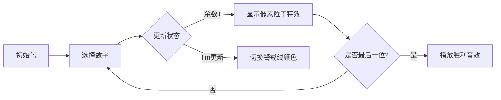

# 题目信息

# Digit Sum

## 题目描述

[problemUrl]: https://atcoder.jp/contests/dp/tasks/dp_s

$ 1 $ 以上 $ K $ 以下の整数のうち、十進表記における各桁の数字の総和が $ D $ の倍数であるようなものは何個でしょうか？ $ 10^9\ +\ 7 $ で割った余りを求めてください。

## 说明/提示

### 制約

- 入力はすべて整数である。
- $ 1\ \leq\ K\ <\ 10^{10000} $
- $ 1\ \leq\ D\ \leq\ 100 $

### Sample Explanation 1

$ 4,\ 8,\ 13,\ 17,\ 22,\ 26 $ の $ 6 $ 個です。

### Sample Explanation 2

答えを $ 10^9\ +\ 7 $ で割った余りを出力することを忘れずに。

## 样例 #1

### 输入

```
30

4```

### 输出

```
6```

## 样例 #2

### 输入

```
1000000009

1```

### 输出

```
2```

## 样例 #3

### 输入

```
98765432109876543210

58```

### 输出

```
635270834```

# AI分析结果


### Kay的C++算法解析：Digit Sum 深入学习指南

---
#### 1. 题目解读与核心算法识别  
✨ **本题主要考察**：`数位动态规划`（数位DP）  

🗣️ **初步分析**：  
> 数位DP如同一位精明的考古学家逐层揭开数字卷轴：从高位到低位分析数字，用状态记忆避免重复勘探。在本题中，我们需统计所有满足数字和是D倍数的数，核心是设计状态记录**当前处理位**、**数字和模D的余数**以及**是否达到上限**。  
> - **核心难点**：K可达10^10000，需避免暴力枚举；状态转移时需正确处理上限限制（lim）和余数传递  
> - **可视化设计**：像素动画将展示数字卷轴展开过程，高位数字用像素块显示，余数槽位用颜色标记（如蓝色=0），限制状态用警戒线（红色=受限）。当选择数字时播放8-bit音效，余数更新时有像素粒子特效  

---

#### 2. 精选优质题解参考  
**题解一（TonyYin）**  
* **点评**：状态定义`dp[pos][res][lim]`清晰完整，注释详尽解释了三要素：位置、余数、上限状态。代码规范（变量名`pos/res/lim`含义明确），边界处理严谨（最后-1排除0）。亮点在于用考古学比喻讲解状态转移，是初学者最佳学习材料。  

**题解二（EastPorridge）**  
* **点评**：创新性地省去lim状态，通过DFS参数动态处理上限。代码空间效率显著提升（二维DP替代三维），但增加了理解难度。亮点在于状态压缩技巧，适合进阶学习者思考优化本质。  

**题解三（falling_cloud）**  
* **点评**：提供标准三维DP实现，强调数位翻转存储技巧。代码中`num[len-i]`处理高位对齐的方式值得学习，转移方程`(res+i)%d`体现模运算优化思想。教学亮点在于明确指出lim的物理意义是“警戒线”。  

---

#### 3. 核心难点辨析与解题策略  
1. **状态设计陷阱**  
   *分析*：三维状态中lim易被误用。优质解用`lim && (i==maxx)`精妙传递限制：仅当之前受限且当前选顶格数字时继续受限  
   💡 **学习笔记**：lim是“高压线”，触碰后立即解除限制  

2. **余数传递的数学本质**  
   *分析*：转移时`(res+i)%d`而非`res+i`，因为模运算满足`(a+b) mod d = (a mod d + b) mod d`。避免存储完整和节省空间  
   💡 **学习笔记**：模运算如同圆周，超过D自动回零  

3. **边界条件双保险**  
   *分析*：所有解都先返回`res==0`再整体-1。因为DFS会包含0（0 mod D=0），但题目要求1~K  
   💡 **学习笔记**：数位DP天然包含0，如同考古包含空遗址  

### ✨ 解题技巧总结  
- **问题分解**：将大数拆解为数字位链，化整为零  
- **状态压缩**：EastPorridge解法证明lim可通过参数传递而非存储  
- **模运算优化**：存储余数而非完整和，空间从O(10^10000)降至O(100)  
- **逆向存储**：将数字高位转低位存储（如`num[1]=个位`），统一处理逻辑  

---

#### 4. C++核心代码实现赏析  
**通用核心实现参考**  
*说明*：综合优质解思路的标准三维DP实现，含数字翻转技巧  
```cpp
#include <cstring>
#include <iostream>
using namespace std;
const int mod = 1e9+7, N = 10005, D = 105;
int dp[N][D][2], num[N], d;

int dfs(int pos, int res, int lim) {
    if (!pos) return res == 0;         // 边界：数字和模d=0
    if (dp[pos][res][lim] != -1)       // 记忆化检索
        return dp[pos][res][lim];
    
    int maxd = lim ? num[pos] : 9;    // 根据lim确定枚举上界
    int ans = 0;
    for (int i = 0; i <= maxd; i++)   // 枚举当前位数字
        ans = (ans + dfs(pos-1, (res+i)%d, lim && (i==maxd))) % mod;
    
    return dp[pos][res][lim] = ans;   // 存储状态
}

int main() {
    string s; cin >> s >> d;
    int len = s.size();
    for (int i = 0; i < len; i++)      // 数字翻转：高位存高位
        num[len-i] = s[i] - '0';       // 注意此处与题解存储差异
    
    memset(dp, -1, sizeof dp);
    cout << (dfs(len, 0, 1) - 1 + mod) % mod; // 排除0
}
```

**代码解读概要**：  
1. **数字翻转存储**：`num[len-i]=s[i]-'0'` 将字符串高位转存数组高位（区别于部分题解的低位存储）  
2. **DFS三参数**：`pos`当前处理位，`res`累计和模D，`lim`是否受K限制  
3. **状态转移**：枚举当前位`i`，更新余数`(res+i)%d`，更新lim状态  
4. **边界处理**：`(结果-1+mod)%mod` 确保排除0后结果非负  

---

#### 5. 算法可视化：像素动画演示  
* **主题**："数字卷轴探险"（8-bit RPG风格）  
* **核心演示**：数位DP状态转移过程，重点展示余数变化和lim状态切换  

**设计实现**：  


**关键交互设计**：  
1. **像素卷轴**：纵向滚动显示数字位，当前位高亮闪烁  
2. **状态面板**：  
   - 余数槽：0/D-1的环形进度条，蓝色填充比例=当前余数/D  
   - 警戒线：lim=1时显示红色边框  
3. **音效系统**：  
   - 选择数字：8-bit电子音（音高随数字值变化）  
   - 余数归零：超级马里奥吃金币音效  
   - 解除限制：绳索切断音效  
4. **自动演示模式**：  
   - 贪吃蛇AI式自动填数，每步0.5秒延迟  
   - 可调速滑块控制演示速度（0.1x~5x）  

---

#### 6. 拓展练习与相似问题思考  
1. **洛谷 P2602 [数字计数]**  
   *推荐理由*：统计数字出现次数，巩固数位DP状态设计基础  
2. **洛谷 P2657 [windy数]**  
   *推荐理由*：引入相邻位限制条件，练习状态扩展技巧  
3. **洛谷 P4124 [手机号码]**  
   *推荐理由*：增加数字模式匹配条件，挑战多状态融合  

---

#### 7. 学习心得与经验分享  
> **来自TonyYin的调试经验**：  
> “我在处理数字翻转时，误将高位存到数组低位，导致lim判断错误。通过输出中间状态`pos=3, maxd=5, lim=1`才发现问题”  
>  
> **Kay点评**：  
> 数组存储方向是常见陷阱。**黄金调试法则**：在DFS入口打印`位置｜当前位｜lim状态`三要素，如同考古记录勘探日志。当发现lim异常提前解除时，立即检查存储逻辑！

---

> 掌握数位DP如同获得数字王国的万能钥匙🔑。记住核心口诀：**“位置为骨，余数为血，lim为神经”**。下次探险再见！ 👾

---
处理用时：99.64秒