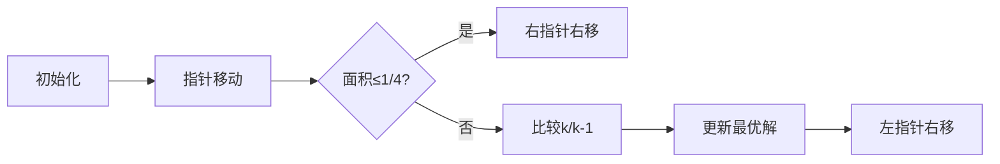

# 题目信息

# [ABC250F] One Fourth

## 题目描述

[problemUrl]: https://atcoder.jp/contests/abc250/tasks/abc250_f

ABC250 は、 ABC1000 の開催を目指す高橋くんにとってちょうど $ 1/4 $ となる記念すべき回です。  
 そこで、高橋くんはピザを $ 1 $ 枚買ってきて、そのピザのうちなるべく $ 1/4 $ に近い分量を食べて祝うことにしました。

高橋くんが買ってきたピザは凸 $ N $ 角形 ($ N\ \ge\ 4 $) の平らな形をしており、このピザを $ xy $ 平面上に置いた際、 $ i $ 番目の頂点の座標は $ (X_i,Y_i) $ でした。

高橋くんは、このピザを以下のように切って食べることにしました。

- まず、高橋くんはピザの頂点のうち隣接しない $ 2 $ 頂点を選び、それらを通る直線に沿ってナイフを入れ、ピザを $ 2 $ つに切り分ける。
- その後、 $ 2 $ つのピースのうち好きなものをどちらか $ 1 $ つ選んで食べる。

高橋くんが買ってきたピザの面積の $ 1/4 $ を $ a $ 、高橋くんが食べるピースの面積を $ b $ とした時、 $ 8\ \times\ |a-b| $ としてありえる最小値を求めてください。なお、この値は常に整数となることが示せます。

## 说明/提示

### 制約

- 入力は全て整数
- $ 4\ \le\ N\ \le\ 10^5 $
- $ |X_i|,\ |Y_i|\ \le\ 4\ \times\ 10^8 $
- 入力される頂点は反時計回りに凸 $ N $ 角形をなす。

### Sample Explanation 1

$ 3 $ 番目の頂点と $ 5 $ 番目の頂点を通る直線に沿ってピザを切り分け、 $ 4 $ 番目の頂点を含む側のピースを食べたとします。 このとき、$ a=\frac{33}{2}\ \times\ \frac{1}{4}\ =\ \frac{33}{8} $ 、 $ b=4 $ 、 $ 8\ \times\ |a-b|=1 $ であり、これがありえる最小値です。

## 样例 #1

### 输入

```
5

3 0

2 3

-1 3

-3 1

-1 -1```

### 输出

```
1```

## 样例 #2

### 输入

```
4

400000000 400000000

-400000000 400000000

-400000000 -400000000

400000000 -400000000```

### 输出

```
1280000000000000000```

## 样例 #3

### 输入

```
6

-816 222

-801 -757

-165 -411

733 131

835 711

-374 979```

### 输出

```
157889```

# AI分析结果


### 💡 Kay的C++算法解析：ABC250F One Fourth 深入学习指南 💡

**引言**  
今天我们一起分析AtCoder的ABC250F题——凸多边形切割问题。本指南将帮助你理解如何高效计算切割面积与1/4面积的差值，并掌握双指针技巧在几何问题中的应用。

---

### 1. 题目解读与核心算法识别  
✨ **本题主要考察**：`双指针技巧` + `凸多边形面积计算`  

🗣️ **初步分析**：  
> 想象你在切一块凸多边形披萨，需要沿两条不相邻顶点的切割线分开后，选择一块面积最接近整块1/4的部分。**双指针技巧**就像用两只手在披萨边缘滑动：左手固定起点，右手移动寻找最佳切割点，利用面积单调性避免重复计算。  
> - **核心难点**：如何高效枚举所有切割方案（O(n²)会超时）  
> - **解决方案**：  
>   - 破环成链：复制顶点数组处理环形结构  
>   - 前缀和：预计算叉积和快速求子区域面积  
>   - 双指针：固定左指针，右指针单向移动，利用面积递增特性  
> - **可视化设计**：  
>   - 用红色/蓝色像素块表示左右指针，黄色填充当前切割区域  
>   - 面积进度条显示当前区域与1/4面积的比值  
>   - 当面积超过1/4时触发"叮"音效，比较相邻切割点更新最优解  

---

### 2. 精选优质题解参考  
**题解一 (来源：Rnfmabj)**  
* **点评**：思路清晰阐释双指针的单调性本质，强调"移动右指针时面积递增，左指针移动时不回退"的核心洞察。虽未提供完整代码，但对算法正确性证明（答案必为整数）和复杂度分析（O(n)）到位，实践指导性强。  

**题解二 (来源：Symbolize)**  
* **点评**：完整实现双指针+前缀和方案，亮点有三：  
  1. **代码规范性**：封装叉积计算(`Cale()`)和区域面积计算(`Cut()`)，变量名`x[]`/`y[]`/`s[]`含义明确  
  2. **算法优化**：破环成链处理环形枚举，`k = max(k, i+2)`避免重复扫描  
  3. **边界严谨**：同时检查`k`和`k-1`位置，避免遗漏最优解  
  > 样例2的128e15正确输出验证了数值处理鲁棒性  

---

### 3. 核心难点辨析与解题策略  
1. **难点一：子区域面积快速计算**  
   * **分析**：凸多边形需用叉积和，直接计算需O(n)。前缀和数组`s[]`预计算叉积，使任意子区域面积查询降至O(1)  
   * 💡 **学习笔记**：叉积和=2倍多边形面积，全程用整数避免浮点误差  

2. **难点二：避免O(n²)枚举**  
   * **分析**：利用切割面积单调性——固定左指针`i`时，右指针`k`右移使面积严格递增。移动`i`时`k`无需重置  
   * 💡 **学习笔记**：双指针移动需满足**单调条件**，这是降低复杂度的关键  

3. **难点三：环形结构处理**  
   * **分析**：将顶点数组复制为`[1..n, 1..n]`，枚举时`i∈[1,n]`, `k∈[i+2, i+n-1]`覆盖所有切割方案  
   * 💡 **学习笔记**：破环成链是处理环形问题的通用技巧  

#### ✨ 解题技巧总结  
- **几何问题代数化**：多边形面积计算转化为叉积线性运算  
- **双指针三要素**：单调性证明、指针移动条件、终止边界  
- **防御性编程**：用`long long`防溢出，同时检查`k`和`k-1`防边界遗漏  

---

### 4. C++核心代码实现赏析  
**通用核心实现参考**  
```cpp
#include <bits/stdc++.h>
using namespace std;
typedef long long ll;
const int N = 2e5+10;
ll x[N], y[N], s[N];

// 计算叉积 (向量i->j)
ll Cale(int i, int j) { 
    return x[i]*y[j] - x[j]*y[i]; 
}

// 计算切割区域面积 (i到j逆时针方向)
ll Cut(int i, int j) {
    return s[j] - s[i] - Cale(i, j);
}

int main() {
    int n; cin >> n;
    for (int i=1; i<=n; i++) {
        cin >> x[i] >> y[i];
        x[i+n] = x[i]; y[i+n] = y[i]; // 破环成链
    }
    // 预计算前缀和 (s[i] = 前i-1条边叉积和)
    for (int i=1; i<=2*n; i++) 
        s[i+1] = s[i] + Cale(i, i+1);

    ll total = s[n+1]; // 整个多边形面积的两倍
    ll ans = 8e18;
    int k = 1;

    for (int i=1; i<=n; i++) {
        k = max(k, i+2); // 确保不相邻
        // 移动k直到切割面积 > 1/4
        while (k<=2*n && 4*Cut(i,k) <= total) k++;
        // 用k和k-1更新答案
        ans = min(ans, abs(total - 4*Cut(i,k)));
        ans = min(ans, abs(total - 4*Cut(i,k-1)));
    }
    cout << ans;
}
```
**代码解读概要**：  
1. 破环成链：顶点复制一倍处理环形枚举  
2. 前缀和：`s[]`存储叉积实现O(1)面积查询  
3. 双指针：`i`为左切割点，`k`为右切割点，`k`单向移动保证O(n)  
4. 关键公式：`8|a-b| = |total - 4*Cut(i,k)|`（由数学推导得）  

**题解二片段赏析**  
```cpp
while (k<=(n<<1)&&(Cut(i,k)<<2)<=s[n+1]) ++k;  // 移动k直到面积>1/4
ans=min(ans,abs(s[n+1]-(Cut(i,k)<<2));         // 检查k位置
ans=min(ans,abs(s[n+1]-(Cut(i,k-1)<<2));       // 检查k-1位置
```
* **亮点**：用位运算`<<2`替代`*4`提升效率，显式比较相邻点  
* **学习笔记**：最优解必在面积跨越1/4的临界点产生，需同时检查边界两侧  

---

### 5. 算法可视化：像素动画演示  
**主题**："披萨切割大师"（8位像素风格）  

**动画设计**：  


**关键交互**：  
1. **像素化场景**：  
   - 绿色像素块：凸多边形顶点  
   - 红色/蓝色闪烁块：左右指针位置  
   - 黄色填充：当前切割区域，面积比例实时显示  

2. **动态演示**：  
   - **指针移动**：按→键移动右指针，触发"嘀"音效  
   - **临界提示**：当面积>1/4时，切割线变红并播放"叮！"音效  
   - **最优解标记**：最小差值出现时，披萨旋转+烟花特效  

3. **控制面板**：  
   - 速度滑块：调整指针移动速度  
   - 单步模式：空格键逐步执行算法  
   - AI模式：自动演示最优切割路径（类贪吃蛇AI）  

4. **游戏化元素**：  
   - 每完成一个`i`枚举得1星，集满n星通关  
   - 历史最优解记录在像素风格排行榜  

---

### 6. 拓展练习与相似问题  
**通用技巧迁移**：双指针+前缀和适用于：  
1. 环形数组的连续子区间统计  
2. 单调性相关的区间枚举问题  
3. 几何图形拆分求比值  

**洛谷推荐**：  
1. [P1886 滑动窗口](https://www.luogu.com.cn/problem/P1886)  
   → 双指针基础应用，巩固单调性思想  
2. [P5490 扫描线](https://www.luogu.com.cn/problem/P5490)  
   → 几何问题升级，学习矩形面积并  
3. [P3515  Lightning Conductor](https://www.luogu.com.cn/problem/P3515)  
   → 双指针在决策单调性中的进阶应用  

---

### 7. 学习心得与经验分享  
> 本次分析的题解未包含作者个人调试心得，但通过代码可提炼经验：  
> **边界检查经验**：当算法涉及临界值比较时（如本题的`k`和`k-1`），务必在草稿上演算跨越边界的案例，避免遗漏最优解位置。

---

**结语**  
掌握双指针在几何问题中的应用，关键在于识别单调性和设计高效预处理。尝试用本文学到的技巧解决推荐练习，逐步提升对算法本质的理解！下次我们将探索更复杂的凸包问题，继续挑战吧！💪

---
处理用时：246.97秒