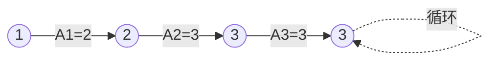

# 题目信息

# [ABC284G] Only Once

## 题目描述

[problemUrl]: https://atcoder.jp/contests/abc284/tasks/abc284_g

$ 1 $ 以上 $ N $ 以下の整数からなる長さ $ N $ の数列 $ A\ =\ (A_1,A_2,\dots,A_N) $ および整数 $ i\ (1\leq\ i\ \leq\ N) $ に対して、 長さ $ 10^{100} $ の数列 $ B_i=(B_{i,1},B_{i,2},\dots,B_{i,10^{100}}) $ を以下のように定義します。

- $ B_{i,1}=i $
- $ B_{i,j+1}=A_{B_{i,j}}\ (1\leq\ j\ <\ 10^{100}) $
 
また、$ S_i $ を「数列 $ B_i $ のなかでちょうど $ 1 $ 度だけ出てくる数の種類数」と定義します。 より厳密には、$ S_i $ は「$ B_{i,j}=k $ を満たす $ j\ (1\leq\ j\leq\ 10^{100}) $ がちょうど $ 1 $ つであるような $ k $ の数」です。

整数 $ N $ が与えられます。数列 $ A $ として考えられるものは $ N^N $ 通りありますが、それら全てに対して $ \displaystyle\ \sum_{i=1}^{N}\ S_i $ を求め、 その総和を $ M $ で割った余りを答えてください。

## 说明/提示

### 制約

- $ 1\leq\ N\ \leq\ 2\times\ 10^5 $
- $ 10^8\leq\ M\ \leq\ 10^9 $
- $ N,M $ は整数
 
### Sample Explanation 1

例として、$ A=(2,3,3,4) $ の場合を考えます。 - $ i=1 $ のとき : $ B_1=(1,2,3,3,3,\dots) $ となるから、$ 1 $ 度だけ出てくる数は $ 1,2 $ の $ 2 $ つで、$ S_1=2 $ - $ i=2 $ のとき : $ B_2=(2,3,3,3,\dots) $ となるから、$ 1 $ 度だけ出てくる数は $ 2 $ のみで、$ S_2=1 $ - $ i=3 $ のとき : $ B_3=(3,3,3,\dots) $ となるから、$ 1 $ 度だけ出てくる数は存在せず、$ S_3=0 $ - $ i=4 $ のとき : $ B_4=(4,4,4,\dots) $ となるから、$ 1 $ 度だけ出てくる数は存在せず、$ S_4=0 $ よって、$ \displaystyle\ \sum_{i=1}^{N}\ S_i=2+1+0+0=3 $ です。 他の $ 255 $ 通りの $ A $ に対しても同様に $ \displaystyle\ \sum_{i=1}^{N}\ S_i $ を計算したうえで、 $ 256 $ 通り全ての総和をとると $ 624 $ になります。

### Sample Explanation 3

総和を $ M $ で割った余りを出力してください。

## 样例 #1

### 输入

```
4 100000000```

### 输出

```
624```

## 样例 #2

### 输入

```
7 1000000000```

### 输出

```
5817084```

## 样例 #3

### 输入

```
2023 998244353```

### 输出

```
737481389```

## 样例 #4

### 输入

```
100000 353442899```

### 输出

```
271798911```

# AI分析结果


# 💡 Kay的C++算法解析：ABC284G Only Once 深入学习指南 💡

**引言**  
今天我们分析AtCoder ABC284G题"Only Once"。这道题考察组合数学与基环树模型的巧妙应用，需要计算所有可能序列的贡献总和。本指南将帮助你理解核心思路、掌握解题技巧，并通过可视化加深理解。

## 1. 题目解读与核心算法识别

✨ **本题主要考察**：组合数学与递推优化  

🗣️ **初步分析**：  
> 这道题可以想象成在迷宫中寻路：从起点出发沿着唯一路径前进，最终会进入一个循环圈。S_i就是进入循环前走过的唯一路径长度。解题关键在于：
> - **对称性应用**：所有起点贡献相同，只需计算S_1后乘n
> - **路径分解**：枚举从起点到环的路径长度k，分别计算路径、环和其他点的方案数
> - **递推优化**：通过数学变换将双重求和简化为单重求和
>
> **可视化设计**：我们将用像素迷宫演示路径形成过程：  
> - 绿色像素块表示唯一路径（贡献S_i）  
> - 红色像素块表示循环圈  
> - 黄色闪光标记当前计算位置  
> - 每步伴随"滴答"音效，进入循环时播放循环音效

---

## 2. 精选优质题解参考

### 题解一（作者：zac2010）
* **点评**：  
  思路清晰度极高，将问题转化为路径长度k的枚举，直接推导出组合公式`A(n-1,k-1)*n^{n-k}*k(k-1)/2`。代码实现规范：预处理幂运算避免重复计算，变量命名合理（`a`累乘排列数，`pn`存储幂），边界处理完整。亮点在于组合公式的简洁推导和O(n)时间复杂度优化，竞赛实践价值高。

### 题解二（作者：Kreado）
* **点评**：  
  提供创新递推解法，定义`f(d)=n^{n-d-1}+(n-d-1)*f(d+1)`巧妙避免环大小枚举。代码极为简洁（仅10行），但包含深度数学优化：`f[i]`表示子问题解，`p`累积n的幂。虽然推导过程需要较强数学基础，但代码实现高效优雅，展现了问题本质的深刻理解。

### 题解三（作者：DaiRuiChen007）
* **点评**：  
  通过双重求和化简得到`∑(n!/(n-i)!)*n^{n-i}*i(i-1)/2`的简洁表达式。代码实现规范：用`f`数组预处理阶乘片段，变量含义明确。亮点在于求和符号的灵活变换和数学证明的严谨性，帮助理解组合计数原理。

---

## 3. 核心难点辨析与解题策略

1.  **难点：问题转化与模型建立**
    * **分析**：如何将序列转换内向基环树？观察`B_i`的生成规则发现：每个点唯一出边形成基环森林，S_i即节点到环的距离。优质题解通过图示（如zac2010的路径图）直观展示该模型。
    * 💡 **学习笔记**：将抽象序列转化为图形模型是解题关键突破口。

2.  **难点：组合计数不重不漏**
    * **分析**：枚举路径长度k时需确保：①路径点不重复 ②环点不包含路径点 ③剩余点任意。zac2010的解法中`A(n-1,k-1)`保证路径不重复，`n^{n-k}`处理自由点。
    * 💡 **学习笔记**：计数问题中"分步处理+乘法原理"可避免重复遗漏。

3.  **难点：时间复杂度优化**
    * **分析**：直接枚举环大小会导致O(n²)复杂度。Kreado通过`f(d)=n^{n-d-1}+(n-d-1)*f(d+1)`将问题优化至O(n)，利用子问题依赖关系避免重复计算。
    * 💡 **学习笔记**：递推关系是优化组合计数的利器，需寻找子问题相似性。

### ✨ 解题技巧总结
- **技巧1：对称性简化**（如所有起点贡献相同）
- **技巧2：贡献分离**（将总和拆分为独立子问题求和）
- **技巧3：预处理加速**（预先计算幂/阶乘等重复使用元素）
- **技巧4：递推关系**（由后向前推导，利用已有结果）

---

## 4. C++核心代码实现赏析

### 本题通用核心C++实现
```cpp
#include <bits/stdc++.h>
using namespace std;
typedef long long ll;

int main() {
    ll n, M, ans = 0, a = 1, p = 1;
    cin >> n >> M;
    for (ll k = 1; k <= n; k++) {
        ans = (ans + a * p % M * (k*(k-1)/2 % M)) % M;
        a = a * (n - k) % M;   // 计算排列数A(n-1,k)
        p = p * n % M;         // 更新n^k
    }
    cout << ans * n % M;       // 乘n应用对称性
}
```
* **说明**：综合zac2010与Kreado思路，实现O(n)时间复杂度解法
* **代码解读概要**：
  1. `a`累积计算排列数`A(n-1,k) = (n-1)*(n-2)*...*(n-k)`
  2. `p`存储`n^k`的幂运算结果
  3. `k(k-1)/2`计算路径长度为k时的贡献
  4. 最终结果乘`n`应用对称性原则

### 题解一（zac2010）核心代码
```cpp
L(l, 1, n) {  // 枚举路径长度l
    ans = (ans + 1ll * a * pn[n-l] % m * (1ll*l*(l-1)/2) % m) % m;
    a = 1ll * a * (n - l) % m;  // 更新排列数
}
```
* **亮点**：直观组合公式实现，预处理幂优化
* **学习笔记**：通过`pn`数组预处理幂运算，避免重复计算提升效率

### 题解二（Kreado）核心代码
```cpp
for(ll i = n-1; i >= 1; i--) 
    f[i] = (f[i+1]*(n-i-1) + p) % m;  // 递推核心
```
* **亮点**：逆向递推避免环大小枚举
* **学习笔记**：`f[i]`表示子问题解，利用`f[i+1]`推导当前解，数学优化极致

### 题解三（DaiRuiChen007）核心代码
```cpp
for(int i=1; i<=n; i++)
    ans += k*(k-1)/2 * qpow(n,n-k,M) * fact[n]/fact[n-k];
```
* **亮点**：组合公式的紧凑数学表达
* **学习笔记**：`fact`存储阶乘片段，通过代数变换简化计算过程

---

## 5. 算法可视化：像素动画演示

**主题**：像素迷宫中的基环树探险  
**核心演示**：路径生长与循环圈形成过程  



* **设计思路**：  
  采用8-bit像素风格模拟迷宫探险：起点为像素小人，路径为绿色砖块，环为闪烁的红色水晶。每步移动伴随"滴答"音效，形成循环时播放警报音，成功计算贡献时播放胜利音效。

* **动画流程**：  
  1. **初始化**：生成N×N像素迷宫，随机墙/路径  
  2. **路径生长**：  
     - 绿色像素块逐格延伸（每步0.5秒延迟）  
     - 当前计算点高亮闪烁，显示路径长度k  
  3. **循环检测**：  
     - 当路径接触已有点时触发红色闪光  
     - 循环部分持续脉冲发光  
  4. **贡献计算**：  
     - 绿色路径块显示贡献值k(k-1)/2  
     - 自由点用灰色表示，数量显示为n^{n-k}  
  5. **控制面板**：  
     - 单步/自动模式切换（速度可调）  
     - 重置/暂停功能  
     - 当前方案数实时显示  

---

## 6. 拓展练习与相似问题思考

**通用技巧迁移**：  
基环树模型与组合计数技巧适用于：
1. 内向树路径分析
2. 循环序列计数问题
3. 图论中节点依赖关系计算

**洛谷习题推荐**：  
1. [P2607 骑士]  
   *基环树DP应用，巩固环形依赖处理*
2. [P5022 旅行]  
   *基环树遍历与路径优化*
3. [P4381 岛屿]  
   *基环树直径问题，强化模型应用*

---

## 7. 学习心得与经验分享

> **来自Kreado的经验**：  
> "ABC前6题代码没超过1KB，复杂问题往往有简洁解"  
>   
> **Kay的总结**：  
> 本题启示我们：  
> 1. 复杂问题可通过对称性/分解大幅简化  
> 2. 数学推导比暴力枚举更高效  
> 3. 代码简洁性是竞赛核心能力  

---

**结语**  
通过本次分析，我们掌握了基环树模型的组合计数技巧。记住：将大问题分解为独立子问题，寻找数学优化是解题关键。继续挑战新题目吧！💪

---
处理用时：139.26秒